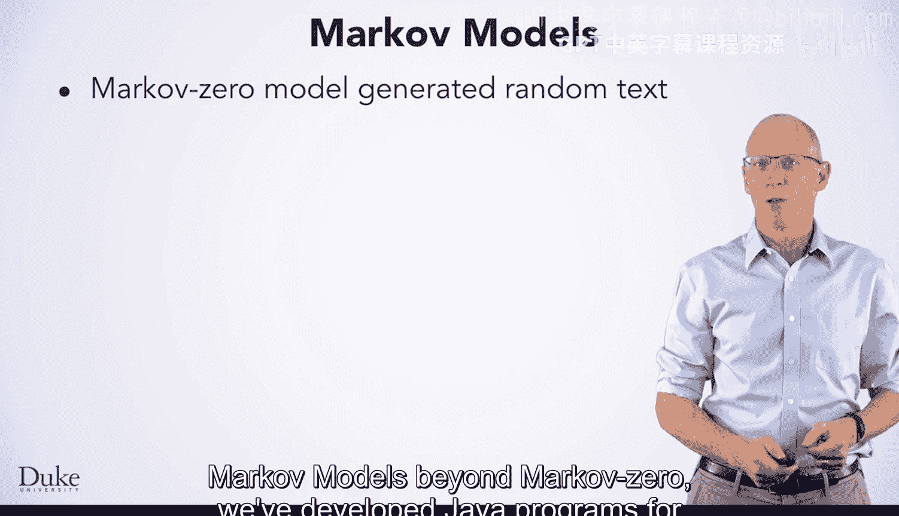
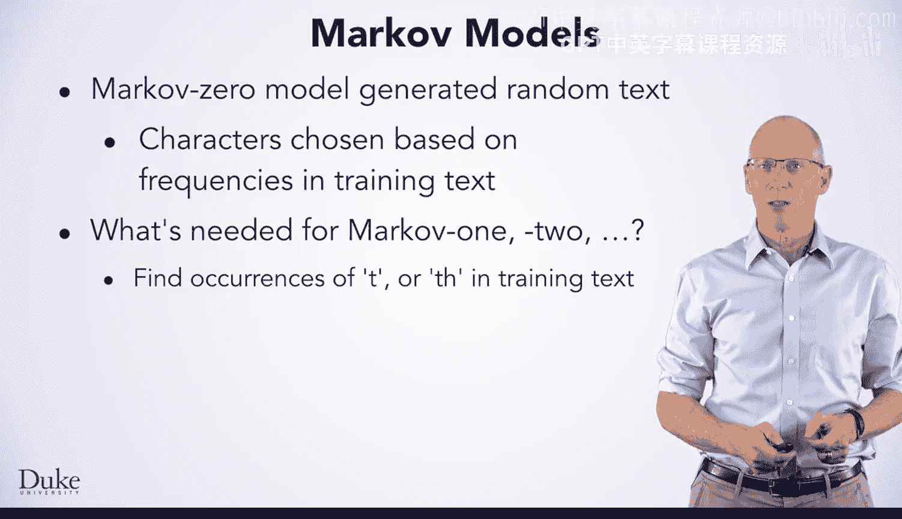
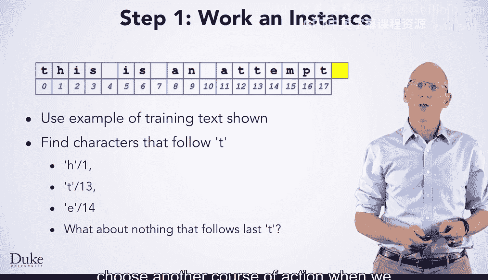
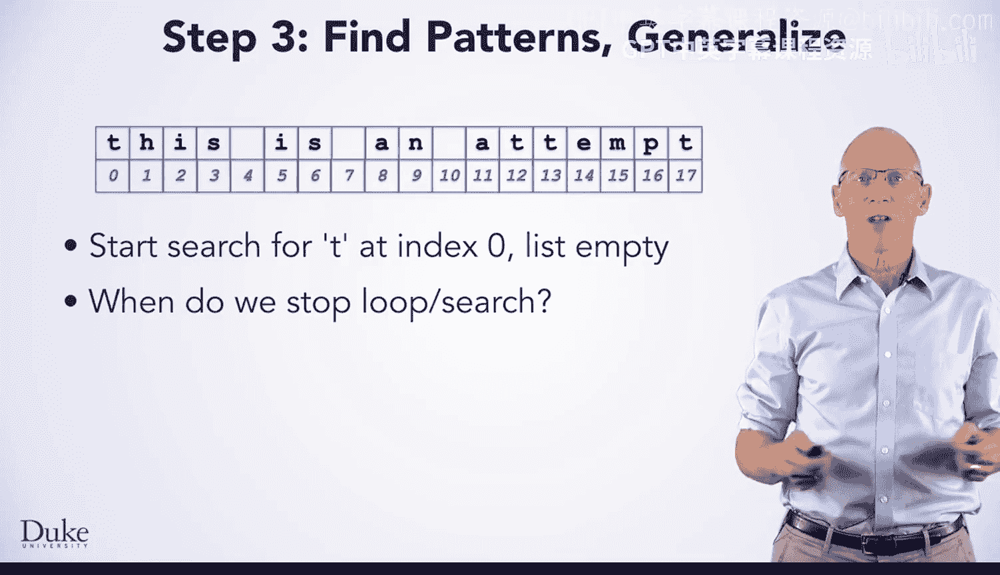
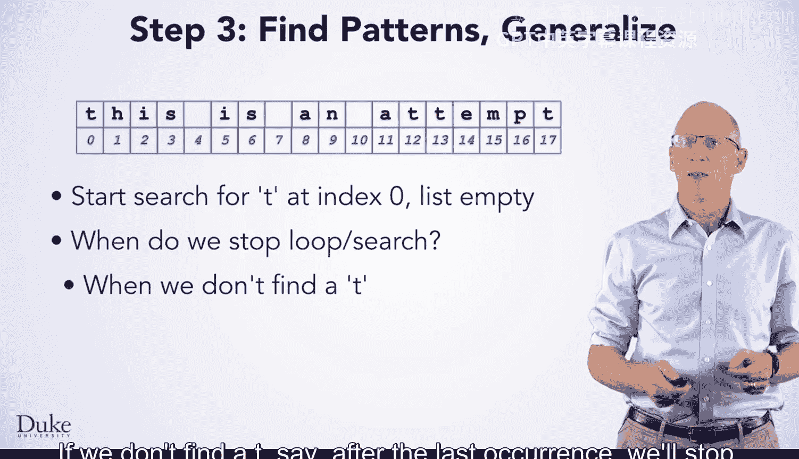

# 147：27_04_04_寻找跟随集 👨‍💻




在本节课中，我们将学习如何为高阶马尔可夫模型（如马尔可夫一阶、二阶模型）开发核心算法。具体来说，我们将专注于一个关键任务：**寻找“跟随字符集”**。我们将使用一个七步流程来推导这个算法，并通过一个简单的例子来理解其工作原理。

---

## 概述 📋

我们已经学习了如何为马尔可夫零阶模型（Markov Zero）编写Java程序来生成随机文本。在该模型中，每个字符都是完全随机地从训练文本中选取的。现在，我们将开发一个更高级模型的核心算法。在马尔可夫一阶模型中，如果我们生成了字符 `T`，我们需要从训练文本中所有紧跟在 `T` 后面的字符中，随机选择一个作为下一个字符。这个“所有紧跟在后面的字符”的集合，就是我们需要寻找的“跟随集”。本节将详细讲解如何找到这个集合。

---



## 七步流程：推导算法 🔄

我们将使用一个结构化的七步流程来设计和理解这个算法。

### 第一步：实例演练



我们使用一段简单的训练文本来进行实例演练：
`this is an attempt to illustrate the algorithm`

我们的目标是：**找出所有紧跟在字母 `T` 后面的字符**。我们将从这段文本中推导出通用算法。


*   第一个 `T` 出现在索引0，它后面的字符是索引1的 `H`。
*   下一个 `T` 出现在索引12，它后面的字符是索引13的 `T`。
*   再下一个 `T` 出现在索引13，它后面的字符是索引14的 `E`。
*   最后一个 `T` 出现在索引17，它位于文本末尾，后面没有字符。

### 第二步：记录操作步骤

我们将手动寻找跟随字符的过程一步步写下来。

1.  初始化一个空的 `follows` 列表。
2.  从索引 `0` 开始搜索第一个 `T`。在索引 `0` 处找到。
3.  将索引 `0` 后面的字符（索引 `1` 的 `H`）加入 `follows` 列表。
4.  从索引 `1`（即上一步找到的跟随字符的位置）开始，搜索下一个 `T`。在索引 `12` 处找到。
5.  将索引 `12` 后面的字符（索引 `13` 的 `T`）加入 `follows` 列表。
6.  从索引 `13` 开始，搜索下一个 `T`。在索引 `13` 处找到。
7.  将索引 `13` 后面的字符（索引 `14` 的 `E`）加入 `follows` 列表。
8.  从索引 `14` 开始，搜索下一个 `T`。在索引 `17` 处找到。
9.  索引 `17` 是文本末尾，后面没有字符，因此无法添加，停止搜索。


最终，`follows` 列表包含三个字符：`H`, `T`, `E`。

### 第三步：寻找模式并归纳

观察第二步的记录，我们可以发现一个清晰的重复模式：

*   **模式A（找到并添加）**：`找到键（key） -> 添加其后的字符 -> 从新位置开始下一次搜索`。这个模式在步骤（2,3）、（4,5）、（6,7）中重复。
*   **模式B（找不到或无法添加）**：当搜索找不到键，或者找到的键位于文本末尾时，循环终止。如步骤（8,9）。

我们还注意到一个关键关系：**下一次搜索的起始位置（`pos`），就是上一次找到的跟随字符的索引**。

### 第四步：编写通用算法

基于以上模式，我们可以用伪代码描述通用算法：

1.  初始化一个空的 `follows` 列表。
2.  设置搜索起始位置 `pos = 0`。
3.  **当** `true` **时循环**：
    *   从位置 `pos` 开始，在训练文本中寻找键（`key`）的下一个出现位置，结果存入 `index`。
    *   **如果** 没有找到 `key`（`index == -1`），**则** 跳出循环。
    *   **如果** `index` 已经是文本的最后一个字符（`index >= 文本长度 - 1`），**则** 跳出循环。
    *   **否则**：
        *   获取 `index` 位置后面的字符（即 `index + 1` 位置的字符）。
        *   将该字符加入 `follows` 列表。
        *   将下一次搜索的起始位置 `pos` 更新为 `index + 1`。
4.  循环结束后，**返回** `follows` 列表。

**核心逻辑的伪代码表示：**
```java
ArrayList<Character> follows = new ArrayList<>();
int pos = 0;
while (true) {
    int index = trainingText.indexOf(key, pos);
    if (index == -1 || index >= trainingText.length() - 1) {
        break;
    }
    follows.add(trainingText.charAt(index + 1));
    pos = index + 1;
}
return follows;
```

### 第五步：测试算法




让我们用另一个键（例如字母 `A`）和同一段训练文本来测试这个算法。训练文本中 `A` 出现在：
*   索引8（`a` in “an”），后面是空格。
*   索引10（`a` in “attempt”），后面是 `t`。
*   索引20（`a` in “algorithm”），后面是 `l`。



根据算法，`follows` 列表应包含：`空格`, `t`, `l`。你可以手动模拟算法步骤来验证。

### 第六步：实现代码

将上述伪代码翻译成具体的Java代码。确保正确处理字符串边界和返回值。

### 第七步：调试与优化

运行代码，使用不同的训练文本和键进行测试，确保其正确性。思考如何将其扩展以支持马尔可夫二阶模型（此时键是双字符，如 `TH`）。

---

## 总结 🎯

本节课中，我们一起学习了为高阶马尔可夫模型生成文本的核心算法——寻找跟随集。我们通过一个具体的七步流程，从实例演练开始，逐步记录、归纳模式，最终推导出通用算法并准备将其转化为代码。这个算法的核心思想是：**通过循环，在训练文本中不断寻找指定键的下一个出现位置，并收集其后的字符，同时更新搜索起点，直到搜索完整个文本**。掌握这个算法是理解马尔可夫链文本生成的关键一步。