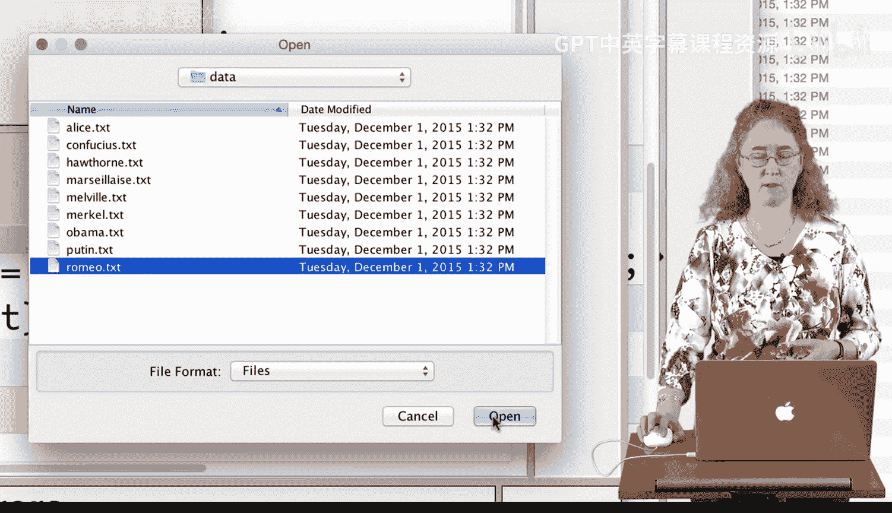
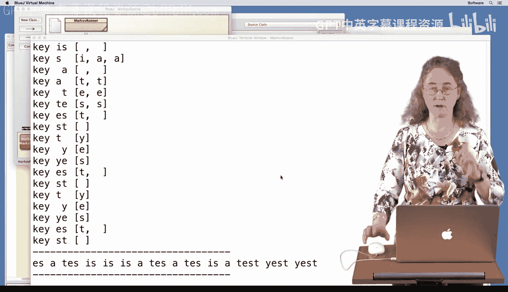
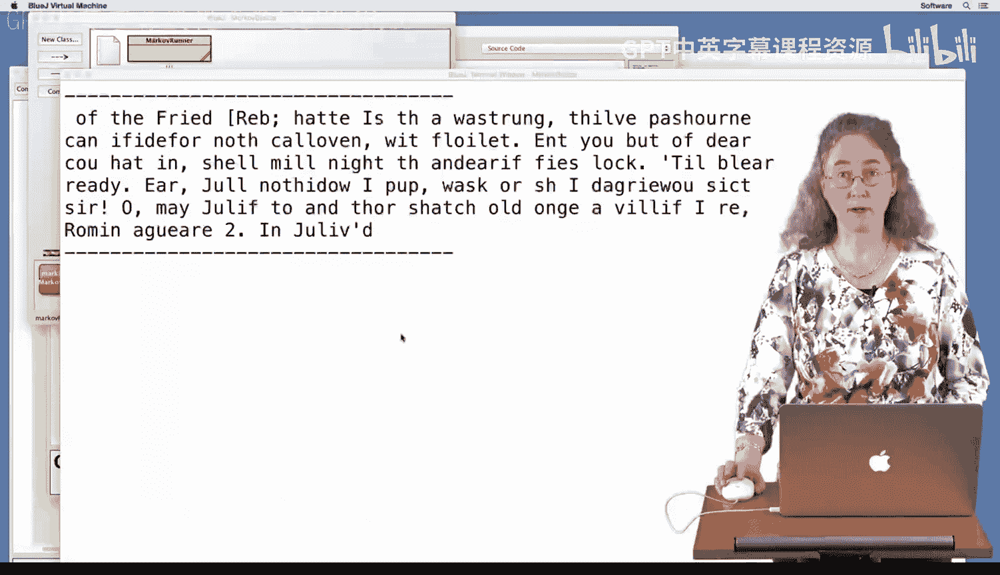

# 149：测试与调试 🐛


在本节课中，我们将学习如何通过测试与调试来发现和修复程序中的错误。我们将以一个具体的例子——修复一个马尔可夫文本生成器中的逻辑错误——来演示这一过程。

---

上一节我们介绍了马尔可夫模型的基本概念，本节中我们来看看如何通过调试来修正一个实现上的错误。

在观察程序输出时，我发现随机生成的文本看起来不太对劲。特别是当使用 `Markov3` 模型时，输出结果仍然像乱码。理论上，使用 `Markov3` 意味着我们基于三个字符来预测下一个字符，因此输出中的每一个四字符子串都应该来自训练文本。但实际结果并非如此。

为了找出问题所在，我决定调试这个程序。首先，我需要缩小测试范围，以便更容易地观察程序行为。



以下是调试步骤：

1.  **简化输入数据**：为了避免处理大文件的复杂性，我回到 `MarkovRunner` 类，将训练文本替换为一个简短的测试字符串，例如 `"This is a test. Yes, a test."`。
2.  **添加打印语句**：在 `MarkovTwo` 类的 `getRandomText` 方法中，我添加了打印语句来输出当前的“键”（key）和对应的“后续字符集合”（follows）。这有助于验证程序内部的数据是否正确。
    ```java
    System.out.println("Key: " + key + " Follows: " + follows);
    ```
3.  **运行并观察**：使用简化的测试数据运行程序。观察控制台打印的信息，我发现了一个关键问题：除了第一个键是预期的两个字符长度外，后续所有的键都变成了单个字符。这与 `MarkovTwo` 模型要求键长始终为2的设定不符。

通过分析代码，我找到了错误的根源。在 `getRandomText` 方法中，更新键（key）的代码逻辑是错误的。

原来的错误代码是：
```java
key = "" + nextChar; // 错误：将键直接设置为新字符
```

正确的逻辑应该是：将旧的键去掉第一个字符，然后在末尾追加新找到的字符，从而实现滑动窗口的效果。



修正后的代码应为：
```java
key = key.substring(1) + nextChar; // 正确：滑动窗口，保持键长不变
```

修复这个错误后，我重新用简化的测试数据运行程序。这次，所有的键都正确地保持了两个字符的长度，生成的文本也看起来合理了。



确认基本逻辑正确后，我移除了调试用的打印语句，并将训练数据恢复为完整的文件（如《罗密欧与朱丽叶》的文本）。再次运行 `MarkovTwo` 模型，生成的文本质量有了明显提升。

最后，我将模型从 `MarkovTwo` 升级到 `MarkovThree`。这需要做三处修改：将所有代表键长的数字 `2` 改为 `3`。修改后运行程序，生成的文本中出现了更多有意义的单词和短语，效果显著改善。

---

本节课中我们一起学习了调试程序的基本方法：通过简化测试用例、添加打印语句来观察程序内部状态，从而定位逻辑错误。我们发现，程序员对代码行为的预期与实际运行结果可能存在差异，而系统性的调试是发现并修正这些差异的关键。最终，我们成功修复了马尔可夫文本生成器中的键更新逻辑错误，并验证了 `MarkovThree` 模型能产生更连贯的文本。