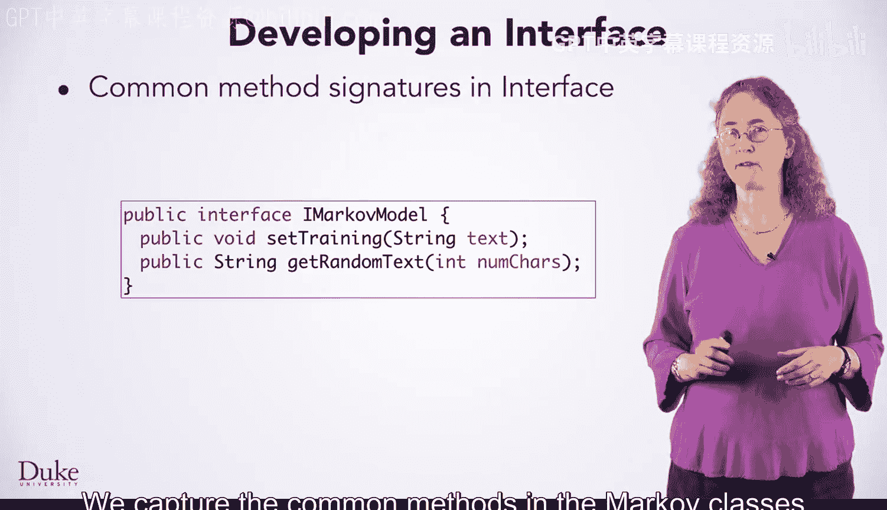
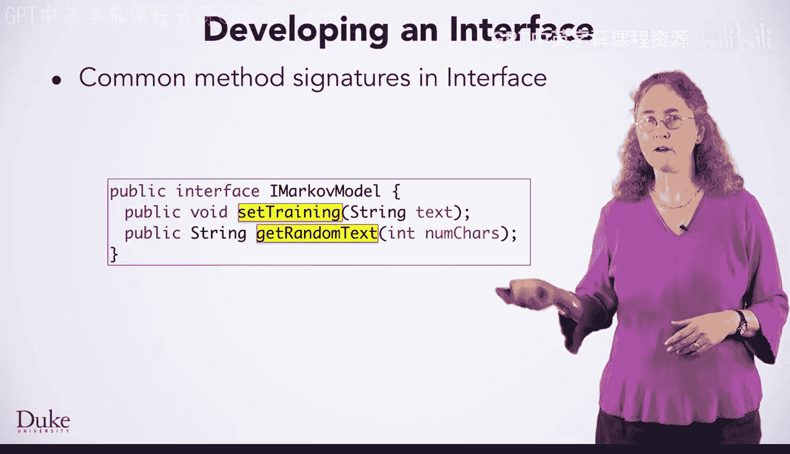
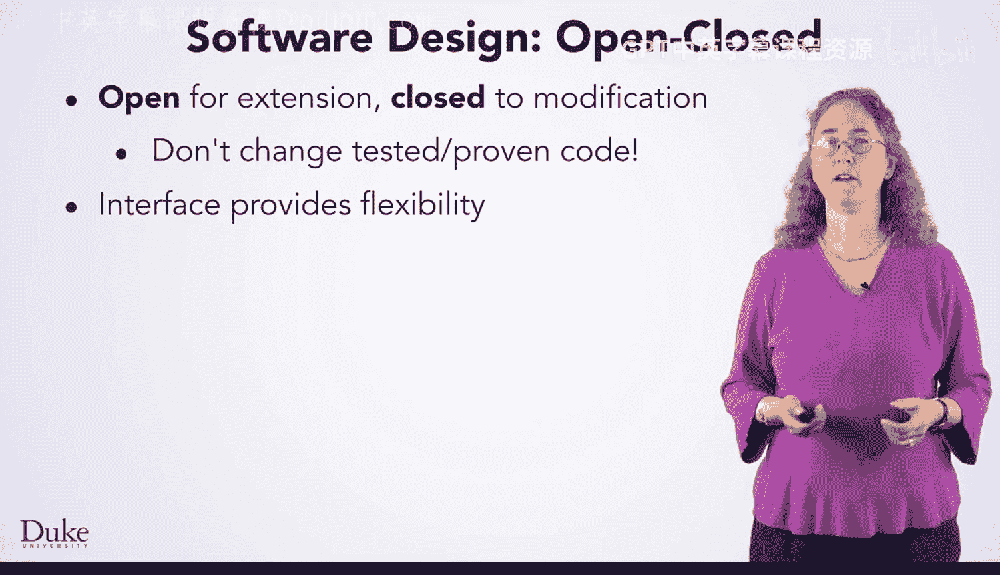
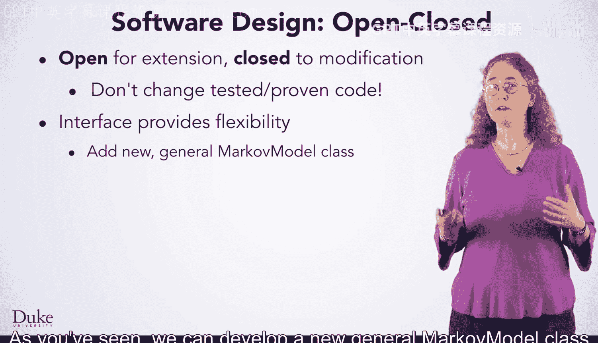
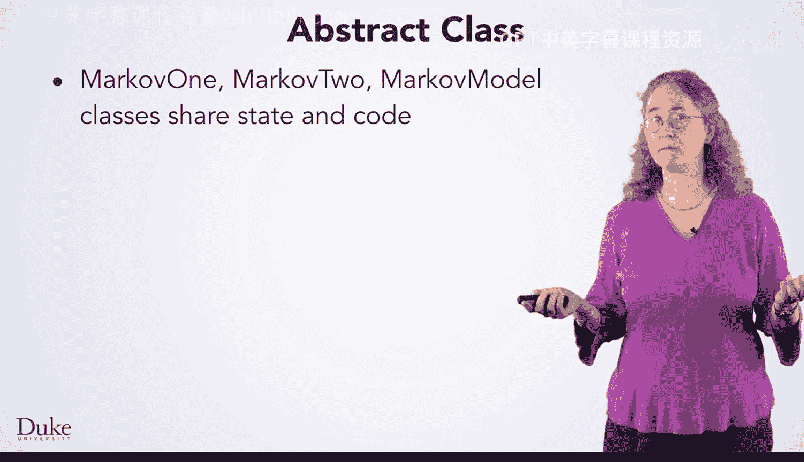
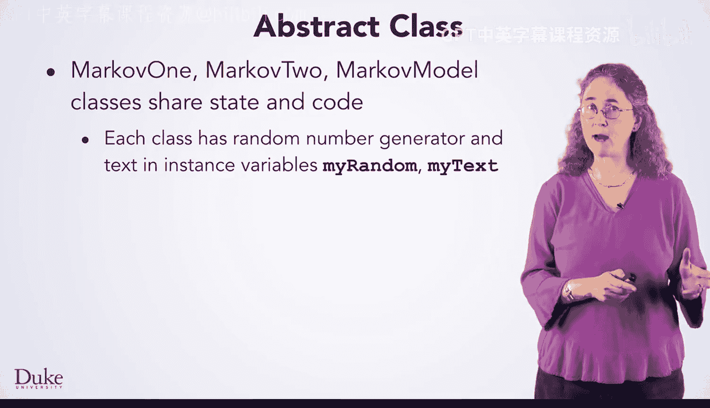
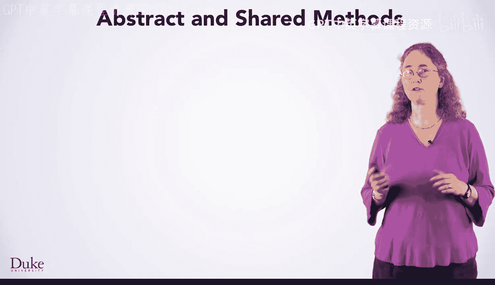
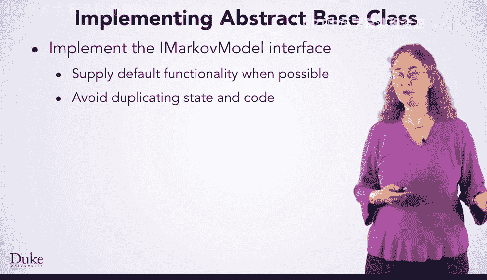
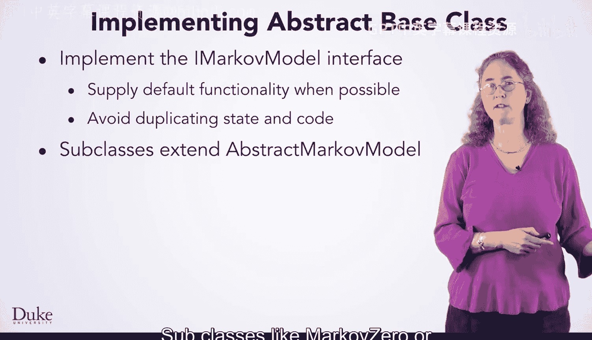

# Java编程和软件工程基础：2-5：接口与抽象类 🧩

在本节课中，我们将学习如何使用接口和抽象类来捕获Markov程序中多个类共享的公共特性。我们将探讨如何通过接口实现代码的通用性和灵活性，以及如何利用抽象类来避免代码重复。

---

## 使用接口捕获共性

上一节我们介绍了Markov程序的基本结构。本节中，我们来看看如何通过接口来形式化类之间的共同点。

我们曾在`MarkovRunner`类的`runMarkov`方法中开发代码来生成随机文本。我们首先使用`MarkovZero`类，然后将其变量更改为`MarkovOne`类，而`runMarkov`中的代码仍然有效。这是因为`MarkovZero`和`MarkovOne`类使用了相同的方法名，例如`setTraining`和`getRandomText`。

我们希望用Java接口来捕获这些共性，以便能以多种方式使用这些类。你可能还记得排序时使用的`Comparable`和`Comparator`接口，以及我们为搜索地震数据而开发的`Filter`接口。现在，我们将设计并实现一个新的接口来捕获这里的共性。

以下是接口开发的核心步骤：

*   **定义接口**：我们通过将方法的签名包含在接口中来捕获Markov类中的公共方法。
*   **命名惯例**：接口名称通常以“I”开头，这是一种常见做法。因此我们创建了`IMarkovModel`接口。
*   **实现接口**：每个实现该接口的类都使用Java关键字`implements`来声明，例如`MarkovOne implements IMarkovModel`。
*   **方法要求**：每个类中已经存在具有所需名称的必需方法。

使用接口将提供实用性和灵活性。

---

## 接口的实用性与灵活性

接口的一个主要优势是能够编写通用的方法。让我们看看这是如何实现的。

我们可以编写一个方法，其参数类型为`IMarkovModel`接口，如下面`runModel`方法所示。第一个参数`markov`的类型是`IMarkovModel`。这意味着我们可以调用`runModel`并传递一个`MarkovZero`对象或一个`MarkovTwo`对象作为第一个参数。

*   可以传递名为`mz`的对象，因为它的类型`MarkovZero`实现了`IMarkovModel`接口。
*   可以传递名为`m2`的对象，因为`MarkovTwo`也实现了`IMarkovModel`接口。

调用`markov.setTraining(...)`将调用`MarkovZero`、`MarkovTwo`或任何其他实现了`IMarkovModel`接口的类中的相应方法。对`markov.getRandomText(...)`的调用同样会执行作为第一个参数传入的对象所属类中的特定代码。

这个例子阐释了所谓的“开闭软件设计原则”。其思想是：类应该对扩展开放，但对修改关闭。

使用接口以及我们即将看到的其他概念，你可以创建一个新类，并用它来替代一个已经过测试和验证的类。你不应该为了扩展代码功能而去修改已经正常工作的代码。

`IMarkovModel`接口提供了灵活性。正如你所见，我们可以开发一个新的通用`MarkovModel`类来替代`MarkovOne`、`MarkovTwo`等。如果这个类实现了`IMarkovModel`接口，我们就可以在现有代码中使用它。这意味着我们不需要为了使用新类而去修改例如`runModel`这样的代码。

我们可以开发一个使用哈希映射的更高效实现，并用它来替代`MarkovModel`。例如，在你编写的代码中，辅助函数`getFollows`可能会被调用数百次来查找跟在“TH”后面的字符。每次都会重新扫描整个文本来查找。通过存储和重用这些后续字符，你的代码可能会更高效。并且由于接口的存在，你可以在`runModel`和其他代码中使用它。

---

## 引入抽象类避免重复

`IMarkovModel`接口提供了极大的灵活性，但有些共享代码我们可以通过开发所谓的“抽象类”来避免重复。

我们开发的每个Markov类都共享状态和代码，有时这些代码在每个类中是重复的。

例如，每个类都有一个`Random`对象和用于建模随机文本的文本，它们分别存储在实例变量`myRandom`和`myText`中。许多类共享完全相同的`getFollows`辅助方法，这些方法被复制粘贴到每个`.java`文件中。

我们希望避免这种重复，方法是将公共状态和代码捕获到一个称为“抽象基类”的结构中。这将依赖于继承，这是一个极其重要的面向对象概念。我们在这里简要提及，你可以在Coursera的UCSD专项课程中了解更多关于此概念及其他面向对象概念的知识。

抽象基类在Java的`util`包中被广泛使用，例如`AbstractList`和`AbstractMap`。像`ArrayList`和`HashMap`这样的类就是这些抽象类的子类。子类可以继承状态和代码（或行为）。

让我们来看看抽象基类。

抽象基类`AbstractMarkovModel`被标记为`abstract`。我们很快就会明白这意味着什么。在所有类（如`MarkovOne`、`MarkovTwo`和`MarkovModel`）之间共享的状态被标记为`protected`，而不是`private`。这些实例变量将在每个扩展此抽象基类的子类中可访问。我们接下来讨论`extends`关键字。

---

## 抽象类与共享方法

让我们更仔细地看看抽象方法和共享方法。

该类是抽象的，因为在`AbstractMarkovModel`类中有一个方法被标记为`abstract`。那个方法就是`getRandomText`方法，它在每个扩展`AbstractMarkovModel`的类（称为子类）中以不同的方式实现。

辅助函数`getFollows`被标记为`protected`。它可以在每个子类中被调用，就像受保护的实例变量可以被访问一样。

---

## 扩展基类

你可以看到`MarkovModel`类继承了我们在看的`AbstractMarkovModel`类的状态和行为。关键字`extends`意味着这个类从超类（或父类）获取实例变量和`getFollows`代码。

因为这个超类或基类实现了`IMarkovModel`接口，所以这个`MarkovModel`类也实现了从超类继承的相同接口。这个类有自己的实例变量`myOrder`，被标记为`private`，就像你在之前的编码示例中所做的那样。

扩展抽象类的类必须实现抽象方法。

`AbstractMarkovModel`类有一个抽象方法`getRandomText`。这意味着`MarkovModel`类必须实现这个方法，正如你在这里看到的。`MarkovModel`子类从超类继承了受保护的状态和行为。这包括受保护的实例变量`myRandom`和`myText`（训练文本）。子类也可以调用继承的方法，比如`getFollows`。

---

## 总结

让我们总结一下接口和继承的例子。

抽象基类的关键思想是实现接口，并在可能时提供默认功能，以避免在每个子类中重复状态或行为。

像`MarkovZero`或`MarkovOne`这样的子类将扩展基类。扩展类意味着子类继承了父类或超类的接口，因此子类也实现了`IMarkovModel`。这意味着客户端代码无需更改，依赖该接口的代码仍然可以工作。

抽象基类中的一些方法被标记为`abstract`，子类必须提供其实现。例如，我们在`MarkovOne`和`MarkovTwo`中看到了`getRandomText`的不同实现。

在本节课中，我们一起学习了如何利用接口定义类之间的契约以实现灵活替换，以及如何使用抽象基类来封装共享的代码和状态，从而减少重复并建立清晰的继承层次结构。这些是构建可维护、可扩展Java应用程序的重要工具。

祝编程愉快！