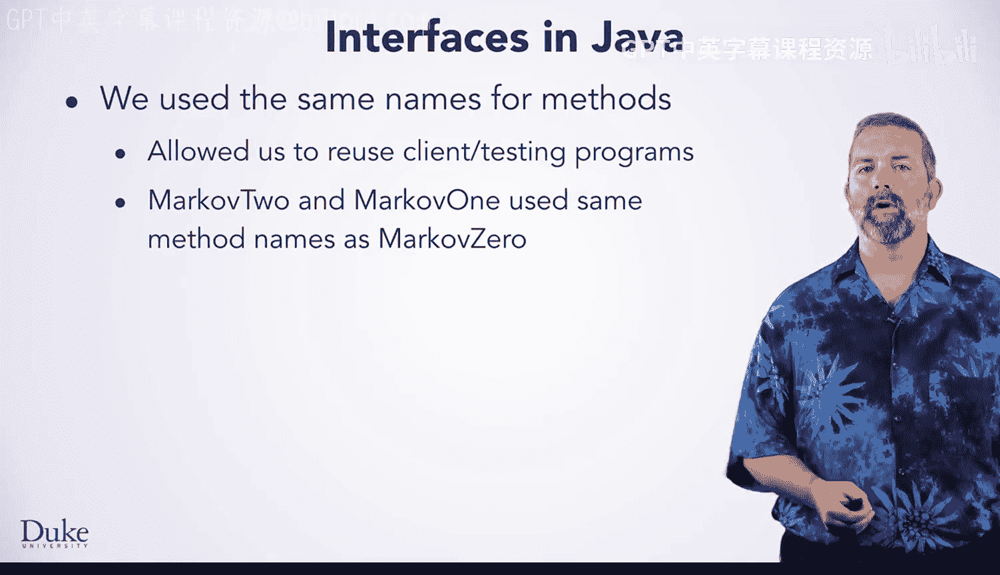
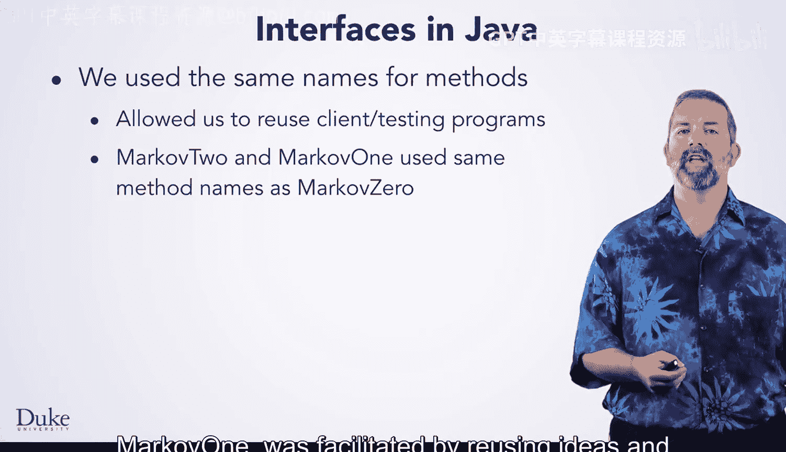
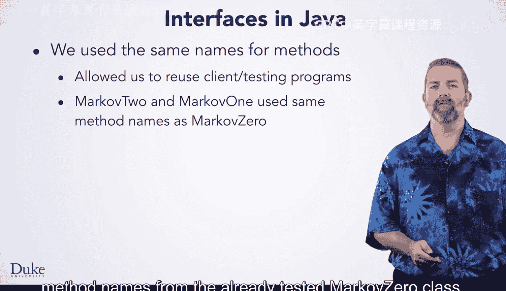

# Java编程和软件工程基础：2-5：预测与随机文本生成总结 🧠


在本节课中，我们将总结通过一系列相关程序和类所学到的新Java概念，这些概念是在预测和随机文本生成这一实用想法的背景下引入的。


通过开发一系列相关的类和程序，我们得以在熟悉的程序背景下介绍新的Java和设计思想。


在我们的示例中，我们使用了马尔可夫文本生成，但这些思想有助于形成机器学习算法的基础，例如用于垃圾邮件检测以及搜索引擎和移动智能手机中的预测和自动完成功能。

上一节我们介绍了马尔可夫模型的应用背景，本节中我们来看看在实现过程中遇到的具体设计问题及其解决方案。


我们研究了相关的类，这引导我们设计接口和抽象基类，以克服在多个类之间复制和粘贴代码的问题。熟悉的背景有助于促进对这些新的Java和面向对象概念的探索。我们还通过查看用于排序的`Comparable`接口，更深入地研究了Java接口。

以下是我们在设计过程中遵循的第一个关键原则：


*   **首先，我们在许多类中使用相同的方法名。** 这使我们能够在新类中重用客户端或测试代码。测试代码之所以能与不同的类一起编译，是因为方法名是相同的。我们首先开发了`MarkovZero`，但通过重用已经测试过的`MarkovZero`类中的思想和方法名，促进了`MarkovTwo`和`MarkovOne`的设计。

在确立了统一方法名的重要性之后，我们进一步将这一思想形式化。

我们将创建通用方法名的思想扩展到了创建一个名为`IMarkovModel`的接口。接口是Java和其他面向对象语言中一个强大的概念。接口在`java.util`、`java.io`和其他包与库中被广泛使用。





以下是接口定义的一个简单示例：
```java
public interface IMakrovModel {
    void setTraining(String text);
    String getRandomText(int numChars);
}
```



最后，我们将这些思想进一步扩展，为马尔可夫类创建了一个抽象基类。这使我们能够捕获公共代码，而不仅仅是方法名，正如我们通过创建接口所捕获的那样。

以下是抽象基类可能包含的公共代码示例：
```java
public abstract class AbstractMarkovModel implements IMakrovModel {
    protected String myText;
    protected Random myRandom;

    public void setTraining(String s) {
        myText = s;
    }

    public void setRandom(int seed) {
        myRandom = new Random(seed);
    }

    // getRandomText 方法保持抽象，由子类实现
    public abstract String getRandomText(int numChars);
}
```

本节课中我们一起学习了如何通过构建一系列相关的马尔可夫文本生成器，来引入和掌握Java的核心设计概念。我们从统一方法名开始，进而设计了`IMarkovModel`接口以实现多态，最后创建了`AbstractMarkovModel`抽象基类来消除代码重复。这个过程展示了接口和抽象类在构建灵活、可扩展和可维护的面向对象程序中的强大作用，这些原则是许多复杂算法和现代软件工程实践的基础。