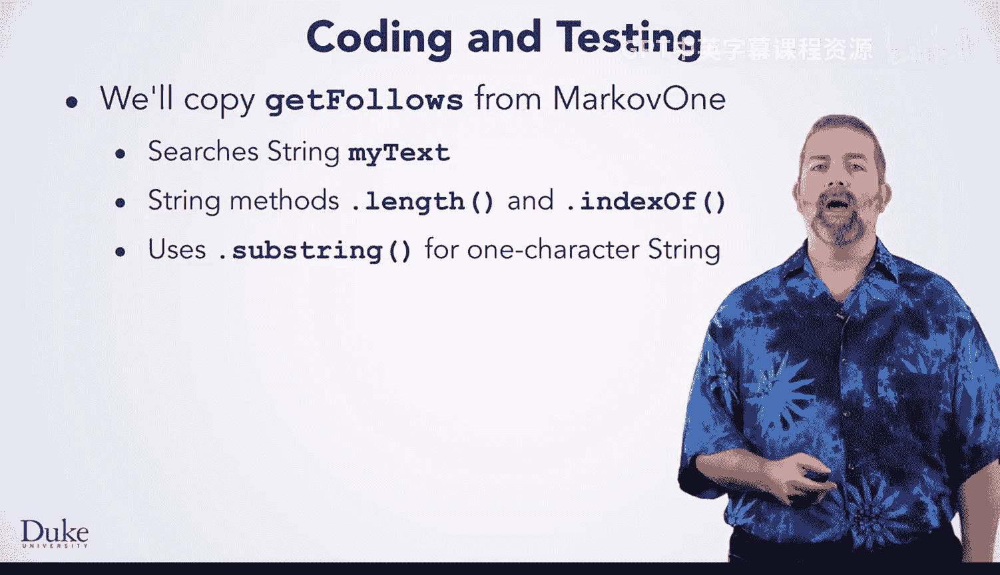
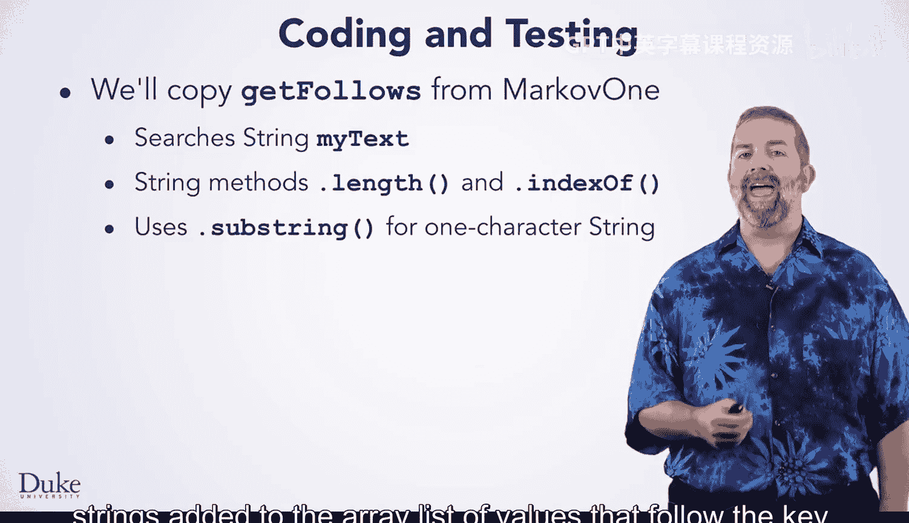
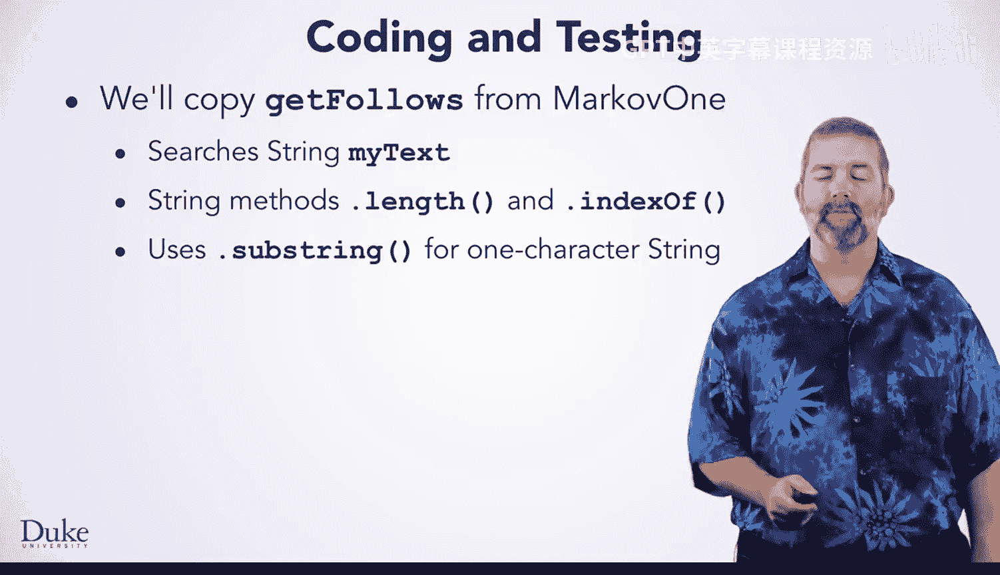

# Java编程和软件工程基础：2-5：一阶模型概念 🧠

在本节课中，我们将要学习如何实现一个基于单词的马尔可夫模型（Markov Word One），用于根据一个单词来预测下一个单词，从而生成随机文本。我们将复用之前基于字符的马尔可夫模型的设计和代码，理解抽象和接口如何帮助我们重用客户端程序。

## 复用设计理念 🔄

上一节我们介绍了基于字符的马尔可夫模型。本节中我们来看看如何将相同的概念应用到基于单词的模型上。

我们将使用在生成随机字符文本的马尔可夫程序中已经开发并测试过的相同概念。我们已经开发并测试了 `IMarkovModel` 接口，我们将继续使用它。在可能的情况下，复用已经测试过的代码是一个好主意。如果我们有一个好的设计，那么像 `MarkovRunner` 这样的客户端程序，即使面对一个全新的、基于单词而非字符的文本生成模型，也能继续工作。

一个好的设计意味着实现会改变，但接口（包括使用该接口的客户端程序）不会改变。这就是抽象的最佳体现。我们能够重用客户端程序，是因为这些程序依赖于类的接口，而不是其具体实现。

## 状态与行为的改变 🛠️

我们将把实例变量 `myText` 从字符串（String）改为字符串数组（String Array）。这需要修改一些代码。我们将搜索单词而非字符。这意味着我们需要修改辅助方法 `getFollows`，并实现一些新的私有辅助方法。

设计类通常意味着思考类的状态和行为，即实例变量和方法。

我们将以 `MarkovOne` 中经过测试的设计和代码为基础，来构建 `MarkovWordOne`。两者都实现了 `IMarkovModel` 接口，这意味着两者都将拥有 `setTraining` 和 `getRandomText` 方法。

在 `MarkovWordOne` 中，我们将遍历一个单词数组（即训练文本），这类似于在字符串中搜索字符。实际上，字符串在其内部实现中也使用了字符数组。

我们将一次一个单词地构建随机文本。这与一次一个字符地构建文本几乎相同，只有一个小的区别：我们需要在单词之间添加空格。当一次一个字符地构建文本时，我们利用了空格本身也是一个字符这一事实，因此空格是随机生成的。

## 初始化 MarkovWordOne 对象 🏗️

我们需要创建并初始化实例变量。我们将一个随机对象和一个单词数组存储为实例变量。这与 `MarkovOne` 几乎相同，但我们使用的是字符串数组而不是单个字符串。

我们在构造函数中初始化字段，创建随机数生成器。实例变量 `myText` 在调用 `setTraining` 方法时被赋值，就像 `MarkovOne` 中的代码一样。这里我们使用字符串方法 `split`，通过正则表达式 `\\s+` 将一个字符串分割成单词，该表达式代表一个或多个任意空白字符。我们之前使用过相同的习惯用法来将字符串分割成单词。

## 实现 getRandomText 方法 📝

现在，我们转向 `getRandomText`，这是 `IMarkovModel` 接口要求的第二个方法。该接口要求我们实现此方法以返回随机生成的文本。

接口中的方法签名使用了一个名为 `numChars` 的整型参数。因为在之前的马尔可夫类中，我们设计并实现了 `getRandomText` 方法，该方法基于随机生成指定数量的字符来返回一个字符串。

在 Java 中，方法签名取决于参数的类型，而不是参数名。因此，在 `MarkovWordOne` 中，我们可以将参数名改为 `numWords`，因为我们是一次生成一个单词，而不是一个字符。

我们将单词逐个添加到 `StringBuilder` 中，这里展示了初始键是随机选择的情况。我们还必须在每个单词后显式地添加一个空格。因此，在将每个单词追加到 `StringBuilder` 后，我们追加一个空格字符串。这意味着末尾会有一个多余的空格，但我们可以使用 `String.trim()` 方法将其移除。

`MarkovWordOne` 中的 `getRandomText` 方法几乎完成了。我们没有在上一个幻灯片中展示的 `for` 循环在这里展示。它与 `MarkovOne` 中的 `for` 循环几乎相同。

我们将方法中的 `numChars` 改为此版本 `getRandomText` 中使用的名称 `numWords`。我们还显式地在追加到 `StringBuilder` 的单词后添加了一个空格。除此之外，代码是相同的。

## 修改辅助方法 getFollows 🔍

我们准备编码和测试 `MarkovWordOne`。我们将从 `MarkovOne` 复制 `getFollows` 私有方法。

那段代码搜索一个字符串实例变量 `myText`。我们将复制的代码使用了 `.length()` 和 `.indexOf()` 方法，我们需要更改这些。我们复制的代码还使用 `.substring()` 来创建跟随键（key）之后添加到 `ArrayList` 值列表中的单字符字符串。我们也将替换 `.substring()`。

这些变更是必要的，因为 `myText` 从字符串变成了字符串数组。替换 `.length()` 和 `.substring()` 将非常简单，但我们需要编写一个辅助方法来替代字符串方法 `.indexOf()`。

Java 没有为数组或 `ArrayList` 提供同样类型的、返回索引的通用搜索方法。`ArrayList` 确实有返回布尔值的 `.contains()` 方法，以及返回值的第一个或最后一个索引的方法，但没有像字符串的 `indexOf` 方法那样从特定索引开始搜索的方法。我们将把它写成辅助方法，从而得到一个可运行的程序。

## 总结 📚

本节课中我们一起学习了如何将基于字符的一阶马尔可夫模型扩展为基于单词的模型。我们理解了通过良好的接口设计（`IMarkovModel`）可以实现代码的复用，客户端程序无需修改。我们探讨了核心变更点：将训练文本从 `String` 改为 `String[]`，相应地修改了 `getFollows` 等辅助方法的实现逻辑，并在生成文本时处理了单词间的空格问题。这体现了面向对象编程中抽象和封装的力量。