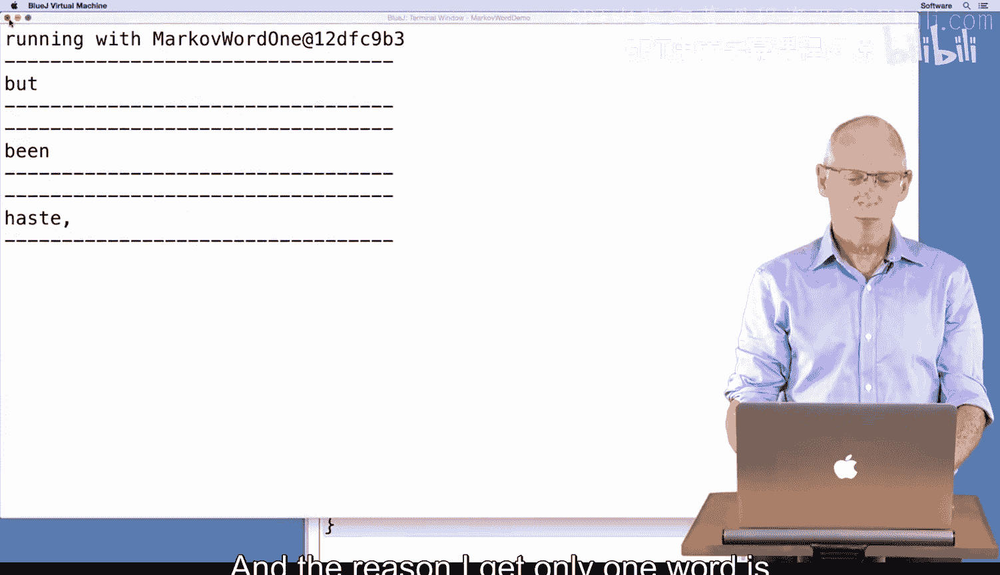

# 154：一阶马尔可夫词模型辅助函数


在本节课中，我们将要学习如何为一阶马尔可夫词模型（Markov Word 1）开发和测试代码。我们将重点关注如何修改和实现一个关键的辅助函数 `getFollows`，该函数用于在单词数组中查找特定“键”之后出现的所有单词。我们将通过复制并调整现有代码来完成这个任务，虽然这不是最佳实践，但在学习更高级的抽象方法之前，这是一个有效的步骤。

## 概述与目标


上一节我们介绍了基于字符的一阶马尔可夫模型。本节中我们来看看如何将其思想应用到单词上，构建一个基于单词的一阶马尔可夫模型。我们的核心任务是修改 `getFollows` 方法，使其能够处理字符串数组（单词）而非单个字符串（文本）。


## 初始代码与问题

首先，我们运行现有的 `MarkovRunner` 类来观察基于字符的模型输出。当我们尝试将其改为使用 `MarkovWordOne` 类并运行时，发现它只生成了一个随机单词，而不是我们期望的200个单词。

问题根源在于 `MarkovWordOne` 类中的 `getFollows` 方法尚未正确实现。该方法目前返回一个空的 `ArrayList`，因为它还没有被填充数据。

## 复制并修改 `getFollows` 方法

为了解决这个问题，我们将从 `MarkovOne` 类中复制 `getFollows` 方法的代码到 `MarkovWordOne` 类中。然后，我们需要进行几处关键修改，以适应从“字符”到“单词”的转变。

以下是需要修改的核心部分：

1.  **获取长度**：在字符模型中，我们使用 `myText.length()`。在单词模型中，`myText` 是一个字符串数组，因此我们应使用 `myText.length`（没有括号）。
    ```java
    // 字符模型
    int len = myText.length();
    // 单词模型
    int len = myText.length;
    ```

2.  **查找索引**：在字符模型中，我们使用 `myText.indexOf(key, pos)` 来查找子串。字符串数组没有内置的 `indexOf` 方法，因此我们需要自己编写一个辅助函数。
    ```java
    // 字符模型
    int index = myText.indexOf(key, pos);
    // 单词模型
    int index = indexOf(myText, key, pos); // 调用自定义的辅助函数
    ```

3.  **获取后续字符/单词**：在字符模型中，我们使用 `myText.substring(start+1, start+2)` 来获取下一个字符。在单词模型中，我们只需要直接获取 `start+1` 位置的单词。
    ```java
    // 字符模型
    String next = myText.substring(start+1, start+2);
    // 单词模型
    String next = myText[start+1];
    ```

## 实现自定义的 `indexOf` 辅助函数

由于字符串数组没有 `indexOf` 方法，我们需要自己实现一个。这个函数的作用是：在给定的字符串数组 `words` 中，从指定位置 `start` 开始，查找目标字符串 `target` 第一次出现的位置。

以下是该函数的实现逻辑：

```java
private int indexOf(String[] words, String target, int start) {
    for (int k = start; k < words.length; k++) {
        if (words[k].equals(target)) {
            return k;
        }
    }
    return -1;
}
```



**代码解释**：
*   函数接收三个参数：要搜索的单词数组 `words`、要查找的目标单词 `target`、以及开始搜索的位置 `start`。
*   使用一个 `for` 循环从 `start` 位置开始遍历数组。
*   在循环中，使用 `equals` 方法（而不是 `==`）来比较字符串是否相等。
*   如果找到目标单词，立即返回其索引 `k`。
*   如果循环结束仍未找到，则返回 `-1`，表示未找到。

## 测试修改后的代码

完成上述修改后，我们重新编译并运行 `MarkovRunner` 类。这次，程序成功生成了包含200个随机单词的文本。虽然文本内容可能没有实际意义（因为每个单词都是根据前一个单词随机选择的），但它证明了我们的 `getFollows` 方法和自定义的 `indexOf` 函数工作正常。

## 总结

本节课中我们一起学习了如何为一阶马尔可夫词模型实现核心的 `getFollows` 辅助函数。我们通过复制并修改基于字符的模型代码，将其适配到单词场景。关键步骤包括：
1.  将文本视为字符串数组而非单个字符串。
2.  将字符串的 `length()` 方法调用改为数组的 `length` 属性访问。
3.  用自定义的 `indexOf` 函数替代字符串的 `indexOf` 方法，以在数组中查找单词。
4.  直接通过数组索引获取下一个单词，而非使用 `substring`。

虽然通过复制代码来避免重复不是长期的最佳实践，但它帮助我们理解了模型从字符到单词转换的核心逻辑。在后续课程中，我们将学习使用抽象和继承来更优雅地处理这类代码复用问题。