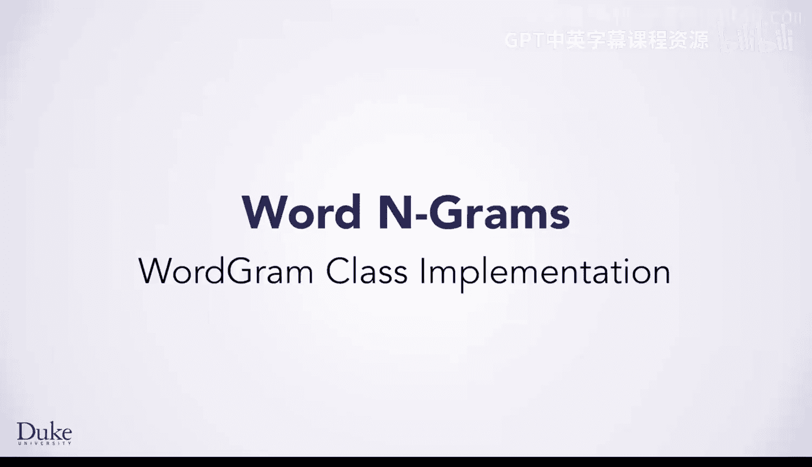
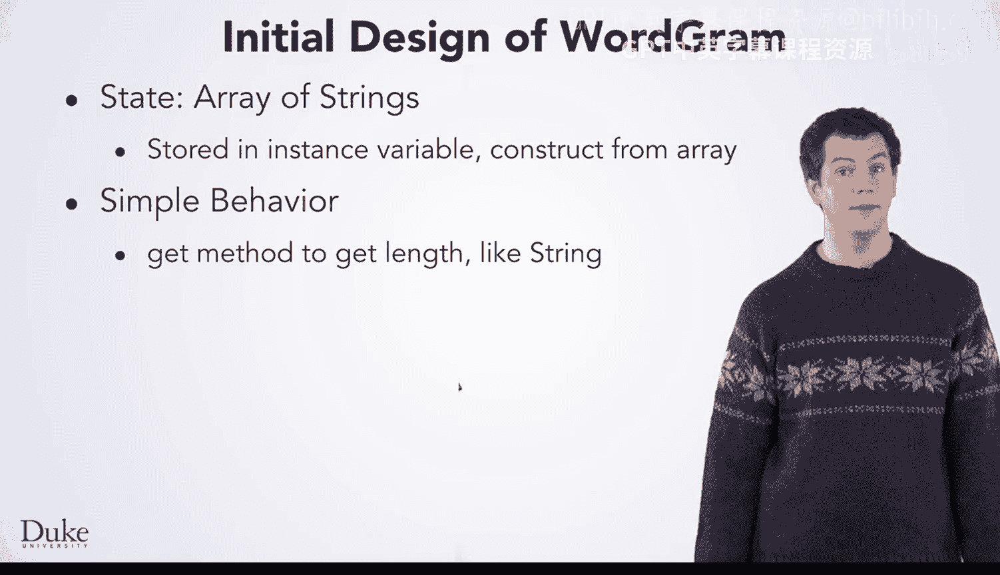
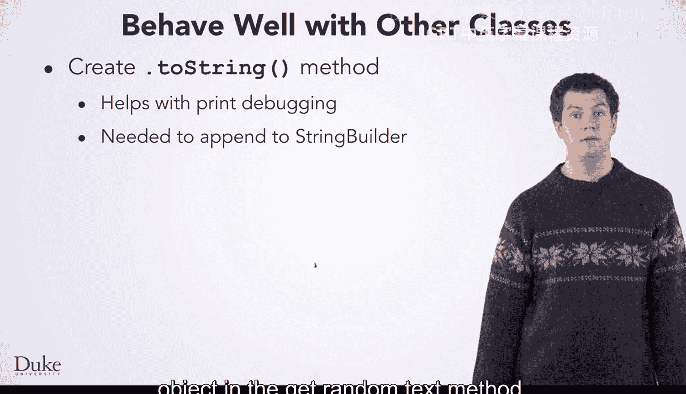
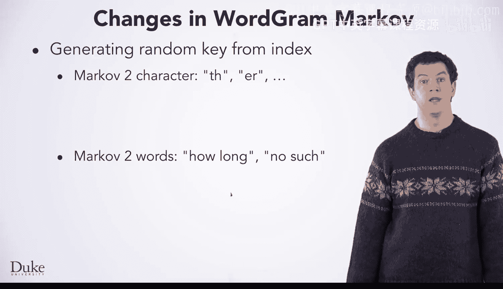

# Java编程和软件工程基础：2-5：WordGram类实现



在本节课中，我们将学习如何设计和实现一个名为`WordGram`的类。这个类将用于处理字符串序列，类似于字符序列的处理方式，但针对的是单词。我们将从设计思路开始，逐步讲解其状态、行为以及关键方法的实现。

## 概述：类的设计思路与用例

上一节我们介绍了从字符到单词的马尔可夫模型转换。本节中，我们来看看如何为单词序列设计一个专门的类。

作为类设计的一部分，通常需要考虑这个类将如何被使用。这通常被称为生成用例，既可以针对整个程序，也可以针对单个类进行。我们将思考`WordGram`对象在我们的马尔可夫程序中如何被使用。我们有一些经验可以借鉴。

以下是`WordGram`类的主要使用场景：
*   我们将从一个字符串数组中创建一个`WordGram`对象。这类似于使用`substring`方法从字符中创建字符串。
*   我们需要向一个`WordGram`的末尾添加一个新的字符串。这类似于在生成随机文本时，添加一个后续字符以形成新的键。

我们准备好总结`WordGram`的初步设计了。其状态将是一个字符串数组。我们将把它存储在一个实例变量中，就像在字符马尔可夫程序中`myText`是一个字符串一样。

## 核心行为设计



我们先看一些简单的行为。我们需要一个`get`方法来获取`WordGram`的长度，就像字符串有`.length()`方法一样。这被称为`get`方法，因为它只是获取一个值。

我们需要一个类似于字符串的`.charAt()`的方法，但用于获取特定索引处的单词。我们希望程序员能够像使用其他类一样使用`WordGram`。这意味着我们需要一个`.toString()`方法用于打印和其他用途，并且我们还需要一个`.equals()`方法用于查找后续词，这一点我们很快就会看到。

我们可能会考虑一个`.compareTo()`方法，并让`WordGram`类实现`Comparable`接口，这可能会使其更通用。但在我们分析`WordGram`将如何被使用时，我们没有涉及到排序。我们不会设计一个不会被使用的功能。我们可以在需要时再添加功能。

## 构造函数与状态初始化

现在，我们来设计`WordGram`的构造函数。构造函数用于初始化对象的状态。

以下是构造函数的代码示例：
```java
public WordGram(String[] source, int start, int size) {
    myWords = new String[size];
    System.arraycopy(source, start, myWords, 0, size);
}
```
在这种情况下，状态是一个我们命名为`myWords`的字符串数组。该数组中的字符串是从作为参数传递给构造函数的源数组中复制而来的。要复制的字符串数量是构造函数的另一个参数，开始复制的起始索引也是。`System.arraycopy`方法将值从源数组复制到目标数组。在这里，目标就是实例变量`myWords`。

## 核心方法实现

我们将查看`WordGram`中简单行为的代码。这些方法是字符串方法的直接类比。

`.wordAt`方法返回指定索引处的字符串，就像`.charAt`返回字符串中指定索引处的字符一样。如果索引无效（过低或过高），该方法会抛出一个异常。在访问数组、`ArrayList`或字符串值时，你可能已经遇到过这样的异常。在这里，我们的代码像其他类一样抛出异常。如果你继续学习Java，你会学到更多关于异常的知识。目前，我们希望我们的类能像其他类一样运作。

单词的数量由`.length`方法返回，就像字符串类中字符的数量由`.length`方法返回一样。

我们还有两个方法，以确保`WordGram`能与其他类良好协作。就像我们的`.wordAt`方法在索引错误时像相关类一样抛出异常，我们需要这些方法，因为程序员期望它们。

我们将创建一个`.toString`方法，正如你在其他例子中看到的，这将有助于打印`WordGram`，无论是用于输出还是作为调试帮助。在`getRandomText`方法中，我们还需要`.toString`来将值追加到`StringBuilder`对象。

我们将创建一个`.equals`方法。这在确定一个`WordGram`对象何时等于另一个对象时非常重要，例如在编写`getFollows`辅助方法时。如果两个`WordGram`对象的长度相等，并且对应索引处的字符串相等，那么它们就是相等的。

我们需要使用`.equals`而不是`==`来检查两个字符串是否相等。



## 从字符到单词的代码转换



我们简要看一下从字符模型转换到单词模型后代码的变化。一旦`WordGram`类完成，你将需要自己并在后续课程中做更多工作。

在字符马尔可夫模型的`getRandomText`方法中，你需要生成随机文本，随机文本将是训练文本中出现的两个字符序列，如“T H”和“E”。这些是使用`.substring`方法获得的。在单词马尔可夫模型中，随机文本是像“how long”和“no such”这样的序列。这些序列是通过创建一个新的`WordGram`对象形成的，使用的参数与字符类中相同：`myText`、`index`和`myOrder`。

## 总结

本节课中我们一起学习了如何为单词序列设计和实现`WordGram`类。我们明确了其设计用例，定义了以字符串数组为核心的状态，并实现了包括构造函数、`.wordAt`、`.length`、`.toString`和`.equals`在内的关键方法。这个类封装了单词序列的操作，使得从基于字符的马尔可夫模型过渡到基于单词的模型变得更加清晰和模块化。