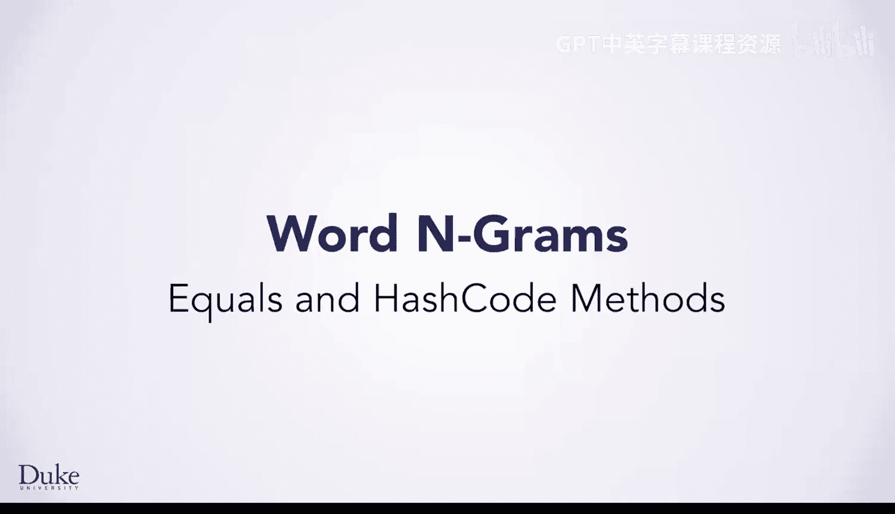
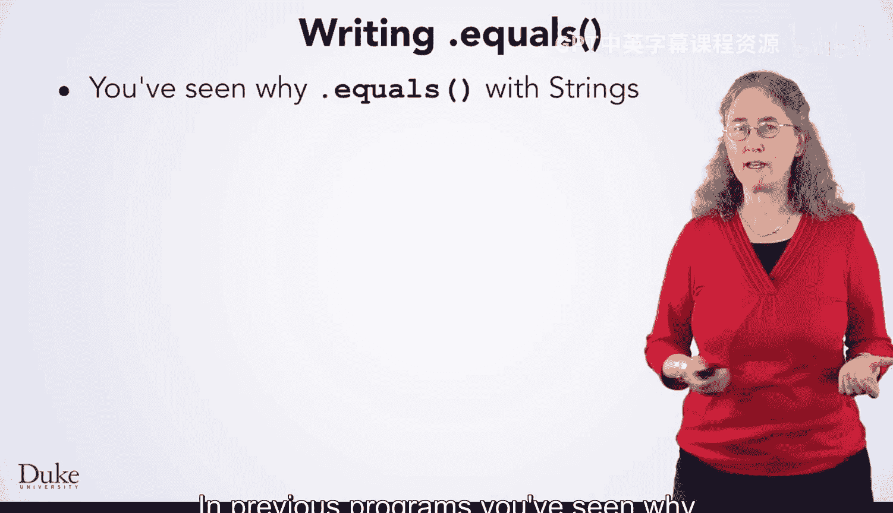
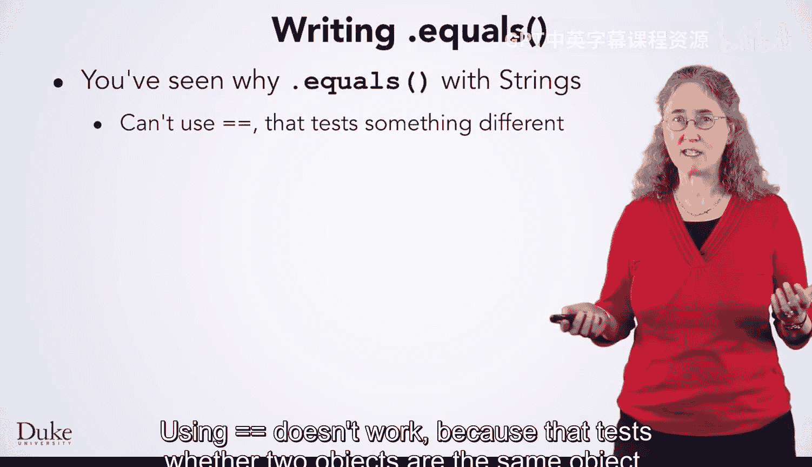
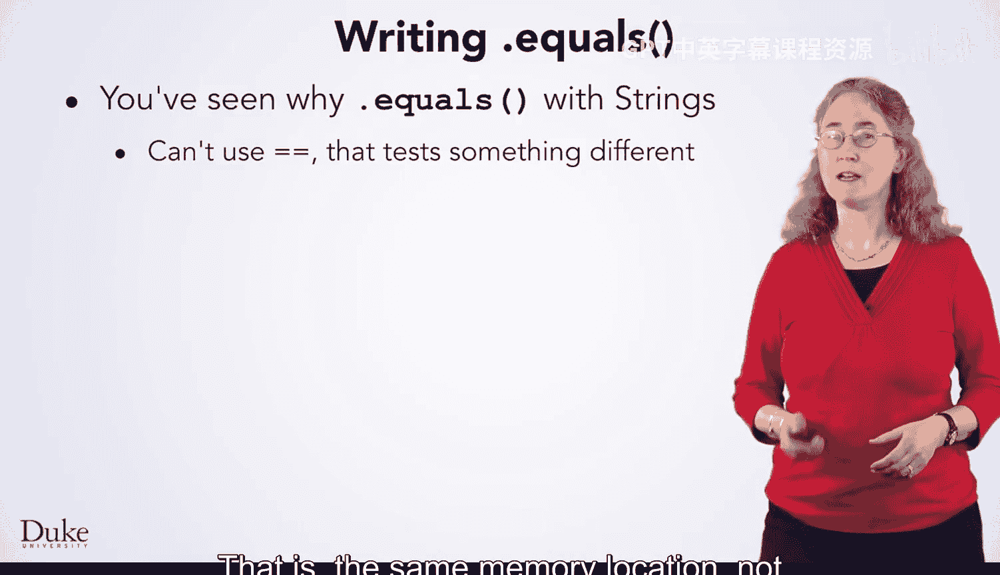
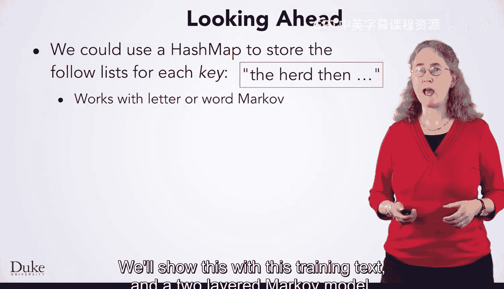
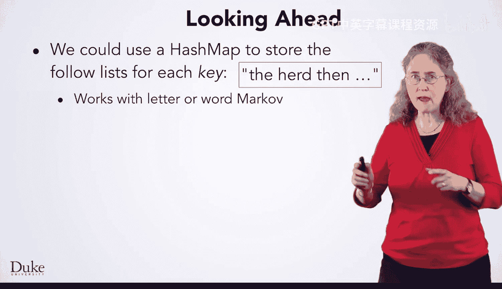
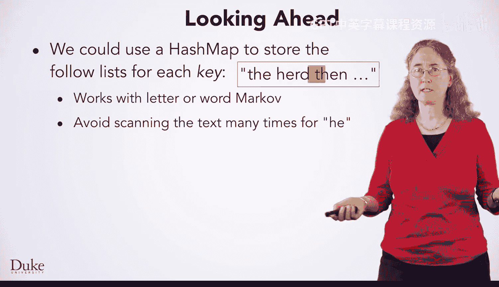
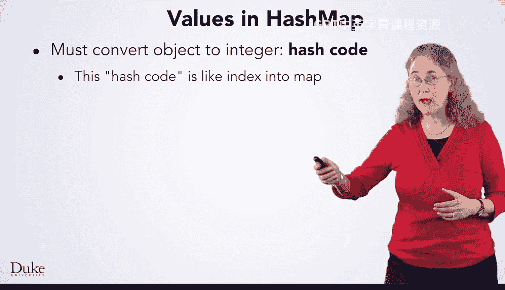
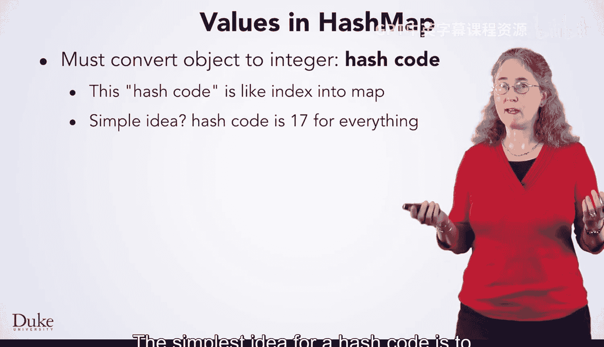
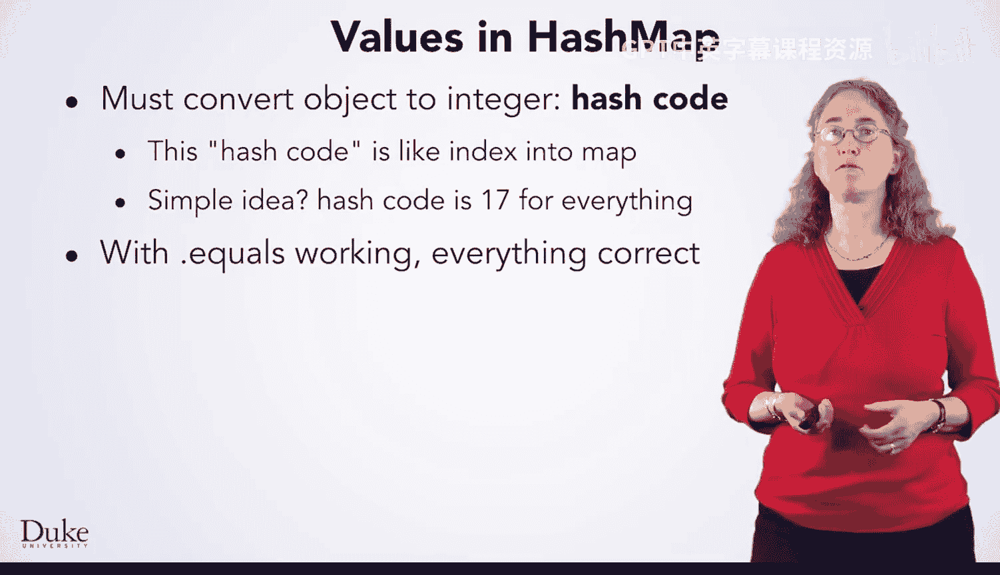

# Java编程和软件工程基础：2-5：equals与hashCode方法

在本节课中，我们将学习如何为`WordGram`类开发几个关键方法，使其能在我们的马尔可夫程序中正常运作。我们将重点探讨`equals`和`hashCode`方法的实现原理与必要性，并简要介绍`toString`方法。这些方法是构建健壮Java类的基础。

我们将使用`WordGramTester.java`程序来演示技术、思路并测试方法。这些实现技巧不仅适用于`WordGram`类，也适用于任何其他Java类。

我们将展示如何测试`toString`方法和`WordGram`构造函数，尽管它们已经编写完成。

我们将探讨为什么需要`equals`方法。虽然我们在之前的课程中讨论过`equals`，但本节将简要讨论如何实现`equals`方法，而不仅仅是调用它。

`equals`方法对于`MarkovWord`的`follows`方法正确工作是必需的。这将足以让`MarkovRunner`类与`MarkovWord`一起工作并生成随机文本。

我们还将简要介绍一个高级方法。我们将看到如何实现`hashCode`方法，以便`WordGram`对象可以被添加到哈希映射中。

掌握了`toString`、`equals`和`hashCode`的知识，你将准备好应对大量的类和程序设计挑战。

## 实现 equals 方法

首先，让我们看看`equals`方法。在之前的程序中，你已经见过为什么需要使用`equals`来比较字符串。

使用双等号`==`进行比较是无效的，因为它测试的是两个对象是否是内存中的同一个对象，而不是它们是否包含相同的信息。

在其他程序中，你调用过`equals`方法。现在，我们来看看编写它需要什么。

我们必须遵守Java对编写`equals`方法的要求。

第一个要求是参数类型为`Object`。这是Java中每个类的基类或父类。如果你学习更高级的面向对象编程课程，将会探讨要求此类型的原因。

我们不会用`WordGram`以外的任何类型来调用`equals`，所以我们要做的第一件事是将参数`o`进行类型转换，以便编译器将其视为`WordGram`对象。

通过将类型放在括号中进行强制转换，可以使编译器将参数`o`引用的对象视为`WordGram`类型。我们使用名为`other`的变量来完成此操作，但可以使用任何名称。

然后，我们将当前对象的长度与`other`引用的`WordGram`对象的长度进行比较，如果长度不同则返回`false`。这是实现`equals`方法的第一步。

有了`equals`和`toString`方法，我们就可以编写马尔可夫词类了。但我们将提前了解一下你将在后续课程中学习的内容，以及作为对我们一直使用的马尔可夫类的一个增强。

## 哈希映射与 hashCode 方法

我们可以将所有用于生成文本的键存储在一个哈希映射中。我们将键映射到跟随该键的所有字符的列表。

这种技术适用于字母或单词马尔可夫模型。我们将用这个训练文本和一个双字母马尔可夫模型来展示。

训练文本以“he”开头，然后是“a”，并继续包含更多未显示的字母。其核心思想是避免为像“he”这样的键多次扫描文本。

在我们的模型中，我们找到“he”和一个跟随字符。然后找到“he”的下一次出现，再下一次出现。如果我们再次看到键“he”，就需要重新扫描文本以寻找跟随字符，重复我们之前已经做过的工作。这可能会在我们每次生成“he”作为键并需要找到跟随字符时发生。

与其反复扫描，不如在哈希映射中查找键并检索存储在列表中的跟随字符。这可能会更高效。但为了实现这一点，我们需要实现`hashCode`方法。

我们将提供哈希映射的高层概述，足以获得一些理解，但不会涉及太多细节。其核心思想是将对象转换为一个整数哈希码。

这个哈希码作为哈希映射中的索引。对于字符串，对象“Ho”可能被转换为哈希码3217。这个数字告诉我们在哈希映射中哪里可以找到“Ho”。

最简单的哈希码想法是让每个对象都有相同的索引，比如数字17。如果我们这样做，只要`equals`方法正确，我们的代码就能正确工作。但性能会非常差，因为每个对象都会存储在同一个“桶”中。“桶”是哈希映射中存储对象的位置。

理想情况下，每个对象都有一个不同的数字。这样，在桶中找到一个对象就很容易，因为它是桶中唯一的对象。

如果你学习另一门Java课程，比如紧随本课程之后的UCSD专项课程，你将看到这是如何工作的细节。

一个具有更好性能的简单想法是，将`WordGram`中每个字符串的哈希码简单地相加。

享受将对象哈希到许多不同桶中的乐趣，这样你的哈希操作就会很快。

## 总结

本节课中，我们一起学习了如何为`WordGram`类实现关键的`equals`和`hashCode`方法。我们了解了`equals`方法对于对象内容比较的必要性，以及`hashCode`方法对于在哈希映射等数据结构中高效存储和检索对象的重要性。掌握这些方法，是进行有效Java类设计和程序开发的基础。