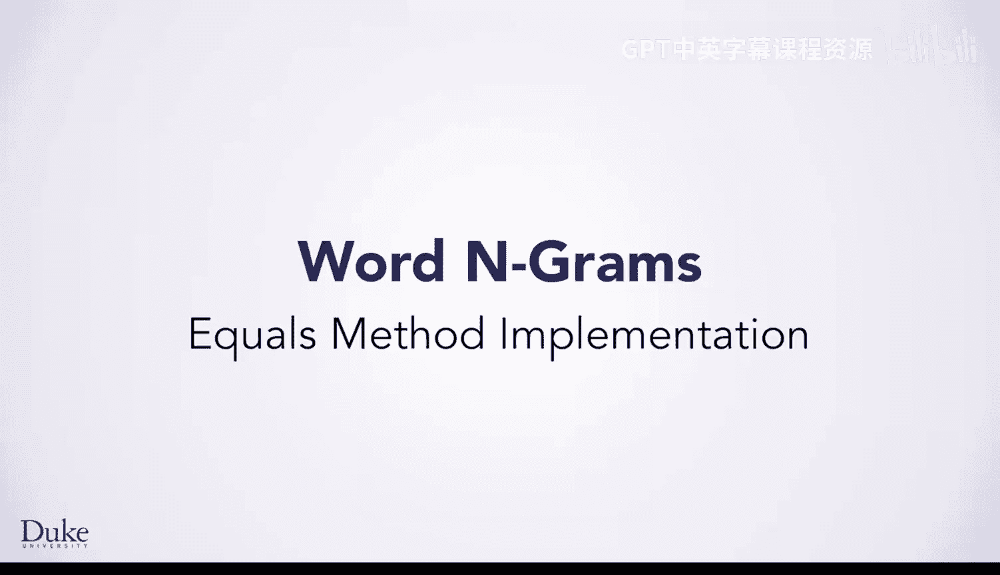
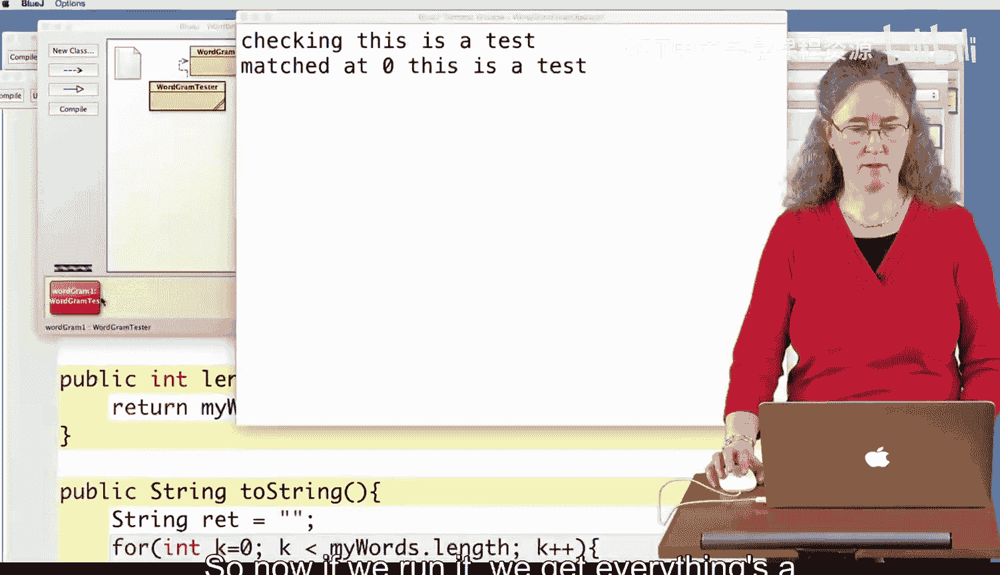

# 158：equals方法实现




在本节课中，我们将学习如何以及为何需要编写自定义的 `equals` 方法。我们将通过一个具体的例子——比较 `WordGram` 对象——来理解当默认的 `==` 运算符和 `Object` 类的 `equals` 方法不能满足需求时，如何实现我们自己的逻辑来判断两个对象是否“相等”。

## 问题引入：默认比较的局限性

上一节我们介绍了 `WordGram` 类的基本结构。本节中我们来看看如何比较两个 `WordGram` 对象是否包含相同的单词序列。

我们有一个测试方法 `testWordGramEquals`。它从一个长字符串中创建多个长度为4的 `WordGram` 对象，并将它们存入一个 `ArrayList`。然后，它尝试找出列表中所有与第一个 `WordGram` 对象相等的其他对象。

以下是测试代码的核心逻辑：

```java
WordGram first = list.get(0);
for (int k=0; k < list.size(); k++) {
    if (first == list.get(k)) {
        System.out.println("matched at " + k);
    }
}
```

运行此代码，发现它只匹配了索引0处的对象（即 `first` 与自身比较）。即使索引4和8处的 `WordGram` 对象包含完全相同的单词序列（“this is a test”），也没有被匹配到。这是因为 `==` 运算符比较的是两个对象引用是否指向内存中的同一个对象，而不是它们的内容是否相同。

## 尝试使用默认的 `equals` 方法

接下来，我们尝试使用 `Object` 类提供的 `equals` 方法，将 `if` 条件改为：

```java
if (first.equals(list.get(k))) {
    System.out.println("matched at " + k);
}
```

再次运行测试，结果依然只匹配了索引0处的对象。这是因为 `Object` 类中的默认 `equals` 方法实现与 `==` 运算符的行为相同，它并不了解 `WordGram` 对象内部的数据结构。

## 实现自定义的 `equals` 方法

因此，我们需要在 `WordGram` 类中重写（override）`equals` 方法，定义我们自己的相等性逻辑。

首先，我们在 `WordGram` 类中添加方法签名。`equals` 方法必须接受一个 `Object` 类型的参数并返回一个 `boolean` 值。

```java
public boolean equals(Object o) {
    WordGram other = (WordGram) o; // 将传入的对象转换为 WordGram 类型
    return true; // 临时返回 true 以测试方法是否被调用
}
```



编译并运行测试，此时程序输出了所有匹配项（因为始终返回 `true`），这证明我们自定义的 `equals` 方法已被成功调用。接下来，我们需要完善其内部逻辑。

一个合理的 `WordGram` 相等性判断应包含以下两个步骤：
1.  检查两个 `WordGram` 对象的长度是否相同。
2.  如果长度相同，则逐个比较对应位置的单词是否完全相同。

以下是完善后的 `equals` 方法实现：

```java
public boolean equals(Object o) {
    // 1. 检查传入的对象是否是 WordGram 类型
    if (! (o instanceof WordGram)) {
        return false;
    }
    WordGram other = (WordGram) o;

    // 2. 比较两个 WordGram 的长度
    if (this.length() != other.length()) {
        return false;
    }

    // 3. 逐个比较单词
    for (int k=0; k < this.length(); k++) {
        if (! this.wordAt(k).equals(other.wordAt(k))) {
            return false; // 发现一个不匹配的单词，立即返回 false
        }
    }

    // 4. 所有检查都通过，返回 true
    return true;
}
```

**代码解释**：
*   `instanceof` 运算符用于确保传入的对象 `o` 是 `WordGram` 类型或其子类的实例，这是进行安全类型转换的前提。
*   首先比较长度，如果长度不同，则两个 `WordGram` 肯定不相等。
*   使用一个 `for` 循环遍历每个索引位置，并使用字符串的 `equals` 方法比较 `this` 对象和 `other` 对象在该位置的单词。
*   一旦发现任何位置上的单词不匹配，方法立即返回 `false`。
*   如果循环顺利完成，说明所有单词都匹配，方法返回 `true`。

## 测试与验证

现在，我们再次运行 `testWordGramEquals` 方法。这次，程序正确地找到了索引0、4和8处的三个相等的 `WordGram` 对象，并打印出相应的匹配信息。

## 总结

本节课中我们一起学习了如何为自定义类实现 `equals` 方法。我们了解到：
1.  `==` 运算符和 `Object` 类的默认 `equals` 方法比较的是对象引用（内存地址），而非对象内容。
2.  当需要根据对象的内部状态（如 `WordGram` 中的单词序列）来判断相等性时，必须重写 `equals` 方法。
3.  一个健壮的 `equals` 方法实现通常包括：类型检查、关键属性（如长度）的比较，以及深层内容（如数组或集合中的元素）的逐一比较。

通过实现 `WordGram` 的 `equals` 方法，我们掌握了让对象支持“逻辑相等”比较的核心技能，这是构建复杂、可维护Java程序的重要基础。