# 162：static关键字详解 🧠

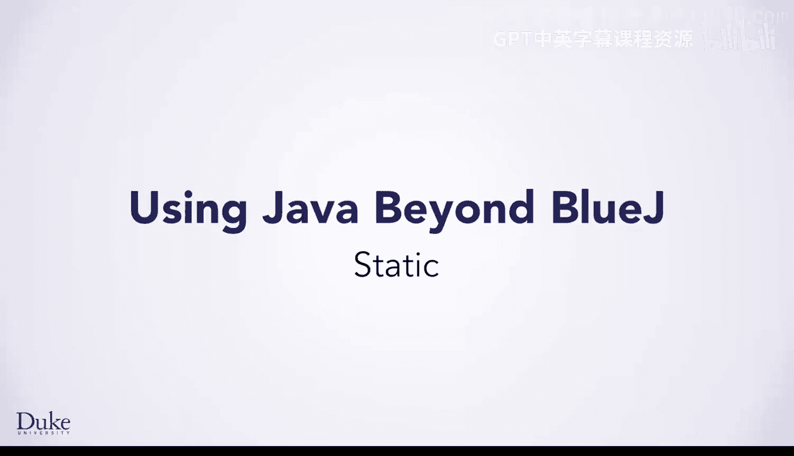


在本节课中，我们将要学习Java中一个重要的概念——`static`关键字。我们将探讨它如何应用于字段和方法，理解它与实例成员的区别，并通过一个银行账户的示例来掌握其核心用途。


## 静态的含义


上一节我们介绍了`main`方法，它是静态的。本节中我们来看看`static`具体意味着什么。


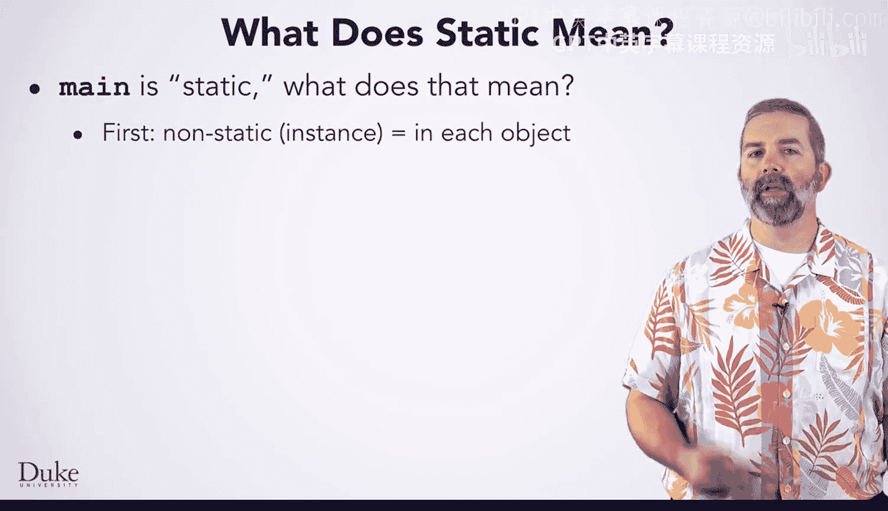

`static`意味着该方法属于类本身，而不属于类的任何特定实例。为了理解这一点，我们首先需要了解非静态字段，即每个类实例都拥有自己独立副本的字段。


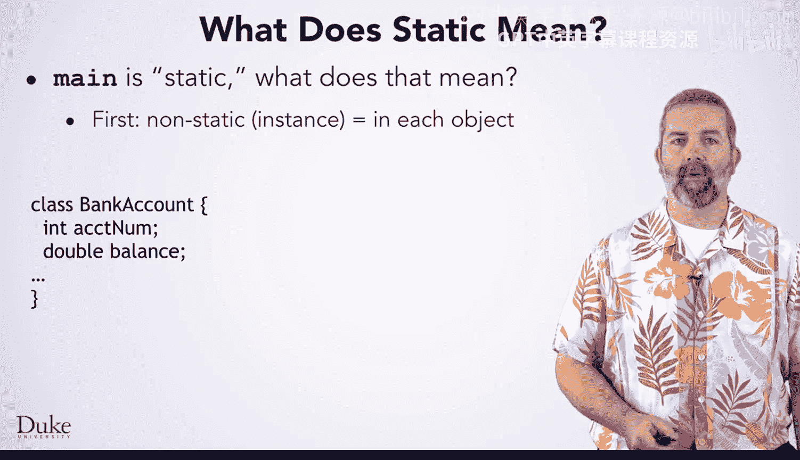

## 非静态字段示例

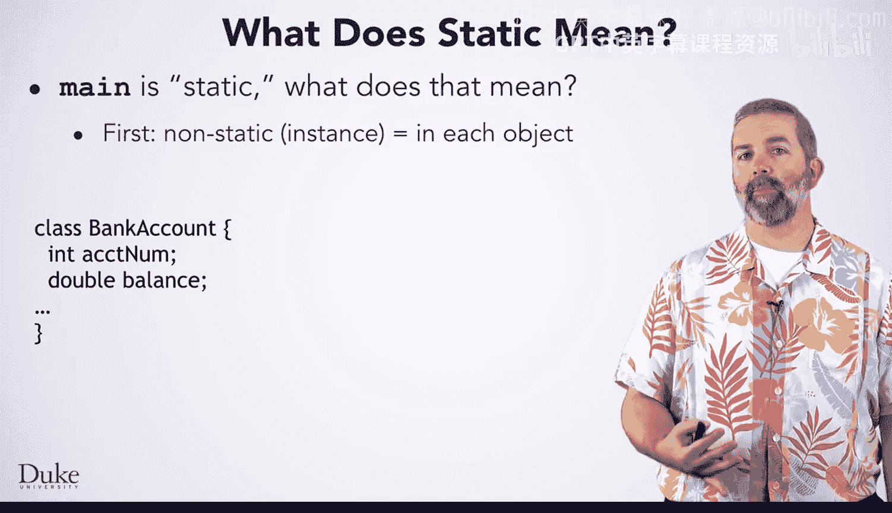

以下是银行账户类中非静态字段的一个典型例子。

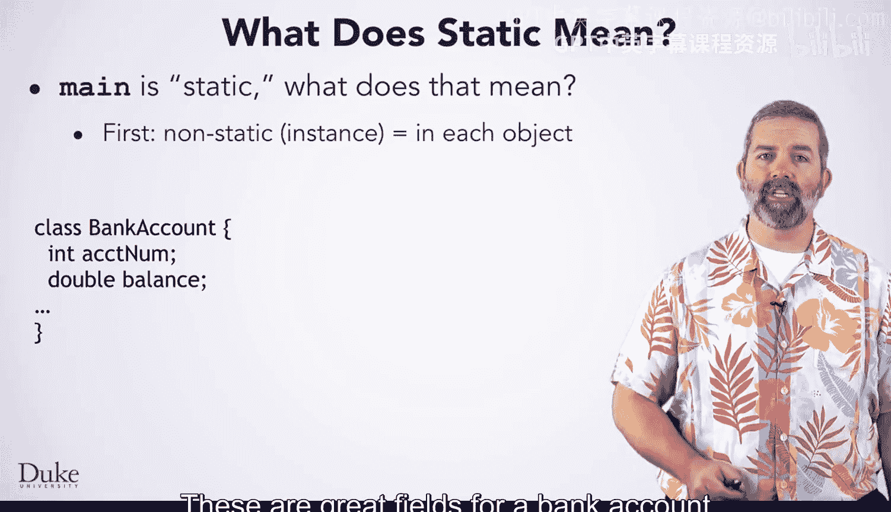

假设你正在编写银行软件，决定创建一个银行账户类，并声明账户余额和账户号码字段。

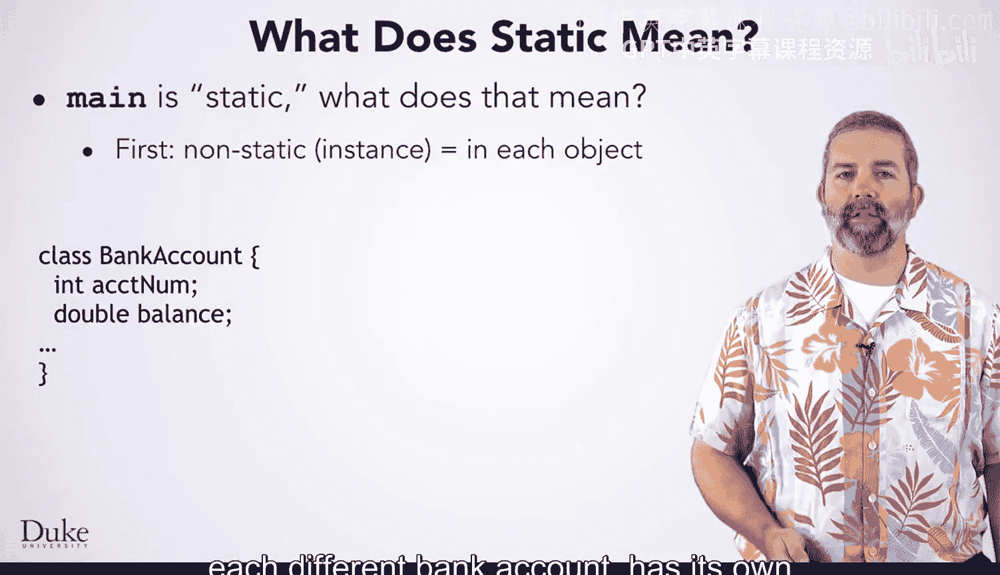

```java
public class BankAccount {
    private double balance;
    private int accountNumber;
}
```

这些是银行账户类的理想字段，因为每个实例（即每个不同的银行账户）都拥有自己的账户号码和自己的余额。

如果你创建了这个类的三个实例来存储三个账户的数据，它们可能看起来像这样。你可以看到每个实例都有自己的账户号码和余额。这些字段不是静态的，它们存在于每个实例中。


## 引入静态字段的需求

现在假设在编写软件时，你想跟踪下一个要分配的账户号码。这样，当你创建一个新账户时，你就知道该给它什么号码。

为此创建一个实例变量（如下所示）效果并不好。

```java
public class BankAccount {
    private double balance;
    private int accountNumber;
    private int nextAccountNumber; // 这是一个错误的设计
}
```

声明这个字段会使每个银行账户都拥有自己的“下一个账户号码”，但这并不是你真正想要的。让我们通过一个你可能想写的构造函数来看看这个问题，该构造函数使用这个`nextAccountNumber`来初始化正在构建的银行账户的账户号码，然后递增该`nextAccountNumber`。

```java
public BankAccount() {
    this.accountNumber = this.nextAccountNumber;
    this.nextAccountNumber++;
}
```

当你创建第一个银行账户对象时，所有字段的初始值都是0。然后执行构造函数中的代码。第一行将从这个对象的`nextAccountNumber`初始化该对象的账户号码，将其设置为0。下一行将这个对象的`nextAccountNumber`递增到1。到目前为止，这个行为是正常的，但当你创建第二个银行账户对象时，问题就出现了。

这个新创建的对象拥有每个字段的独立副本。现在，当你执行构造函数的第一行时，它使用该对象的`nextAccountNumber`来初始化这个对象的账户号码。然后你将对象内部的`nextAccountNumber`递增到1。结果，你最终得到了两个号码相同的账户，这会导致你的银行软件出现问题。实际上，你创建的每个账户的号码都将是0。

这里的问题是，“下一个账户号码”并不是每个不同银行账户的属性，而是所有银行账户共享的东西。


## 静态字段的解决方案

这正是`static`关键字的用途：当某个事物不属于某个特定类型的每个对象，而是由该类型的所有对象共享时使用。

在这里，你可以看到我们将`nextAccountNumber`声明为静态。

```java
public class BankAccount {
    private double balance;
    private int accountNumber;
    private static int nextAccountNumber = 0; // 静态字段
}
```

现在，`nextAccountNumber`数据不是存储在每个银行账户中，而是有一个副本被所有银行账户共享。

当你想从类外部引用静态字段或方法时，你可以在点号前加上类名，因为它不属于任何特定对象。对于这个字段，你可以写`BankAccount.nextAccountNumber`。


## 静态字段的特点


所以现在你对静态字段有了一些了解：对于静态字段，只有一个副本，而不是每个对象实例都有一个副本。

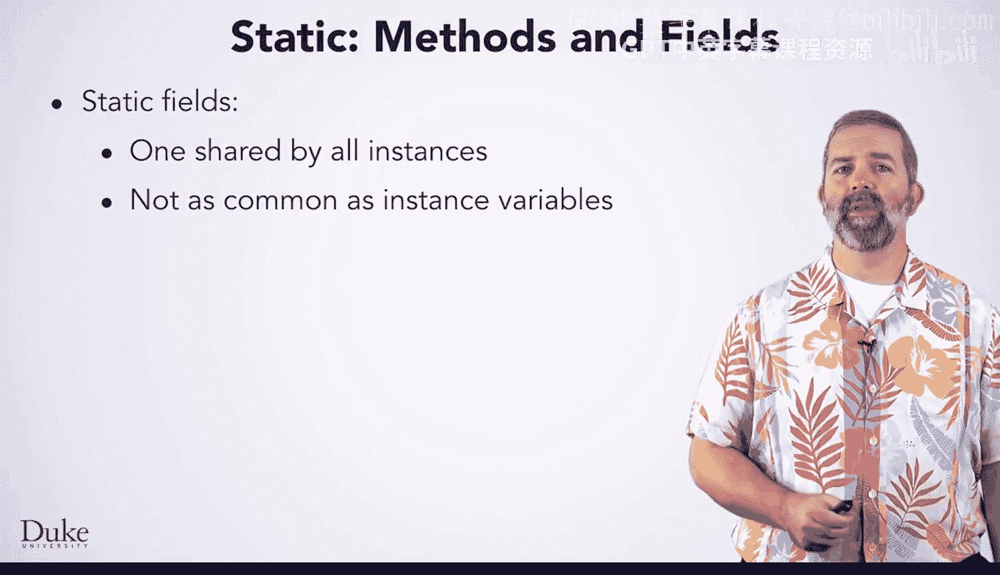

这些（静态字段）往往比实例字段少见得多。通常，你会希望用每个实例都拥有的属性来描述对象。

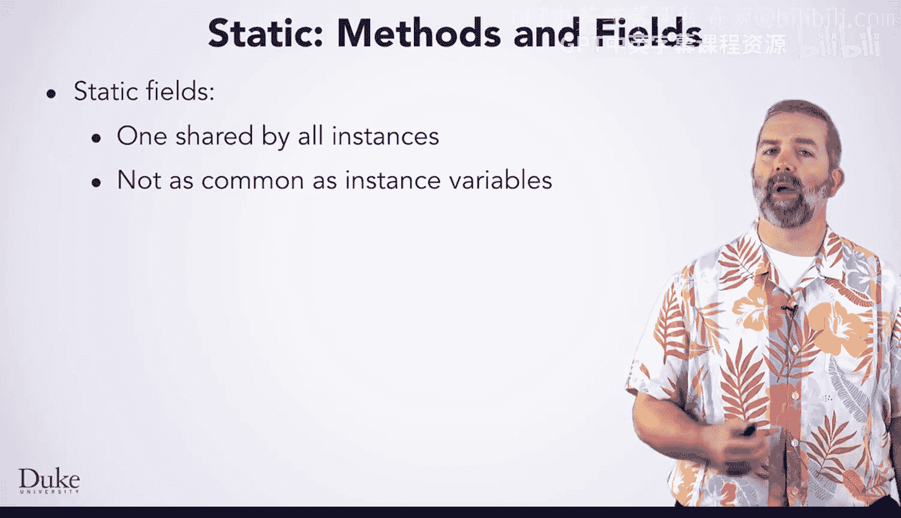

然而，有些时候使用`static`是合适的，因此了解它很有好处。


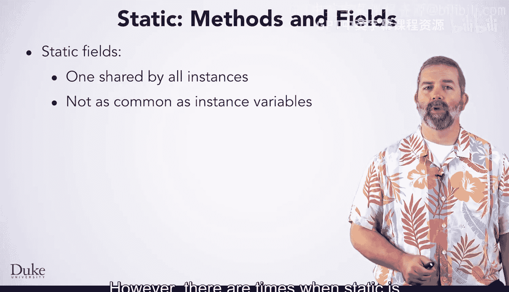

## 静态方法

你也可以声明静态方法。对于常规方法，你可以认为它们存在于每个实例内部。但对于静态方法，就像静态字段一样，你可以认为它们只有一个，由类的所有实例共享。

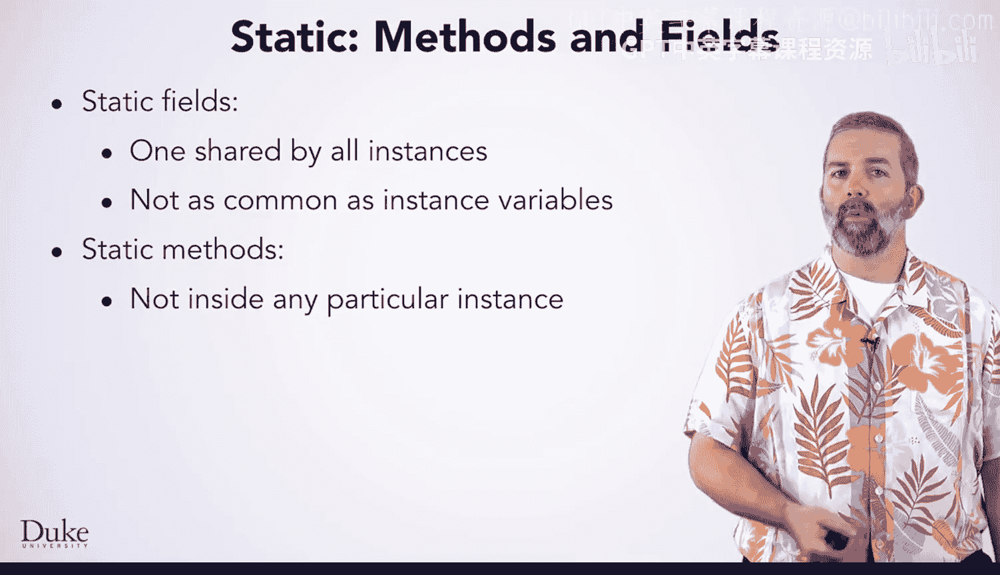

以下是静态方法的关键特性。

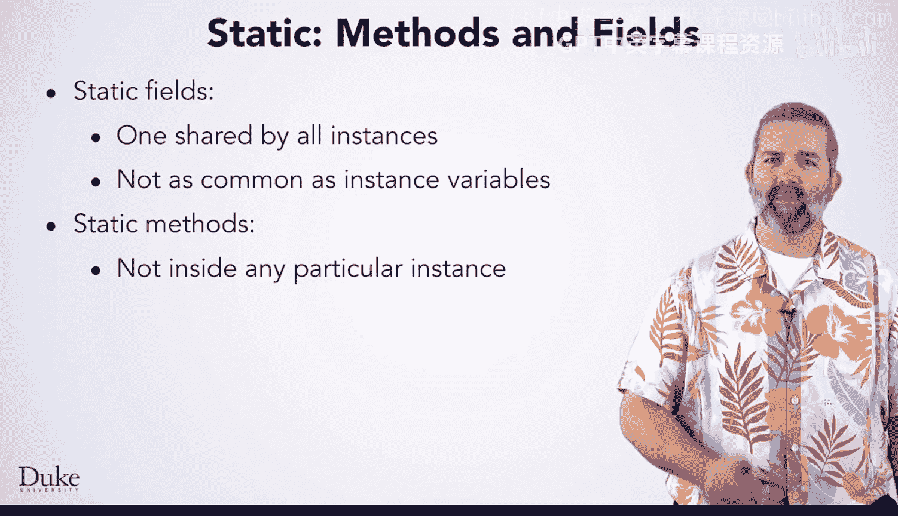

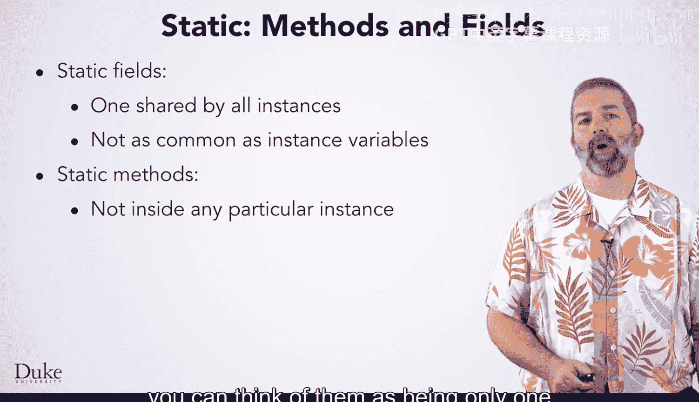

*   静态方法只能访问它们所属类的静态字段和其他静态方法。
*   然而，它们不能直接访问非静态字段或方法。
*   如果你想从静态方法访问非静态字段或方法，你需要指定要操作哪个对象实例的字段或方法，使用`对象.字段`或`对象.方法`的语法。


## 总结

本节课中我们一起学习了Java中的`static`关键字。我们了解到，静态成员（字段和方法）属于类本身，而不是类的任何特定实例。静态字段在内存中只有一个共享副本，而静态方法只能操作静态数据或通过对象引用操作实例数据。通过银行账户的例子，我们看到了使用静态字段来管理所有账户共享信息（如下一个账户号码）的正确方式。理解`static`是掌握Java面向对象编程中类级与实例级概念区别的重要一步。