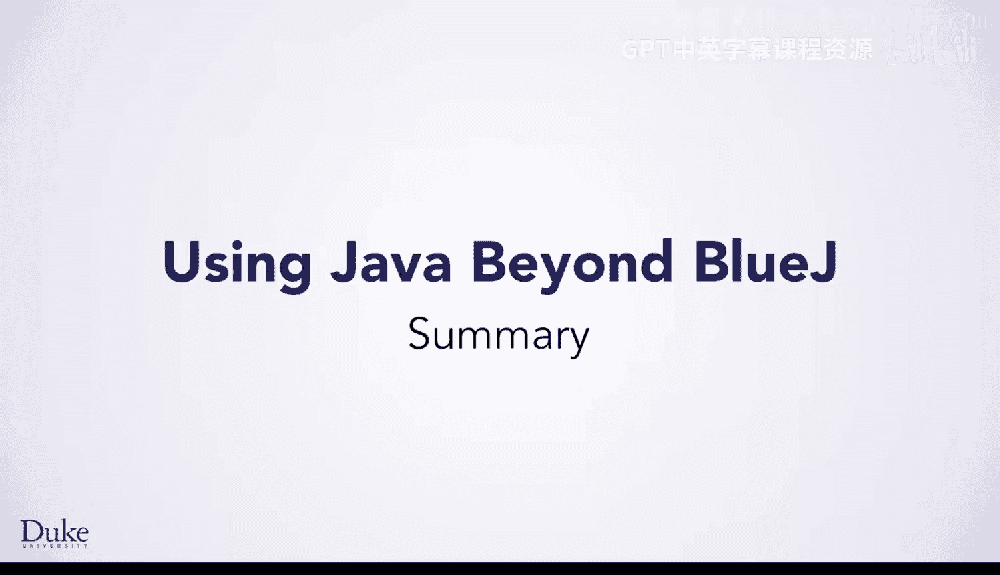
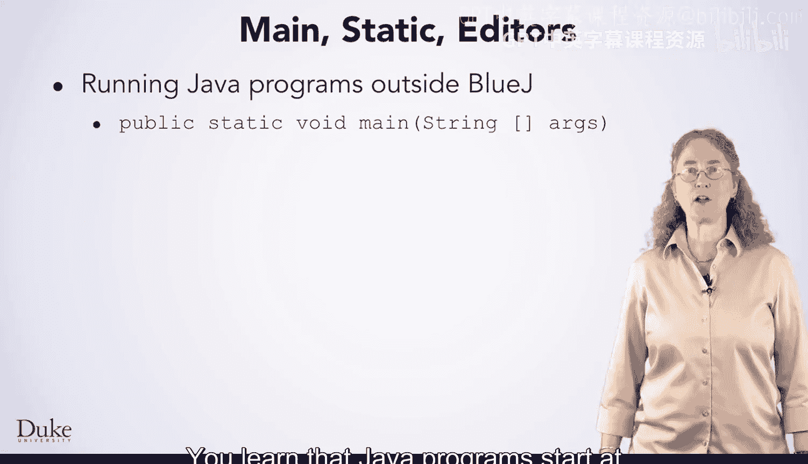
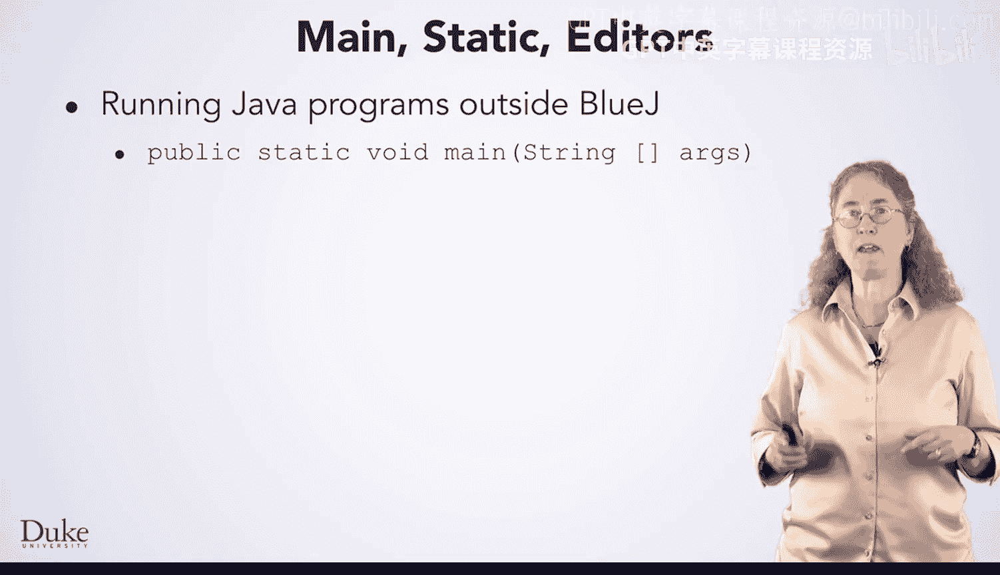
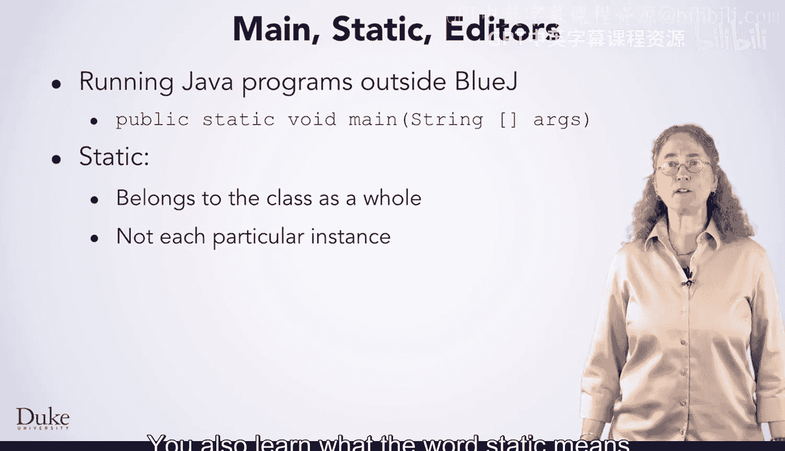
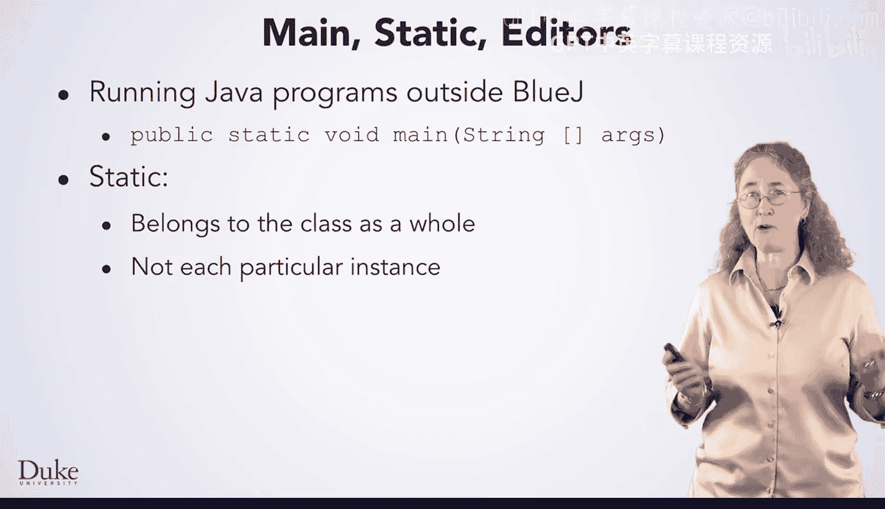

# Java编程和软件工程基础：2-5：Java入门知识总结 🎯



在本节课中，我们将总结在BlueJ环境之外需要掌握的Java编程基础知识。我们将回顾程序的入口点、`static`关键字的含义，并探讨不同代码编辑器的选择。

## 程序入口点：main方法

上一节我们介绍了Java程序的基本结构，本节中我们来看看所有Java程序的起点——`main`方法。

Java程序的执行始于`main`方法，其标准声明格式如下：

```java
public static void main(String[] args)
```

以下是关于`main`方法声明的关键点：
*   `public`：表示该方法可以被公开访问。
*   `static`：表示该方法属于类本身，而非类的某个特定实例。
*   `void`：表示该方法不返回任何值。
*   `String[] args`：这是一个字符串数组参数，可用于接收命令行传入的参数。

## 理解static关键字

了解了程序如何启动后，我们深入探讨一下`main`方法声明中出现的`static`关键字。

`static`关键字表示一个方法或变量属于整个类，而不是属于该类的每个具体对象实例。这意味着无需创建类的对象，就可以直接通过类名来访问`static`成员。

## 代码编辑器的选择

掌握了Java的核心语法概念后，选择合适的工具来编写代码同样重要。本节我们来看看BlueJ之外的代码编辑器。

市面上存在多种代码编辑器，其功能范围广泛，从适合新手的友好型编辑器到为专家设计的高效型编辑器。



以下是选择编辑器时需要考虑的因素：
*   你未来的编程计划是什么。
*   投入时间学习一款高效的专业工具能带来多少收益。
*   你对使用简单易上手的新手工具的偏好程度。



选择哪款编辑器取决于你的具体需求，需要在学习成本与易用性之间找到平衡。



---



本节课中我们一起学习了Java程序的基础知识：程序从固定的`main`方法开始执行；`static`关键字定义了属于类本身的成员；并且了解了根据自身技能水平和未来规划选择合适的代码编辑器的重要性。