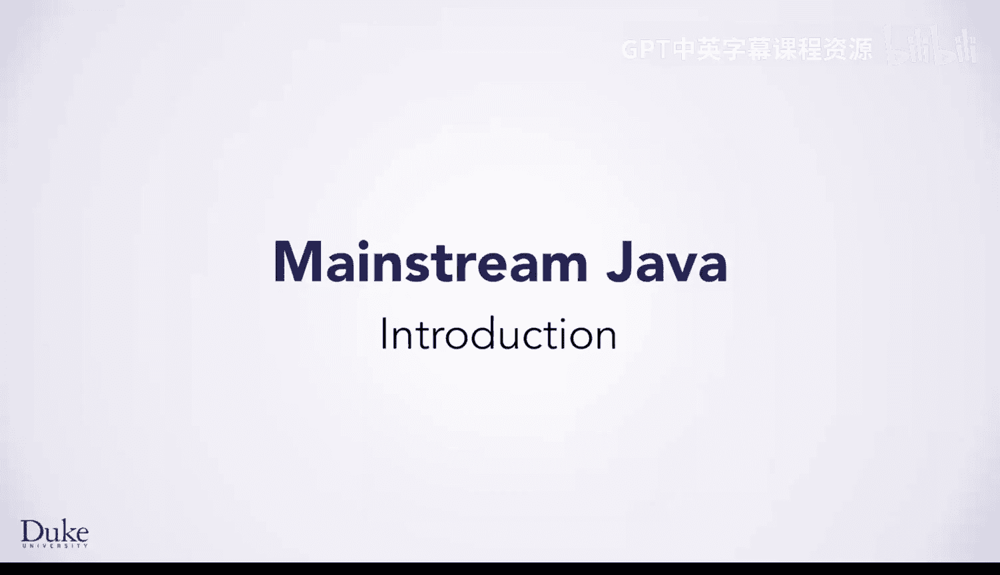
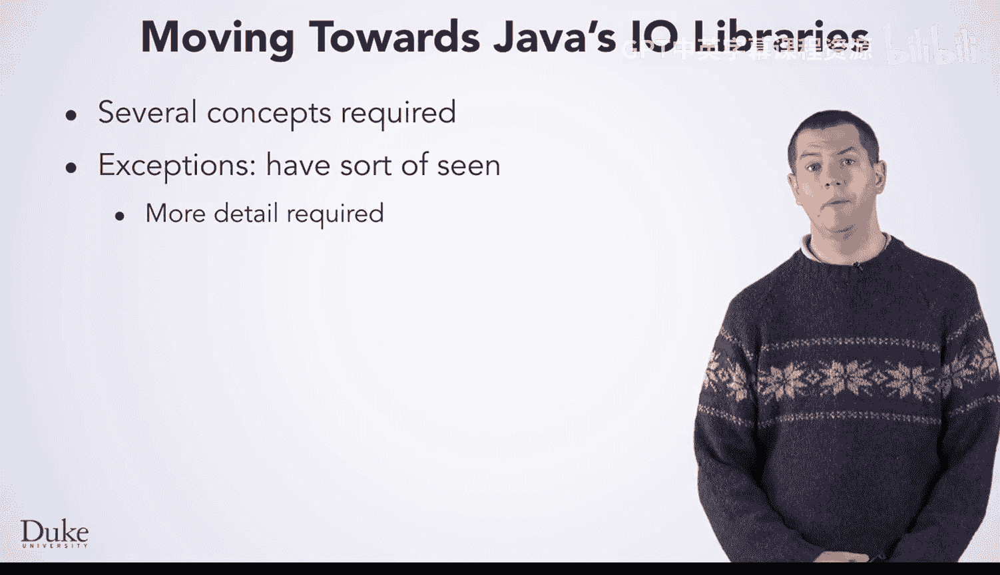

Java编程和软件工程基础：4.5.1：Java IO库简介 🚀

在本节课中，我们将学习如何在不依赖Edu Duke工具包的情况下，直接使用Java的IO库来读取文件。我们将介绍两个核心新概念：异常处理和NIO库。

到目前为止，你一直在使用Edu Duke工具包来简化各种任务。

我们提供了一些类，例如`FileResource`和`URLResource`。这些类使你能够轻松地遍历文件或网站的内容。此外，还有一些用于处理图像和范围的类。

然而，在某些没有Edu Duke工具包的环境中，你可能需要读取文件。一种选择是直接下载并使用这个工具包。它是开源的，因此你可以在任何项目中自由使用。

但是，如果无法使用该工具包，你可以直接使用Java的IO库。使用Java的IO库需要一些我们尚未涉及的新概念。之所以等到现在才介绍这些主题，是因为你现在已经具备了理解它们所需的Java技能。这也是我们在课程初期为你提供Edu Duke库的原因。

这些新概念中的第一个是**异常**。你可能已经见过一些异常情况。也许在某些时候，我们的程序因此崩溃过，但我们尚未深入探讨它们。

另一个概念是**NIO库**。实际上，有两种不同的方式可以进入Java的IO库。我们将重点介绍NIO库。

顺便提一下，如果你想知道如何弹出那个文件选择对话框（就像你在无参数调用`new FileResource()`时看到的那样），那要复杂得多，我们在此不深入讨论。当然，由于它是开源的，你可以自行查看代码。

---

本节课中，我们一起学习了直接使用Java IO库的必要性及其两个核心前提：异常处理和NIO库。这为你处理文件操作提供了更底层和灵活的方法。