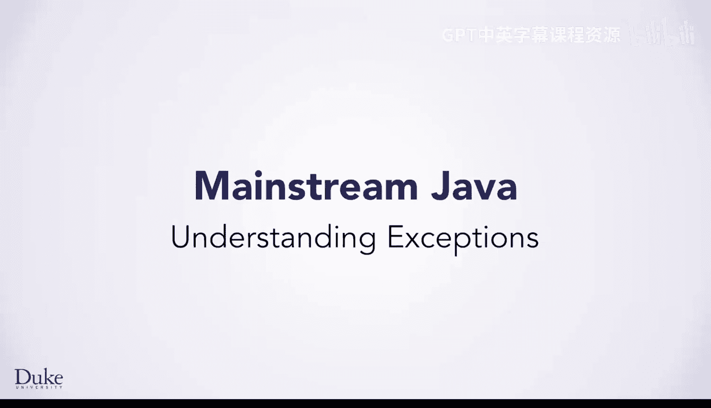
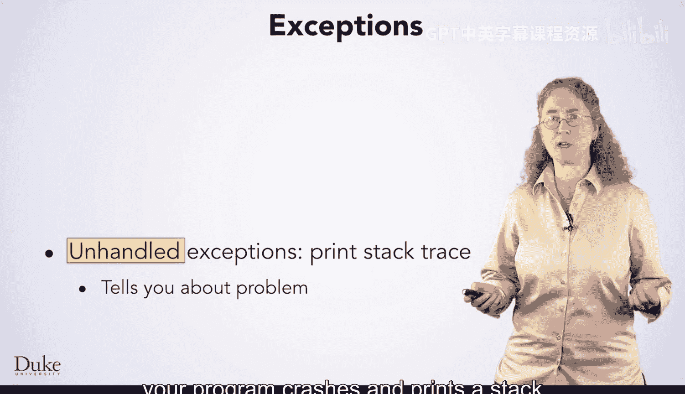
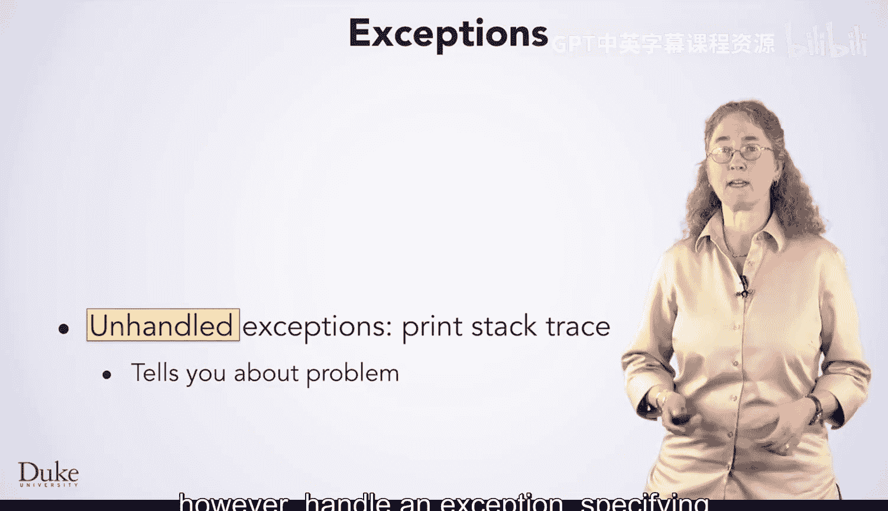
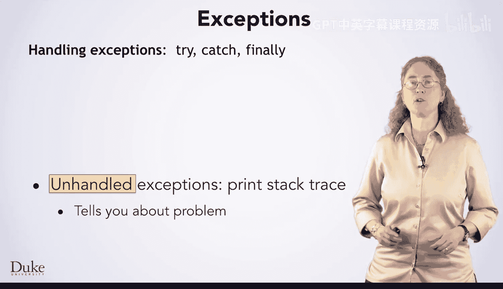
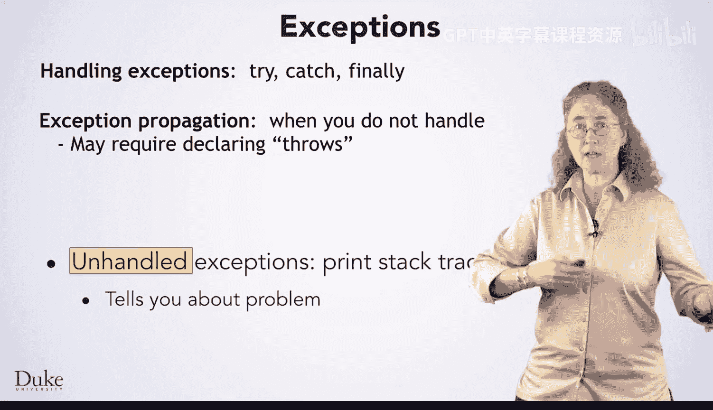
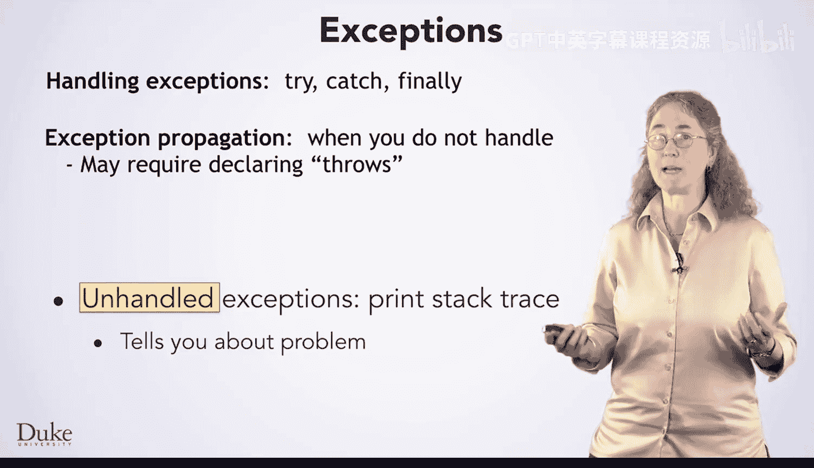
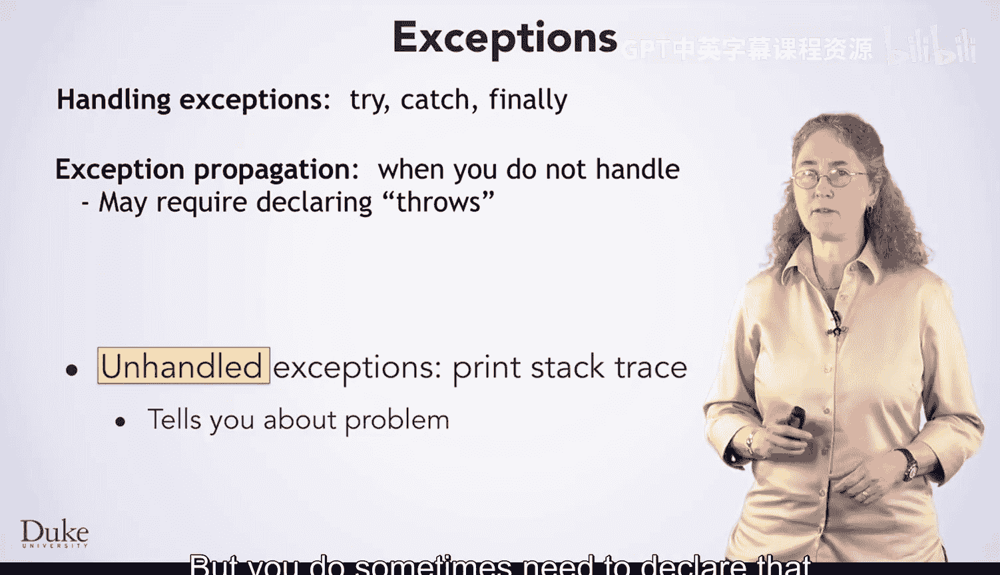

# Java编程和软件工程基础：2-5：理解异常



在本节课中，我们将要学习Java中的异常。异常是程序运行时出现问题的信号。我们将了解什么是异常、为什么程序会因此崩溃，以及如何在程序中主动使用异常来处理错误情况。

## 什么是异常？

上一节我们介绍了课程目标，本节中我们来看看异常的基本概念。

异常意味着程序无法完成它尝试执行的某项操作。有时这表明代码中存在错误，例如访问字符串或数组的无效索引。然而，有时异常表示程序员无法控制的情况，例如用户要求程序打开一个不存在的文件，或者程序在下载信息时网络连接中断。实际的程序必须处理这些有问题的状况，而异常实际上是处理此类问题的一种较好方式。

## 栈追踪

当程序遇到一个未处理的异常时，程序会崩溃并打印一个栈追踪信息。这个信息你可能之前见过类似的形式。

以下是栈追踪信息的组成部分：

1.  **异常类型**：首先，信息会告诉你发生了哪种类型的异常，即程序遇到了什么问题。例如，`StringIndexOutOfBoundsException` 表示字符串索引越界。
2.  **详细信息**：接着，信息会提供关于问题的更多细节。例如，它可能告诉你尝试访问的无效索引是哪个。
3.  **调用栈**：最后，也是最重要的部分，是栈追踪本身。它列出了在问题发生时，已被调用但尚未返回的方法列表。

栈追踪从问题发生的最内层方法开始，一直回溯到程序的入口点（通常是 `main` 方法）。你通常应该从调用栈中第一个出现在你自己代码中的方法开始查找问题。

## 处理异常：try, catch, finally

你的程序并非只能崩溃。它可以捕获并处理异常，指定如何处理问题。

处理异常涉及三个新的核心概念：`try`、`catch` 和 `finally`。

以下是它们的基本用法：

```java
try {
    // 尝试执行可能抛出异常的代码
    riskyOperation();
} catch (SpecificExceptionType e) {
    // 如果捕获到 SpecificExceptionType 类型的异常，则执行这里的代码
    System.out.println("处理异常: " + e.getMessage());
} finally {
    // 无论是否发生异常，finally 块中的代码都会执行
    cleanupResources();
}
```

## 异常传播

如果一个方法不知道如何处理某个异常，它会将异常传播给它的调用者。调用者可以处理这个异常，或者继续传播给它的调用者，依此类推。

你不需要做任何显式操作来传播异常，这是基于异常的错误处理机制的一个关键优点。异常会自动沿调用栈向上传递。

## 声明异常





但是，你有时需要在方法签名中声明该方法可能抛出某种异常。这使用 `throws` 关键字。



```java
public void readFile(String filename) throws IOException {
    // 方法内部可能抛出 IOException
    // ...
}
```

## 抛出异常

最后，当你的代码发现出现了问题状况时，你可以主动抛出自己的异常。这使用 `throw` 关键字。





```java
if (input < 0) {
    throw new IllegalArgumentException("输入不能为负数");
}
```



## 总结

本节课中我们一起学习了Java异常处理的核心知识。我们了解了异常是程序运行时错误的信号，认识了栈追踪的组成和作用。我们学习了如何使用 `try-catch-finally` 结构来捕获和处理异常，理解了异常会自动在调用栈中传播的机制。我们还知道了如何通过 `throws` 声明方法可能抛出的异常，以及如何使用 `throw` 关键字主动抛出异常。掌握这些概念对于编写健壮、可维护的Java程序至关重要。