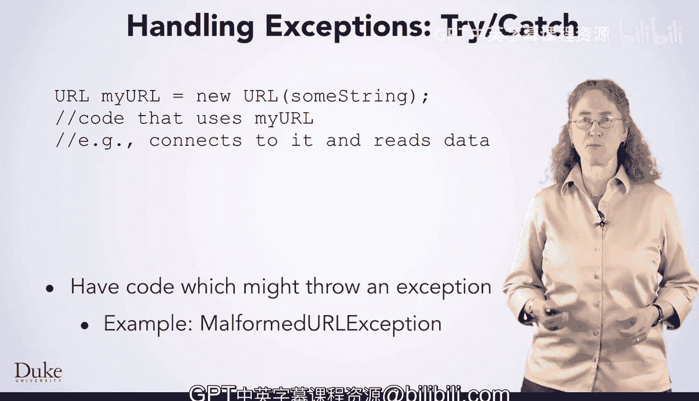
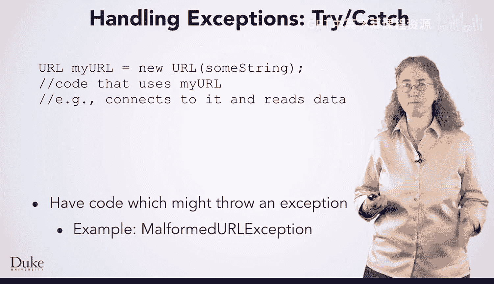
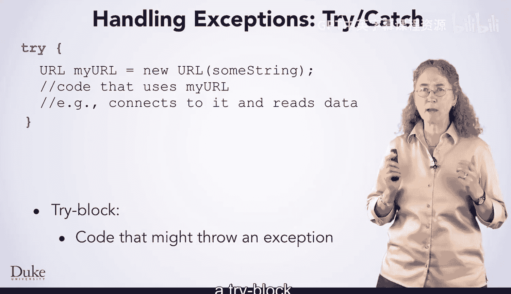
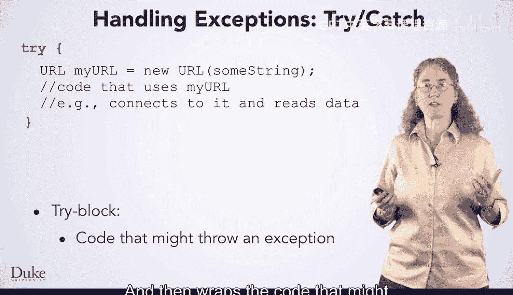

Java编程和软件工程基础：2-5：异常处理 🛡️


在本节课中，我们将要学习Java中的异常处理机制。异常处理是编写健壮程序的关键，它允许程序在遇到错误时优雅地恢复，而不是直接崩溃。我们将通过一个具体的例子来理解如何使用`try`、`catch`和`finally`块。

假设你有一段代码，它可能会遇到问题。例如，如果你使用Java内置的`URL`类来处理URL，其构造函数可能会抛出一个`MalformedURLException`异常。如果你传入一个无效的URL字符串，就会发生这种情况。



也许这个字符串是从用户那里读取的，你并不希望因为用户输入错误而导致程序崩溃。那么，你该如何处理这个异常呢？

### 使用 Try-Catch 块



处理异常的第一步，是将可能抛出异常的代码放入一个`try`块中。



一个`try`块以关键字`try`开始，然后将可能有问题的代码用花括号包裹起来。



紧接着`try`块，你需要编写一个`catch`块。`catch`块声明了你想要处理的异常类型（在本例中是`MalformedURLException`），并包含了当问题发生时要执行的代码。

你为异常命名，就像声明一个参数一样，这让你可以访问异常对象。你可以调用它的方法，如果需要从中获取更多信息。

`catch`块中的代码可以做任何你想做的事情，例如，告诉用户他们的URL无效，并要求他们重新输入。

当字符串是一个有效的URL时，不会抛出任何异常。在这种情况下，Java会正常执行`try`块内的代码。当执行到`try`块的末尾时，它会跳过`catch`块，并继续执行其后的代码。

然而，如果字符串不是一个有效的URL，那么在这个构造函数内部的某个地方，将会抛出一个`MalformedURLException`异常。Java随后会进入`catch`块，并开始执行你在那里编写的用于处理错误的代码。

执行完`catch`块后，Java会继续执行紧随其后的代码。

### 使用 Finally 块

你还可以使用一个`finally`块。无论是否抛出了异常，`finally`块中的代码总是会被执行。

`finally`块通常用于清理已分配且需要释放的资源，无论发生了什么情况。Java 7还引入了`try-with-resources`结构来简化某些类型资源的释放，不过我们在这里不深入讨论。

### 代码示例

以下是上述概念的一个简单代码示例：

```java
import java.net.MalformedURLException;
import java.net.URL;

public class ExceptionHandlingExample {
    public static void main(String[] args) {
        String userInput = "https://www.example.com"; // 可以尝试改为无效URL，如 “htp://”

        try {
            // 可能抛出 MalformedURLException 的代码
            URL url = new URL(userInput);
            System.out.println("URL created successfully: " + url);
        } catch (MalformedURLException e) {
            // 处理异常的代码
            System.out.println("The URL you entered is not valid: " + userInput);
            System.out.println("Error message: " + e.getMessage());
            // 可以在这里提示用户重新输入
        } finally {
            // 无论是否发生异常都会执行的代码
            System.out.println("This block always executes.");
        }

        System.out.println("Program continues after try-catch-finally.");
    }
}
```

### 总结

本节课中，我们一起学习了Java异常处理的基础知识。我们了解到，通过使用`try`块包裹可能出错的代码，并用`catch`块来捕获和处理特定的异常，可以防止程序因意外错误而终止。此外，`finally`块确保了无论是否发生异常，某些清理代码都能得到执行。掌握这些概念是构建稳定、可靠应用程序的重要一步。