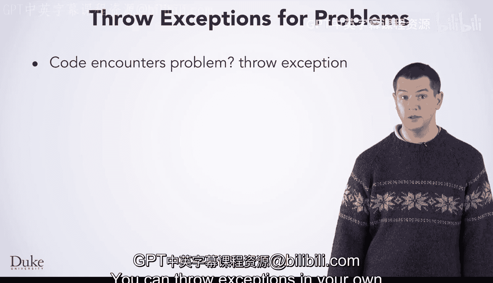

# Java编程和软件工程基础：2-5：抛出异常


在本节课中，我们将要学习如何在Java代码中主动抛出异常。当程序遇到无法自行处理的问题时，抛出异常是一种重要的错误处理机制。

## 🚨 何时抛出异常

上一节我们介绍了异常的基本概念，本节中我们来看看如何主动抛出异常。你可以在自己的代码中，每当遇到无法处理的问题时抛出异常。

你在编写马尔可夫链代码时已经见过这个原则。以下代码片段来自该课程，用于从单词语法类中获取特定单词。

```java
public String getWordAtIndex(int index) {
    if (index < 0 || index >= words.size()) {
        throw new IllegalArgumentException("索引无效: " + index);
    }
    return words.get(index);
}
```

如你所见，当请求的索引无效时，它会抛出一个异常。代码遇到了一个它无法处理的问题。除非调用此方法的代码捕获了这个异常，否则程序将会崩溃。

## 📝 抛出异常的语法

以下是抛出异常的基本语法。其核心是使用 `throw` 关键字，后跟一个表达式，该表达式的结果是你想要抛出的异常对象。

```java
throw new ExceptionType("错误信息");
```



正如这里的例子所示，这个表达式通常会创建一个所需异常类型的新对象，并将任何有用的信息传递给构造函数。

## 🧱 可以抛出什么？

从技术上讲，你可以抛出任何继承自Java内置 `Throwable` 类的对象。然而，更常见的做法是抛出一个继承自 `Exception` 类的对象，而 `Exception` 类本身也继承自 `Throwable`。

Java拥有大量内置的异常类型。虽然可能没有570亿个，但确实有很多。其中一些你可能很熟悉，例如：
*   `ArrayIndexOutOfBoundsException`：数组索引越界。
*   `NullPointerException`：尝试访问空对象的成员。
*   `IOException`：指示读取或写入数据时出现问题，这也是理解如何自行读取文件时异常处理很重要的原因。

大多数情况下，内置的异常类型足以满足你的需求。你可以在Java API文档中了解更多关于它们的信息。

## 🛠️ 自定义异常

如果你编写的程序需要超出内置范围的异常，你随时可以创建自己的异常类。你可以通过编写自己的类并让它继承现有的、合适的异常类型来实现。

我们不会深入探讨创建自定义异常的主题，但作为异常讨论的一部分，我们想提及这一点，以防你在未来的编程工作中需要它。

## 📚 总结


本节课中我们一起学习了如何主动抛出异常。我们了解到，当代码遇到无法处理的问题时，可以使用 `throw` 关键字抛出异常。我们回顾了抛出异常的语法，探讨了可以抛出的异常类型（主要是内置异常），并简要提及了创建自定义异常的可能性。掌握抛出异常是构建健壮、可维护Java程序的关键技能。