# 170：使用Java NIO读取文件 📖

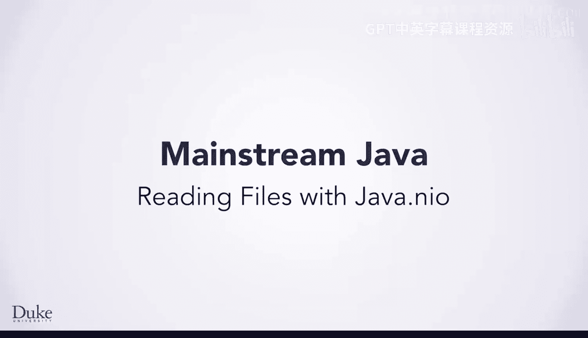


在本节课中，我们将解释为何在课程初期隐藏了关于Java如何处理文件和URL的细节，并展示如何使用标准的Java库来编写程序。我们将通过对比简化库与标准库的代码，来理解底层机制的复杂性及其设计目的。


## 概述


理解文件和URL在编程中的使用细节，很容易妨碍解决更高层次的问题。因此，我们提供了`edduu.duke`库和`FileResource`类来帮助你更快地通过编程解决实际问题。


所有语言和库都会将程序员与可能妨碍问题解决的复杂细节隔离开来。我们提供的库为Java初学者提供了很好的隔离和保护，但即使是常规的Java类也提供了这种隔离和保护。


我们的目标是使你能够解决问题，创造性地思考如何编写程序，从而将编程和问题解决结合起来学习。现在，我们将展示如何在不使用`FileResource`或`URLResource`类的情况下编写“Hello World”程序。了解如何做到这一点，可以帮助你实现自己的类，以隔离编程中遇到的常见问题。

## 从简化库到标准库

让我们回顾一下最初用于打印多种语言“Hello World”的程序之一。

以下代码使用了`edduu.duke`库中的`FileResource`类和`runHello`方法。

```java
// 示例：使用简化库
FileResource fr = new FileResource("hello.txt");
for (String line : fr.lines()) {
    System.out.println(line);
}
```


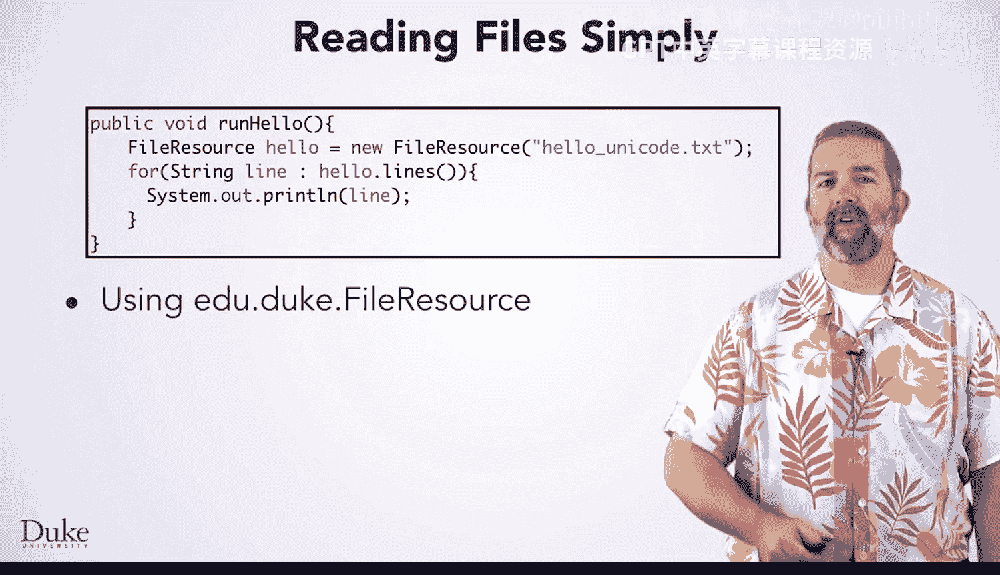

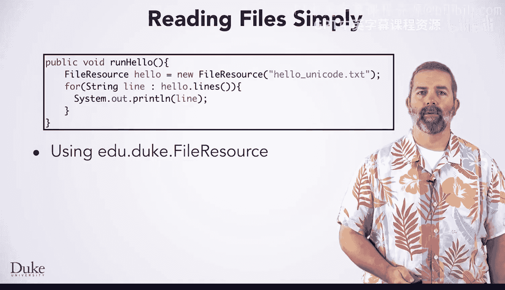

此方法通过从包含多种语言文本的文件中读取并打印单词，来输出不同口语和书面语中的“Hello World”。代码首先创建一个`FileResource`对象来引用和读取包含要打印单词的文件。然后，该方法使用一个`for-each`循环遍历文件中的每一行，在循环体中读取并打印字符串。

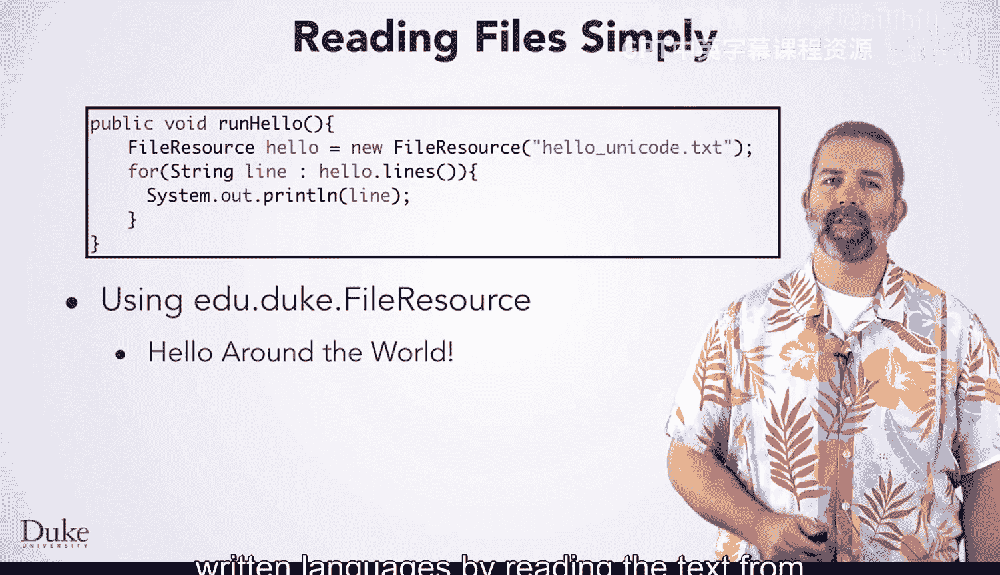

现在，让我们看看仅使用标准Java库实现相同功能的代码。此代码使用了三个包中的七个类。两个程序都使用了`System`类。

```java
// 示例：使用标准Java库
import java.nio.file.*;
import java.io.*;

public class ReadFileStandard {
    public static void main(String[] args) throws IOException {
        Path p = Paths.get("hello.txt");
        try (BufferedReader reader = Files.newBufferedReader(p)) {
            String line;
            while ((line = reader.readLine()) != null) {
                System.out.println(line);
            }
        }
    }
}
```


实现方式有很多种，但我们展示的这种将突出这些额外类为减少重复代码而提供的一些灵活性。

## 核心概念与步骤解析

上一节我们对比了两种实现，本节中我们来详细看看标准Java库实现中的核心步骤和概念。

**第一步是创建一个`Path`对象。** 在代码中，我们将其命名为`p`。它表示文件系统中文件的路径。这里我们使用了`Paths.get()`方法。注意`Paths`中额外的`s`。路径的概念对于文件或URL是相同的，都是从文件夹到文件夹，最终指向实际文件系统中的文件。

**在Java中读取文件的一种标准方法是使用`java.io`包中的`BufferedReader`。** `Paths`和`Path`类则在另一个不同的包中，我们很快就会看到。要创建一个`BufferedReader`，我们首先请求`Files`对象（再次注意`Files`中的`s`）为我们创建一个在程序中使用的读取器。

我们使用一个循环和`reader.readLine()`方法来读取打开的文件的每一行，直到`readLine`返回`null`引用。这意味着文件已完全读取，循环退出。这段代码和使用我们的`FileResource`对象的代码都使用了循环，但循环方式不同。


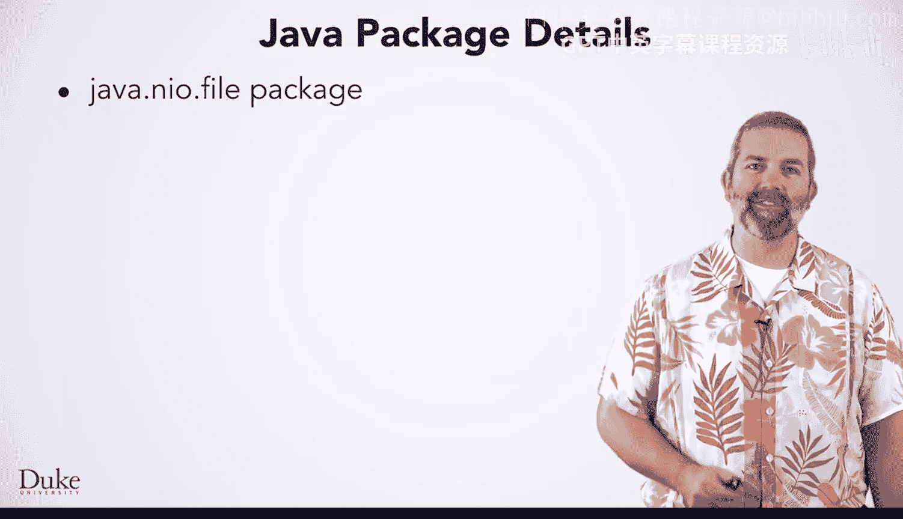

## Java I/O 包简介

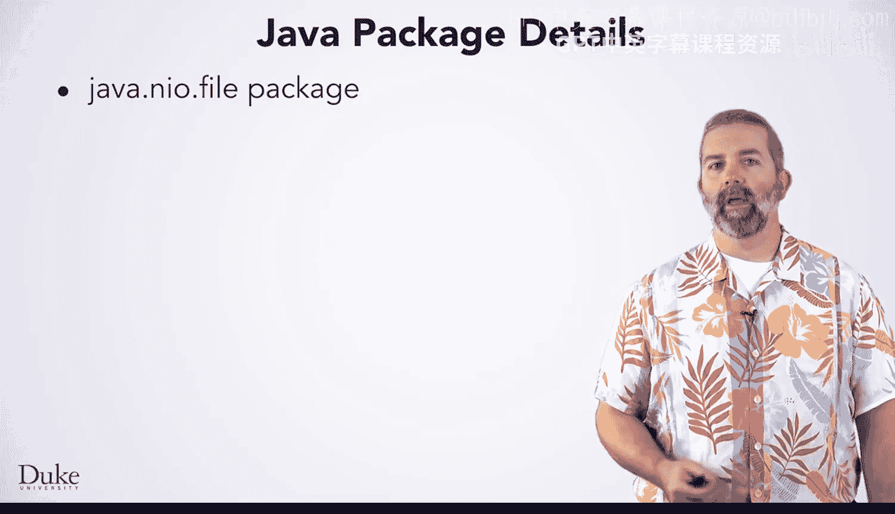


在Java中用于读取文件的两个主要包是`java.io`和`java.nio`。`NIO`中的`N`代表“New”，尽管这个包实际上已经存在一段时间了，但它比`java.io`包要新。

`I`代表输入（读取），`O`代表输出（写入）。换句话说，这些是输入输出包。

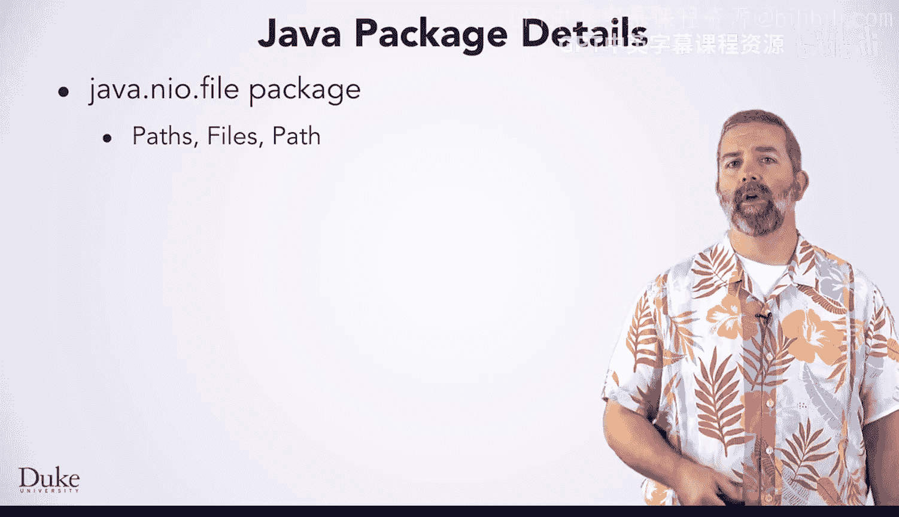

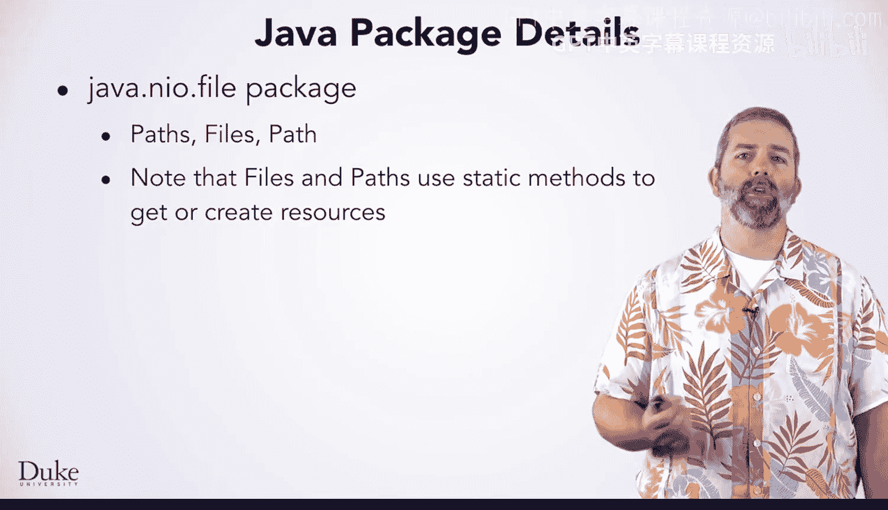

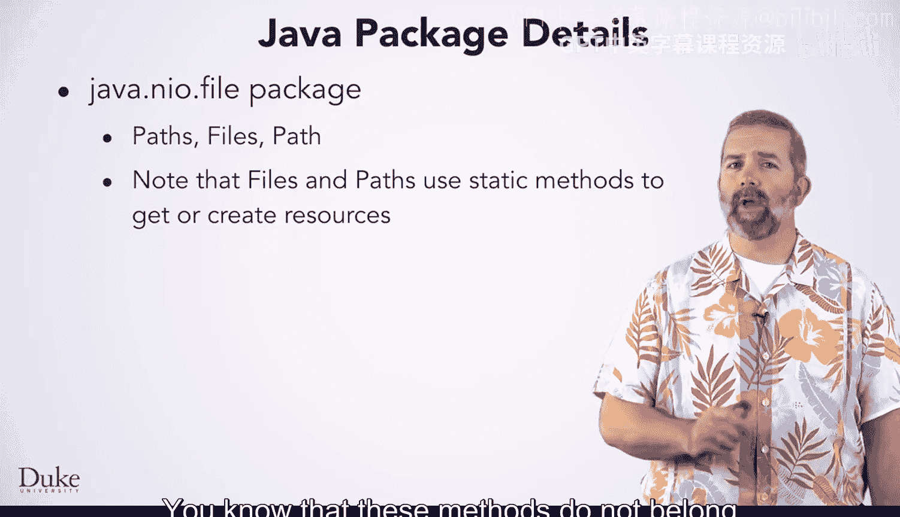

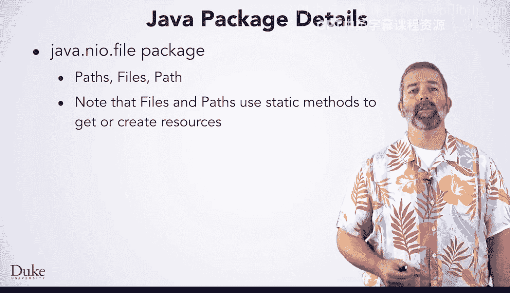

`Paths`、`Files`和`Path`类位于`java.nio`包中。这些类（`Files`和`Paths`）使用静态方法，这是你最近学到的知识。你知道这些方法不属于类的特定实例，而是属于类整体。因此，你不需要创建新对象来使用它们。

许多用于读写的方法，以及一些构造函数，都可能抛出异常。既然你已经学习了异常的基础知识，你就知道应该使用`try-catch`块来处理这些异常，并且如果你不处理它们，则必须在方法声明中添加`throws`相应的异常类型。

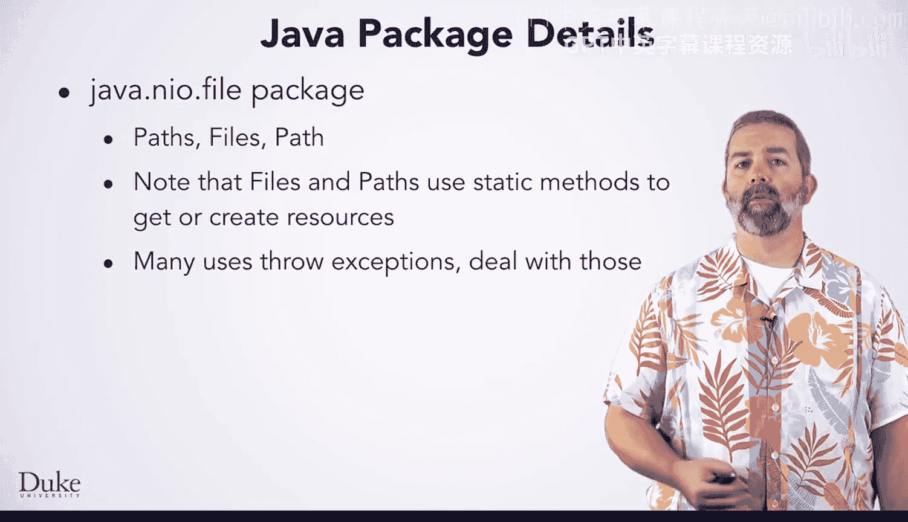

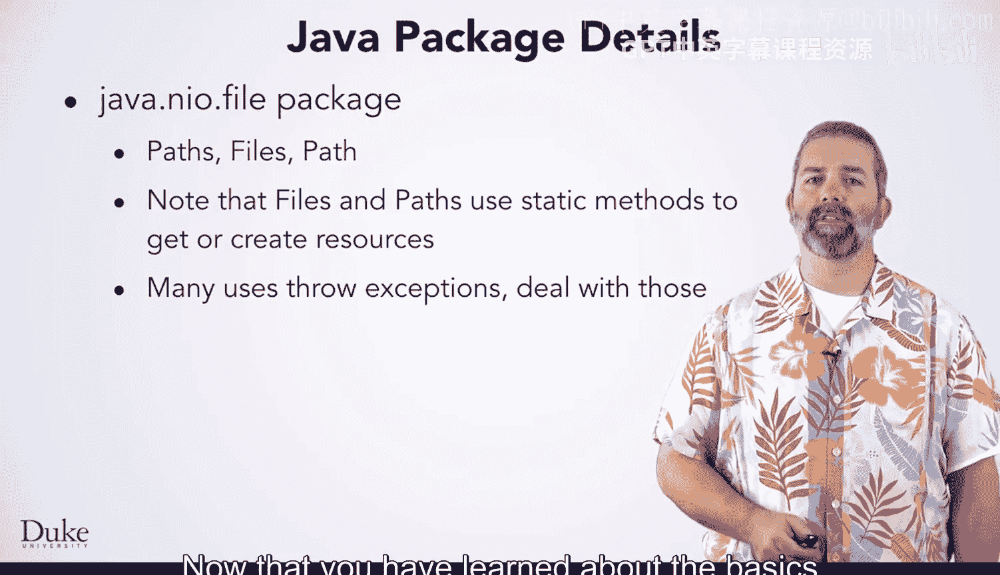

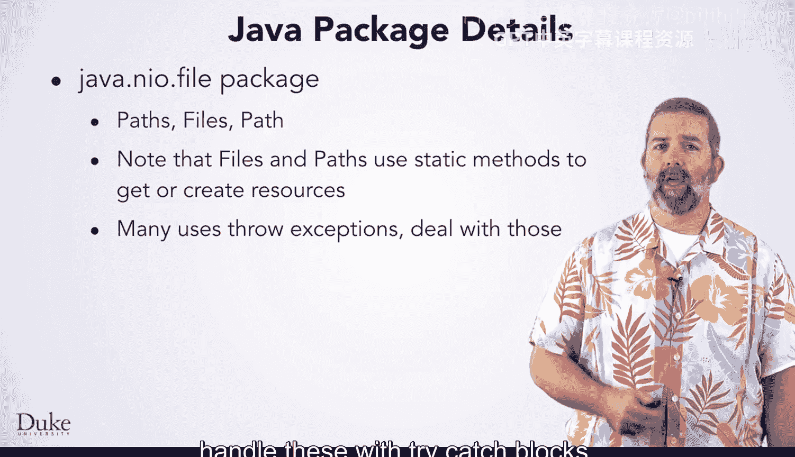

`java.io`包提供了其他用于读写的类。`BufferedReader`类在读取源时经常使用，它对读取的内容进行缓冲以获得良好的性能。`java.io.IOException`类被许多输入输出方法抛出。

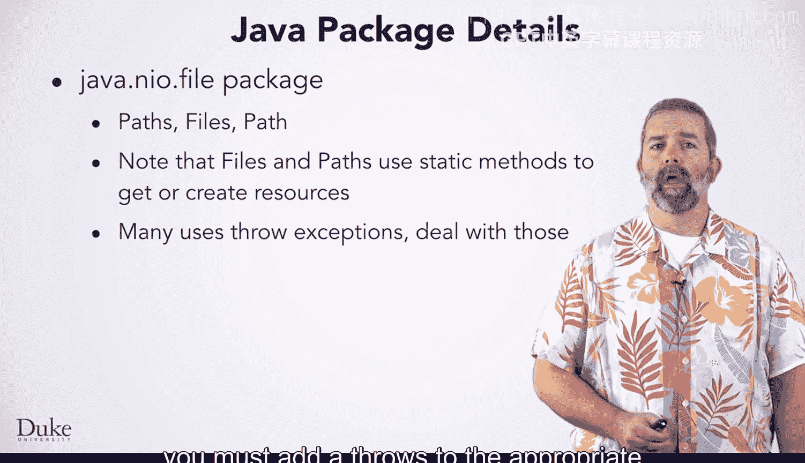

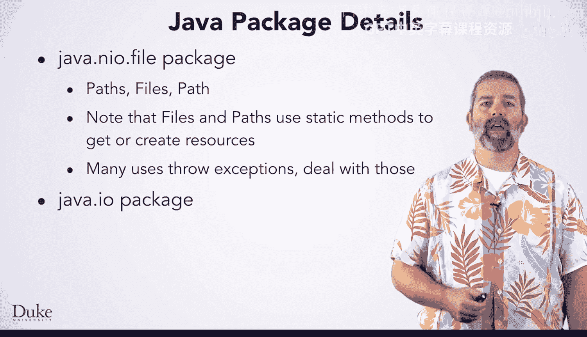

使用这些类需要阅读文档并查看示例，因为读取文件、原始字节或对象或解析信息的方法有很多。我们创建`FileResource`类就是为了让这些事情变得更简单。

## 读取URL的示例

让我们再看一个例子：如何在不使用`URLResource`的情况下，使用`java.net`包读取URL。


使用这个包读取URL与我们`Eduu.duke`库中的`URLResource`类的工作方式类似。首先，通过提供一个代表网站的字符串来创建一个`URL`对象。

然后，你将使用这个`URL`对象从`java.io`类创建一个`BufferedReader`，但这需要几个步骤。第一步是打开到相关URL的连接，并获取一个代表其数据的流。然后使用这个流创建一个`InputStreamReader`，再使用`InputStreamReader`创建一个`BufferedReader`。这是三个步骤，取代了我们创建`URLResource`对象时的一个步骤。

这些额外步骤的目的是提供不同的方式来创建实现`Reader`接口的对象，以便你可以使用相同的代码从文件或URL读取数据。因此，你可以使用与上一个示例中相同的`BufferedReader`循环进行读取。这种重用在我们简化的资源类中更难实现，这也是花时间学习这些复杂类有用的原因之一。

## 总结

本节课中，我们一起学习了为何在入门阶段使用简化库，以及如何转向使用标准的Java `java.nio`和`java.io`包进行文件操作。我们了解了`Path`、`Files`、`BufferedReader`等核心类的用法，并对比了简化库与标准库在代码复杂性和灵活性上的差异。理解这些底层机制有助于你编写更强大、可复用的代码，并为处理更复杂的I/O场景做好准备。