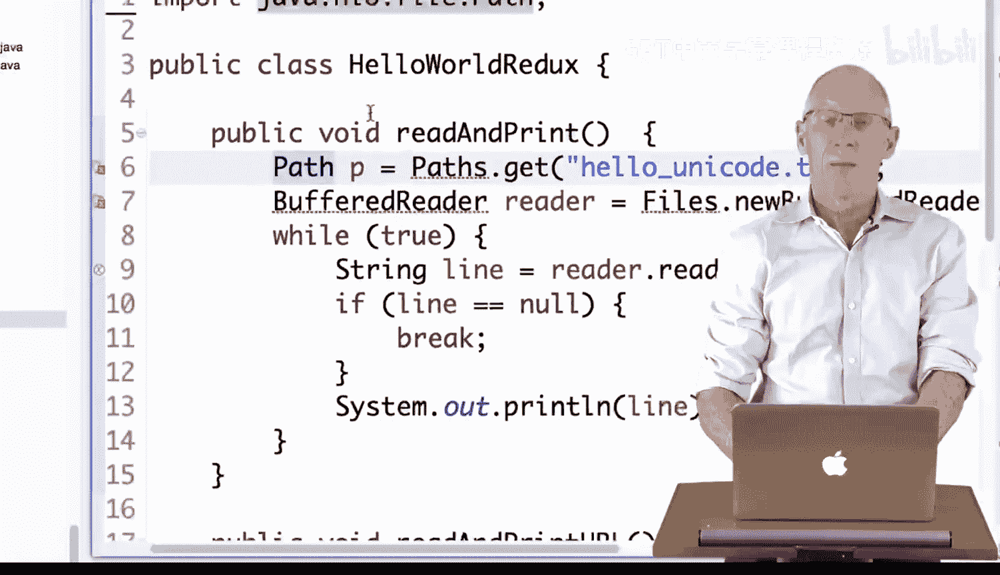
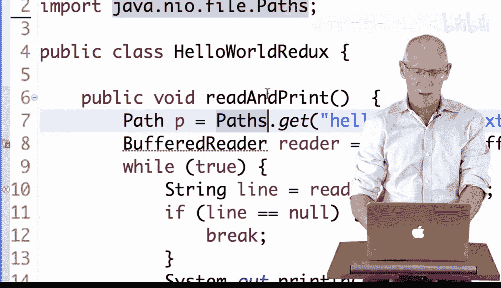
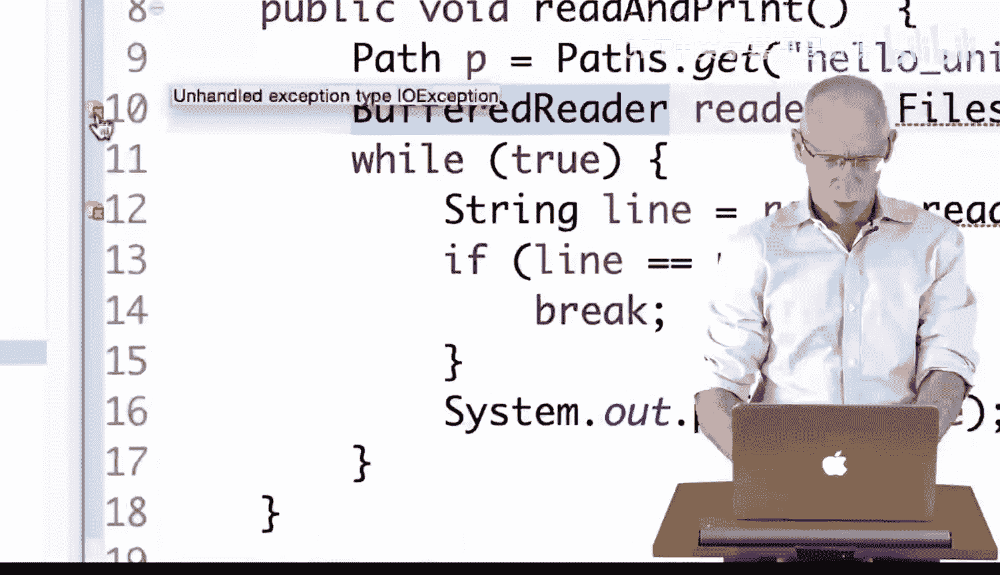
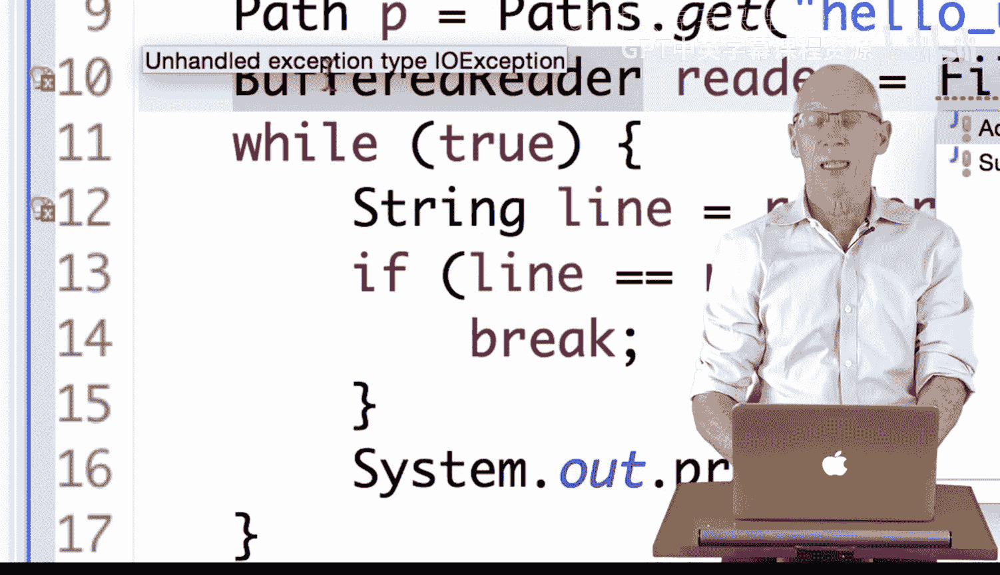
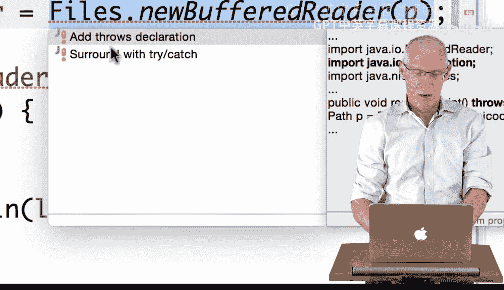

# 171：Eclipse环境下的HelloWorld 🌍

在本节课中，我们将学习如何在Eclipse集成开发环境中编写并运行一个“Hello World”程序。这个程序会读取一个包含多种语言问候语的文件，并将它们打印出来。我们将重点了解Eclipse如何帮助我们管理代码、处理错误以及运行程序。

---

上一节我们介绍了课程目标，本节中我们来看看具体的代码实现过程。首先，我们有一段代码，其功能是打开一个名为 `hello_unicode.txt` 的文件，使用 `BufferedReader` 逐行读取内容，并打印出“Hello World”的各种语言版本。

Eclipse通过红色“X”标记提示代码存在问题。第一个问题是它不知道 `Path` 类。Eclipse可以自动建议导入正确的包。

以下是解决 `Path` 类问题的步骤：
*   将光标置于 `Path` 上。
*   使用Eclipse的快速修复功能（通常是 `Ctrl+1`）。
*   选择导入 `java.nio.file.Path`。

导入 `Path` 后，仍然存在错误，因为代码中使用了 `Paths` 类。同样地，我们需要导入它。

以下是解决 `Paths` 类问题的步骤：
*   将光标置于 `Paths` 上。
*   使用快速修复功能。
*   选择导入 `java.nio.file.Paths`。

接下来，Eclipse提示不认识 `BufferedReader` 和 `Files` 类。我们需要导入它们。

以下是导入 `BufferedReader` 和 `Files` 的步骤：
*   分别将光标置于 `BufferedReader` 和 `Files` 上。
*   使用快速修复功能。
*   选择导入 `java.io.BufferedReader` 和 `java.nio.file.Files`。

现在，代码中还有一个关于“未处理异常”的错误。在Java中，执行文件操作可能抛出 `IOException`，代码必须处理它。

Eclipse提供了两种处理方式：
*   **添加 `throws` 声明**：将异常抛给方法的调用者处理。
*   **使用 `try-catch` 块**：在方法内部捕获并处理异常。

目前，我们选择添加 `throws` 声明。Eclipse会自动在方法签名后添加 `throws IOException`。至此，从文件读取并打印的方法就完成了。

---

上一节我们完成了从本地文件读取的方法，本节中我们来看看如何从网络URL读取数据。代码中已有一个从URL读取的方法，但被注释掉了。我们将其取消注释。

取消注释后，Eclipse会标记出新的错误，主要是缺少必要的类导入。

以下是解决URL相关导入问题的步骤：
*   将光标置于 `URL` 上，使用快速修复导入 `java.net.URL`。
*   将光标置于 `InputStreamReader` 上，使用快速修复导入 `java.io.InputStreamReader`。

代码现在提示有两个未处理的异常：`MalformedURLException` 和 `IOException`。我们可以分别处理，但注意到 `MalformedURLException` 是 `IOException` 的子类。

因此，我们只需在方法声明处抛出更通用的 `IOException`，Eclipse会自动替换掉 `MalformedURLException`。这样，从URL读取的方法也完成了。

---

最后，我们需要在程序的入口 `main` 方法中调用我们编写的方法。我们将调用 `readAndPrintURL()` 方法来从网络获取数据。

点击Eclipse的“运行”按钮执行程序。结果会显示在控制台窗口中，打印出从指定URL读取到的各种语言的“Hello World”问候语。

---

本节课中我们一起学习了在Eclipse中编写、调试和运行一个Java程序的全过程。我们实践了如何使用Eclipse的自动导入和错误修复功能，如何处理文件I/O操作可能抛出的异常，以及如何让程序分别从本地文件和网络URL读取数据。掌握这些基础操作是进行更复杂Java编程的重要第一步。