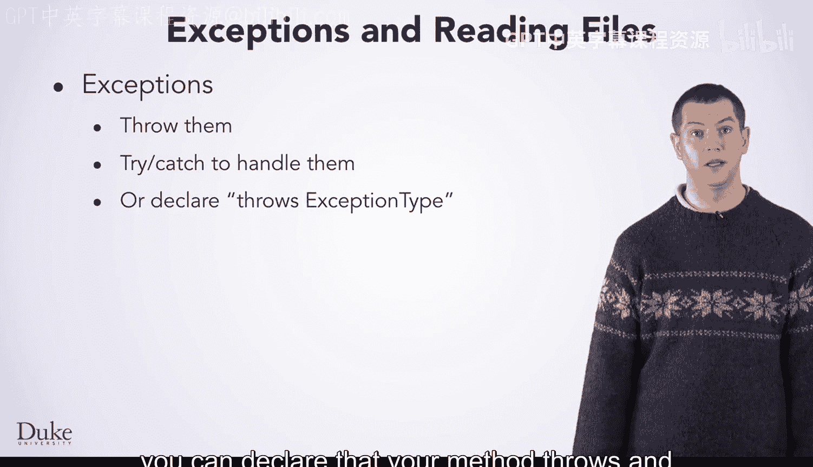
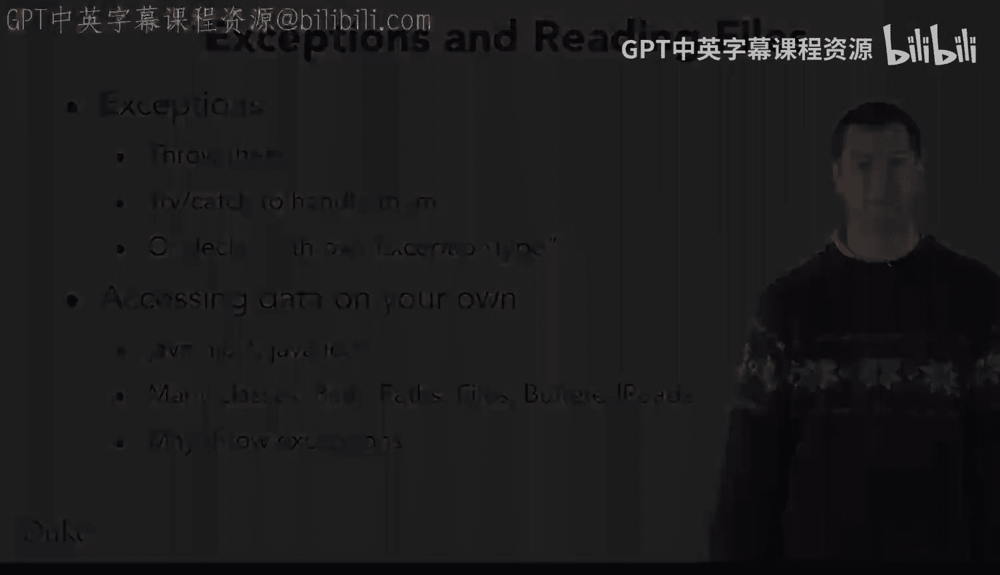

Java编程和软件工程基础：2-5：异常处理与数据访问总结 🎯

在本节课中，我们将总结关于Java异常处理以及数据访问的核心知识。你将回顾如何抛出和处理异常，并了解如何通过Java的I/O包来访问数据。

---

上一节我们介绍了异常处理的基本概念，本节中我们来总结一下关键点。

你已经学习了关于异常的知识。当程序出现问题时，你可以抛出它们。你可以使用 `try` 和 `catch` 来处理那些可能出错的代码中的异常。或者，如果你的代码不知道如何处理某种情况，你可以声明你的方法会抛出可能发生的特定类型的异常。

以下是关于异常处理的关键操作：

*   **抛出异常**：使用 `throw` 关键字。
    ```java
    throw new IllegalArgumentException("输入参数无效");
    ```
*   **捕获异常**：使用 `try-catch` 块。
    ```java
    try {
        // 可能出错的代码
    } catch (ExceptionType e) {
        // 处理异常
    }
    ```
*   **声明异常**：在方法签名中使用 `throws` 关键字。
    ```java
    public void readFile() throws IOException {
        // 方法体
    }
    ```

---

同时，你也学习了如何访问数据。你可以使用 `java.nio` 包或 `java.io` 包，或者混合使用两者。这些包包含许多类，因此在你熟悉它们的过程中，经常需要查阅相关文档。

当然，在尝试访问数据时，经常可能出现问题，例如文件可能丢失，或者网络可能断开。因此，这些操作可能会抛出异常，幸运的是，你现在已经知道如何处理它们了。

以下是数据访问的要点：

*   **核心包**：`java.io` 用于传统I/O操作，`java.nio` 用于更高效的非阻塞或通道I/O。
*   **常见类**：`File`, `FileReader`, `FileWriter`, `Path`, `Files` 等。
*   **处理异常**：I/O操作必须妥善处理 `IOException` 等异常。

---






---


本节课中我们一起学习了Java异常处理的机制，包括如何抛出、捕获和声明异常。我们还回顾了通过 `java.io` 和 `java.nio` 包进行数据访问的基本方法，并认识到在这些操作中处理异常的重要性。掌握这些知识将帮助你编写更健壮、更能应对意外情况的Java程序。