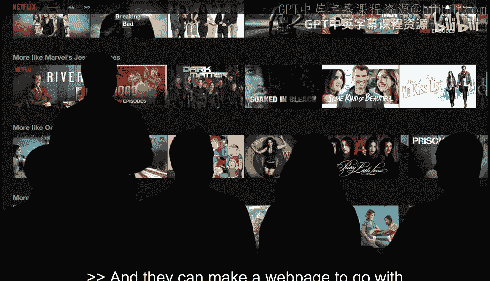
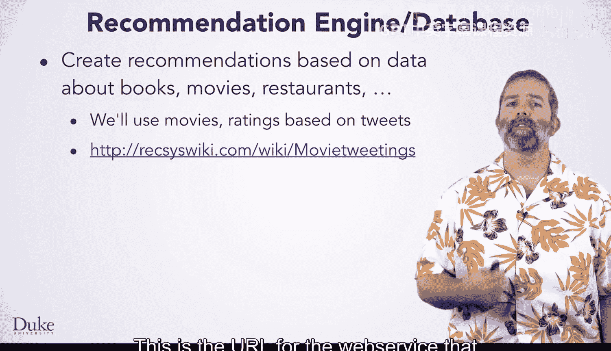

# Java编程和软件工程基础：2-5：引言与动机 🎬

在本节课中，我们将介绍本专项课程的毕业设计项目，并探讨推荐系统背后的基本动机和现实应用。我们将了解推荐系统如何工作，以及你将如何构建一个自己的电影推荐引擎。

## 概述

毕业设计项目要求你构建一个“自己动手”的推荐引擎，用于寻找当前电影的推荐和信息。我们将从理解推荐系统的现实应用场景开始，例如Coursera、Yelp和Netflix，然后探讨你将如何利用来自Twitter的众包电影评论和评分数据来实现类似的功能。

## 现实世界中的推荐系统

上一节我们概述了项目目标，本节中我们来看看推荐系统在现实世界中的几个例子。

当你首次访问Coursera网站时，你会看到类似这里的推荐。这些推荐可能基于课程的受欢迎程度，也可能根据你的浏览历史或访问过的网站进行个性化推荐。网站背后的引擎需要决定展示哪些课程，这可能基于评分或其他标准。

同样，你可以使用Yelp应用或网站获取餐厅推荐。用户可以按位置、价格或其他标准进行筛选。来自世界各地的食客可以通过Yelp贡献评分，其他用户则可以利用这些评分来寻找从旧金山到荷兰海牙等城市的餐厅信息。

有时，这些评分会按除星级以外的其他标准排序。例如，第一个餐厅的星级可能低于第三个餐厅，但你可以按距离远近或近期评分而非总评分进行搜索。

## 毕业设计项目：电影推荐引擎

谈完餐厅推荐，我们来看看电影推荐，这正是你将在毕业设计项目中编写代码实现的功能。

你将使用的网站Twitflix.com会挖掘包含对当前电影评论的推文。这些评论被转化为评分，并作为你程序的输入数据。为了使用这些评分，你需要获取它们、解析它们，并编写程序来确定某人应该观看哪部电影。

我们将使用另一个基于Twitter、更易于解析的数据源。你将能够利用这些收集到的推文来探索推荐。

除了依赖同行，你还可以选择依赖经验更丰富的影评人。Rotten Tomatoes网站会汇总这些专业评论和评分，并向所有人开放。该网站使用平均评分作为向用户推荐的基础。你将能够在本次毕业设计中复制部分此类功能。

你也可以通过类型、共同主演或任何其他标准进行筛选来生成推荐。

## 构建你自己的推荐引擎

以上是基于影评人而非普通观众的推荐。你可能想知道与你相似的用户观看了什么，因为“与你相似”意味着这些人可能与你分享某些电影品味。例如，Netflix通过展示与你相似的用户正在观看的内容来简化这一过程。

你将设计和编写类来实现一个推荐引擎，该引擎能按照我们刚刚讨论的思路进行推荐。你的程序可以从多种来源（食物、电影、书籍等）进行推荐，这完全取决于你读入的数据。

正如我们所说，你将基于来自Twitter帖子的众包电影评论和评分进行推荐。你的推荐将采取多种形式。

以下是提供我们正在使用的实时数据的Web服务的URL，但你也可以从我们的专项课程网站Dukelearntoprogram.com获取所有评分。

你将编写代码来解析推荐评分和电影数据，以便你的程序能够进行推荐。你的推荐可以类似于Twitter或Yelp上基于评分及其平均值的推荐。这是一个有用且直接的编码练习。

此外，评分和推荐可以基于Netflix和亚马逊的做法：找到与你相似的用户或买家，并根据这些买家的购买行为提供推荐。在这种情况下，作为你将设计和实现的代码的一部分，你将能够找到与你或另一位观众相似的用户。

## 总结

本节课中，我们一起学习了推荐系统的基本概念及其在Coursera、Yelp和Netflix等平台上的应用。我们明确了毕业设计项目的目标：构建一个基于Twitter数据的电影推荐引擎。该引擎将能够解析评分、按不同标准筛选，并找到相似用户以生成个性化推荐。现在，让我们开始动手实现它。