# Java编程和软件工程基础：4.03.02：推荐结果过滤 🎬


在本节课中，我们将学习如何通过Java接口和重构技术来改进我们的电影推荐系统，使其更高效、更通用。我们将重点介绍如何过滤推荐结果，例如只推荐2012年后的电影或特定类型的电影。


上一节我们介绍了如何为所有电影生成推荐。本节中我们来看看如何根据特定条件过滤这些推荐结果。

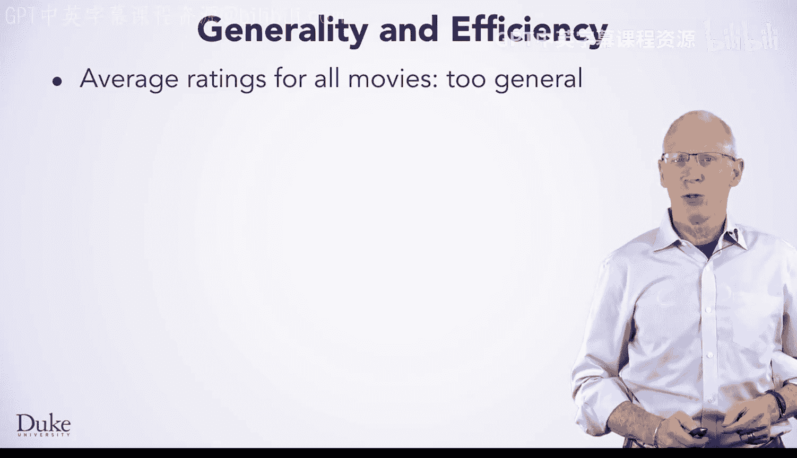


## 概述：提升效率与通用性

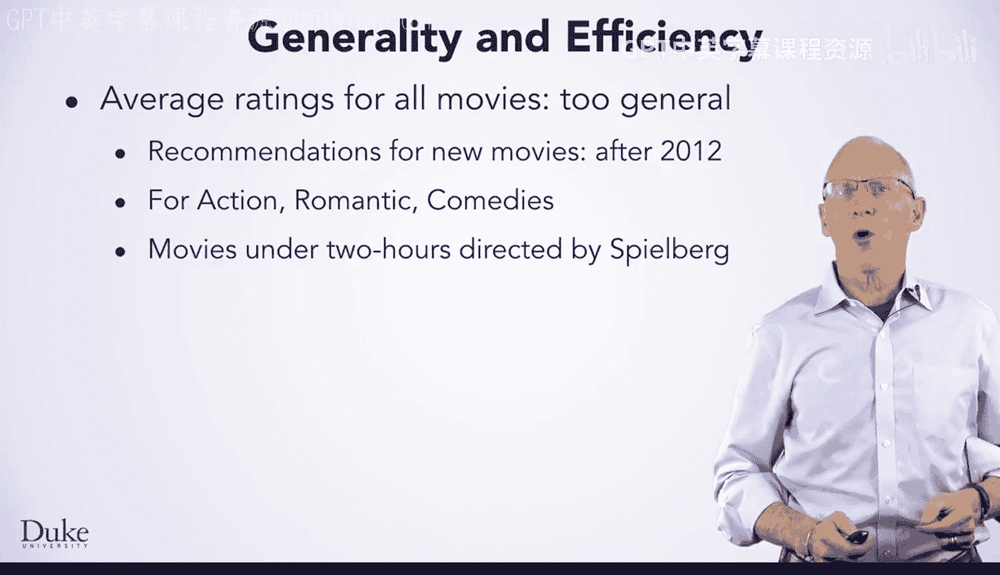

目前，我们的代码可以为所有电影生成推荐，虽然可以指定用于计算平均分的评分者数量，但使用所有电影过于宽泛。假设我们只想推荐2012年之后的新电影。

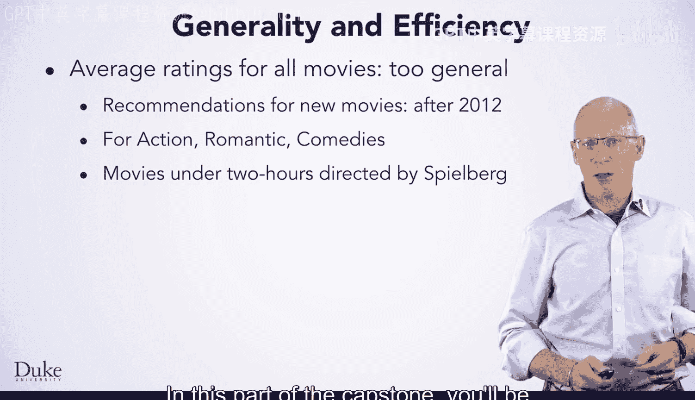

或者，我们可能只想推荐动作片、爱情片或喜剧片。甚至可能只想推荐史蒂文·斯皮尔伯格执导的、片长小于两小时的电影。

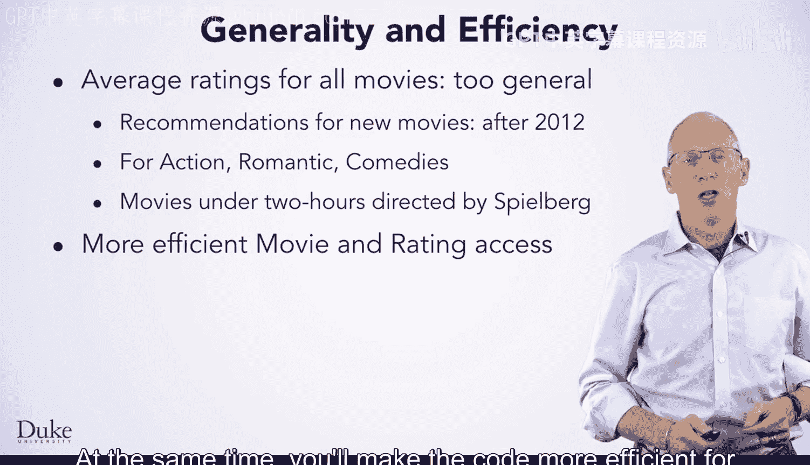

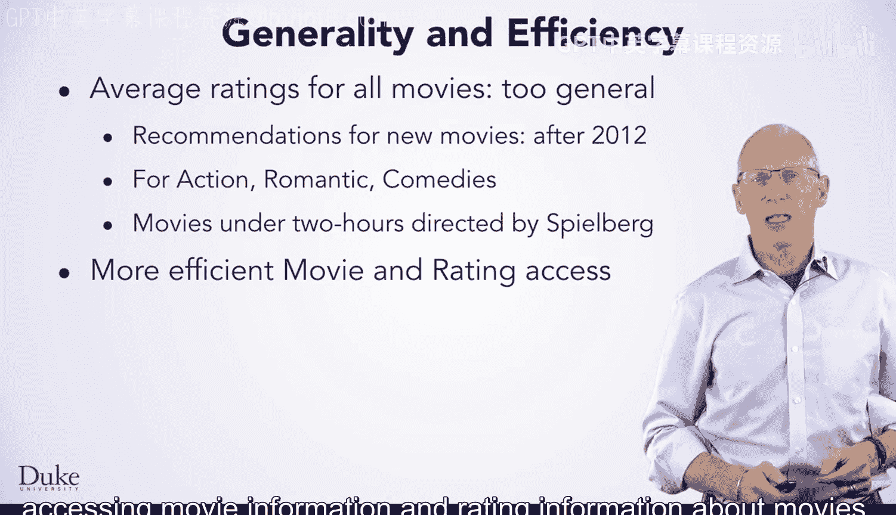

在本次项目实践中，我们将能够获取此类特定推荐。同时，我们将优化代码，使其在访问电影信息和电影评分信息时更加高效。

我们将使用哈希映射（HashMap）替代数组列表（ArrayList）。这将允许程序根据电影ID立即找到电影，而无需遍历数组列表。为了使程序更通用、更高效，我们将使用Java接口，并实践“开闭原则”——在扩展程序功能的同时，确保修改尽可能对外部不可见。

## 重构Rater类 🔧


我们将要进行的第一个修改是重构`Rater.java`类。

重构意味着我们不会添加新功能，并且会最小化或完全不改变现有类的外部接口（即API）。

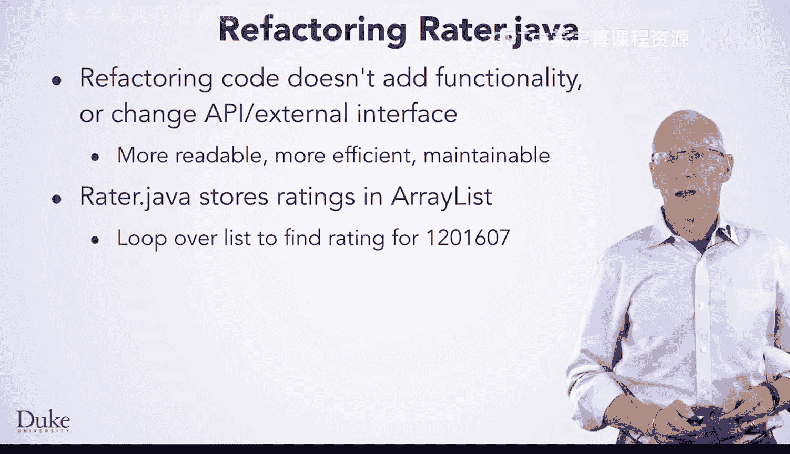

重构是使代码更具可读性、更高效和更易维护的重要部分。`Rater.java`中的当前代码将评分对象存储在数组列表中。为了查找ID为“1201607”的电影的评分，甚至只是确认该电影是否有评分，`Rater.java`中的代码需要遍历评分对象的数组列表。

当有数千名评分者，且每人可能为数百部电影评分时，这种方法效率低下。因此，我们将努力改变这种方法，同时最小化对使用Rater对象的程序其他部分的可见更改。


重构的第一步是创建一个接口，而不是直接修改类。

为了创建一个高效的Rater类并最小化其他更改，我们将首先创建这个接口。我们将复制`Rater.java`并命名为`PlainRater.java`。我们需要更改该类中的代码，以便构造函数命名得当。

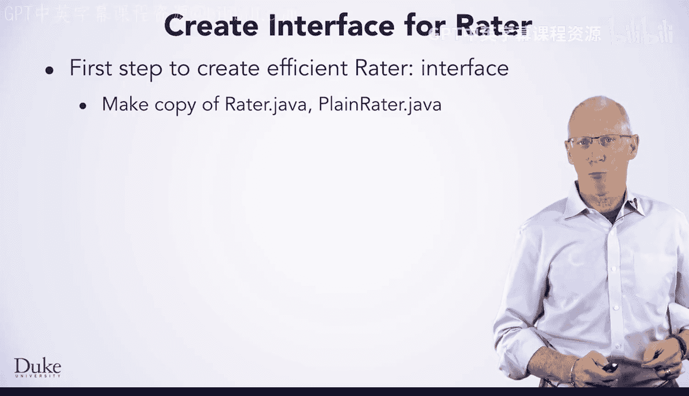

然后，我们将通过移除方法实现，将`PlainRater.java`转换为一个接口，只留下方法声明。创建Rater接口后，我们将看看推荐框架中还有哪些地方需要更改。


程序依赖Rater作为类型来读取数据和创建推荐，这些代码大部分仍将正常工作。


例如，进行推荐评分的代码会调用`hasRating`和`getRating`，这些调用仍然有效。


读取评分数据的代码需要更改。创建Rater对象时需要使用`PlainRater`来创建，但需要将新创建对象的引用赋值给一个类型为`Rater`的变量。


以下是需要更改的代码行示例：
```java
// 重构前
PlainRater rater = new PlainRater("1");
// 重构后
Rater rater = new PlainRater("1");
```


这一行是使代码正常工作所需的唯一更改。通过创建接口，我们最小化了对客户端程序的更改。程序以最小的修改实现了扩展。

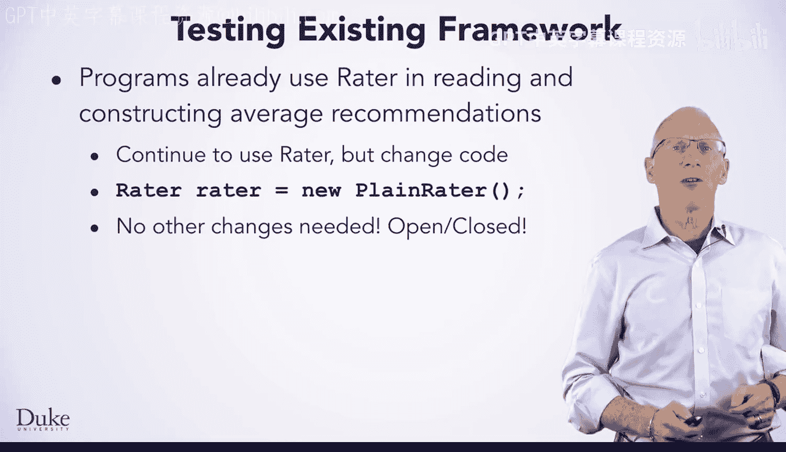

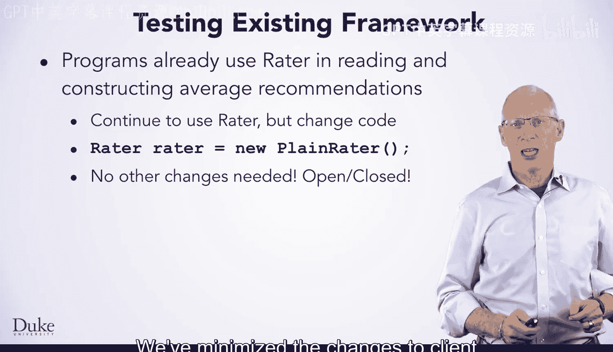

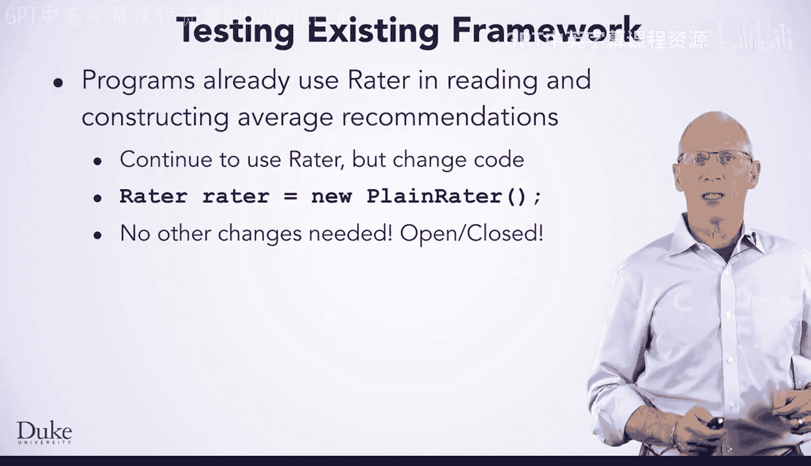

## 创建高效Rater类与使用过滤器 🚀

现在我们可以创建一个高效的`EfficientRater.java`类，并在推荐框架中使用这个新版本。

接口将保持不变，但`hasRating`和`getRating`方法将变得高效，因为它们将在哈希映射中根据评分ID进行搜索，而不是遍历数组列表。


我们需要更改的唯一一行是创建高效Rater对象的代码，该对象被赋值给这里看到的`Rater`类型变量。我们已经使用接口使代码变得高效。

接下来，我们将使用过滤器接口来获得更好的推荐。

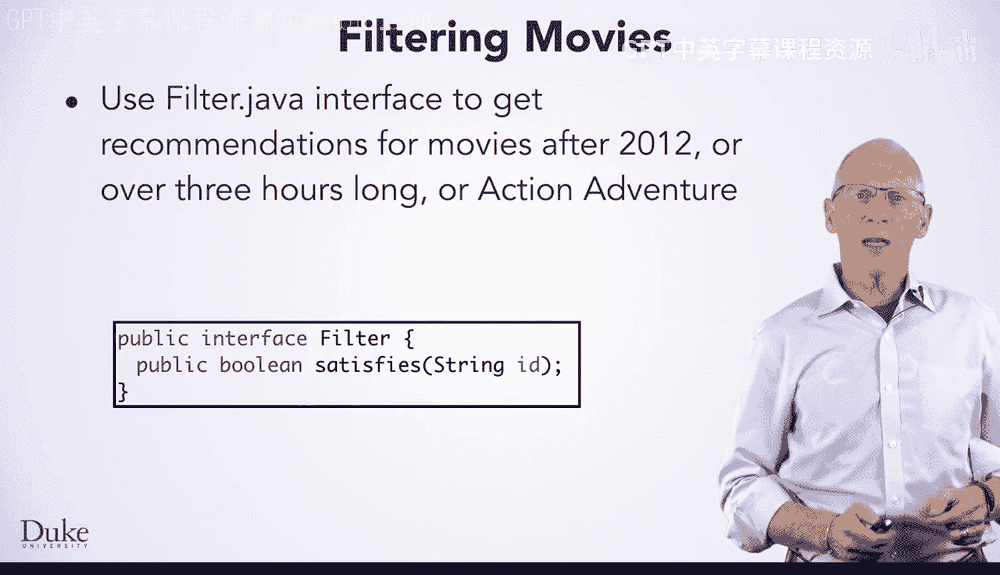

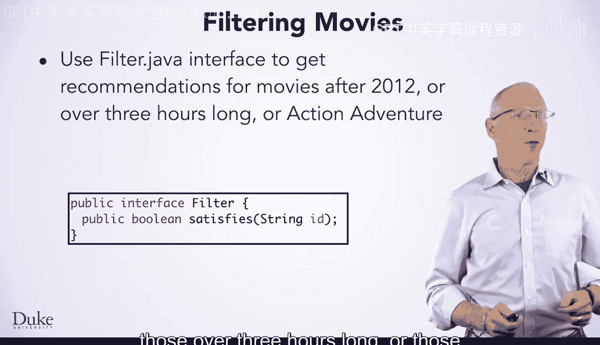

你在处理地震数据时见过类似`Filter.java`的接口。我们希望过滤电影，例如获取2012年后制作的电影、片长超过三小时的电影，或者是动作冒险类电影。

我们将如何创建像这里展示的`YearAfterFilter`这样的过滤器？或者像这里展示的`GenreFilter`？

这些构造函数看起来很简单，但我们需要思考`satisfies`方法在您实现的过滤器类中如何工作。`satisfies`方法将如何根据给定的电影ID查找电影，以确定该电影是否符合过滤器规范（例如，电影是否在2012年后制作）？这里的年份是一个实例变量，但如何访问具有给定ID的电影？

对电影的访问必须通过过滤器的构造函数提供，或以其他方式访问。为了保持简单和高效，我们将创建并使用一个`MovieDatabase`类，该类允许根据电影ID进行高效查询。这将在我们的过滤器类以及推荐框架中的其他类中既高效又易于使用。

`MovieDatabase`类是一个高效而简单的类，有助于编写访问电影信息的代码。


该类设计得易于使用，同时在以下方面非常高效，类似于一个简单的数据库。

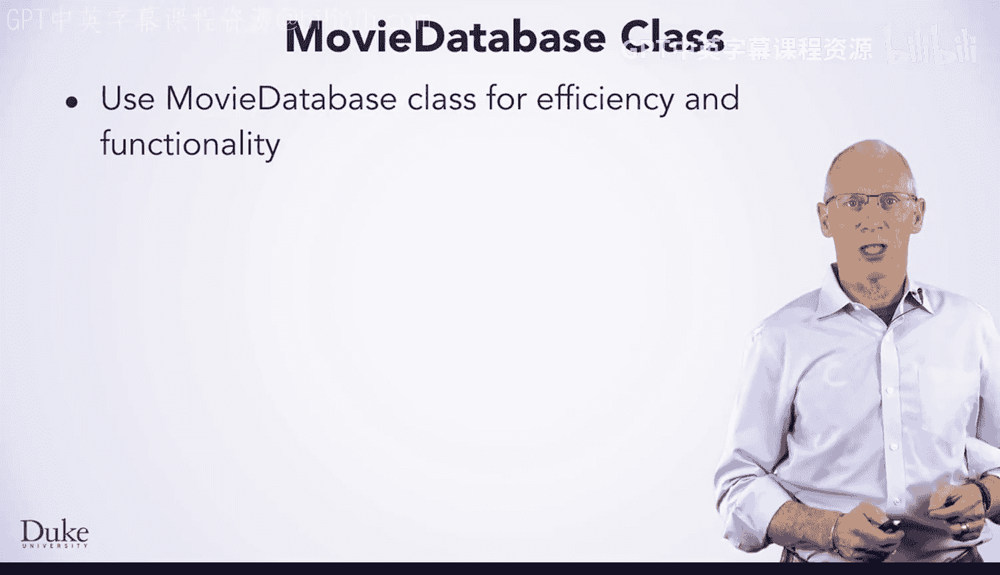

在`EfficientRater`中使用了相同的概念，其中电影ID是哈希映射中的键，用于访问`MovieDatabase`类中使用的电影信息。

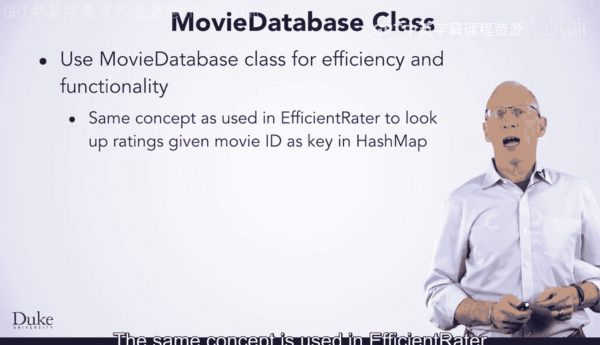

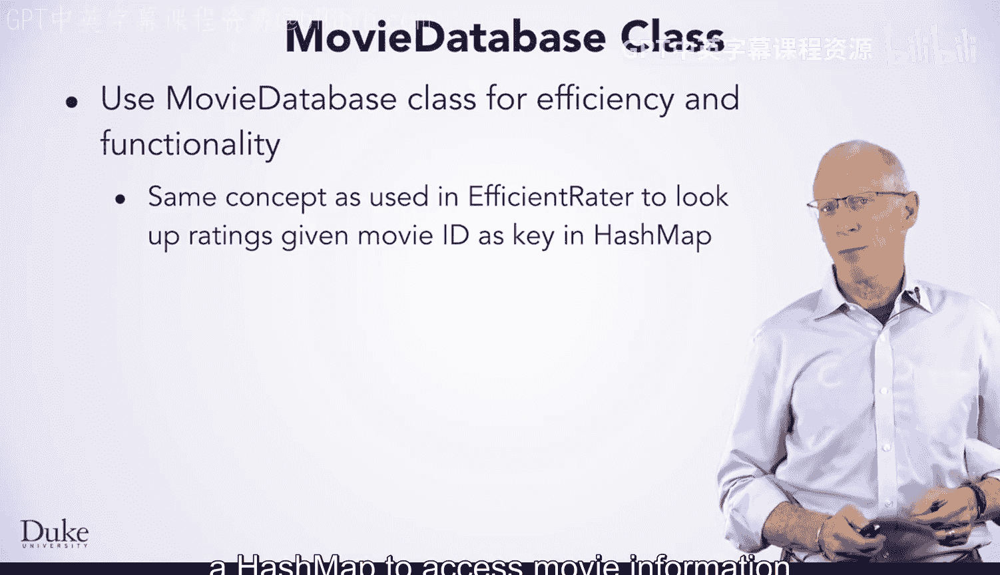

电影ID是键，但现在对应的值是电影对象，而不是像在`EfficientRater.java`中那样的评分。

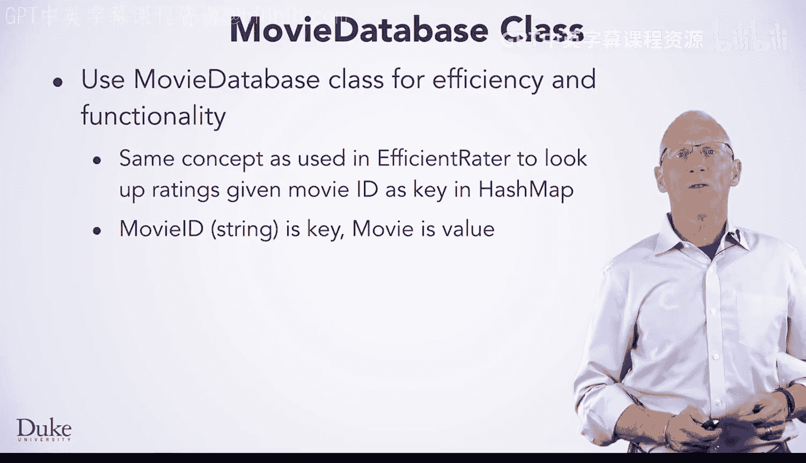

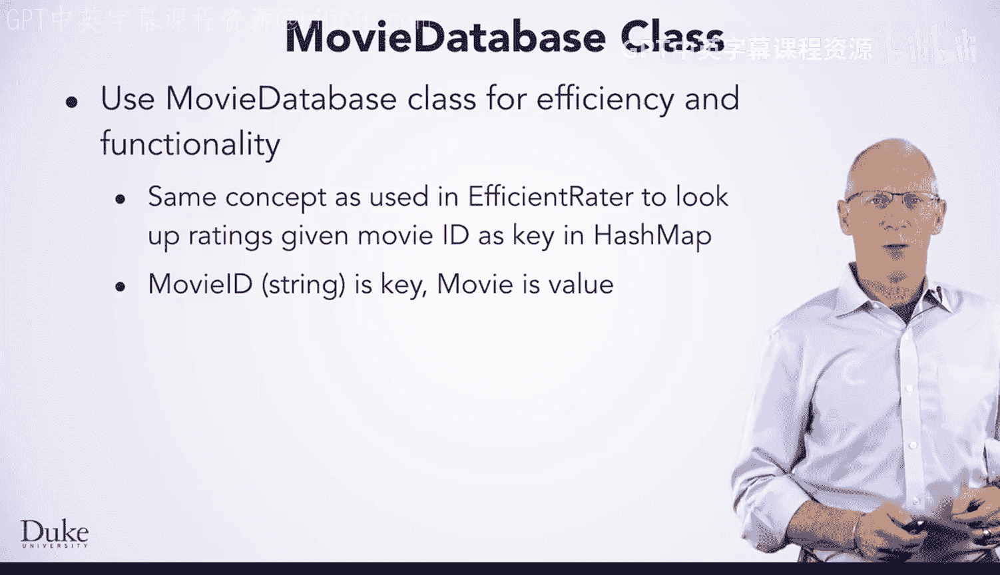

`MovieDatabase`类中的所有方法都是静态的，因此不会使用`new`创建MovieDatabase对象。相反，对电影的访问是通过静态方法提供的，就像使用`Math.sqrt`和其他数学函数时无需创建Math对象一样。

从概念上讲，这个类就像一个真实的数据库，支持基于电影ID作为键的查询，并返回一部电影或所有满足或通过过滤器的电影。

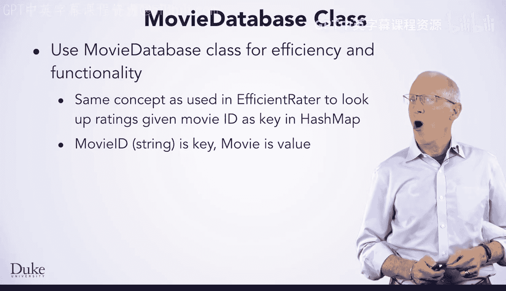

当您完成所有这些推荐时，您将已经使用了过滤器、接口，并创建了高效的数据库类。


在新的推荐框架中，电影将不再像以前那样通过作为电影对象数组列表的实例变量来访问。


相反，使用静态方法`MovieDatabase.filterBy`来获取所有满足过滤器的电影ID。该方法返回一个电影ID的数组列表。要获取所有电影，您需要传递一个始终返回`true`的过滤器，这样每部电影都满足此过滤器。

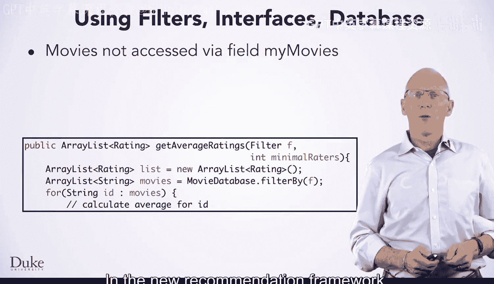

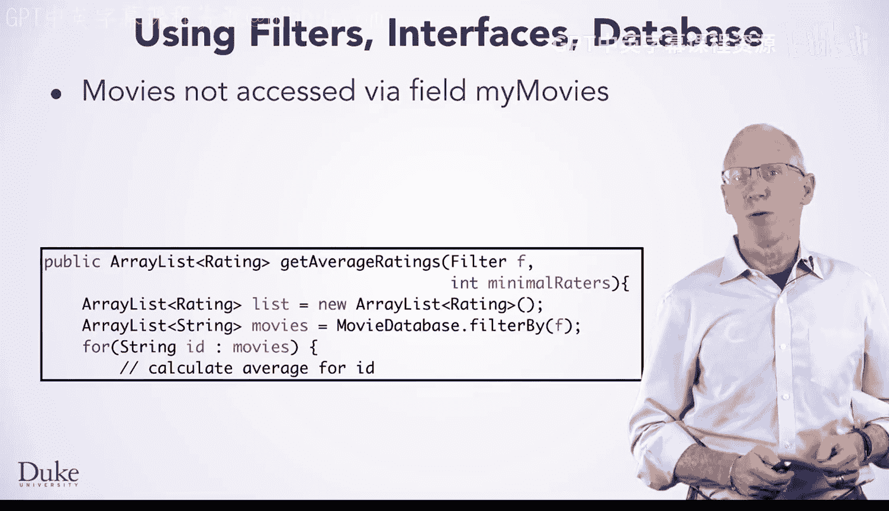

在您开始的代码中，这是`TrueFilter`类。

您将能够通过查找类似2012年或之后制作的浪漫电影的平均分来获得其他类型的推荐。

例如，您可以创建一个`YearAfterFilter`，如下所示。以及一个`GenreFilter`，如下所示，用于查找浪漫电影。然后，这些过滤器可以添加到一个`AllFilters`对象中，该对象将多个过滤器组合成一个过滤器。

添加流派过滤器和年份过滤器后，平均推荐结果显示2012年或之后的浪漫电影，如本推荐列表所示。这些推荐是通过利用Java接口的力量和重构代码生成的，以确保已经测试过的程序即使在新的上下文中也能继续工作。添加更高效的代码是额外的收获。

## 总结 🎉

本节课中，我们一起学习了如何通过重构`Rater`类和使用Java接口来提升推荐系统的效率和通用性。我们引入了`MovieDatabase`类来高效访问电影数据，并利用过滤器接口（如`YearAfterFilter`和`GenreFilter`）实现了对推荐结果的灵活过滤。这些实践不仅应用了“开闭原则”，使系统易于扩展，还通过使用哈希映射等数据结构显著提升了程序性能。