# Java编程和软件工程基础：5.04.02：计算加权平均值 📊

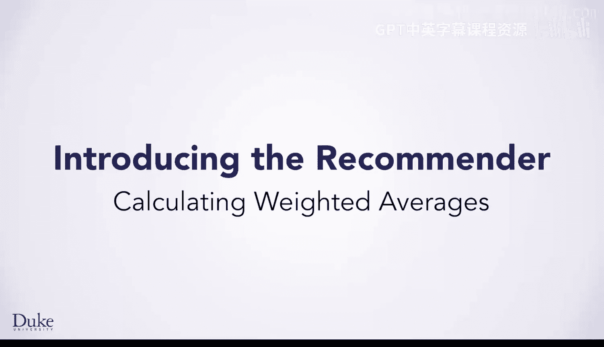

在本节课中，我们将学习如何通过计算加权平均值来改进电影推荐系统。我们将探讨简单平均值的局限性，并引入协同过滤的概念，以生成针对特定用户的个性化推荐。

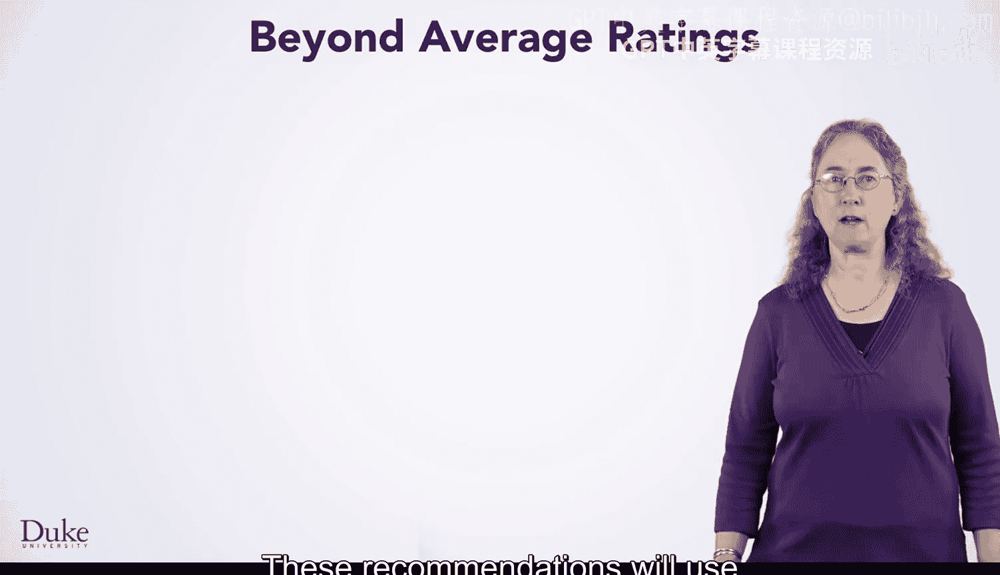

---

## 概述

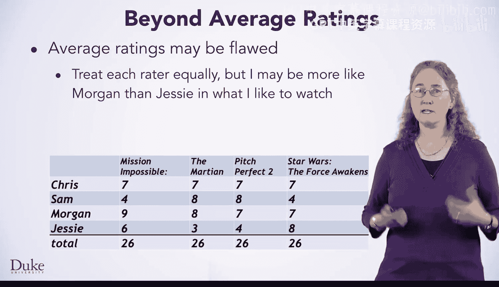

简单平均值在推荐时，平等地对待所有评分者。然而，对于特定用户而言，某些评分者的品味可能更接近该用户，他们的评分应具有更高的权重。本节课将介绍如何计算加权平均值，以实现更精准的个性化推荐。

## 简单平均值的局限性

上一节我们介绍了基于简单平均值的推荐方法。本节中我们来看看它的局限性。


使用所有评分者的平均分进行推荐，意味着每个评分者的意见被平等对待。但对于“我”的个性化推荐，摩根的评价可能比杰西的更相关，因为“我”喜欢的电影类型可能更接近摩根。同理，对于“你”的推荐，萨姆的评分可能更具参考价值。

## 协同过滤的基本思想

为了解决上述问题，我们引入一种不同的推荐方法，称为**协同过滤**。其核心思想是为特定用户生成推荐，而非为所有用户提供相同的推荐列表。

为了实现这一点，我们需要在计算平均值时，为不同的评分者分配不同的权重，更重视那些与目标用户品味相似的评分者。

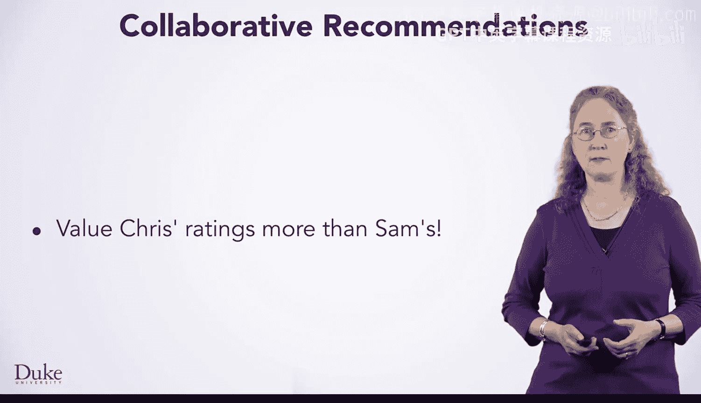

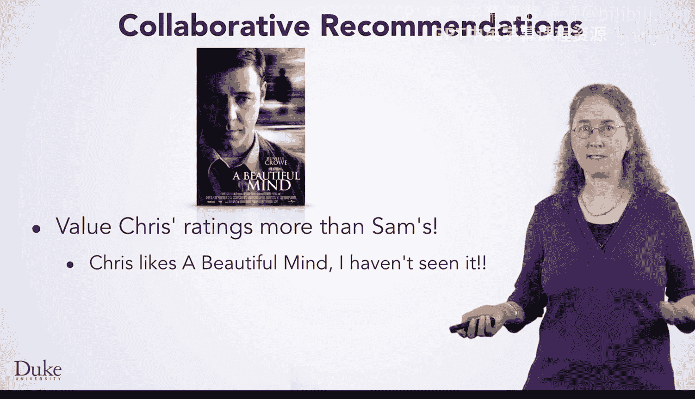

要创建协同推荐，我们需要对已编写的平均分计算方法进行一些修改。

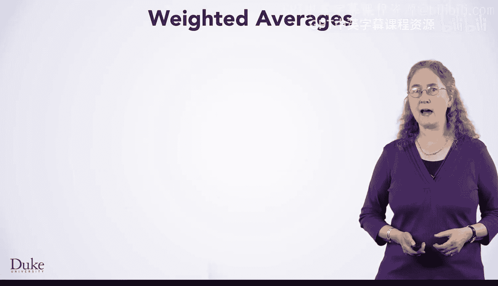

## 计算加权平均值

以下是计算加权平均值需要进行的两个概念性修改。假设下表是三位评分者（克里斯、萨姆、摩根）的评分。

**第一个修改**是只使用与“我”或目标用户相近的评分者的评分。相近评分者的数量是一个参数，例如可以设置 `n = 10` 来使用10位最相近的评分者。

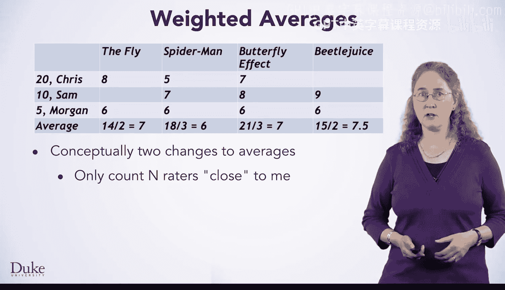

**第二个修改**是根据评分者与目标用户的接近程度来加权他们的评分。让我们更详细地探讨这个想法。

假设我们要为“我”推荐电影，以下是四部电影的平均分：
*   《苍蝇》：平均分 7
*   《蜘蛛侠》：平均分 6
*   《蝴蝶效应》：平均分 7
*   《甲壳虫汁》：平均分 7.5

根据这些平均分，我应该看《甲壳虫汁》，因为它平均分最高。但是，克里斯的品味可能比摩根更接近“我”，因此我应该更重视克里斯的评分。这将改变我们计算平均值以获得推荐的方式。

让我们更仔细地看看如何计算加权平均值。

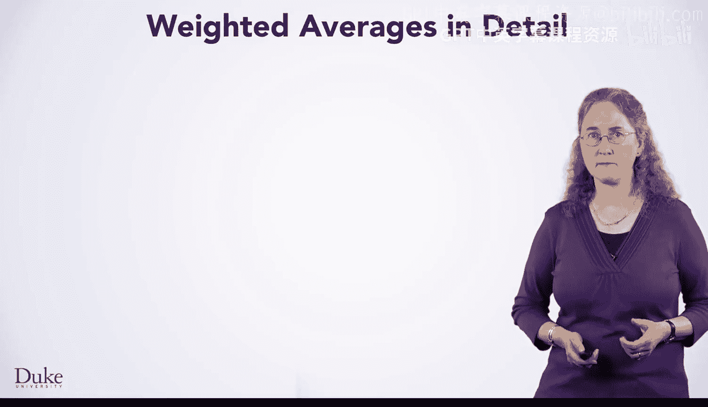

## 权重的应用

我们将使用每个评分者的“接近度权重”来计算电影评分的平均值。如下表所示，克里斯的权重是20，萨姆是10，摩根是5。我们稍后会展示如何计算这些权重，现在先用它们来计算加权平均推荐。

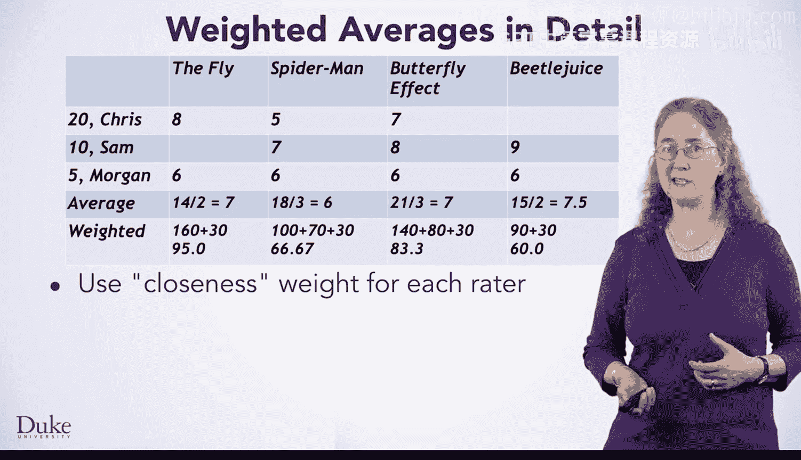

在计算平均值时，我们将每个评分乘以对应的接近度权重。不是每部电影都会被所有评分者评分。我们将使用加权平均来获得针对“我”或任何目标用户的推荐，计算中使用了这些接近度权重。

以电影《苍蝇》为例：
*   克里斯的权重是20，评分是8，贡献值为 `8 * 20 = 160`。
*   萨姆没有评分。
*   摩根的权重是5，评分是6，贡献值为 `6 * 5 = 30`。
*   加权总和为 `160 + 30 = 190`。假设总权重为 `20 + 5 = 25`，则加权平均值为 `190 / 25 = 7.6`。这与未加权的平均值7不同。

同理计算其他电影：
*   《蜘蛛侠》的加权平均值约为 6.67。
*   《蝴蝶效应》的加权平均值约为 8.33。
*   《甲壳虫汁》的加权平均值约为 6.0。

根据这些加权平均值，看起来我们应该看《蝴蝶效应》。值得注意的是，基于未加权平均分最好的电影《甲壳虫汁》，在使用加权平均后变成了评分最低的电影。

为了计算这个加权平均值，我们需要先计算权重，即一个评分者与“我”或某个特定评分者的接近程度。

## 计算相似度权重

我们将每个评分者表示为一个评分向量，以便讨论如何计算接近度。向量在概念上就是每个电影的评分列表。

例如，为了便于解释，我们假设有7部电影。评分者萨姆的7个评分如下（未评分的电影用0表示）：
`[5, 7, 0, 8, 0, 1, 0]`

克里斯的评分如下：
`[0, 6, 7, 0, 9, 0, 0]`

“我”的评分向量显示我评了6部电影：
`[6, 4, 0, 4, 0, 6, 0]`

让我们看看如何使用这些向量来计算“我”和萨姆之间的相似度权重。

我们遍历每部电影，计算“我”和萨姆都评过分电影的评分乘积之和：
1.  电影1：萨姆评5，“我”评6，乘积为 `5 * 6 = 30`。
2.  电影2：萨姆评7，“我”评4，乘积为 `7 * 4 = 28`。
3.  电影4：萨姆评8，“我”评4，乘积为 `8 * 4 = 32`。
4.  电影6：萨姆评1，“我”评6，乘积为 `1 * 6 = 6`。

“我”和萨姆的相似度权重就是这些值的总和：`30 + 28 + 32 + 6 = 96`。

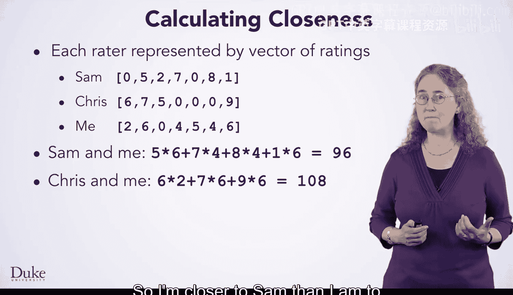

用同样的方法计算“我”和克里斯的相似度权重。我们有三部共同评分的电影，计算总和：`0*6 + 6*4 + 7*0 + 0*4 + 9*0 + 0*6 + 0*0 = 0 + 24 + 0 = 24`。（注意：根据向量，实际共同电影是第2部（6*4=24）和第4部？原例数据需核对，此处演示逻辑）

所以在这个计算中，“我”与萨姆更接近，因为权重是接近度的度量。

## 点积与评分中心化

上面的计算实际上是一个**点积**，它是向量空间中数学接近度的一种度量。了解我们计算加权平均值的方法有数学基础是很好的。

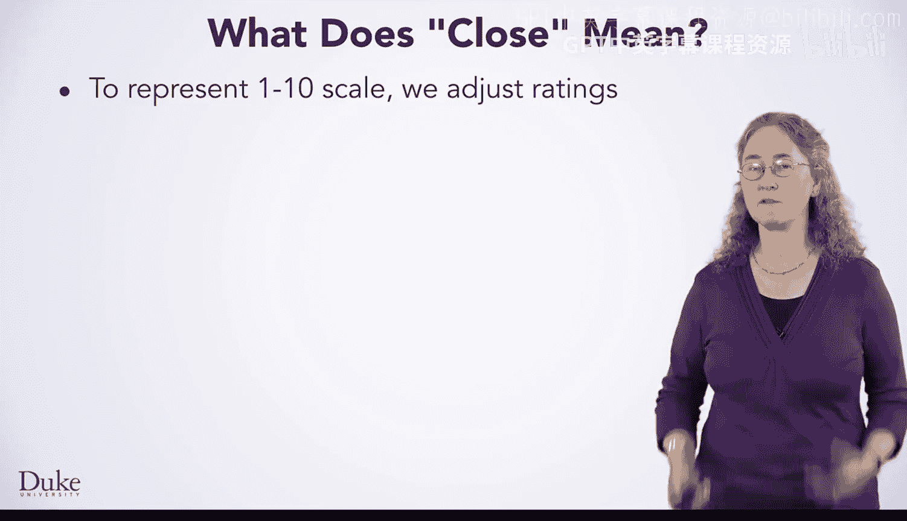

在这种情况下，我们简单地计算两个评分者对每部共同评分电影评分的乘积之和。

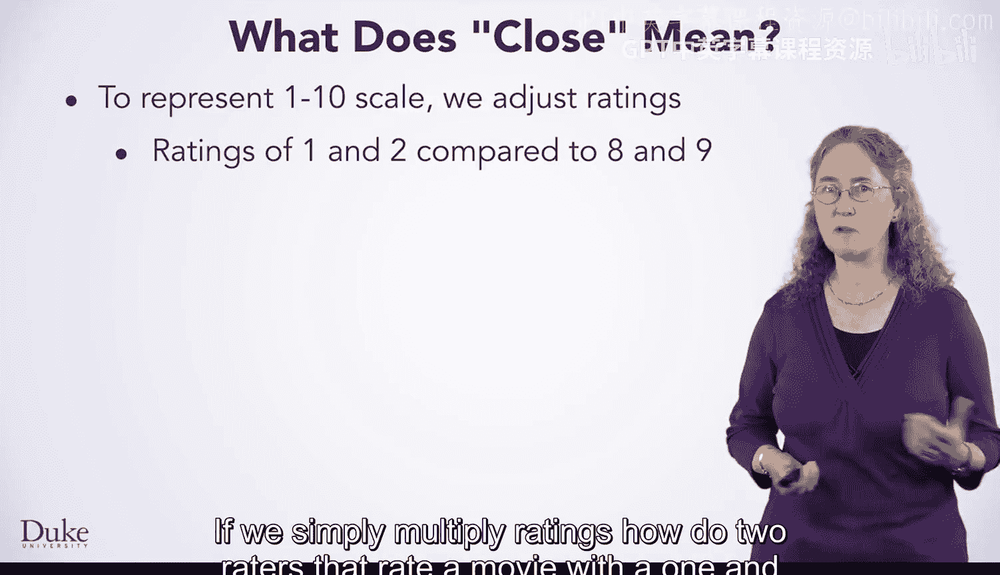

在实际计算中，我们需要调整评分以解决1到10的评分尺度问题，其中1分表示非常不喜欢，10分表示非常喜欢。

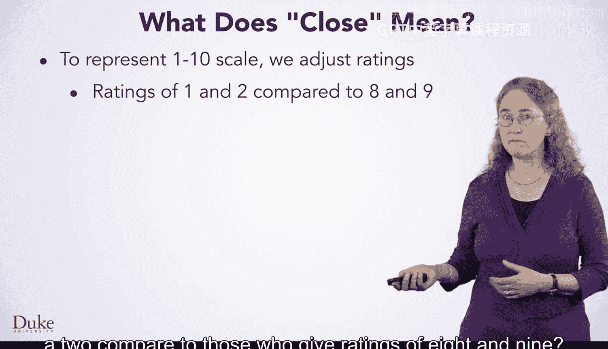

当我们通过计算点积来确定接近度时，我们希望1到10尺度上的评分能有效工作。我们希望相近的评分者对电影的评分也相似（例如都喜欢或都不喜欢），因为这种接近度是相似性的度量。

如果我们简单地相乘，两个给电影评1分和2分的评分者，与评8分和9分的评分者相比如何？

如果直接相乘，我们会比较 `1*2=2` 和 `8*9=72`，差异巨大。但这两组评分者的品味非常相似：给1分和2分都表示非常不喜欢，给8分和9分都表示非常喜欢。这两对评分应该对相似性度量的贡献相等，但直接相乘的结果却不相等。

我们将通过从每个评分中减去中间值5来进行**中心化**处理。
*   对于评分1和2，使用 `1-5=-4` 和 `2-5=-3`。
*   对于评分8和9，使用 `8-5=3` 和 `9-5=4`。
*   中心化后的乘积分别为 `(-4)*(-3)=12` 和 `3*4=12`。
*   这样我们就得到了两组评分者同样相似的结论。

让我们看一个中心化评分的例子。原始评分为0的用星号表示，我们在计算相似度得分时不会使用它们。

萨姆的7个原始评分及中心化后评分：
*   原始：`[5, 7, 0, 8, 0, 1, 0]`
*   中心化：`[0, 2, *, 3, *, -4, *]`

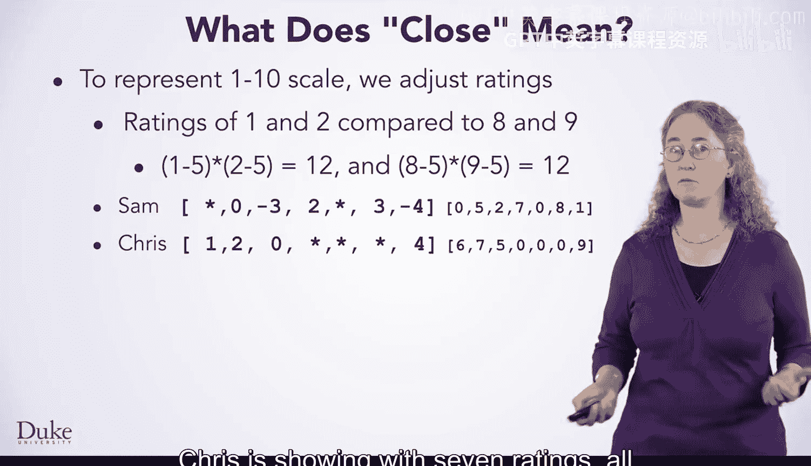

克里斯的评分：
*   原始：`[0, 6, 7, 0, 9, 0, 0]`
*   中心化：`[*, 1, 2, *, 4, *, *]`

“我”的评分：
*   原始：`[6, 4, 0, 4, 0, 6, 0]`
*   中心化：`[1, -1, *, -1, *, 1, *]`

现在重新计算“我”和萨姆的相似度权重（使用中心化评分）：
1.  电影1：萨姆0，“我”1，乘积 `0*1=0`。
2.  电影2：萨姆2，“我”-1，乘积 `2*(-1)=-2`。
3.  电影4：萨姆3，“我”-1，乘积 `3*(-1)=-3`。
4.  电影6：萨姆-4，“我”1，乘积 `(-4)*1=-4`。

总和为 `0 + (-2) + (-3) + (-4) = -9`。

计算“我”和克里斯的相似度权重：
1.  电影2：克里斯1，“我”-1，乘积 `1*(-1)=-1`。
2.  电影3：克里斯2，“我”0？根据向量“我”未评分，应为*，不计算。原例数据可能不一致，此处假设共同电影为第2部（已算）和第5部？克里斯4，“我”0？不计算。实际应根据共同评分电影计算。
    （注：根据提供的中心化向量，“我”和克里斯共同评分的电影似乎只有第2部（1*-1=-1）。原文本描述有矛盾，我们理解其核心思想即可。）

所以在这个中心化后的计算中，“我”可能更接近克里斯而不是萨姆，因为与萨姆的乘积和为负数，表明我们的喜好相反。记住，在原始非中心化评分中，“我”更接近萨姆。所以中心化处理带来了差异。从评分中可以看出，萨姆和“我”并不一致：当“我”喜欢一部电影时，萨姆不喜欢，反之亦然，因为所有乘积都是负数。

这项技术在计算相似度时是标准的，但很容易被忽略。如果像1到10这样的全正尺度上的评分不以这种方式中心化，相似度权重将会改变。

## Java代码实现

让我们看看用于计算这些加权相似度以找到“我”或任何评分者附近评分者的Java代码。我们将调用 `getSimilarities` 方法，这是你需要在本核心项目中完成的方法。

```java
public ArrayList<Rating> getSimilarities(String id)
```
参数 `id` 是为其计算相似评分的评分者。
`RaterDatabase` 类将提供给定评分者ID的访问权限，类似于你已经使用过的 `MovieDatabase` 类。`RaterDatabase` 类也提供对所有评分者的访问，就像 `MovieDatabase` 类提供对所有电影的访问一样（尽管电影可以被过滤）。

在这个循环中，你将调用另一个方法来计算“我”和评分者 `r` 之间的点积。这个点积值将与评分者 `r` 的ID配对在一个 `Rating` 对象中，并添加到要返回的 `ArrayList` 中。

在返回 `ArrayList` 之前，代码将对列表进行排序，以便第一个 `Rating` 是具有最高权重（最接近“我”）的评分者。我们可以通过调用 `Collections.sort` 并传递一个比较器来实现，该比较器是Java `Collections` 类的一部分。这个比较器反转了 `Rating` 对象的默认排序顺序，以便列表将最高值存储在前面。

一旦你获得了每个评分者的权重，你就能够计算加权平均值来获得推荐。

`getSimilarRatings` 方法与 `getAverageRatings` 类似，但是针对一个特定的评分者，其ID是参数。

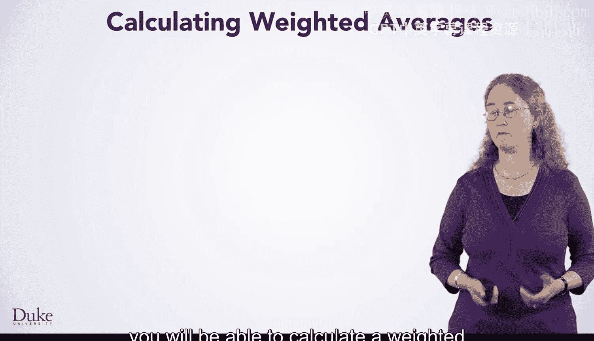

首先，通过调用我们刚刚讨论的 `getSimilarities` 方法来计算所有评分者的权重。
与 `getAverageRatings` 方法一样，此代码循环遍历评分者。在 `getAverageRatings` 方法中，循环遍历所有评分者，并检查每个评分者是否对正在计算平均分的电影进行了评分。

在这里，我们只循环遍历那些与“我”接近的评分者，即那些权重存储在名为 `list` 的 `ArrayList` 中的评分者。我们只使用 `list` 中的前 `numSimilarRaters` 个条目，其中 `numSimilarRaters` 是一个参数。其思想是仅使用最接近“我”的前10、20或100个评分者。

在从 `list` 中获取评分时，需要注意确保索引有效，避免越界错误。
在累积加权总和后，加权平均值将被添加到要返回的 `ArrayList` 中，就像未加权的 `getAverageRatings` 方法中的代码一样。你将返回电影评分的列表，你可能希望先对其进行排序。

在获得协同过滤推荐之后，你需要编写代码将其呈现给用户。

## 呈现推荐结果

你需要决定是否应该为已经看过的电影提供推荐。
这是一个为“我”生成的推荐列表，基于“我”今年看过的电影给出的10个评分。在输出中，“我”评过分的电影用星号标出。这些评分可能有助于“我”校准结果，因为“我”喜欢这些电影，在top15列表中看到它们对“我”来说是有意义的，尽管“我”不需要推荐去看它们，因为已经看过了。


我们应该打印超过top15吗？我们应该打印所有推荐吗？我们应该打印加权平均值吗？
你还将决定是否应该打印比电影标题更多的信息。你可以打印年份、流派或更多信息。你可以生成HTML输出，在网页上显示推荐。

享受寻找推荐的乐趣吧！

---

## 总结

在本节课中，我们一起学习了如何通过协同过滤和加权平均值来改进电影推荐系统。我们探讨了简单平均值的不足，引入了根据评分者相似度进行加权平均的思想，并详细讲解了计算相似度权重（点积）的方法及其关键步骤——评分中心化。最后，我们概述了在Java中实现这些概念的代码框架。通过这种方法，我们可以为每个用户生成更加个性化的电影推荐。