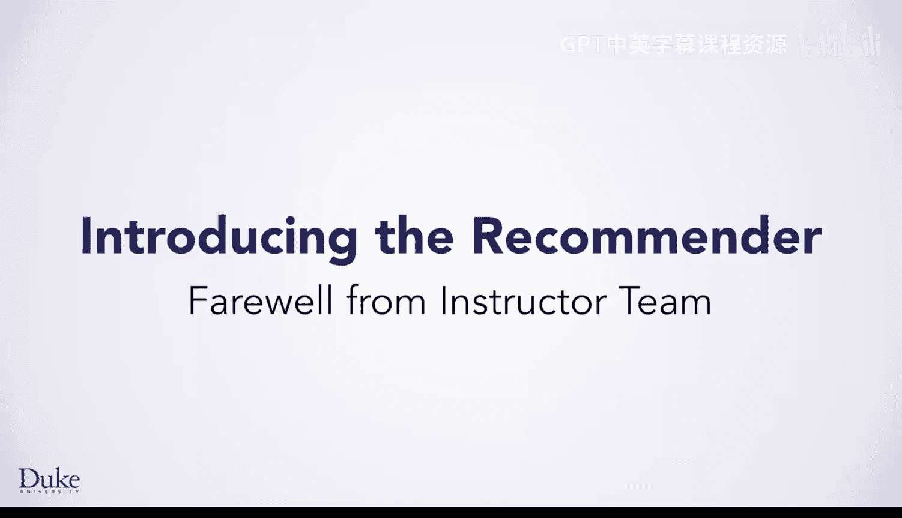
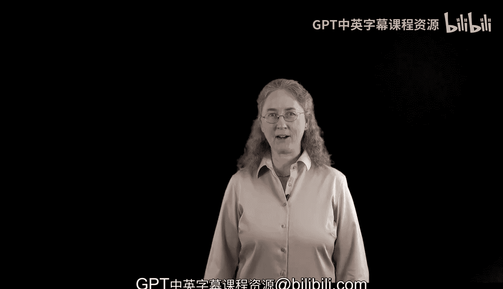

# Java编程和软件工程基础：2-5：教学团队告别 🎓

在本节课中，我们将回顾整个专项课程的学习历程，并展望未来的编程之旅。

---

非常感谢您完成了我们的专项课程和顶点项目。

---

感觉就像昨天一样，我们还在用恐龙演示“万物皆数字”，并开始学习编程七步法。

现在，我们的学习者已经能够编写推荐引擎了。

这些引擎甚至可能用七步法来推荐《白雪公主》。欧文，这算是个玩笑。

虽然不会有关于《白雪公主与七步法》的电影。

但这会是一个很酷的续集：她学习编程，在谷歌获得一份很棒的工作，并从此开发有用的软件，幸福地生活下去。

尽管这很有趣，但更重要的是，所有完成本专项课程的学习者，已经对编程（特别是Java）有了深入的了解。

---

然而，尽管他们学到了很多，但这并非他们编程旅程的终点。

相反，这仅仅是一个开始。

如果他们在此课程之后继续学习，还有更多可以学习和实践的内容，无论是深入钻研Java，还是学习另一门语言。

不过，这确实标志着我们专项课程的结束。

所以，再见，祝你好运，无论你的编程冒险将带你走向何方。

---

在本节课中，我们一起回顾了整个专项课程的成就，并鼓励大家将此次学习视为未来广阔编程之旅的起点。