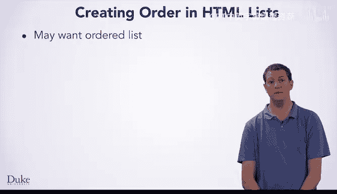
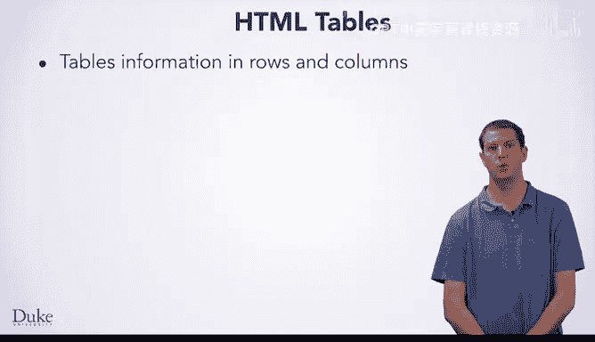

# 杜克大学《Java编程和软件工程基础-1｜Java Programming and Software Engineering Fundamentals》中英字幕 - P10：10_01_11_列表与表格.zh_en - GPT中英字幕课程资源 - BV1gM4m117nk

You've already learned some basics of HTML， which lets you specify the contents of a web page that you want to make。

 You learned about metadata tags such as head and title and sectioning tags such as body H1 and H2。

 you learned about text content such as the P tag， which formats a paragraph。 However。

 there's much more that you can do with HTML， besides just put text into paragraphs。

 One way that you might want to organize information is in lists or tables which we will explore now。

We use bulleted lists often when presenting information， in fact。

 much of the content of these video presentations presents information in that form。

Here you can see a screenshot from a sample webage that organizes information into a bulleted list。

 This particular style of list is called an unordered list， which you can create with the U tag。

 which stands for unordered list。Even though the list is called unordered。

 the content still appears in the order that you specify it。

 it is just called unordered because the labels are all the same bullets by default。

Later in this lesson， we will show you how to create lists with numbered items。

When you go on to learn about CSS， you can change the style of the bullets。

Now that you have the big idea， let us dive into the details of using the UL tag to make unordered lists。

Here's the HTML for the page we saw a second ago。 If you look inside the UL tag。

 which corresponds to the actual bulleted list， you will see many LI tags， each LI tag。

 which stands for a list item， describes one item in the list。If we look at each of these LI tags。

 we can see how they correspond to the items that appear in the list。When you make lists。

 it is important to know that you must place everything in the list inside L tags。

All of the tags inside of the UL tag called the UL Ts children have to be AllI tags， otherwise。

 are HTMLs incorrect。However， inside the LI tags， we can put much more than just text。

 we can put images， links， or even another list。Okay， so you know about unordered lists。

 but sometimes you want an ordered list， one that will number the items。

 If you wanted to describe your preferences for your five favorite fruits， for example。

 you might want to number them。

In such a situation， numbering is important as you want to indicate the ordering of the list。

 You can also have lists which are ordered， but labeled with letters instead of numbers。

You can make these types of lists with the OL tag， which stands for ordered list and works a lot like the UL tag。

 Much like the UL tag， you specify the list items with LI tags。

 which are the only type of tag you can put as direct to children of the OL tag。 Of course。

 as with the UL tag， you can put a lot of different kinds of things inside of the LI tag。

The numbering for LI tags is automatic。 If you add or remove elements from your HTML。

 the numbers will automatically adapt so that the elements are numbered 1，2，3，4， and so on。

We mentioned how you can put a variety of types of elements inside of an LI tag。

 letting you put images， links or nested lists inside of a list。

 We call putting these elements together， composing them。

Composition is an important concept in computer science and is common in design of languages。

 whether markup languages like HTML or programming languages like Java。

 This property lets you build large， complex systems。

 whether web pages or programs in a way that you can understand。 You can put small。

 easy to understand pieces together to build larger， more complex things。In the case of web pages。

 we can put elements together to get more sophisticated formatting。 In most cases。

 you can compose elements with each other， however you want， although there are some rules。

 for example， you cannot put the title tag inside of an unordered list because it does not make sense for the title of the page to be inside a list。

 The title tag can only go in the header。However， you can make a list of images or a list of lists。

 when you make a list of lists， it is called a nested list。

 Nesting is another common concept in computer science。

 which just refers to one of a thing being inside of another of that thing here。

 you are going to learn about nested lists Later， when we delve into programming。

 you will learn about nested loops。 The concept is the same。 A loop inside of a loop。

 much like a list inside of a list。You can make a nested list such as this one by placing a UL tag which describes the inner list inside of the LI tag for one of the items in the adder list。

Notice how the bullets for the inner list are different from the bullets for the outer list。

 as well as how the inner list is indented more deeply。

 These features both help whoever is reading the web page。

 visually distinguish the content in the outer inner lists。😊，As well as when you write the HTML。

 it is helpful to indent more deeply each time you put one element inside of another。

This structure helps you visually distinguish where elements belong in the HTML so you can edit it more easily later。

Notice how you can compose the list items here， you just write the inner list with UL and LI just like you would do anywhere else。

 you do not have to do anything special， and that is an important aspect of composition。

 you just put the pieces together and they work the same way everywhere。

The HTML for this example is available on CodeP if you want to play with it after you finish watching this video。

Another way you might want to organize information in your HTML is with a table which lets you arrange things into rows and columns。

 For example， you might want to display some information about food based on what taste you associate with it。

Sometimes people will use tables for more general organization of the contents of the page， but CSS。

 which we will learn about later is the preferred way to do that。

You make a table with HTML elements that match up with the visual structure of the table。Now。

 let us look in depth at the HTML elements that were used to make this table。First。

 you write a table tag at the start of the table， which has a matching in table tag at the end of the table。

Next， you write a TR tag which stands for table row， for each row of the table。As you can see here。

 each TR corresponds to one row in the resulting table。

Rows can either contain TH tags which specify header elements such as these and TD tags which specify the data for non header elements of the table。

We have text inside of our TD tags here， but do you think that you could put other things inside of them。

Sure， the principle of composition says that you could put images， lists。

 or a variety of other things in your table if you wanted to。Okay。

 so now you've seen HTML tables and lists which let you organize information from simple to complex。

 if you wanted， you could put a table tag inside of an LI tag or a list inside of a table。

Isn't composition great， You're going to see it come up again as it is a key principle in computer science。

 and it will help you as you create， design and build whatever you want the computer to do for you。

 whether it is a web page to show off some cool information or a program to compute something important。

😊。