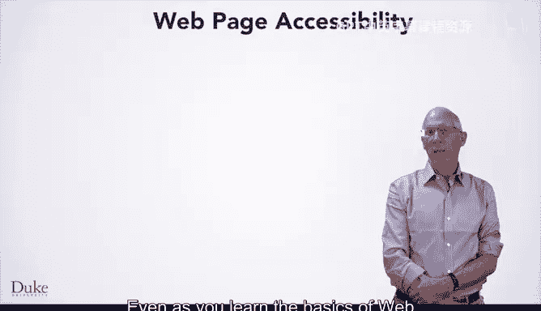
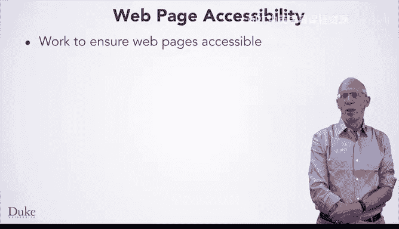
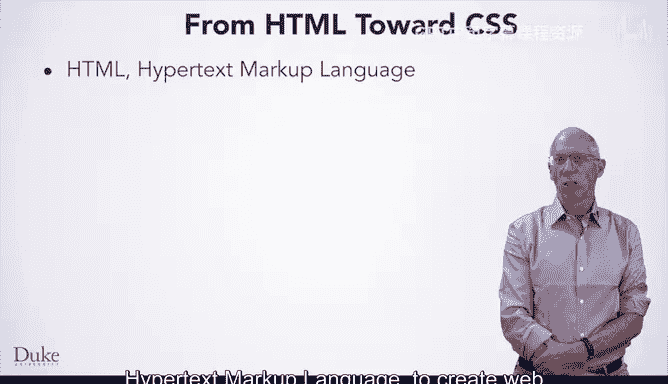

# 杜克大学《Java编程和软件工程基础-1｜Java Programming and Software Engineering Fundamentals》中英字幕 - P11：11_01_01_CSS如何用于网页设计.zh_en - GPT中英字幕课程资源 - BV1gM4m117nk

Web pages today are displayed in experience differently depending on many criteria。

The kind of device and screen。Affect both how to display and whats a display。

 Web pages are often designed to accommodate different users with different abilities and disabilities。

 Users experience web pages differently。 Some users are colorblind， Some can't see well。

 and some have a hard time clicking on small links。Users may see web pages on computer monitors。

 but today， many users are viewing the web on mobile devices like smartphones and tablets。

 Web pages may even be displayed on huge screens。Web designers must take users and devices into account when creating web pages。

Even as you learn the basics of web page creation and design。

 you can and should keep some things in mind when you create a web page working to make web pagess accessible。

You'll do this by removing barriers and to help make your web pages accessible to everyone。

Some people have trouble seeing certain colors， some can't see it all。

 and some have a hard time manipulating a mouse。Users with poor eyesight may use screen readers to help view and experience a web page。

 some colors and some fonts are easier to read than others。

Some alphabets require special fonts to display well。If you develop more web pages。

 you'll want to ensure a good user experience。And this means that pages should load quickly when that's possible。

We've already used HTML or Hypertext Markup language to create web pages that anyone in the world can see。

H T M L specifies the content of a document， the words and images that appear in a web page。

 Some formatting is specified with Hm L。 For example。

 different size headers are indicated in H T M L by H1 or H2 or H3 tags。

Different kinds of lists are indicated in H T M L by using O。

 L and U L tags for ordered and unordered lists。 These display differently because browsers interpret the Hml and change both headers and lists to match the H M L markup。

Tables are also formatted using HTML， as you've seen。

 with the many tags that are used to build a table for displaying data and other information。

Images are displayed using HTML， and you've seen that the width of an HTML image or IMG tag can be specified using the width attribute or specifying the width using a style addition to the HTML tag。

These style and width modifications are example of what's called CSS to style a web page。

 CSS is an abbreviation or an acronym for cascading style sheets。

CSS specifies the look and formatting of a web page， whereas HTML specifies the content。

This allows web designers to separate the content from how it's presented。

 which can accommodate the different users and different display devices。

To make sure that even in other countries。These can be displayed without changing the content of the web page。

 For example， how big is an H1 header tag。What color should be used for the text in an H1 header tag？

Should the color or size depend on the user and how the user is experienced the webpage on whether the user is using a mobile device。

 these attributes of a tag can be specified and changed using CSS。

If youre creating thousands of web pages for a website。

 changing the color or font or the size of an HTML element can be localized in one place rather than repeated in 1 thousand0 places。

 which would make changes difficult Design for scale is a key part of computer science and one that CSS and HTML together make possible。

