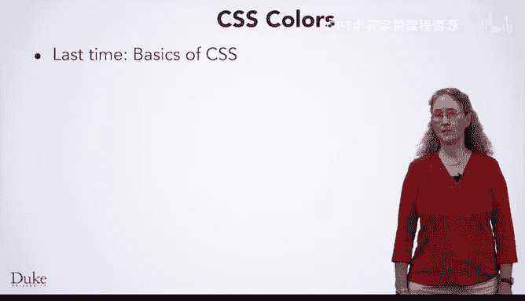
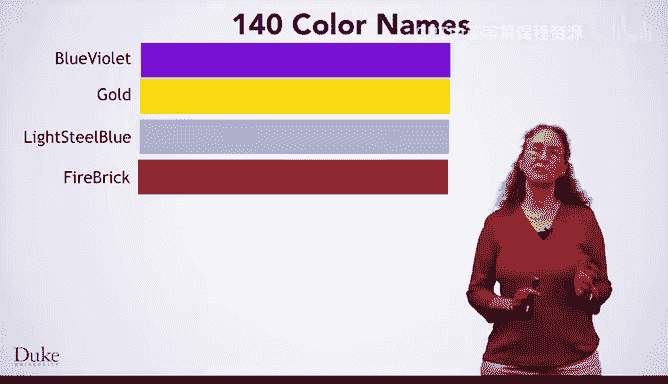
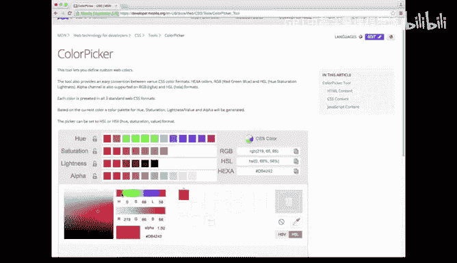
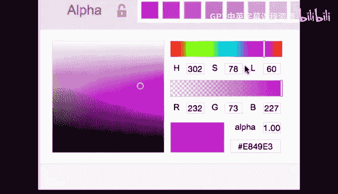
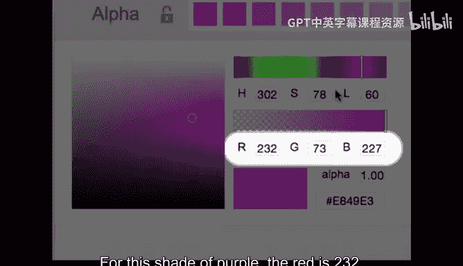

# 杜克大学《Java编程和软件工程基础-1｜Java Programming and Software Engineering Fundamentals》中英字幕 - P13：13_01_04_CSS中的颜色与命名.zh_en - GPT中英字幕课程资源 - BV1gM4m117nk

In this lesson， you are going to learn a bit more about CSS In the last lesson。

 you learn the basics of CSS， its syntax， as well as how you can name styles with classes and IDs。

In this lesson， you're going to learn a bit more about colors in C SS。 In particular。

 you will learn that you can specify them not only by name， but also by numeric values。

 an instance of an important concept that you will learn in the next lesson that everything is a number for a computer。

Remember from last time that you learned to style the H1 tags to be blue and centered。

 we use blue as the value for the property color to achieve this styling。

What if you wanted to use another color， we saw green in another example。

 so you could guess that you might be able to use a variety of basic colors such as red and yellow。

 and you would be right。But you might want to design a web page with more sophisticated color choices。

C， SS supports a much wider variety of color names。

 giving you the ability to choose some nice shades of different colors。 Here's a few of my favorites。

 Blue violet is a nice shade of purple。😊，Gold is， of course， gold colored。Light blue steel is a nice。

 bluish gray， and fire brick is a deep red。 In fact。

 there are 140 standard color names giving you a wide selection of colors to choose from by name。😊。

How could you remember them all， as with many other things。

 nobody memorizes these sorts of things and said， what's important is knowing how to look up what you need。

You can find websites such as this one， which will show you the various colors。

 as well as their names。However， even 140 colors is not a lot。

What if you wanted some other shade of a color that does not have a standard name？

It seems like we might want more colors， but how many would we need？

Humans can perceive literally millions of colors。For example。

 we have here 12 very subtly different shades of blue ranging from very dark。

On the left to a medium light blue on the right， These are just a few shades of blue。

 and one of them is a very important shade of blue。 This bar in the middle is Duke blue。Of course。

 there's many more shades of blue and many more shades of other colors too。

So how can we handle millions of colors？Giving them all names would be somewhat unmanageable。

 One problem is that someone would have to come up with millions of color names and standardize them。

 Another problem is that you would have to look through millions of names to find the color that you want。

Limiting the selection of available colors is not a very appealing option。

 If you really want a particular color， such as exactly Duke Blue。

You would be unhappy if you could not get it。Another option would be to give each color a number。

 which is what is actually done。In fact， as you will learn later for a computer。

 everything is a number。 so this choice is actually a natural way to handle millions of colors。

The way that colors work as numbers is that they are specified by a combination of how much red。

 green and blue they have， with each component taking a value between 0 and 255。

This scheme is sufficient to specify about 16 million colors。

 which is more than humans can distinguish。In CSS， you can specify color by specifying its red。

 green， and blue components by writing RGB then an open parentheses。

 followed by the numerical value for red， green， and blue， each separated by a comma。

 then a closed parenthees。This syntax takes the red， green and blue numbers。

 and then combines them into a single numerical value for you。

Each of the colors we saw before has their RGB values written on top of them here。

You can also specify a color by its entire numerical value by running a pound sign followed by 6 hexadecimal digits。

 Hexadeadecimal means base 16。 So each digit has a value from 0 to 15。

 Hexadeadecimal is convenient to write RGB values since each color has 256 possible values。

 meaning exactly two hexadeadecimal digits。 The left two digits here specify the red。😊。

The middle two digits specify the green。And the right two digits specify the blue。

You do not need to be able to convert to and from hex decimal， but for those who are curious。

 we will take a closer look。You're used to base 10 numbers where each place is 10 times the previous。

 You have the ones， the tens and hundreds places， and so on。And hexadeadeimal。

 each place is 16 times the previous， so you have the ones， the 16th， 256 place， and so on。

If we look at the two digits for each color， we have the ones in  sixteenthth places。

The red of this color is 8 a， which is 8 in the 16th place， plus a， which is 10 in the one's place。

 that makes 138。For the green， you get2 in the 16th place， plus B， which is 11 in the one's place。

 which makes 43。For blue， you have E， which is 14 in the 16th place and two in the one's place。

 which makes 226。Many people find it easier to choose colors graphically and let a tool give them the number。

 Let us see an example of this， with Mozilla's color picker。

This is the color Picker tool available from Mozilla。

 you can see the URL of this tool at the top of the web browser here。

 but you can also find a link to it in the reading that goes with this lesson。

As we look down at the main part of this tool， you will see it has a colored box and a colored slider。

Moving this slider around。Adjust the hue of the color， you can see red。Yellow。Green。Blue， purple。

 and red。Maybe you want a shade of， say purple。You can then adjust the specific shade in the box on the left。

You can get gray。Or brighter。Or lighter or darker。 I'm going to pick this color。

Once you find the color you want， this tool displays the numeric information to the right for this shade of purple。

 The red is 232。 The green is 73， and the blue is 227。

 You can also read the entire hexadeimmal number from this box on the bottom。 It's E 8，4，9 E3。

 There are some more advanced features such as alphapha。

 which lets you adjust transparency in case you are layering objects。 If you wanted to use that。

 This other slider would let you change the transparency。😊。

This the tool also shows HSL， which is just a different way to represent colors as numbers。

 but we won't worry about that。 so if you want to pick a specific color graphically。

 a tool like this can be really great。 That concludes our lesson on colors and CSS。

 you have learned that there are many standard names which you can look up when you need them。

And that you can specify millions of colors by numerical values， either by writing RGB and the red。

 green and blue values that you want， or by writing a pound sign and the hexademal value of the colors's number。

We also saw a color picker tool， which lets you look for the color you want to use and then gives you the numerical values for that color to write in your CSS。

