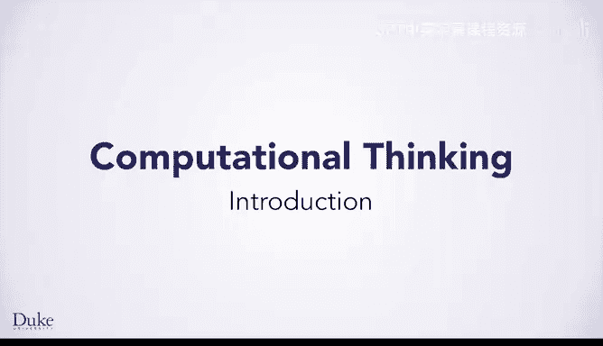
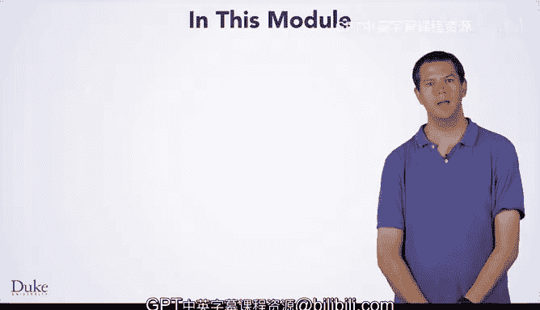

# 杜克大学《Java编程和软件工程基础-1｜Java Programming and Software Engineering Fundamentals》中英字幕 - P14：14_02_01_引言_1.zh_en - GPT中英字幕课程资源 - BV1gM4m117nk

So far， you've been looking at making web pagess Now we're going to switch gears for a while and start learning about computational thinking。

 the type of thinking that enables you to write computer programs。

 you'll be programming in ja so that eventually you can use your programs to enhance your web pages in this module。

 you'll learn some basic programming concepts and ja syntaxs。

 a process for designing algorithms or solutions to programming problems and how to work with some image processing libraries we've developed for this course。

So why are you learning programming， what can you do with it？

Programming is great for solving problems that have a lot of computation or repetition in them。

 For example， what if you wanted to manipulate the images on your web page。

 Since images are made up of pixels to manipulate the images on your web page。

 You would need to look at all the pixels in them。 If you had an image that was 100 by 100 pixels。

 a relatively small image， you would still need to look at 10000 pixels。 This is hard for humans。

 but easy for computers。 If you tried to look at all 10000 pixels by hand， you might get bored。

 you might make mistakes， and it would definitely take you a long time。

 A computer could finish looking at all 10000 pixels in just a few seconds。😊。

One common application of image processing using programming is using green screens to change the background of an image。

If you take a photo in front of a green screen， you could write a program to change every green pixel in the image so that you replace the green screen with another image。

 This is the example you'll focus on in this module。

 you'll learn our seven step process for solving problems。

 the basics of JavaScript and the programming concepts you'll need to be able to solve the green screen problem and many more。

 Now， let's start by looking at one important idea behind programming that everything is a number。

