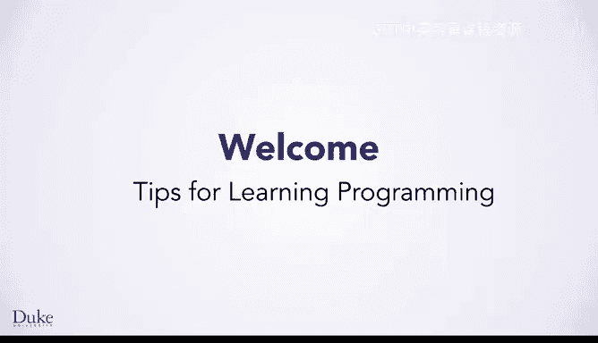

# 杜克大学《Java编程和软件工程基础-1｜Java Programming and Software Engineering Fundamentals》中英字幕 - P2：02_01_03_编程学习技巧.zh_en - GPT中英字幕课程资源 - BV1gM4m117nk

To help you do your best， we want to give you some suggestions about how to learn in the course。

First， do a little each day， it's really hard to learn programming all at once if you do a few course items each day instead of trying to do it all in a day or two。

 you'll remember things better， you'll be more motivated and you'll have more time to work through problems in your code。

Speaking of problems with code， also known as bugs。

 it's normal to make mistakes when you're programming， so our next tip is don't give up。

Everyone gets bugs in their programs。 And part of programming is figuring out what's wrong and how to fix it。

 When you're programming， we really recommend following the seven step process。

 This means you should plan how to solve the problem before you start writing any code。

 The seven step process is important because it gives you a method for solving problems。

 Then when you figured out a solution， you can start writing code。

 Once you're ready to start writing your programs。 Make sure you've read the relevant documentation。

 So you know which other methods exist and how to use them。

 Ref back to the documentation as often as you need to。Next。

 take advantage of the live coding videos and the practice quizzes for the live coding videos。

 this is a great opportunity to program alongside the instructors Finally， for the practice quizzes。

 even though they don't contribute to your final grade。

 there's still a good chance for you to test your code。

 use the practice quizzes to find and fix problems before you move on to the graded quizzes。Finally。

 if you're still having trouble with your programs。

 ask for help from the instructor team and your peers in the course discussion forums。

 part of being a good programmer is knowing how to ask for help effectively。

 we'll talk more about that in the next video。