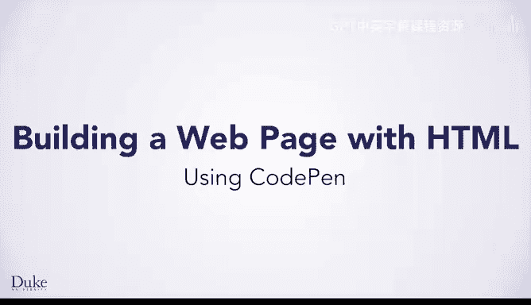
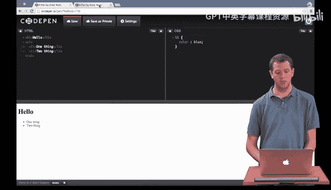
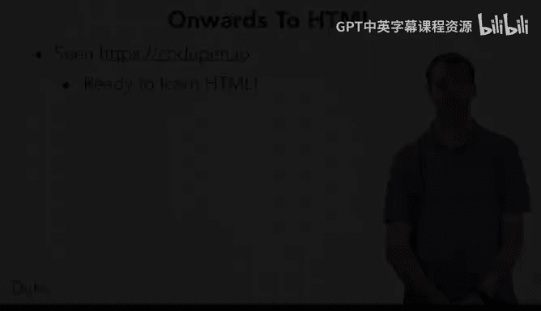

# 杜克大学《Java编程和软件工程基础-1｜Java Programming and Software Engineering Fundamentals》中英字幕 - P4：04_01_01_使用CodePen.zh_en - GPT中英字幕课程资源 - BV1gM4m117nk

Welcome back。 Hopefully， you're excited to start learning how to create your own webpage in HTML。

 Before we dive into those details， we're going to learn about a tool that you can use to do this。

 This will let you follow along with the examples as we go through things and of course。

 explore and create as you want。 You can play around and make your own web pages Try out the concepts that you learn。

😊，There are many possible tools that we could use to make web pages。

 and we're going to use one called codeP。o Let's see how you can use this tool。

I've gone in my browser to codeP。o， which is the tool that you'll be using to create a web page On this first page。

 you can see links to other people's pens， which is what they call projects and you could go explore them if you wanted。

 What we're going to do is go up to the top and click new pin。

 which lets you make your own project so that you can make your own web page。By default。

 there are three frames at the top， we're going to close the one on the right because we're not going to need that one。

 which leaves you with one to make HTML and one to make CSS。

 You're going to learn about HTML shortly and CSS later。If you were to write Hml in。This top frame。

 and you don't have to worry about the fact you haven't learned that yet。 You'll learn it very soon。

You would see as I type it， it shows up in the bottom， formatted as it would on an actual web page。

Now， as you learn later about CSS， you'll be able to use it in this box on the right to change the style and formatting of your web pages you created。

 so here I changed these list items from black text to blue text。

Of course this web page is not very interesting， you can make much more sophisticated web pagess as you'll learn to do shortly。

 which have images and more complicated formatting here's one which has a lot of HTML as well as a lot of CSS and by the end of these next couple modules you'll be able to do this。

To design web pages as you want to。Now that you've seen codeP。o。

 you know how you can create web pages once you know HTML。

Now we're ready to dive in and learn HTML so you can express anything you want in a web page。

