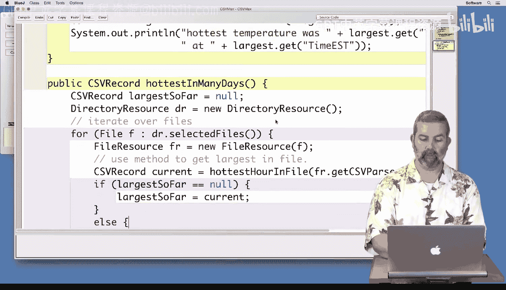
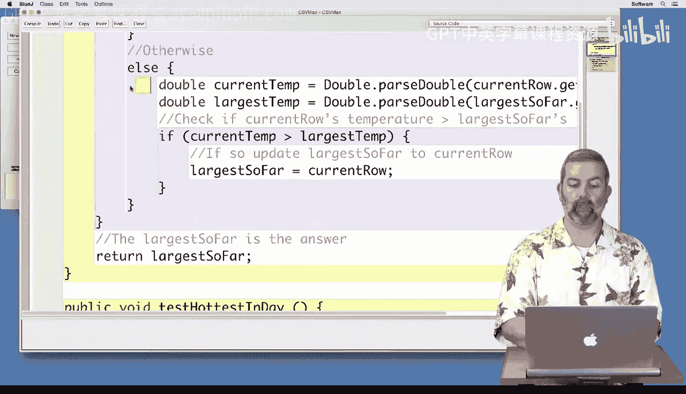
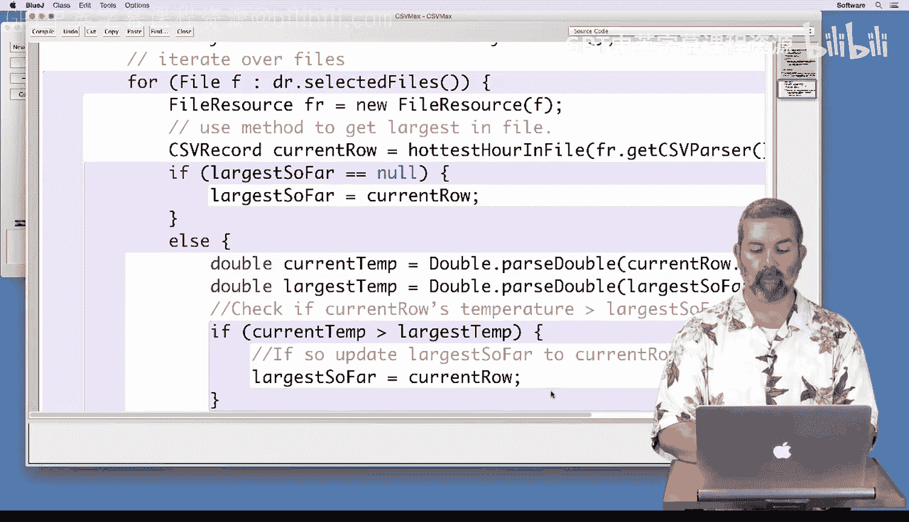
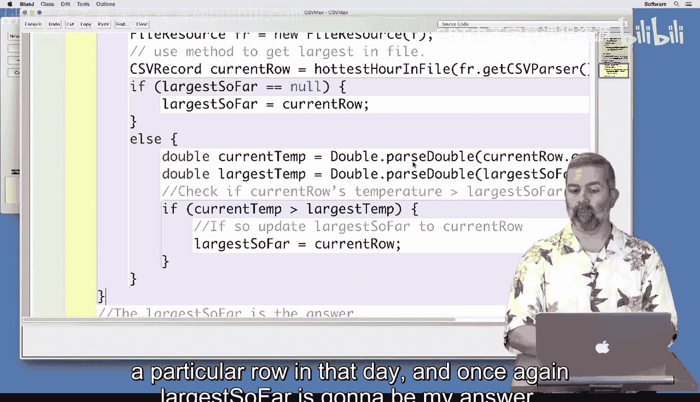
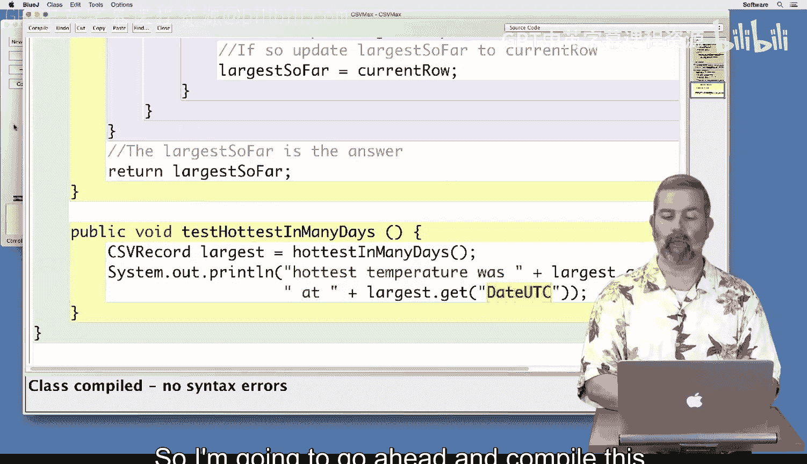
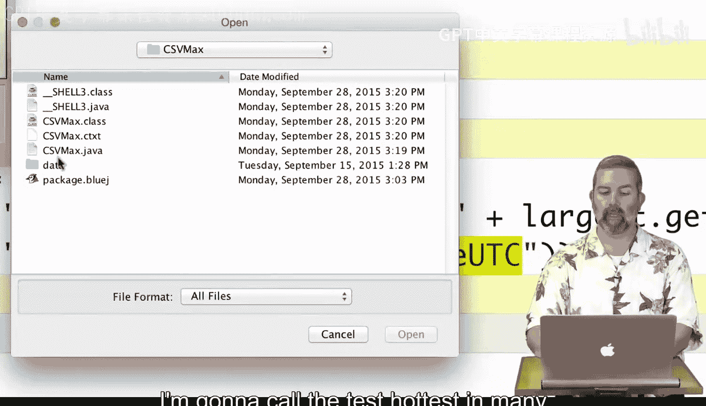
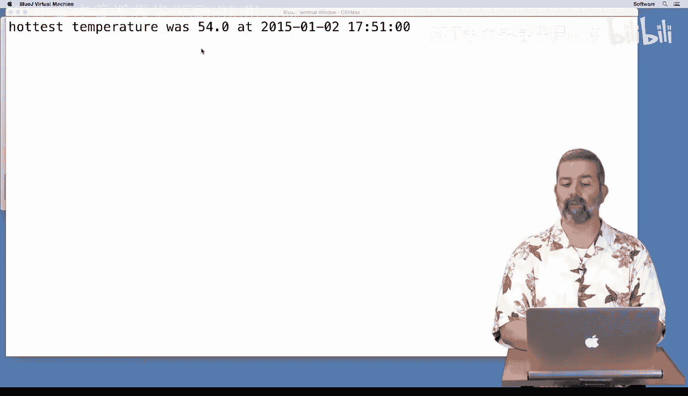
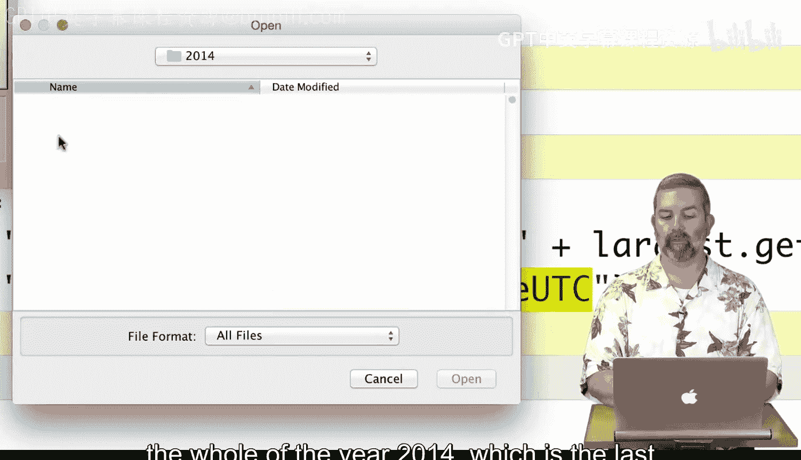
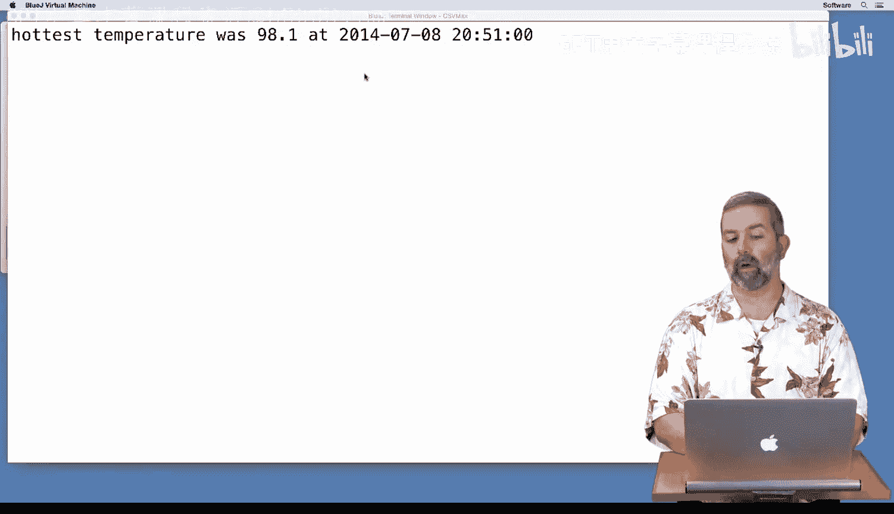

# 杜克大学《Java编程和软件工程基础2-5｜Java Programming and Software Engineering Fundamentals》中英 -BV18U411U729_p55-

Now that we can find the hottest temperature on a single day。

 let's look over a range of days and find the hottest temperature over that range。For this。

 I've created a new method called hottest and many days that we'll use to do this calculation。

And we'll be using a directory resource for this， which will allow us to select any number of files over at once to compare。

As we've done。For many examples， we'll create a。File。

 and that will be what the directory resource returns when we say selected files and we'll iterate over that。

And now that we have that file， we'll use that to create a new file resource。

And now that we have a file resource， we can actually use the we can call the hottest hour and file method that we created earlier with the CSV parter。

 just like we did in our test actually， and so this code right here that we've already got in our test is exactly what we're going to do。

 but now we're going to do it inside of a loop so that we can do it as many times as needed。

But instead of this one being the largest， this one is only going to be the current temperature。

And we're going to have to compare that against the largest so far。

 So just like in the previous example， we're going to have to keep track of what we think is the largest one so far。

So to do that， we will create a CSV。Record。Largest so far， I'll even use the same name。

 and initially， it will be nothing。 So I'll set that to null。And then once I get the the。

 I'm looking through the loop here， I'm going to check to see if the。larrgest。So far。Is empty。

I meaning we haven't assigned it yet， then I will go ahead and。Reassign it。

To the current one that we just got。Otherwise。

I'm going to have to compare the two of them again。And again， since this code is going to be very。

 very similar， I'm actually going to go ahead and literally copy and paste it from my previous implementation。

And I'm getting to get the。Current temp。 I'd call that one current row。 I like current row。

 I'm going to call。This one current row as well again， so that we have a similarity of names。

 And so I'm going to get the current temperature and save that as a double current temp。

 I'm going to get the largest temperature out of largest so far。

 I'm going to compare them if it's greater。 I'm going to go ahead and replace it。

And then I'm going to close my loop。And so now I've iterated over many days。 the main difference is。

 as I've called hottest hour in file instead of calling it for a particular row in that day。

 and once again， largest so far is going to be my answer。

So I'm going to return that at the end。I'm going to compile my code just to make sure that I didn't make any silly mistakes。

And it compiles， so now let's go on to testing。For testing， once again， I've created a test method。

 test hottest in many days。 In this case， I call the hottest in many days method。

 It takes no arguments。 So there's nothing to pass， but it returns to CSV record largest for me to。

Use， I've printed out that the hottest temperature was， and I've also printed out what day was。

 I've changed the field that I get to date UTC from time ET since it could be any day。

 and now I want some extra information。 I want to know what day it actually occurred on。

So I'm going to go ahead and compile this。And come over to the Blue Jay environment。

 I'm going to create a new CSV max object。

I'm going to call the test hottest in many days， and I'm going to go ahead and choose the first two days from 2015 just to test because I've tried those two times before so I know that the hottest day for January 1s was 51。

1 and the hottest for January 2 was 54 so I would expect that the answer is 54 on January 2nd and sure enough that's what my answer is。

Now that I have some confidence that it's working， I'm going to try it on a bigger data set and so now I'm going to test for many days and I'm going to see what it was like for the whole of the year 2014。

 which is the last year for which we have complete data and now I'm going to go ahead and say open。

 and apparently that was 98。1 occurring on July 8th at 1051 pm。

So now I feel somewhat confident that my code is working。

 I tried it on a small example just two days and then I scaled it up to try it on an entire year。

 something that would be very difficult for me to test by myself。

 but that smaller dataset gave me some confidence that my larger dataset set was working correctly。

