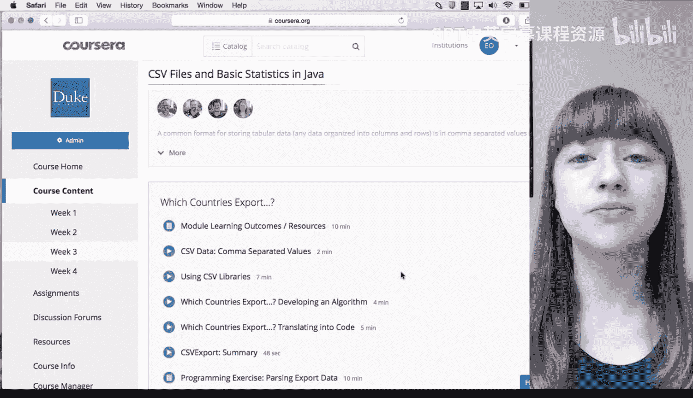
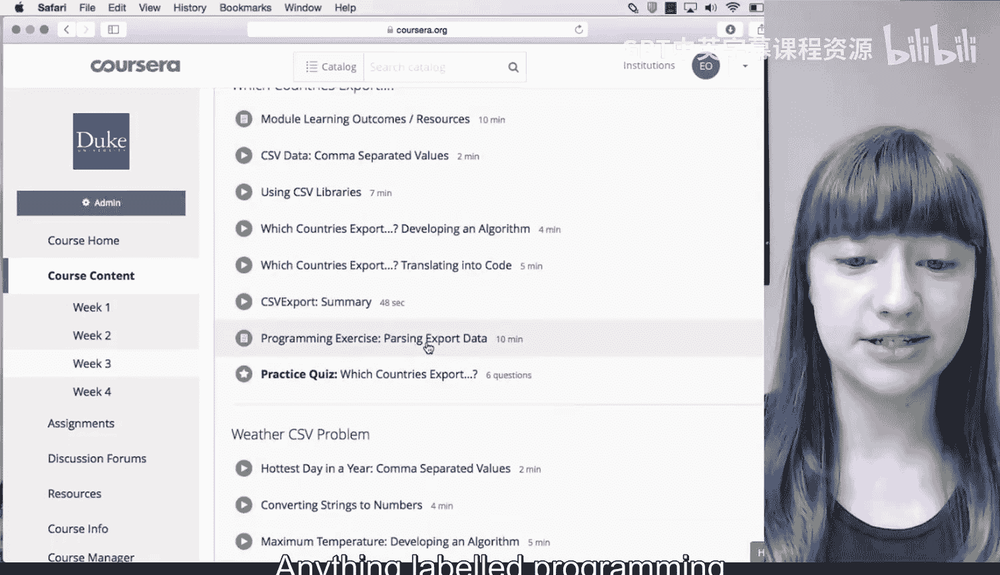
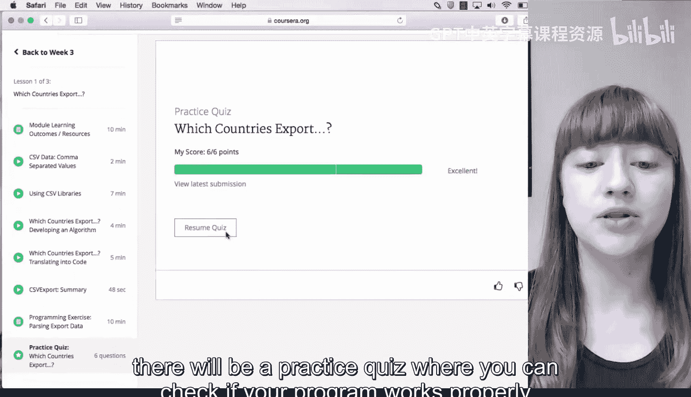
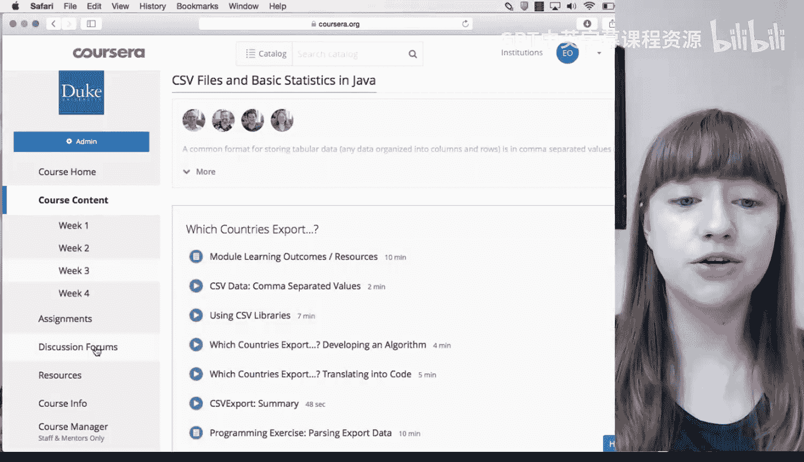
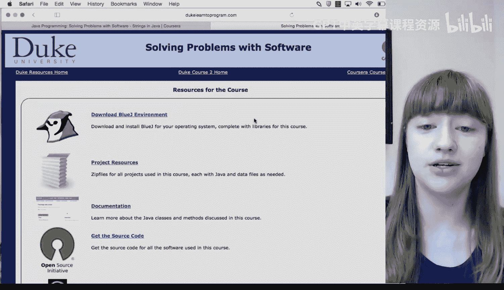
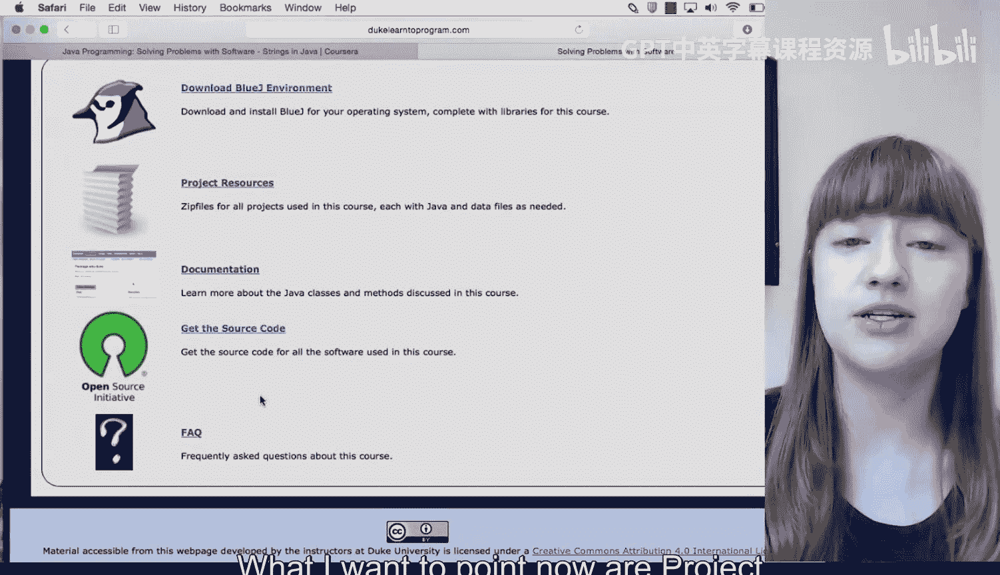
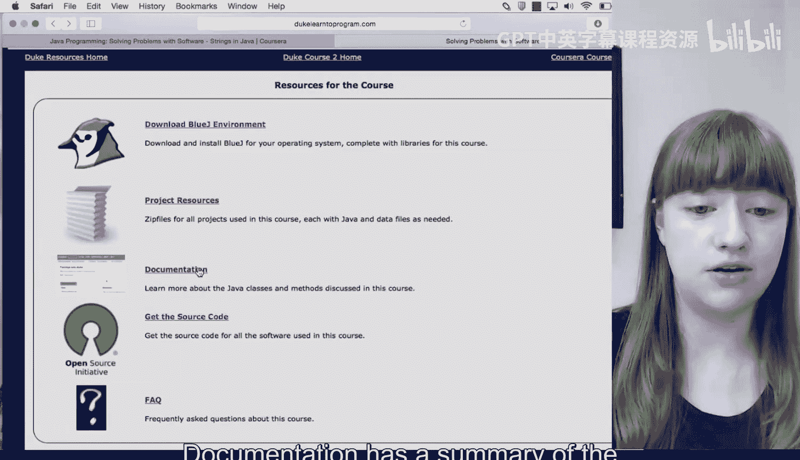

# 杜克大学《Java编程和软件工程基础2-5｜Java Programming and Software Engineering Fundamentals》中英 p02 02_01_04_助您成功的资源.zh_en -BV18U411U729_p2-

Hi， I'm Elizabeth。 I'm part of the instructor team here at Duke University。

 Before you get started with this course， I want to make sure you're aware of some important resources and give you some tips for doing well。

 The assignments in this course will be programming exercises so you'll practice writing code Anything labeled programming exercise here in the course content is an assignment and contains instructions to help you write your own program When you finish writing your code there will be a practice quiz where you can check your program works properly by comparing your results to answers provided by the instructors。

I also want to show you the course site Duke learntoprogram。com。

You can see we have a page for each course and a pager frequently asked questions about the specialization。

This has everything from certificates to the software we use in the course。

If you go back to the homep page and select the course you're working on you'll get to that course's main page。

 so I'm using course two here as an example what I want to point out now are project resources。

 documentation and the Frequ Ask Ques page Project Re is where you can download code to follow along with the video lectures or to begin the assignments。

Documentation has a summary of the Java methods you'll learn in this course。

 This is useful if you forget the name of a method or if you want to find out if there's a Java method to accomplish a particular task。

It's not an exhaustive list of all Java methods， it's just a summary of the most useful ones for this course。

Finally， the frequently asked Que or FAQ page contains questions specific to this course for questions about the specialization as a whole。

 click this link up here。So hopefully this video has given you an idea of how the course is structured and what resources you'll need to know about if you have any feedback about how we can make these resources more useful to you。

 please let us know in the discussion forums on Coursera。

