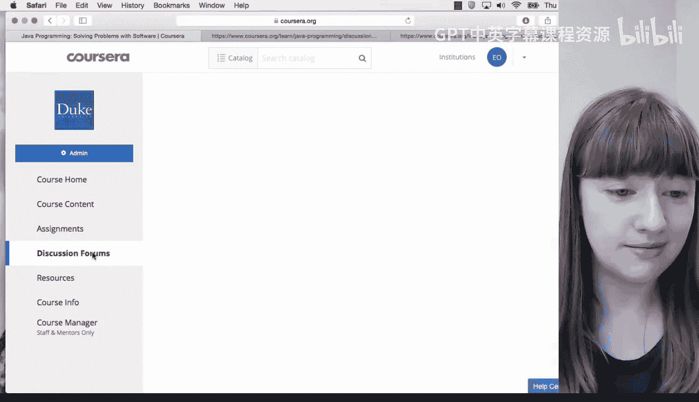
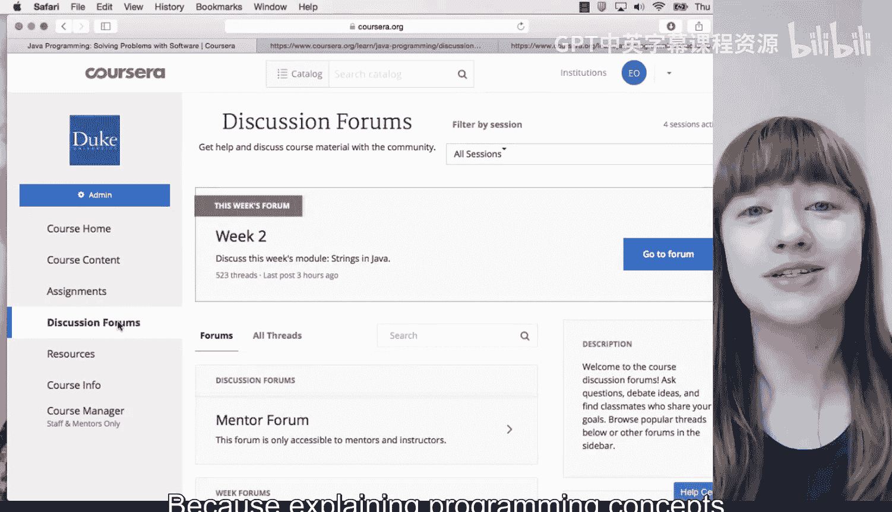
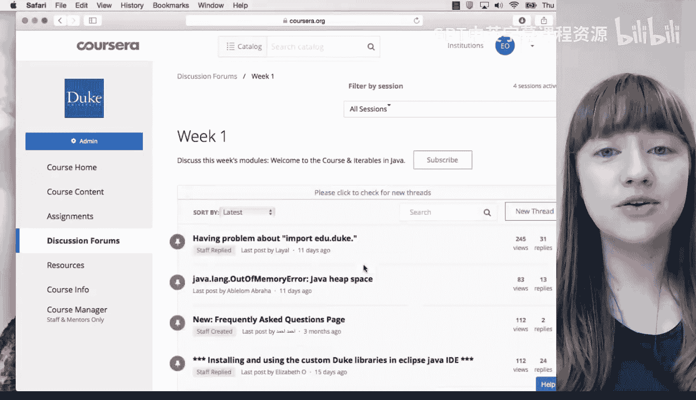
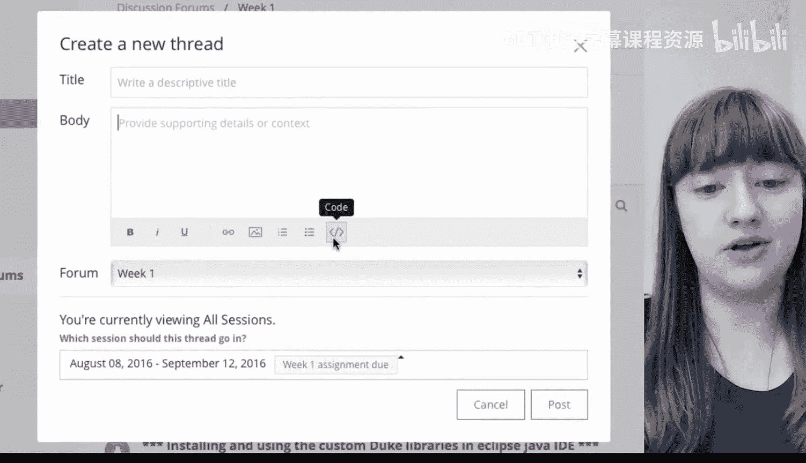
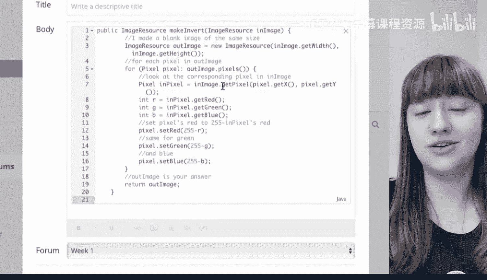
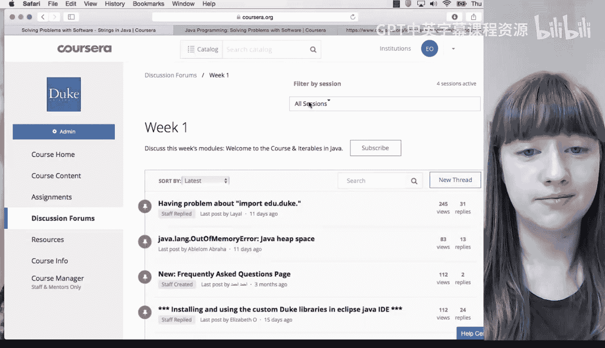
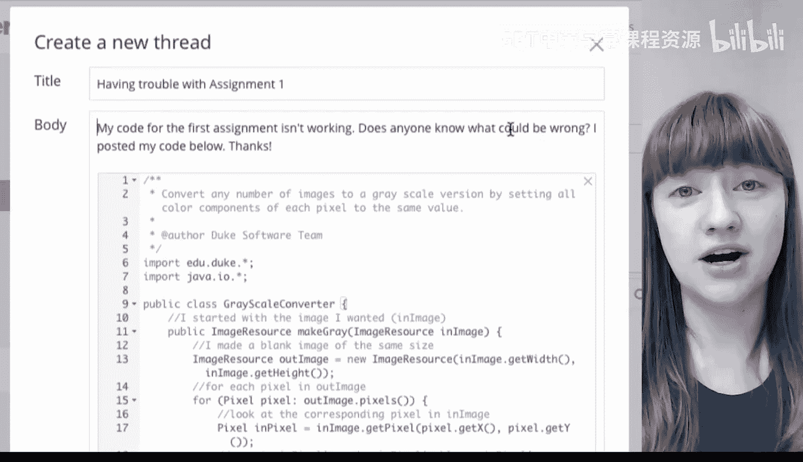

# 杜克大学《Java编程和软件工程基础2-5｜Java Programming and Software Engineering Fundamentals》中英 p04 04_01_06_有效使用论坛求助.zh_en -BV18U411U729_p4-

It's completely normal to struggle with learning programming and when that happens the instructor team and your peers in the courses are here to help the best way to Osra help is through the discussion forums which you can find here。

You can also answer questions in the discussion forums and we really encourage that because explaining programming concepts is a great way for you to learn and you also get to help out one of your classmates。

😊。

Here are some general tips about asking questions in the forums。First before you start a new topic。

 you should check the FAQ pages on Duke learntoprogram。

com and existing form threads to see if your question has already been answered there。

 the first thing you should do when you have a question about a programming assignment or a quiz is check the FAQ page for that course。

Second， start a new thread If you have a new question。

 Don't post your question as a reply to an existing thread unless it's really closely related。

 This way， it's easier for people to see what your question is about and help you more quickly。

 Third， if you need to post code， use the code formatting box。

Which is the one with this symbol on。

This is much easier to read than if you just copy and paste it directly into the post。

We also want to give you some tips on writing a good question so that others can help you most easily。

 If you're having trouble with the programming assignment。

 name and link to the assignment you're working on。 If your program is throwing an exception。

 you can post a screenshot of the error message and also the line of code that it occurs at。

If your program is producing a result that's different from what you expected。

 make sure you say what input you're running your code on。

 the output you expected to get and the output you actually got。 For example。

 suppose I am trying to write a program to change every green pixel in an image to blue。

 I should share the image I am running my program on my input。

 I should explain that I am expecting every green pixel to become blue。 my expected output。

 And I should also explain that every green pixel is actually becoming red。 My actual output。

 Then others in the form can better understand the problem I'm having。

If you have to share some code because others can't help based on the description of what your program is doing。

 it's okay to share a few lines of code， but don't share your whole program。

 figure out which part of your program you think the error is in and share a few lines of that method。

 don't copy and paste your whole program into your post。

If you have a general programming question such as how do I write a For loop or how do I add items to a list。

 it's okay to post those lines of code because they're so general Finally。

 if you have a conceptual question， make sure you name and link to any course materials you refer to。

When you're answering questions， it's okay to share code for general programming concepts such as how do I write a for loop。

 however， if someone is having a problem in their code， don't give them the solution。

 try to guide them towards fixing their code themselves by giving hints。

If you don't know what the problem is， suggest what they might do next to debug their code。

Let's look at some example posts。

In this post， I didn't really ask for help very well。 I said my code wasn't working。

 and I asked if anyone knew what might be wrong， but I didn't really explain what the code is trying to do。

 what it's actually doing or what troubleshooting I had tried so far。 I also posted a lot of code。

 So I edited my post， and now it's much better。 You can see that I explained which assignment I'm working on。

 and I provided a link to it。

I also explained what happens when I run my program。

 so my actual output and what should have happened when I run it， so my expected output。Finally。

 I only posted a few lines of code that I thought the problem was in。

Now that you've learned how to ask and answer questions about your code。

 you're ready to start learning how to program， I hope you enjoy the course and I look forward to interacting with you all in the forums。

 good luck。