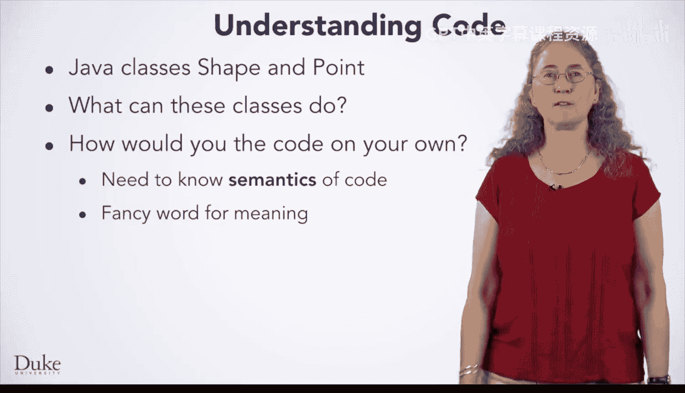

# 杜克大学《Java编程和软件工程基础2-5｜Java Programming and Software Engineering Fundamentals》中英 p09 09_02_04_为什么需要语义：阅读代码的动机.zh_en -BV18U411U729_p9-

Okay， you will be using the Java classes shape and point。

 But what will you be able to do with these classes？ Well， in some ways， you know the answer to that。

 you will be able to draw shapes or calculated shapes perimeter。

 But just knowing what a Java class or script can do does not mean you understand it。

 So the question we are going to answer now is， how would you understand what this code does by yourself。

 That is， what are the semantics or meaning of each part of the code。

 understandingstanding the precise meaning of code is important because you can't write code without saying precisely what you mean。

When we talk about understanding the semantics of code， what exactly do we mean？We mean。

 how would you execute the code by hand with nothing but pencil and paper。

 This skill is very important for a couple of reasons。 First。

 it's how you understand code well enough to write what you mean。 Second。

 when your code does not behave as you expect， How do you figure out what is going wrong。

 you need to understand what it does。 And this gives you the skills to do that。

