# 杜克大学《Java编程和软件工程基础2-5｜Java Programming and Software Engineering Fundamentals》中英 p100 34_03_07_HashMap用于灵活设计.zh_en -BV18U411U729_p100-

In this lesson， we'll look at how we can use the hashmap class to make our Gladlib class easier to extend。

 have fewer lines of code， and be a good example of how to become a more skilled and experienced software designer。

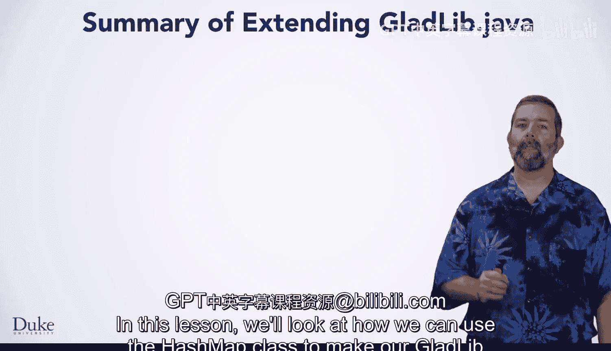

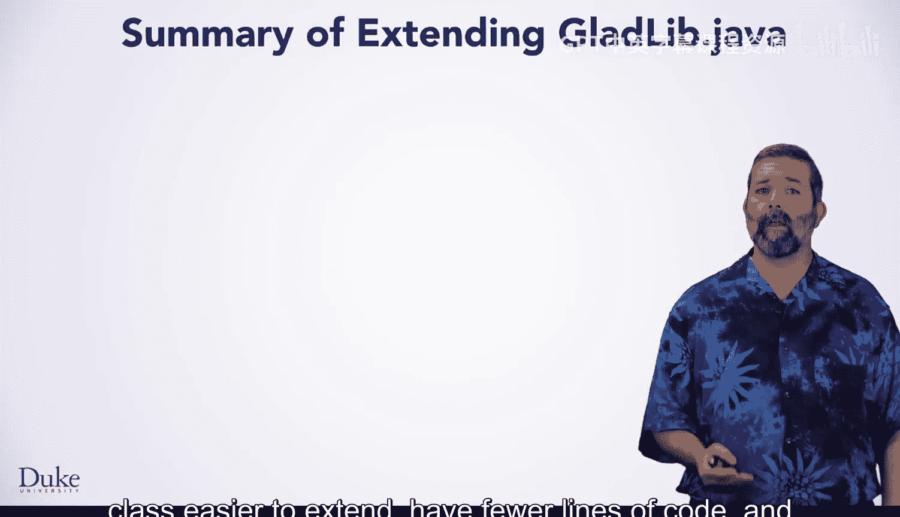

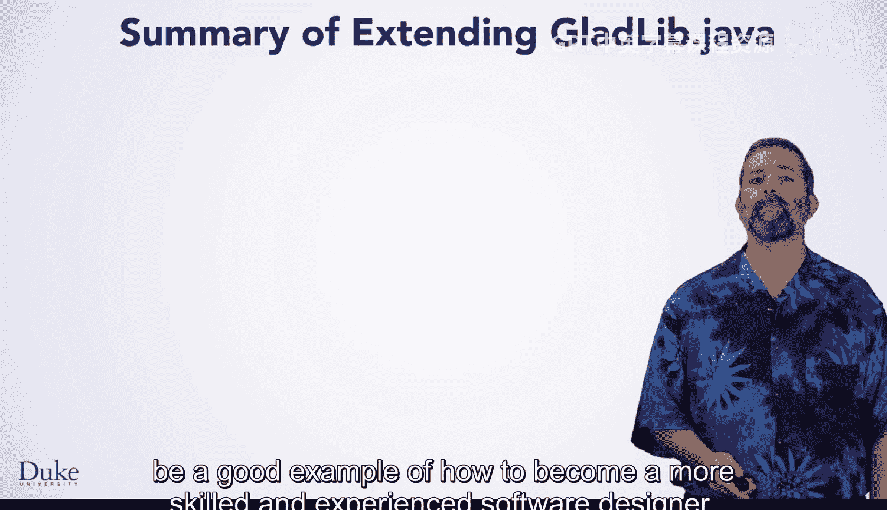

As a reminder， extending the class to use a new label like angle bracket verb angle bracket requires modifying the code in three places。

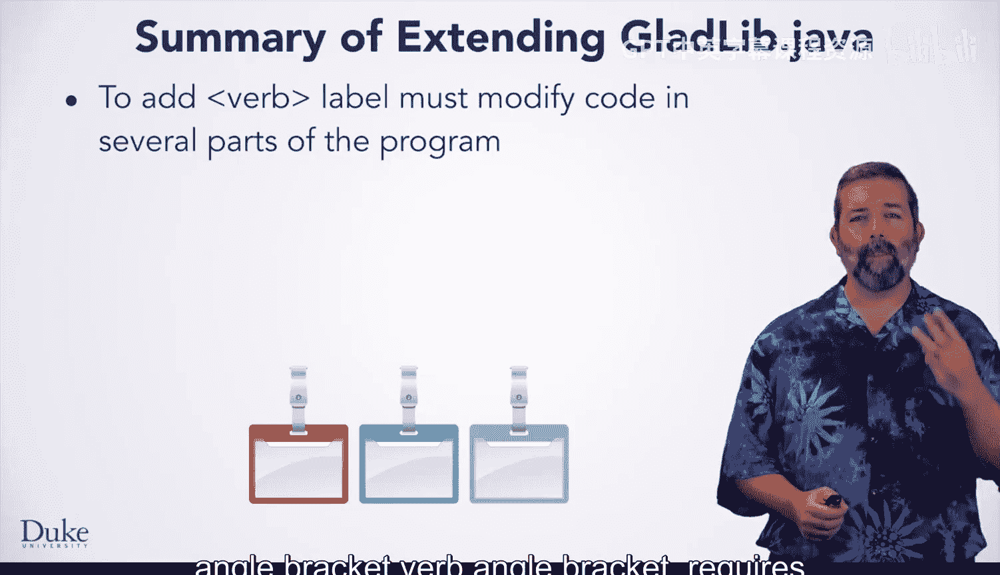

You'll need to create an array list instance variable， initialize it properly。

 and use it as the source for your random replacements。

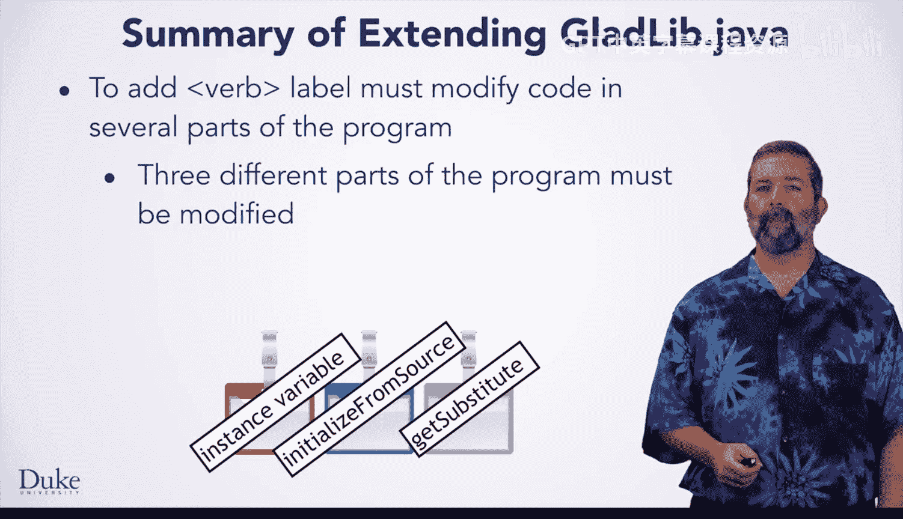

You should also follow a convention of using field names like verb list for the label verb。

This makes it difficult to use text files or URLs for the source of word replacements。

 unless all such sources follow the same conventions。

 such as using a file name noun do TXT for the label noun or the field noun list。

 or colored doTXT for color list and the field color。

Let's take a look at the concepts behind these requirements for extending the GlaDlibB class to look at a new way of structuring data in classes。

Each label is associated with an array list instance variable。

You see the label noun associated with noun list， the label color with color list， and so on。

These named instanceense variables make for a poor design。

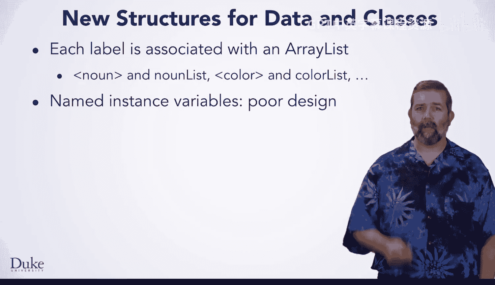

Adding a new label like verb requires defining an instance variable by name。

 initializing it by name and using it by name。 That's three places in which the program must be modified。

 Instead， willll use a hash map to help create a better and more flexible design。

 The hash map will allow us to label or align the label to an array list without ever having to name the array list itself。

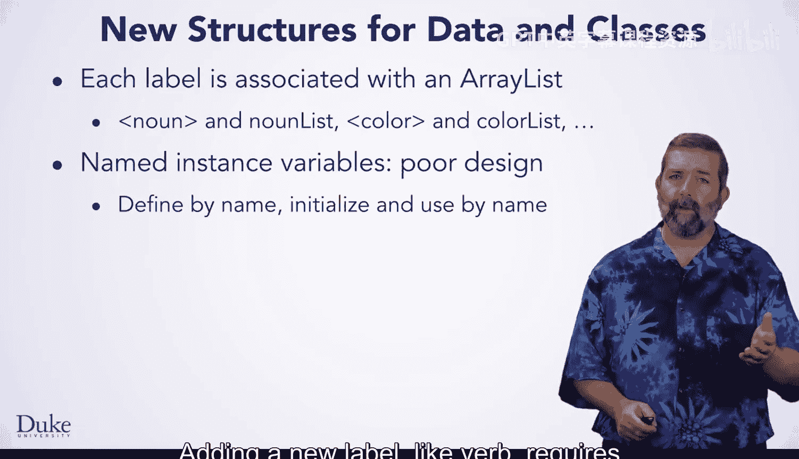

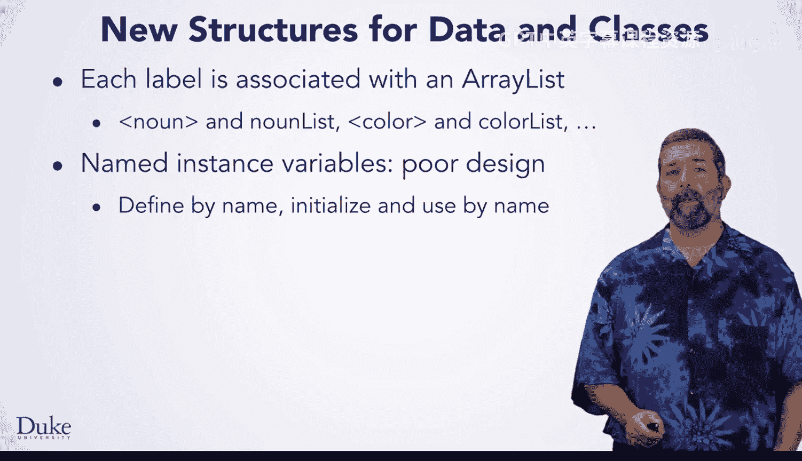

Given a label， the code will look up or find the associated array list in the hashmap structure。

As you've seen， this is similar to how index of works for finding a value in an array list or a character in a string。

 Getting the value associated with a label will return an array list。

Let's take a closer look at how using a hash mapap creates a more flexible design。

One hash mapap will replace seven or more instanceense variables。

 the hash map will reference as many arrays as needed。

 rather than us having to define separate instanceense variables and following a aiming convention as you see here。

The code will use a single instance variable。A hash map named My map。

 This will associate an array list with each label。So the keys in the map are strings。

 the label in the Gladlib program。The value associated with each key is the array list of replacement words for that label。

This means that to add a new label and a new array list。

 we don't have to add a new instance variable。 we simply need to store new values in the single hash map instance named My map。

Let's look at how the method get substitute works with a hash mapap。

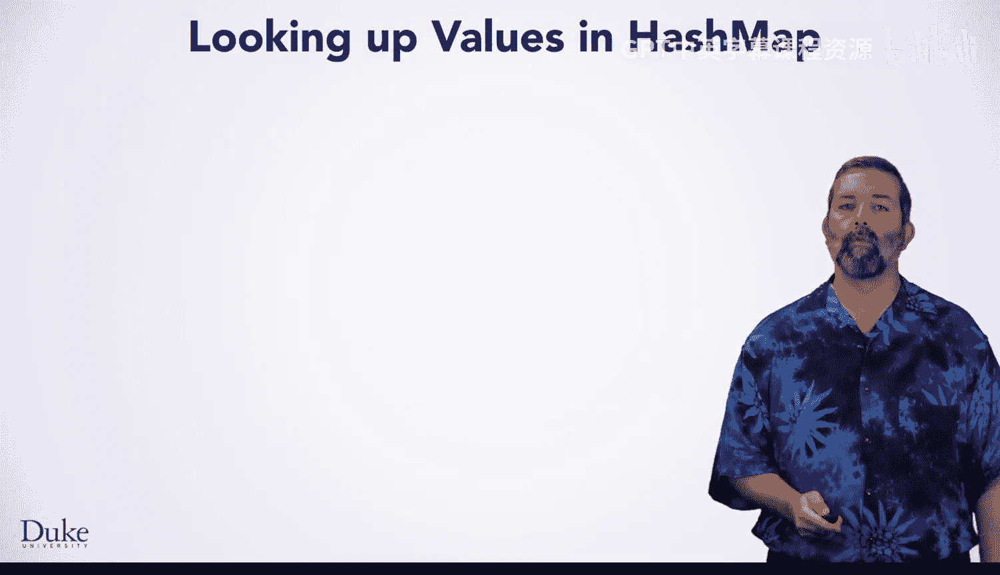

In the original program， a sequence of if statements was used to identify the instanceense variable associated with a particular label。

 The naming convention of using country list for country allows a programmer to extend the code。

 but there will always be as many if statements in the get substitute method as there are labels and inense variables。

The last if statement is different。 You can see that the label angle bracket number。

 angle bracket generates a random number instead of finding one in a list of numbers。

When using a hash map， the Get substitute method is much more simple。

 The hash map associates a label with the array list of replacements。

The array list for a label is accessed using the hashmap dot get method to get the array list associated with a string label like country or noun or color。

Adding a new label doesn't require modifying this method at all。

 And that's an example of the open close principle we talked about in a previous video usingsing a hash map makes for a more flexible class that's easier to extend。

 but there's room for even more improvements using hash maps again。

The original program reads a file or URL to store information in each named instance variable。

 the array list of replacement values for that label。

That was done in a sequence of statements that call the helper method， read it。

The hashm version still associates a label with a file name。

And that file name must be specified in the program。

 but the code is different because we use a loop to associate each label with a file name。

 This wasn't possible in the original program。Note the private helper method read it is still called。

What changes if we want to add a new label like verb。

 the program will still associate the name of the file of replacement values。

In verb dot text with the new label。We could store a new string， like verb。

 in the local string array of variable labels。 We could add that just after the string time frame。

 for example， Unfortunately， we still have the limitation in that the codes uses a naming convention for files like verb dot text for the label verb。

We could use a hash map in a different way to associate file names with labels without modifying the program。

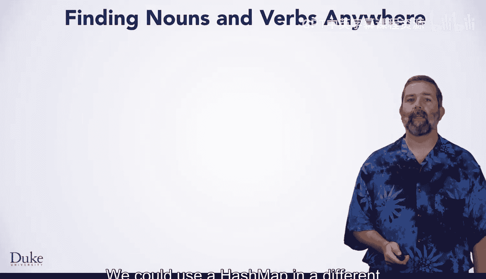

The program could be designed to read a file of information that specifies where to find the words to replace the labels。

 rather than requiring the code to be modified， compiled， tested。

 and run to simply find nouns in a different file or website。

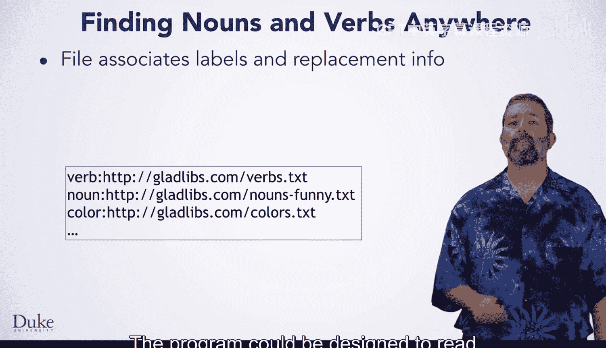

This kind of file is often called a dot Pro or property file。As shown here。

 it simply associates a label with a source of replacements for that label。

The convention of using a colon to separate values in a dot properties file is common。

 but equals could also separate the values。 The dot properties file can be read using a file resource object。

 for example， and the information in the properties file stored in a hash map。

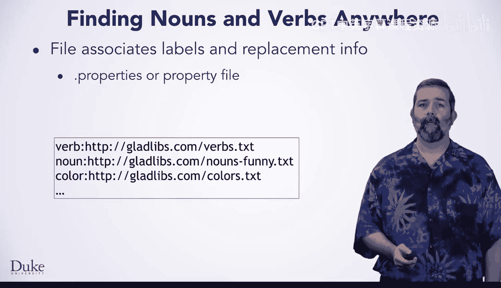

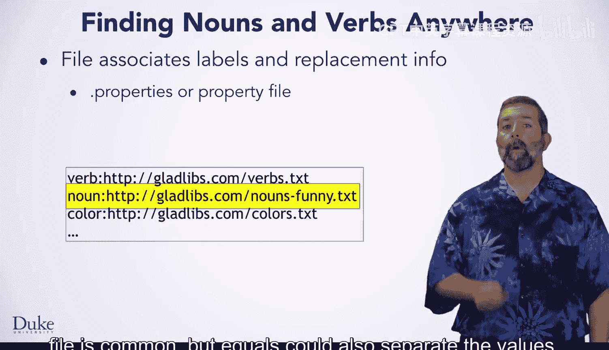

Suppose a hash map instance variable named My label source is used to associate labels like noun with a source of words that are noun replacements like Gladlibs dot com slash nounsfuny dot T X T。

The method initialized from source would simply loop over the values stored as keys in the hash mapap。

 recall the keys are accessed via the method key set。

The string that specifies the source for each label is retrieved from from the map using the dot get method。

 The source is used to read values into the array list for the label。

You could add such a feature to the GlaDlibB program to make it even more extensible。

