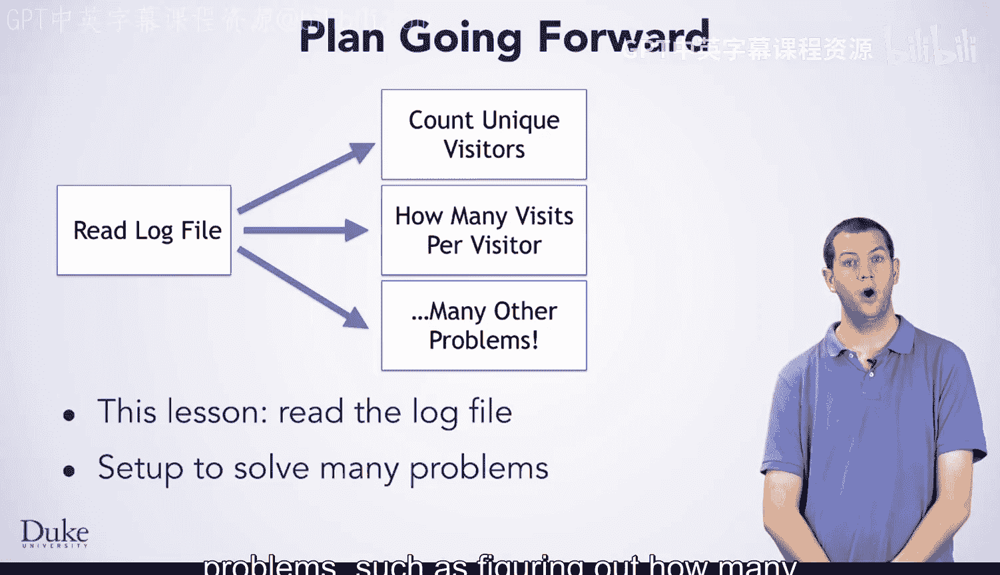

# 杜克大学《Java编程和软件工程基础2-5｜Java Programming and Software Engineering Fundamentals》中英 p102 36_04_02_简介_2.zh_en -BV18U411U729_p102-

Now， you are going to write some programs to analyze web server log files。

 Most major web servers log each access to a file which records who made their request。

 when the request was made， what their request was and how the server responded。

 So why would you want to analyze Web server logs。 A web server's log file lets you understand a lot about how your website is being used。

 You might want to know how many people are visiting your site， Is it popular or not。

If you have many different pages， are they all getting traffic or only a few。

Understanding how your site is being used is particularly important If you are trying to make money off of it。

 Popular pages bring in revenue， While pages that nobody looks at are not helping your business。

The log file can also be useful in diagnosing problems。

 as it will tell you when your server is experiencing errors。

If one of the pages isn't getting traffic because a link to it is broken。

 you want to know so you can fix it In the rest of this lesson。

 you' are going to work on code to read the contents of a log file。

 Being able to read the contents of a log file will set you up to solve a variety of problems。

 such as figuring out how many different visitors have come to a website or how many times each visitor has visited the site。

