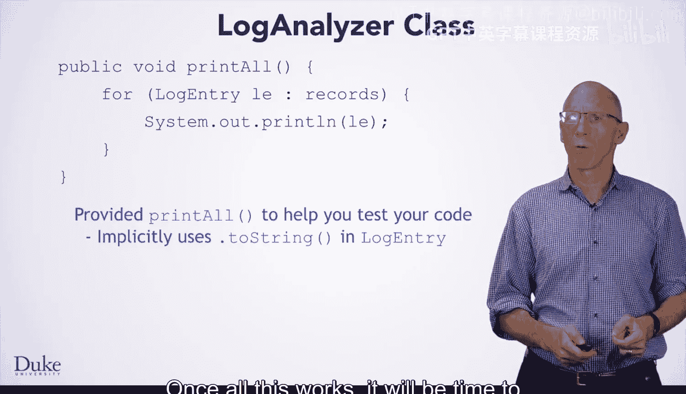
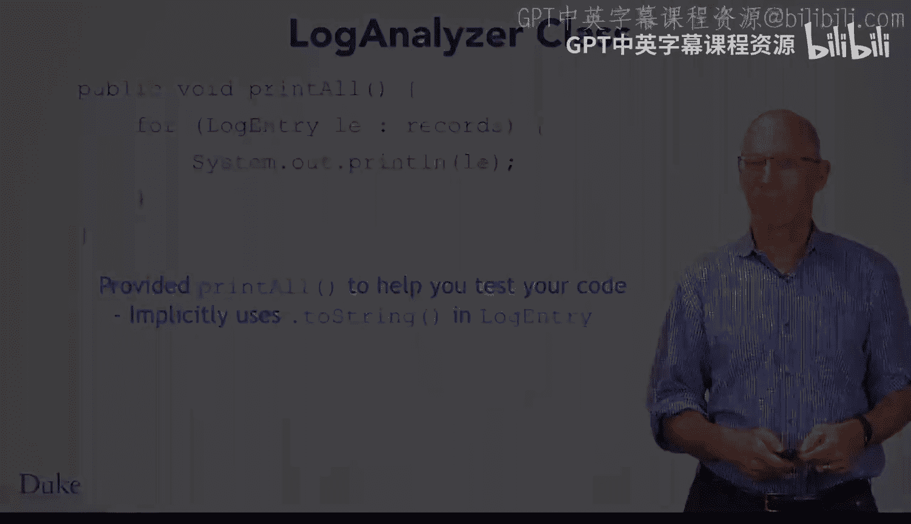

# 杜克大学《Java编程和软件工程基础2-5｜Java Programming and Software Engineering Fundamentals》中英 p105 39_04_05_解析日志文件.zh_en -BV18U411U729_p105-

Hi， now that you've made your log entry class。 you need to parse the lines of the Web server log to be able to create instances of the log entry class。

 You'll do this by splitting the string into the appropriate fields。

 to pass values to the constructor for the log entry class。

 you could accomplish this task with many index of and substr calls。

 Although this task is not algorithmically hard， the code for its very cumbersome。 For example。

 for the time portion of the entry， you would need to turn the string into a date object the built in Java class from the Java do ule package。

 which represents a date and time， even though both the date and time class。

 as well as methods which parse strings are part of Java， the interface to the date class is complex。

 especially since the date format in the server logs， is not the default format in Java。

 for these reasons we've provided code for you， which will take a string from the web server logs。

 parse it into appropriate field。And return a log entry record to use this call weblog parser。

 parse entry and pass the string you want to parse。 the method returns a log entry object。

With that in mind， it's time to turn your attention to starting to write the log analyzer class for right now。

 you're going to write code in the constructor to initialize the object and then write the read file method In later lessons。

 you'll write additional methods that will perform the actual analysis of the log file that you've read in。

The first thing you would do to fill in the code for the constructor。

 the constructor should initialize the record fields to an empty array list。

 you've created array lists in the past， so what you need to accomplish this task should be familiar。

The second thing you should do is fill in code for the read file method。

This method will determine the file name to read from， and then add。

Log entries to the records field to reflect the information from the file you opened。

To accomplish this task， you will want to make a file resource for the requested file。

You will then want to iterate over the file resources lines， and for each line。

 you will use the Weblog parser。 parse entry method to convert the line of text into a log entry。

Then you'll add that log entry to the records field， which as you may recall， is an array list。

When you've written a constructor and the read file method， you'll want to test out your code。

 We've provided a convenient method called printall。

 which will print all the log entries you've stored in the instance variable records。

 Remember the two stringing method that we taught about system that out that Prilin will make use of that two stringing method to represent the log entry as a string。

😡，Once all this works， it will be time to start analyzing the data you've read in， happy coding。

