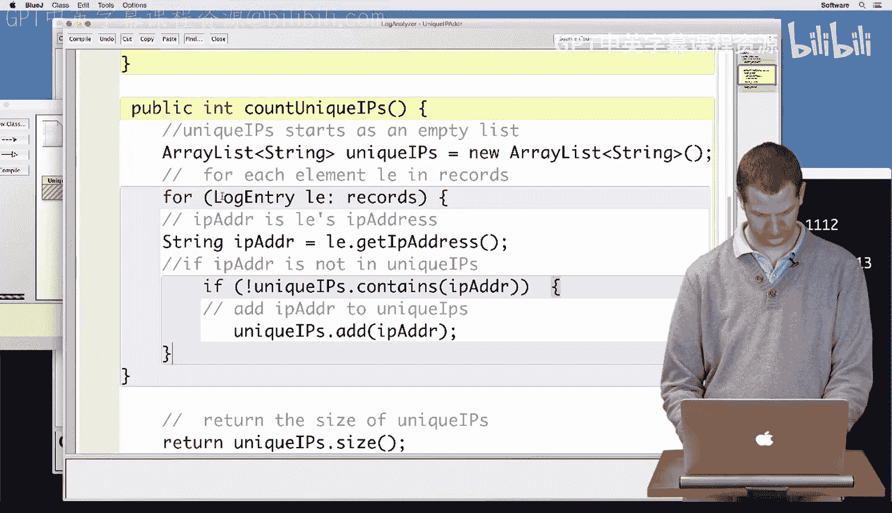
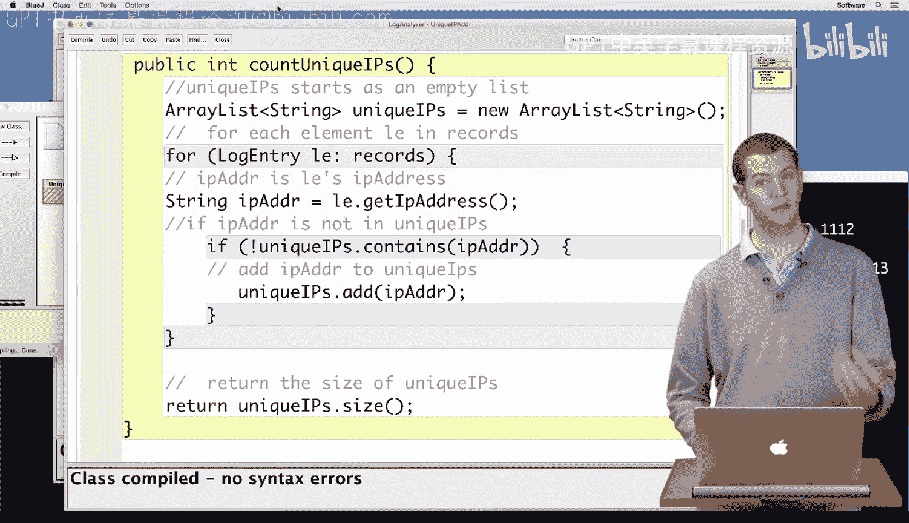
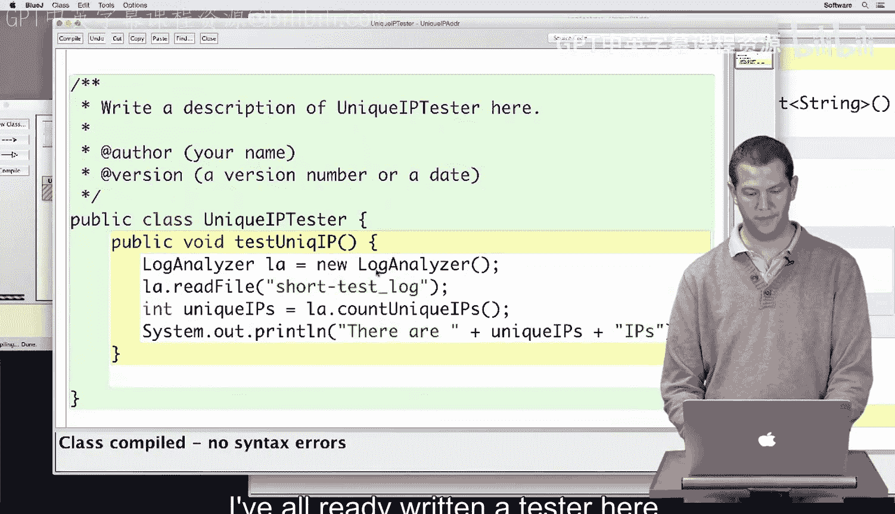
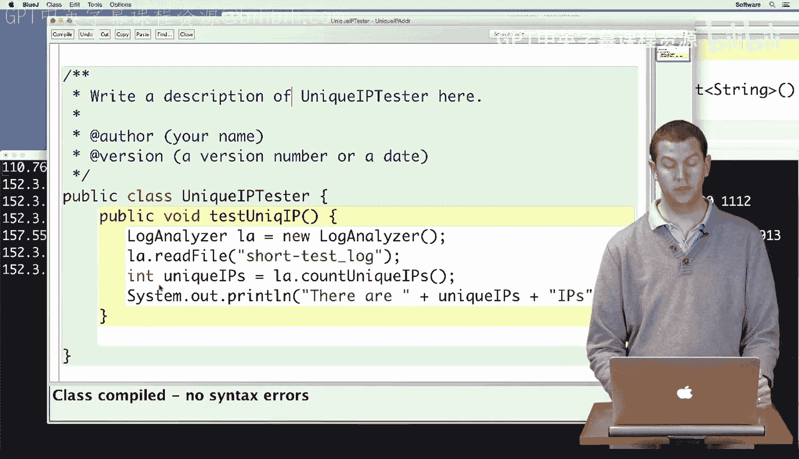
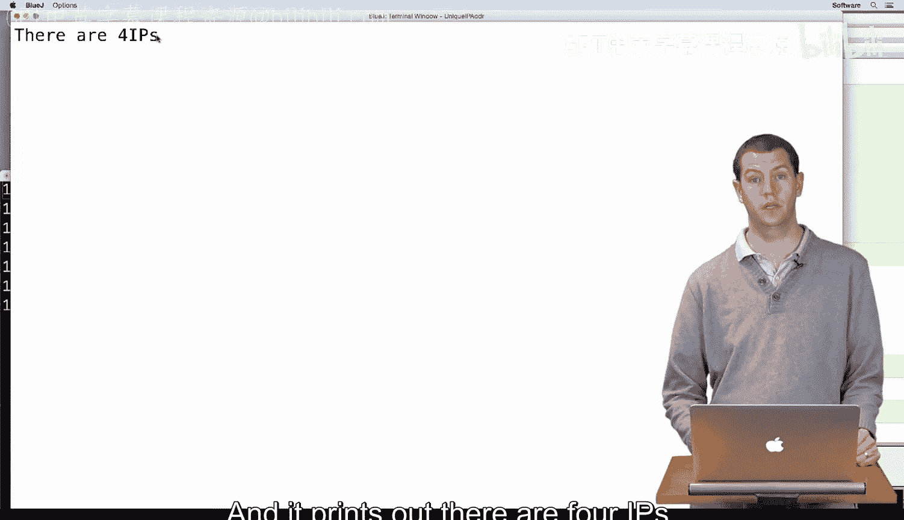

# 杜克大学《Java编程和软件工程基础2-5｜Java Programming and Software Engineering Fundamentals》中英 p109 43_04_03_代码转换_1.zh_en -BV18U411U729_p109-

Al right， now you've devised the algorithm to count the unique IP addresses in a web server log。

 so it's time to turn it into code。As usual， we have here the outline of this method with the pseudocode that you've just developed。

 The first thing we want to do is make unique Is， which starts as an empty list。

 So we're going to have an array list of strings。And we're going to call it unique Is。

 and it's going to be a new empty array list。Now we want to do something for each element。

 which we'll call L in our records， so as you are familiar with by now。

 this is a for each style for loop。Each of these is going to be a log entry。

And remember that records， even though we don't have a records variable in here。Is。

An instance variable。In our class。So we're going to take each log entry in records。

And then we're going to get the IP address out of it。

And then we want to know if IP address is or is not in unique Is。 So we're going to say if。

Unique I Ps。Dot contains。IP address。But we want not that that is the opposites that we're going to put。

A not in front。Then we want to add IP address to unique Is， unique Is。D， and。I P address。Close that。

Close that。And then at the end here， it says we want to return。Unique。I Ps dot size。 Now。

 my braces have ended up in slightly weird places。 That's probably just because I have some braces in my comments。

 So I'm going to delete those。And then try to make sure my code lines up nicely。

Okay。So now I'm going to hit compile。So says class compiled， no syntax errors。

 of course we want to test this， I've already written a tester here which is going to create a new log analyzer。

 read in short test log， which is this log file here。

 It has this IP address this same IP address appears three times so we've only seen two unique IP addresses we have a third and we have a fourth All right then it uses the log analyzers count unique I to count the unique I like we just did and then it prints out how many there are。

So I'm going to go over here to blue J。I am going to。Make a new， unique I tester。

And I'm going to run test unique Is。And it prints out there are four Is。

 which is the result that we expected。 So we're more confident that our code is correct。

