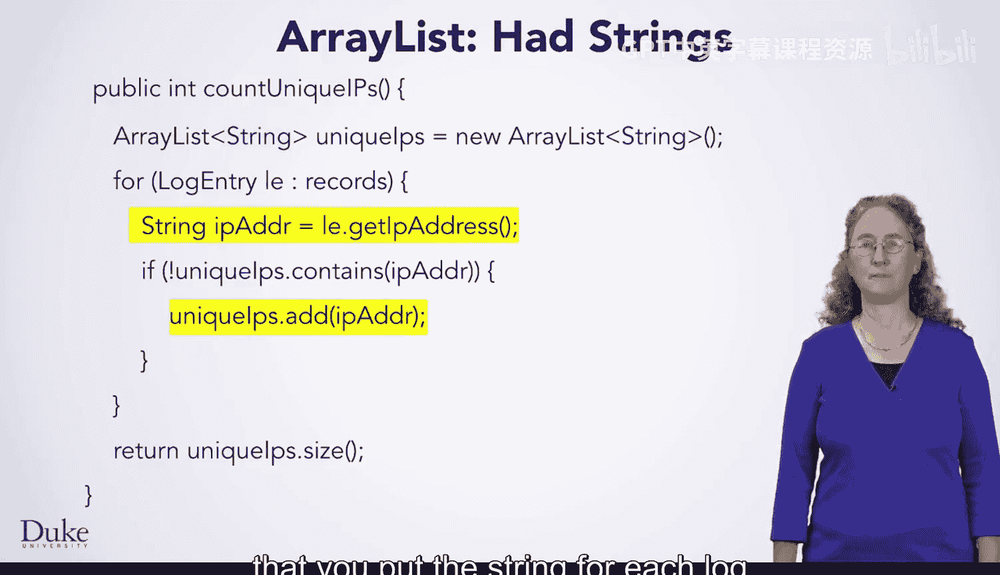
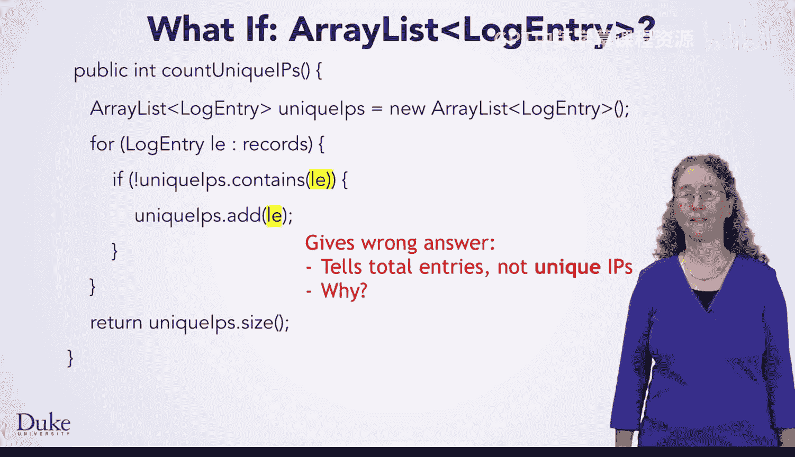
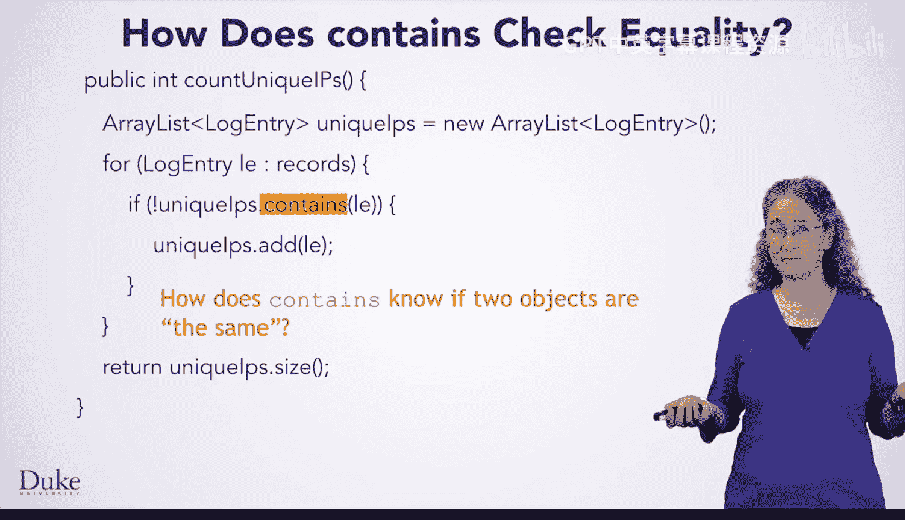
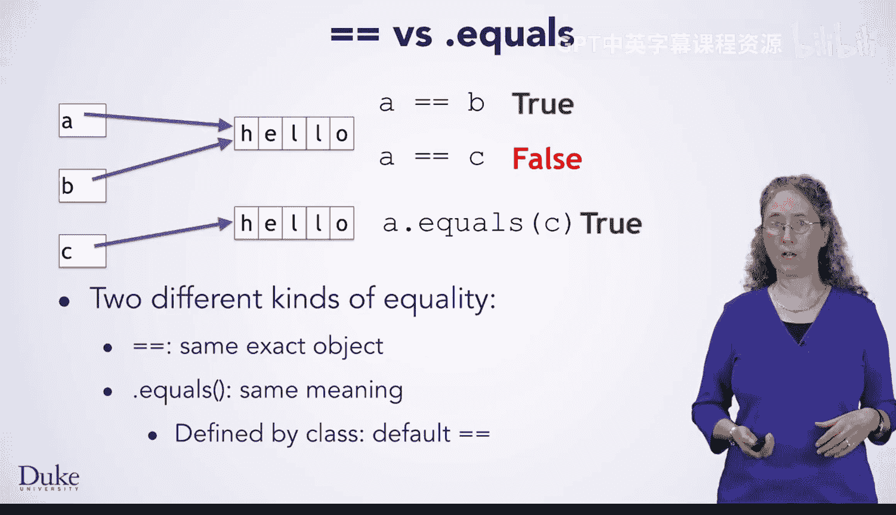
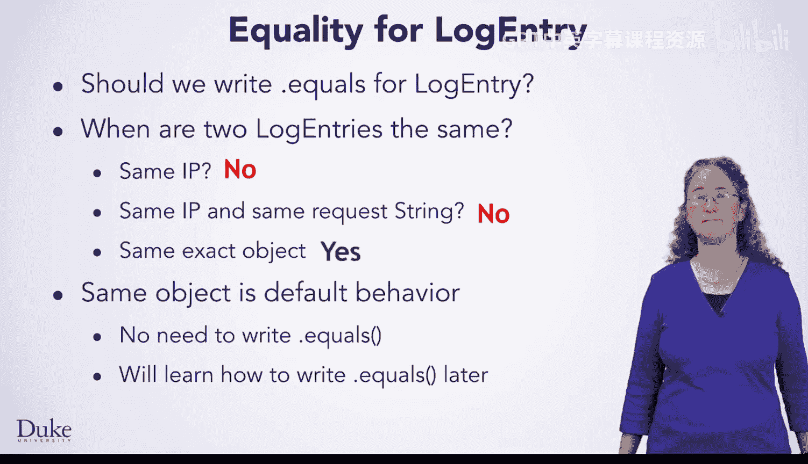
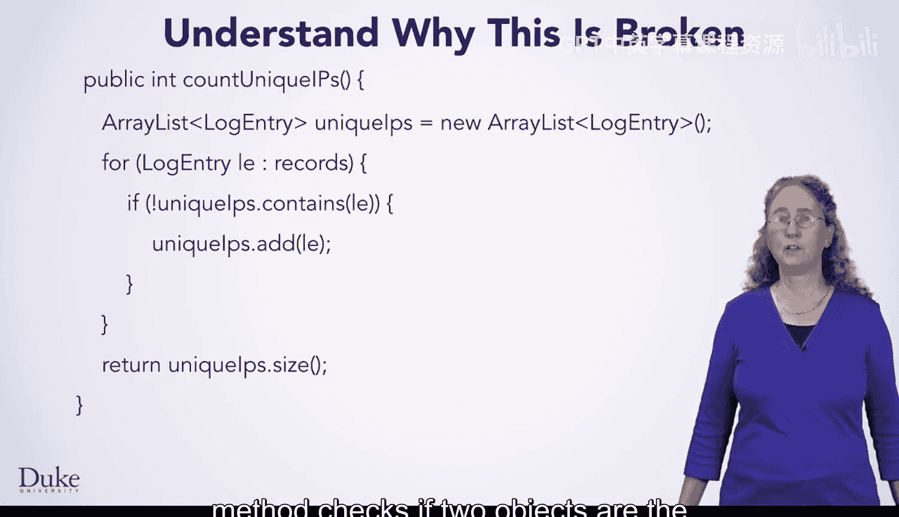
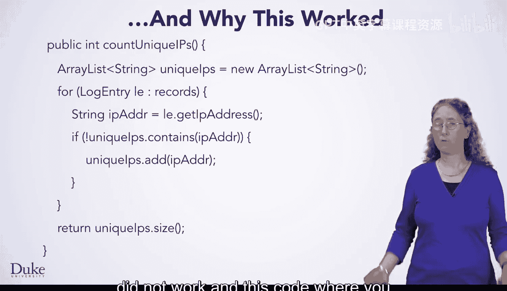

# 杜克大学《Java编程和软件工程基础2-5｜Java Programming and Software Engineering Fundamentals》中英 p110 44_04_04_相等性.zh_en -BV18U411U729_p110-

Now that you have written code to find the unique I P addresses in a web server log。

 let us take a brief look at something very close that would not have worked。

Here is the code that you just wrote for the unique IP addresses problem。

Remember that you have an array list of strings and that you put the string for each log entry's IP address into that array list。

But what if you had written this code instead。This code is the same as what you wrote。

But the array list holds log entries， and the code checks if it has the current log entry。

 not the log entry's I P address。 Likewise， it adds the entire log entry object if it was not already there。

If you were to run this code， it would give you the wrong answer。 In fact。

 it would tell you how many total log entries there are。

Not how many unique I P addresses there are in the log file。Why is that？

To understand this problem， think for a moment about how containss would work。 in particular。

 how does containss know if two objects are the same or different。

Contains is going to check if they are equal。 What exactly do we mean by equal？

Java has two different notions of equality to illustrate this。

 consider the situation in which you have three string variables， A， B and C。

 which refer to two different string objects。 A and B refer to the exact same string object。

 so they are clearly equal。A and C， however， refer to different string objects with the same logical contents。

On the one hand， you can say they are equal because they talk about strings that mean the same thing。

On the other， you could say they are not because they are talking about different objects。

These are the two different notions of equality that exist in Java。The notion of equality。

 meaning the exact same object is what you get when you write equals equals。If you write a equals。

Equals B， then Java checks if A And B refer to the exact same object。Since they do。

 this expression evaluates the true。However， if you write A equals equals C。

 then Java again checks if A and C refer to the exact same object， but because they do not。

 this expression evaluates thes。The other notion of equality。

 do they mean the same thing is done with the dot equals method？If you wrote a dot equal C。

 then Java would call the dot equals method in the string class。

 which checks if the two strings have the same sequence of characters。

Because these two strings have the same sequence of characters， A dot equals C。

Would evaluate to truth？So how does Java know whether two objects have the same logical meaning？

Each class defines dot equals to specify what it means for objects of that type to be the same。

If you do not write one explicitly， the default behavior will be to have the dot equals method check if the two objects are equals equals to each other。

That is， if they are the exact same object。So now that you know about equals equals and dot equals。

 should you write a dot equals method for log entry？Well。

 the first thing you should do is think about when two log entries are logically the same。

What about if they have the same I P address， While that would fix the broken code for this particular problem。

 It's not a good approach in general。 It does not actually match with the notion of two log entries。

 meaning the same thing。Two different requests are not the same。

 even if they came from the same computer。So what if you checked more information。

 what if you checked for the same IP address and the same request string？

Even this would not really mean the two log entries are the same。

As the same computer could ask for the same page many times。For log entries。

 it makes sense to just say that they are logically the same only if they are in fact the exact same object。

Because the behavior you want is the default for dot equals。 you do not need to explicitly write it。

Since you do not need to write a ID equals method for this class。

 we're not going to delve into how to do it yet。Fully understanding what goes into a dot equals method requires a little bit of knowledge that you will not get until the principles of software design course。

However， now that you understand the ideas of equality。

And that the contains method checks if two objects are the same。

You can understand why this code did not work。

And why this code， where you use the IP addresses， did work。

Thanks。