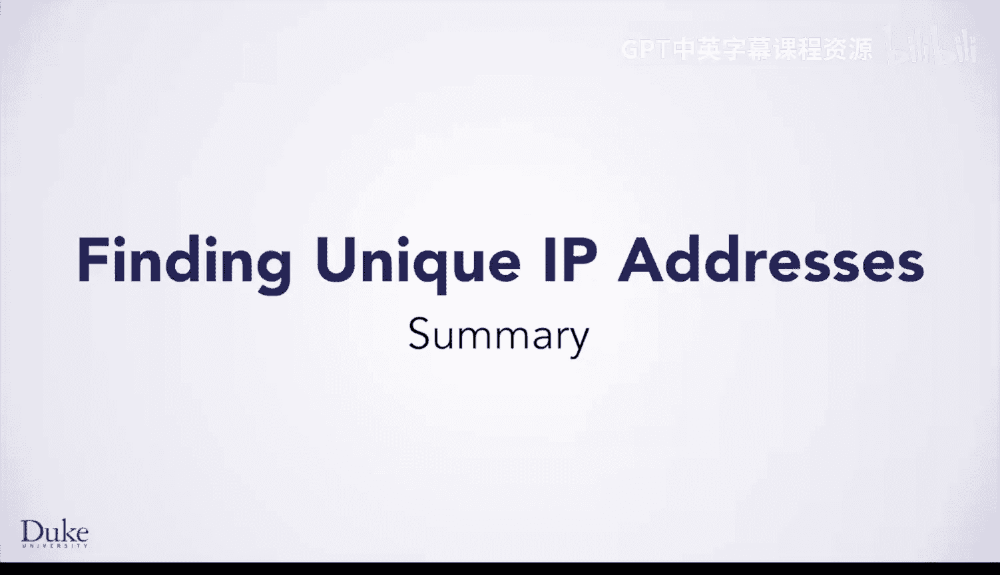
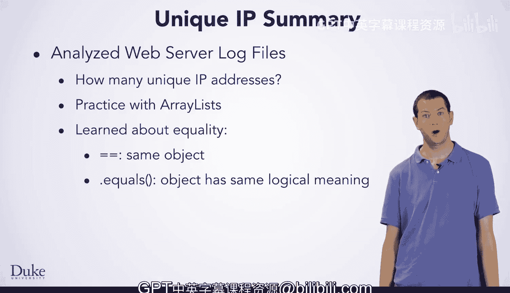

# 杜克大学《Java编程和软件工程基础2-5｜Java Programming and Software Engineering Fundamentals》中英 p111 45_04_05_总结_1.zh_en -BV18U411U729_p111-

Great， now you have completed your first analysis of the Web server log file data that you read。

 You wrote code to figure out how many unique I addresses there were。

 which gives you a good idea of how many people visited your site。

 doing this gave you some great practice with array lists。

 which are useful for solving a wide variety of problems。

 And you also learned about Java's two different notions of equality equals equals。

 which tests if its operas refer to exactly the same object， and the dot equals method。

 which checks if two objects have the same logical meaning。 Each class can define this method。

 however， it needs to so that it can provide the appropriate definition of having the same logical meaning。

😊。

