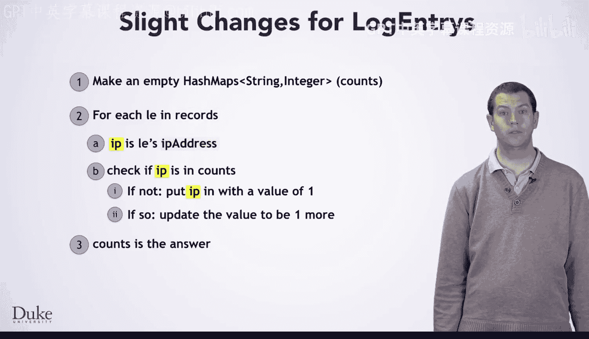

# 杜克大学《Java编程和软件工程基础2-5｜Java Programming and Software Engineering Fundamentals》中英 p113 47_04_02_算法开发_2.zh_en -BV18U411U729_p113-

As always， you are going to apply the seven steps to solve this problem。

 As with the previous problem， we'll observe that the problem is fundamentally the same。

 no matter what strings you use and use strings that are easier to talk about than I P addresses。

 We'll work through this using some animals。 We want to count how many times each animal name appears in this list。

 Cat， snake， T Rex， snake， cat。Now， you start by working through this example in a step by step fashion。

 examining each animal and keeping account of how many times you have seen its name。

 When you have finished looking at each animal in the list， you have your answer。

 Cat and snake both appear twice， and T X appears once。Now that you have worked an example。

 it is time to think about and write down exactly what you just did。

 The first thing was to make an empty table where you could keep track of each name and how many times you had seen it。

Saying you made a table is fine， but it is also good to think about what this means in terms of actual data types you can use in your program。

What type have you seen that is useful for representing this kind of information？Yes。

 a hash map that maps strings， names to integer counts。Once you realize that this is a hash mapap。

 you may as well call the columns by their technical names， key and value。Finally。

 you would want to give this hashmap a name so that you can refer to it easily， we'll call it counts。

Next， you looked at the first string in the list CA。

Then you looked for cat in counts and saw it wasn't there， so you put it in with a value of one。

You did a similar step for the second string snake， which was also not in counts。

And for the third string， T rags。For the fourth string， snake， things were a little different。

When you look in counts， you see snake it already there with a count of one。

 so you update the count to be two。And similarly， for the last string cat。

 you find that it already has a count of one， so you update it to have a count of two。

After all of that， the entire hashmap counts is your answer。

That leads to these steps for this particular instance of the problem。

 So now it is time to find patterns and generalize to any instance of the problem。

 Notice that there are several steps where you did not find the current string in the hash map。

In each of these cases， you put it into the hash map with a value of one。

 Why  one do you always want one， or should you look for some other pattern。

 If you think about it for a moment， you will realize that here you always want one。

 It is the first occurrence of that name。 So you have seen it once。

There are also some cases where you already had that particular name in the hash map。 In these cases。

 you updated the value to be 2。 Again， you should ask yourself， why did I use2。

 Do I always want to or is there some other pattern。In this case， you do not always want to。 Instead。

 you want the old value plus one。 That just happens to always be two here because of the specific example you worked with all of that in mind。

 you should be able to generalize these steps and come up with an algorithm that looks like this。

 This algorithm makes an empty hash map。 then iterates over each string in the input and checks if that string is already in the hash map。

 If not， the algorithm puts that string into the hashm with a value of one。

 And if it's already there， it updates the value to be one more than the old value。

 After processing all the strings， the answer is the hash map counts。

Now you want to test this algorithm out， test it on the input， fish， dog， fish， fish。

This algorithm got you the right answer so you can be more confident that it's correct。

Before you turn this into code， we're going to remember that our input is not actually a list of strings。

 but a list of log entries whose IP addresses you want to process this slightly adjusted algorithm is basically the same but we have changed this variable name to L to stand for log entry and are iterating over the contents of the array list records which is an instance variable in the log analyzer class then you want to get the IP address out of that log entry and use that as the string that you use to update the hashmap now it is time to turn this into code。

