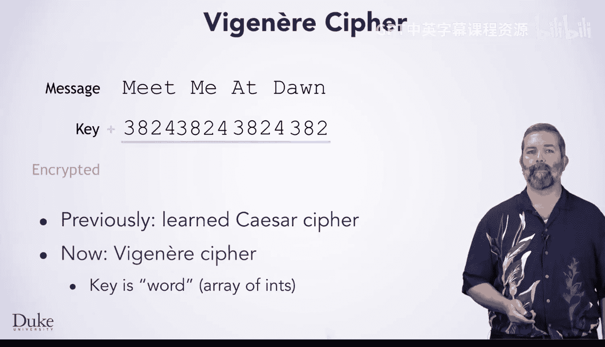
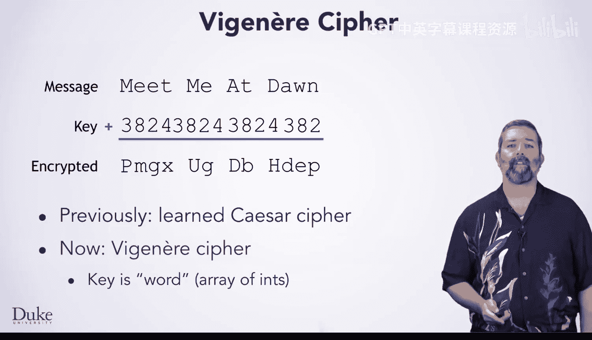
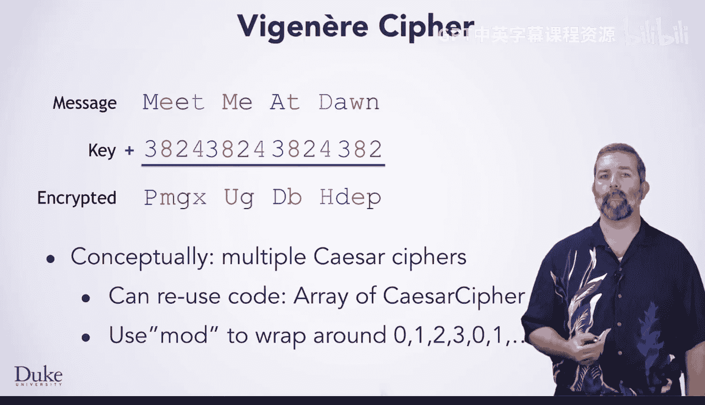
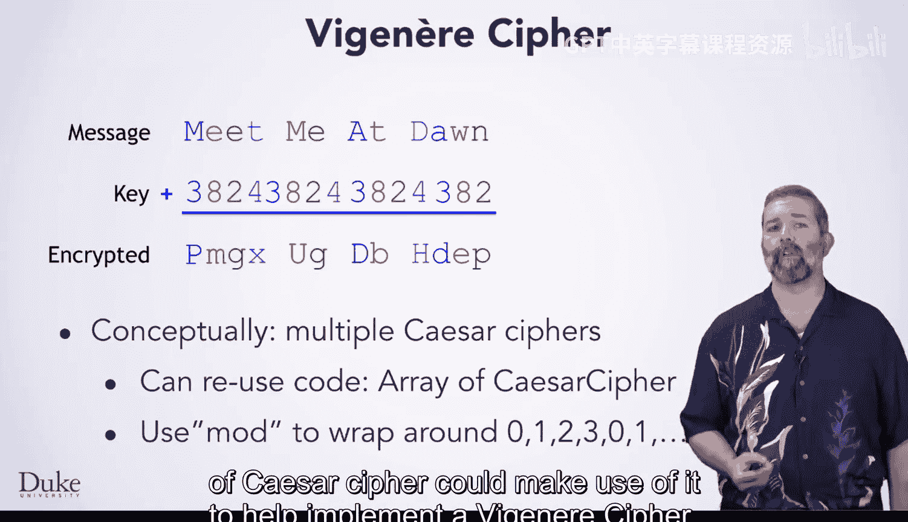
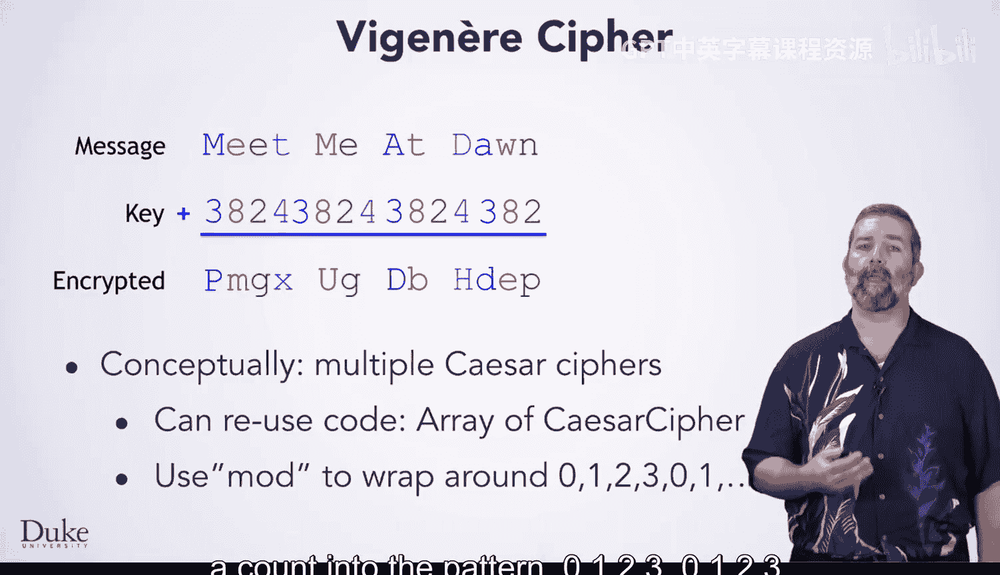
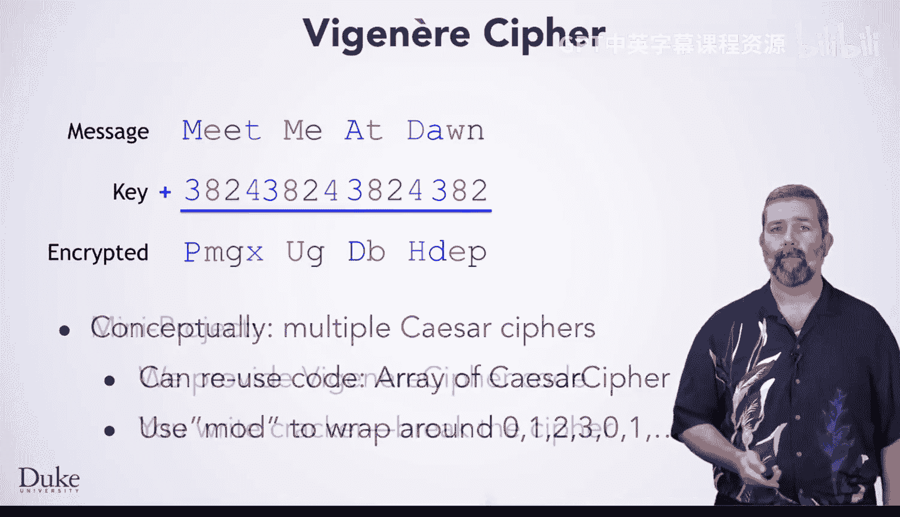
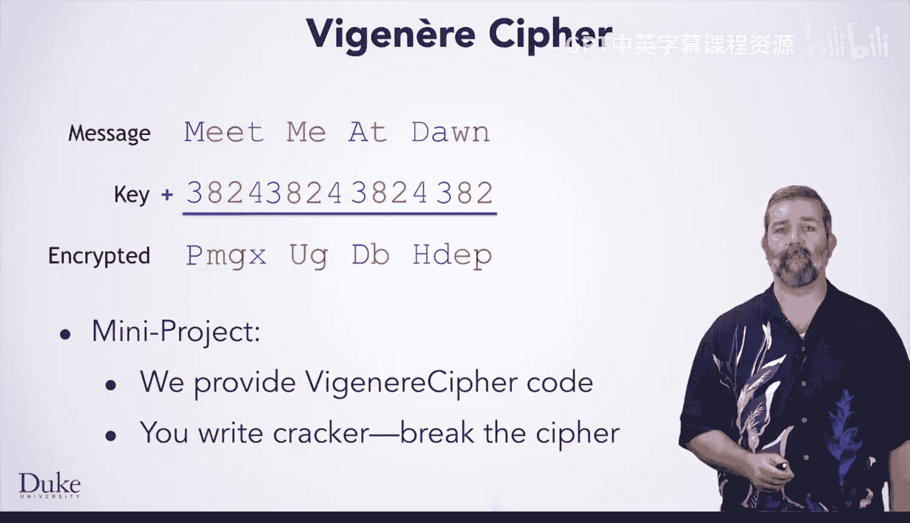
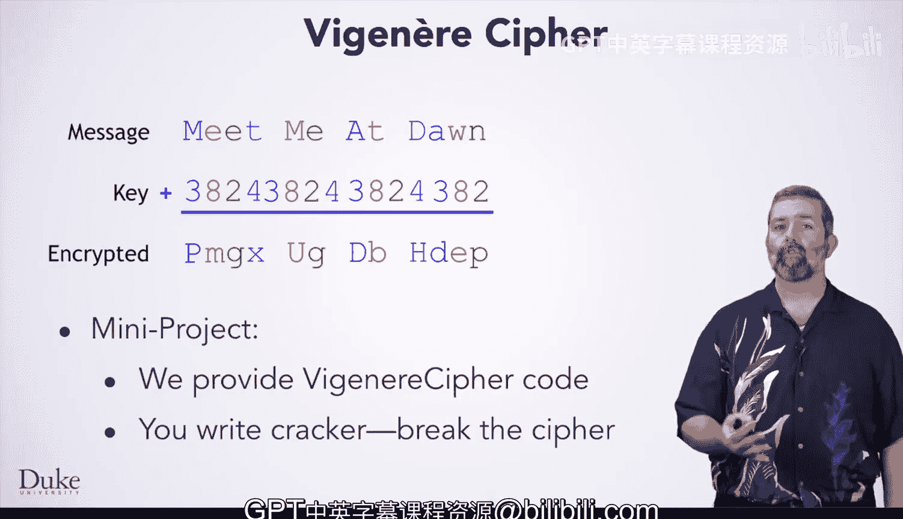

# 杜克大学《Java编程和软件工程基础2-5｜Java Programming and Software Engineering Fundamentals》中英 p117 51_05_02_简介_3.zh_en -BV18U411U729_p117-

If you think back to the start of this course， you learned a little bit about cryptography and implemented the Caesar cipher。

Now you are going to learn a bit about the Vire cipher。

 which historically is quite important as it was thought to be unbreakable for hundreds of years。

However， as you are going to see and do， the cipher is quite easy to break with a computer。Now。

 let's see how this cipher works。The key in visionair was classically a word， for example。

 here we picked dice as our key。You write down the word repeatedly to match the message length。

Each letter represents a number for how much to shift by。So dice means shift by 3，8，2。

 and 4 repeatedly。In a Java program， it would be quite convenient to represent the key as an array of ins。

Now， to encrypt， you shift each letter by the amount written under it。

 much like you did in a Caar cipher， but each letter gets shifted by a different amount。

The first letter is M， which has3 added to it， so you get P。The second letter is E。

 which has8 added to it， so you get M。Then you repeat this process across the entire message。

As we did for Caesar， we'll have to skip anything that's not a letter。

Notice that conceptually， this cipher is like four different Caesar ciphers。

1 with a shift of three shown in blue，1 with a shift of 8 shown in red。

 Another with a shift of2 shown in green and a fourth with a shift of4 shown in purple。

This similarity means that a programmer who has already written an implementation of Caesar cipher could make use of it to help implement a Vire cipher。

 In fact， you could make an array of Caesar cipher objects 1 with each shift specified in the key and use them for your encryption。

 If you did something like this。 You could use the modd operator to wrap account into the pattern 0。

1，2，3，0，1，2，3， for this mini project。 We are going to give you the code for a Vire cipher。

 and you are going to write the code to break it Your goal is to take messages that we have encrypted with Viire and find the decrypted message without knowing the key we used。

 You will start with breaking a message that you know is in English。

And then expand your program so that you can try to break encryption in a variety of languages。

