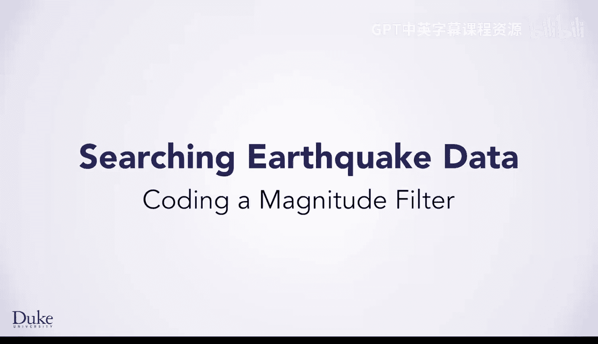
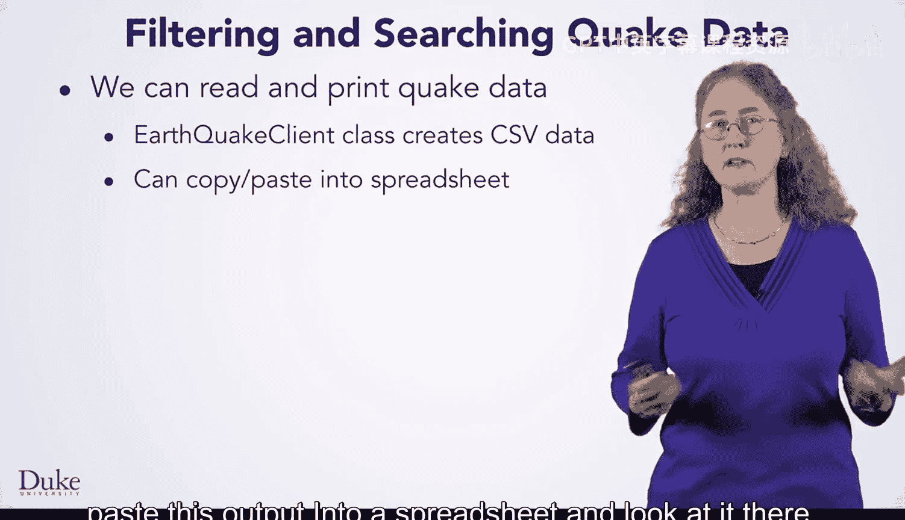
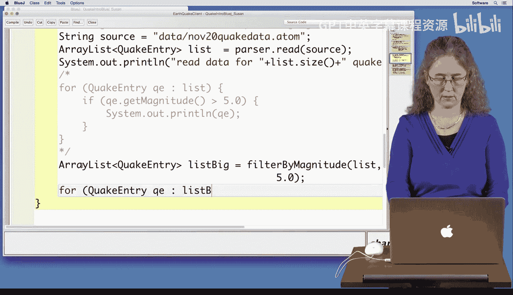

# 杜克大学《Java编程和软件工程基础2-5｜Java Programming and Software Engineering Fundamentals》中英 p125 05_02_06_编写震级过滤器.zh_en -BV18U411U729_p125-

Hi， we're going to use Blue Jay to gain some experience with filtering and searching earthquake data。

😊，We'll start with the existing earthquake client class， which reads in prints Quake data。

We can use this class to print CSV data from either the live USGS data feed or from data we've recorded so you can load it from a file on your computer rather than over the internet。

Since the data is in CSV format， you could also copy and paste this output into a spreadsheet and look at it there。

 This could help you check and debug the code。 you'll write。

 this live coding set lesson will help you build experience reading and searching quake data。

 which will use the same techniques and ideas to search any kind of data。😊。

You'll be able to create new ideas for filtering data so that you can search the quake data to find patterns of simply finding where quakes occur。

You'll see code to filter quick data by the magnitude of a quake or by how far quakes are from a specific location。

Youll also see that using live data can make it difficult to debug your code since the data may change。

We've captured data you can use to help debug and you can do that as well。

 Let's start the coding now。First thing we're going to do is just process the data using the createate CSV method we've written。

 and we can either read data from a file which is what we're going to do first。

 or we could read it from a link， so let's just go ahead and run createate CSV。

So I'm going to create an object。And run the create CSV method and you'll see。It's going to run。

 and it's going to find。From our file， it's got 1，518 quakes and it's got information about the quakes。

So you could actually take that data and cut and paste it and put it into a spreadsheet because it is in CSV format。

 and then that would actually allow you to look at the data in another way and kind of decide if your program is working correctly so we're not going to do that right now but that's something you could do so what we want to do now is go ahead and figure out what are the big quakes from that file。

So we're going to write a method。Called big quakes。

 which essentially is starting out the same way that we just started out the other one。

 we're going to read in all of those earthquakes from our data file。

And then we got to figure out what the big quakes are。So let's do that。

So as you can see what happens here in our code is we have this line here， array list。

 quake entry list， so what we're doing is we're reading from with our parser and putting all of the earthquakes that we're reading into an array list of type quake entries so we can iterate over those which is what I'm going to do now。

So for quake。Entry， and we'll just call it QE。So for each quake entry。

 we're going to have to ask a question and find out how big that quake was。

So we'll have an if statement。And we'll have to get the magnitude of the quake。

 so QE is our quake that's in our array list， and so we'll use the method， get magnitude。

And then we'll compare it。 What I'm going to do is just ask if the quake is bigger than 5。0。

 Im want to know all those quakes that are bigger than 5。0。And if it is， I'm going to print it out。

So I'll just print the quake out。And let's compile that and see if it works。

So it compiled no syntax here， we'll just go ahead and run it。

So we're going to again create a new object。And this time， we're going to run the method， big quakes。

 And let's see what the output is。Okay so you can see all of these quakes here have magnitude greater than five。

Now， another way we could do this is we could write a filter for this。

 because what if we want to get big quakes and we want to do other things。

 So I'm going to instead I'm going to do this a different way。

So I'm going to go up here and I've already started this method up here。It's called。

Filter by magnitude。And when I'm passing in are two parameters。

 I'm passing in an array list of our quake data of quake entries， and I'm also passing in a number。

 which is the size I want all quakes bigger than that number。

And then what I've done is I'd like to create an array list of all such earthquakes。

So I've created a new array list here called answerwer。

And what I want to do is go through the quake data that we're passing in that array list。

 And I want to figure out what are all those earthquakes bigger than mag men。

 which is our number that we're also passing in as a parameter。 So we'll just add code here。So again。

 we're going to create a for loop。For each quake entry。From our parameter， quake data。

We're going to ask the same question。If Q E， we're going to use the gi magnitude。Function。

And here we're going to see if it's greater than。A mag men。

Which is the parameter we're passing in the number。And if it is。

 we want an array list of all such quakes。So if we find a match。

 we're going to add it to the array list answer， so answer。Dont add Q E。

And we'll just check and see if this compiles。And it does。 Now。

 in order to use this new method we wrote filter by magnitude。

 we'll come back down here to big quakes。And I'm just going to comment out this part that we wrote here because we're going to do it a different way。

 This time， we're going to actually use our method。 So I'm just going to put a big comment。

Around this。And instead， we're going to write。We're going to call the method we just wrote。

 and that filter will then return an array list of all of the quakes that have the large magnitude。

So we're gonna have to create an array list to receive the， the answer。 So an array list。

Of type quake entry。So I'm going to call this array list list big。These are just the big quakes。

And that's going to equal where I'm going to call the method。 So that method is called。Filter。

By magnitude。And we're going to have to pass it the array list of all the quakes， which is called L。

And we're also going to have to pass it。A number。 So I'm just going to pass it 5。0。

So that will give us an array list。 And then what we'll have to do is once we get that array list。

 then we can just print out the big earthquakes。 So I'll do that now。

We'll create a for loop just a loop over that particular array list。So if reach quake entry， QE。

That's in the list， big array list。

What we'll do is print these out。Okay， so let's see if this compiles and it does。

So we'll go ahead and run this。So we'll create our object and we'll run big quas。And there it goes。

 So again， we get all the quakes that are bigger than5。 And you can see that。 Now。

 notice we're taking advantage of two string， which knows how to print out an earthquake。

 It printed out in this nice format that's got the location， the magnitude， the depth， and the title。

 And so we're also taking advantage of using that two string。Just wanted to point that out。

