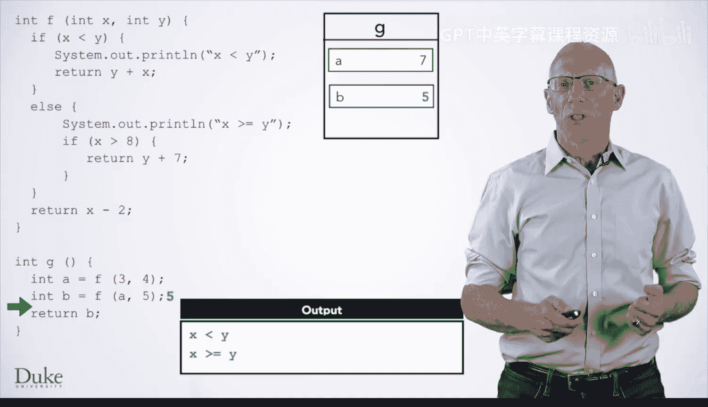
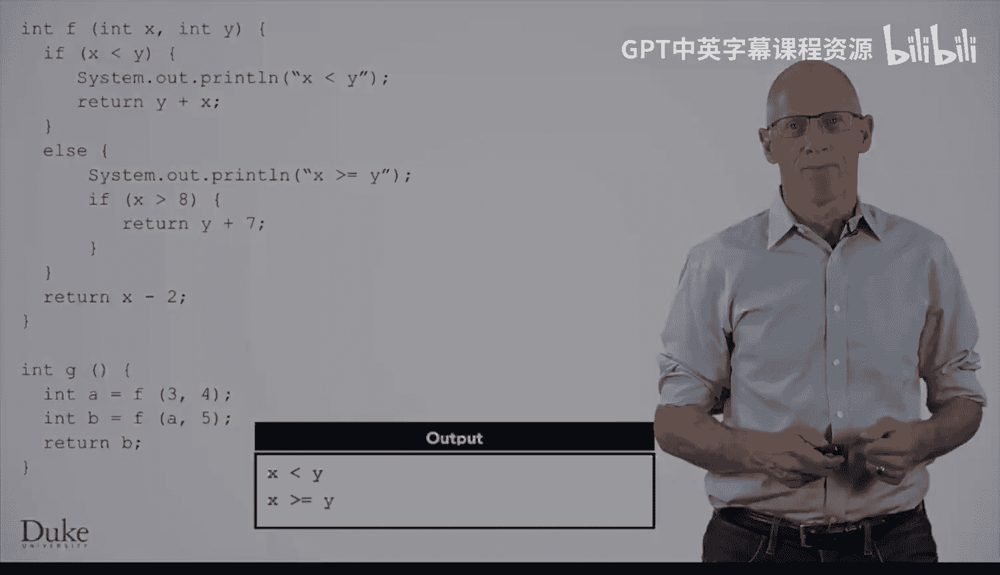

# 杜克大学《Java编程和软件工程基础2-5｜Java Programming and Software Engineering Fundamentals》中英 p13 13_02_02_条件语句.zh_en -BV18U411U729_p13-

Now let's see how to execute code with conditional statements in it。Here we have a function F。

 which has some if and if else statements。 We have another function G。

 We'll assume we've used blue J's interface to invoke the method or function G to start with。

 The first statement declares a variable a。 So we'll make a box for a。

 even though this statement initializes a。 It's going to take a several steps to compute that value。

 So we're going to leave a's value is 0。 until we compute the value of the method F applied to arguments 3 and 4。

 to evaluate this call to F。 we make a frame Pass the value of the parameters。 Note where to return。

 And then we move the execution arrow to the first line of F。

The next line of code is an if statement whose conditional expression is x less than y。

 We evaluate that expression and find 3 less than 4 is true。

 So I move the execution arrow into the then clause of this if statement and continue executing The next statement is a call to system dot out about printlin。

 which is how you print something in Java。 We write x less than y in our output。

And then we return Y plus X。 This values follows the same rules you've already learned for return statements。

 We evaluate the expression to get the return value， which is 7。

 which is then what the function call evaluates to， and we return back to the collar。

 destroying the frame for F。 Now， we're ready to finish initializing a。

 since we know that the call to the method F evaluated to 7。So a is now seven。

Now we're ready for the next line of code in G。 We make a box for B。

 And we call F passing in the arguments 7 and 5。 Once again， we want to evaluate the condition。

 X less than Y。 However， now x is 7 and y is 5。 So x less than y is false。

 We find the closed curly brace for this if statement and see that the if statement has an else clause。

 So we move the execution arrow into the start of the else clause and continue executing from there。

 First， we see the system that out that printlin statement。 and this prints， the line。

 X is greater than or equal to y。 Then we reach another if statement。

 This if statement is nested inside of the else。 but that doesn't affect the rules of how we evaluate it。

 We see that the conditional expression is false， Since 7 is not greater than or equal to 8。

 There's no else clause。 So we move the execution arrow immediately。Past a close。

 curly brace and continue execution。There are not any more statements inside the else clause。

 so we move the execution arrow outside of the else clause and keep going。 Next。

 we have a return statement， so we evaluate the expression x minus2 to find that the return value is 5。

This then gets returned to the place we noted， so we destroy。The frame for F and return back to G。

 We finished the assignment statement， and now we're ready for the return statement from G。

 We execute that， and we're done with the method。

