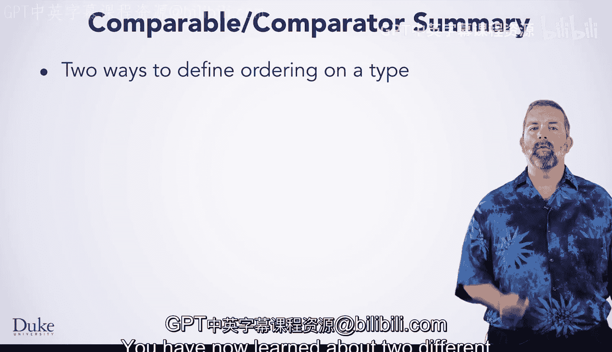
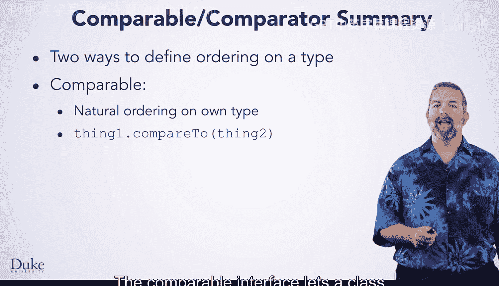
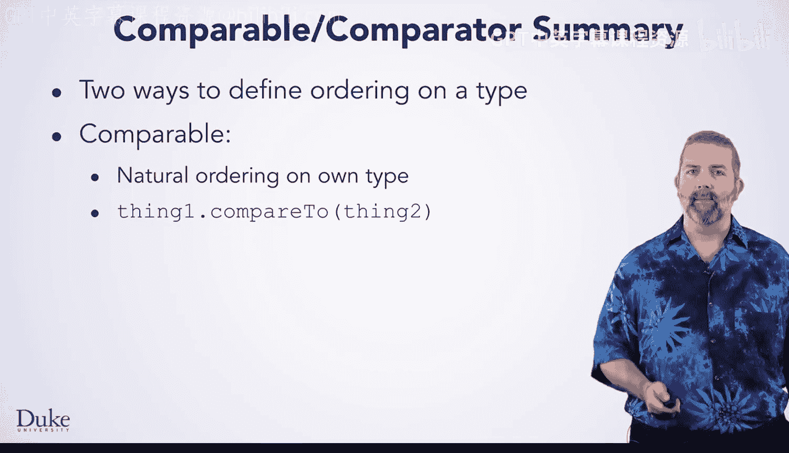

# 杜克大学《Java编程和软件工程基础2-5｜Java Programming and Software Engineering Fundamentals》中英 p144 24_03_06_总结_1.zh_en -BV18U411U729_p144-

You have now learned about two different ways to define ordering on a type。

The comparable interface lets a class define its own natural ordering with the dot compared to method that it promises。

While the comparator interface lets a class define an ordering on some other type with the dot compare method that it promises。

Either of these can be used to specify what ordering criteria collections that sort should use when sorting the data in an array list。

