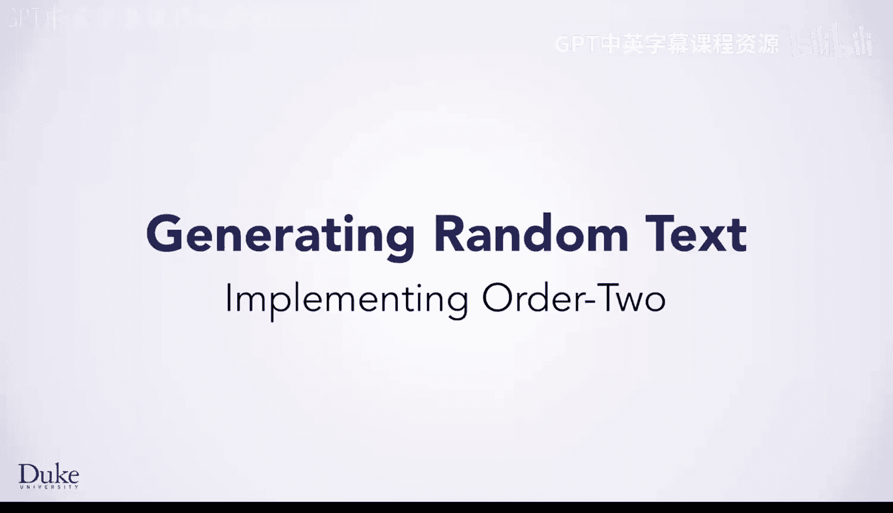
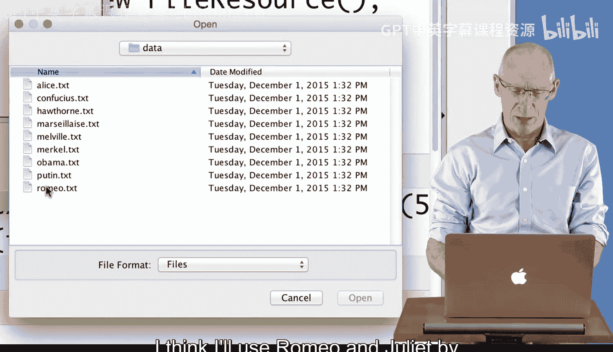
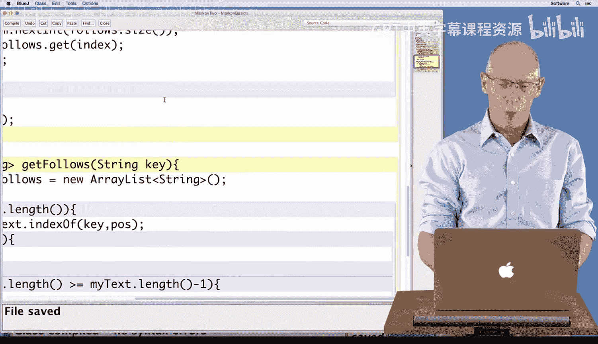
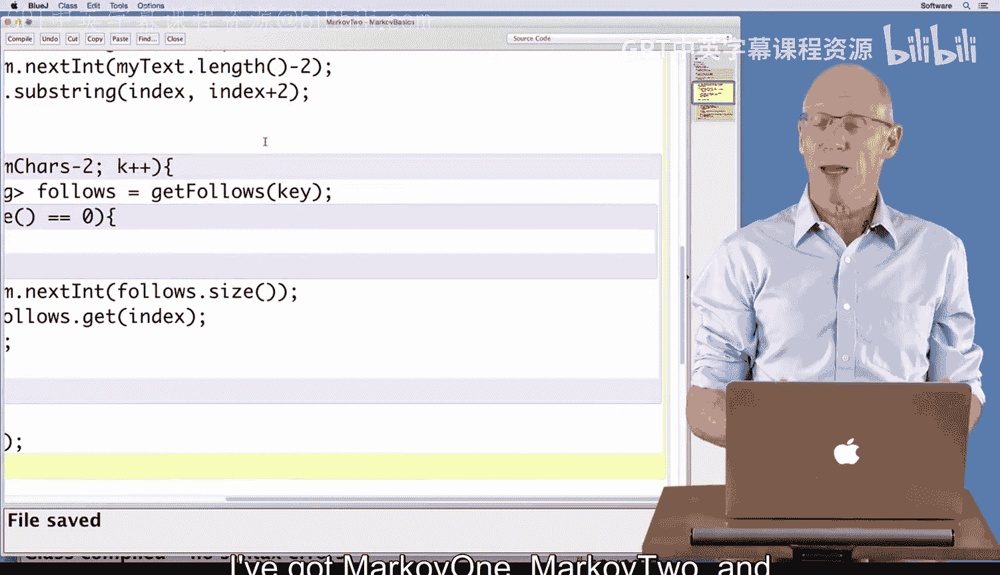
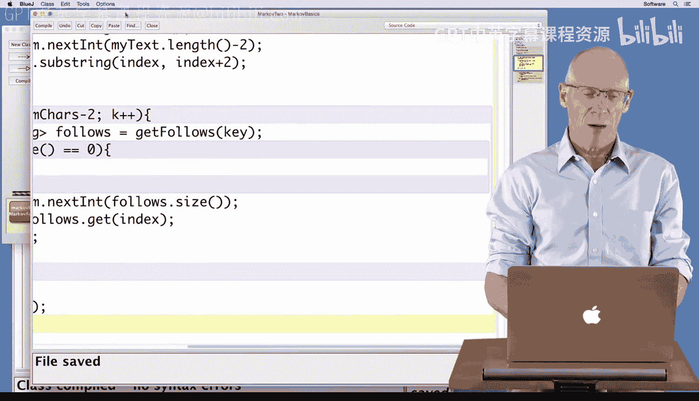

# 杜克大学《Java编程和软件工程基础2-5｜Java Programming and Software Engineering Fundamentals》中英 p148 28_04_05_二阶模型实现.zh_en -BV18U411U729_p148-

Hi， now you've written a Markov one class， which generates random text based on what follows the most recent letter。

 That's doing a bit better at making reallish seeming text， but it's not doing great。

 What if you made it look at the previous two letters， I bet it would be even better。

 You're going to start with a Markov1 do Java class as the basis for implementing Markov 2 dot Java to make this improvement。

 And you could easily extend this Markov2 class to Markov3 or more generally to an order and Markov class。

The mark of one class you developed earlier calls a get follows helper method。

 This is in the get random text method whose main loop is shown here。

 We'll see the entire method on the next slide。The get follows method uses the algorithm we developed with the seven step process earlier。

 It returns to a list of all characters that follows the key。

 We're using one character strings here rather than characters。

Depending on the value of the array list returned by get follows。

 the loop exits when no following characters are found。

Or the list returned is used as the source of a randomly chosen character as the Markov process generates random text here the dot next int method chooses a string at random from the array list。

The random string is added to the string of random text we're building one single character at a time。

 then the loop continues with the random string as the next one character key。

 and its follow list will be found the next time through the loop。

We'll look at some of the details of the get random text in preparation for developing Markov 2 and then the more general Markov model classes。

 here's the entire get random text method with the for loop in the previous slide not shown The key is a one character string chosen at random from all valid indexes of the training text。

 we don't treat the last character of the text is valid since it doesn't have a follow character。

 and that's why we used my text dot length minus-1 as the value for generating a random index。

The index is used to create a one character string as the key。

 and that's why we used index and index plus1 as the arguments to the substring method。

As we get ready to write code for Markov2， think about what changes we'll need to make this code work for a two character key instead of a one character key Let's get coding。

I'm using the Markov basics project and I'm going to go from Markov1 to Markov2 and we'll see that that makes a pretty big difference in the quality of the random text being generated Here I'm in the Markov runner program that creates a Markov one object and then generates three different random texts from it。

 so I compile that class and it runs compiles just fine now I'm going to make a new Markov runner object。

And then I'm going to invoke the method in it called Runmarkov。

I'm going to pick some random text and generate from it。

 I think I'll use Romeo and Juliet by Shakespeare。

And when I generate that random text， we can see this doesn't exactly look like Romeo and Juliet。

 it's kind of hard to see from Liwaa and Gong am Aman Anf Bcastle that it looks like Romeo and Juliet。

 This is a mark of one text generation， which means that each character is used to predict the next one。

As you may remember from the lesson， I'm in my Markov runner class and I simply change Markov1 to Markov zero。

And run this program by compiling it， and it had no syntax errors。

Now when I run it by creating a new object。Using the runmarkov method and generating another random Romeo text。

 this looks even less like Romemeo， or it just in from from So to Nma Now this does have a lot of E's and A's because it chose text at random based on the frequency with which it occurred in the training text。

One of the features of our design is that using Markov0。

In place of Markov1 still allowed my client program to work because。

Both Markov 0 and Markov 1 rely on a get random text method and a set training method。

 That's all they rely on。 We'll be able to capture that commonality with an interface in a later lesson。

 For now， we're going to create the Markov2 class。Using two characters of。

Prediction and run that When I compile it， it says cannot find symbol methods set training。

 So the markov two class doesn't have these methods。 Let me open it up and see what's going on。 Whoa。

 Mark of2 is just the shell of a program。 It has no methods in it。 In fact。

 the comment says copy mark of one and make changes to it。 So I'm going to。Get rid of this comment。

I'm going to open up my mark of one class。I'm going to copy the guts。

 the complete guts of Markov1 by dragging all the way to the bottom。Copying that。

And then pasting it into Markov 2。Now， I know that the name of the constructor must be Mark of 2 rather than mark of1。

Now when I compile it， this class compiles fine， I don't need Markov1 anymore。

And when I go to Markov Runner。Wwhich now uses Markov2 as the name of the class When I compile this class。

 it works just fine because I copied the guts of Markov 1 into Markov2 in general。

 copying code from one class to another is not a great software design technique。

 but it's what we have available to us at this point until we develop an interface that we can use to capture the common code。

As I look through this code， I want to understand the differences between Markov1。And Markov two。

The get training text method。So the set training method is the same。

 The get random text method is slightly different because I'm going to use two characters to predict the next one。

 rather than just using a single character， predict the next one。 So as we can see here。

This picks one substring as my initial key， and that substring has length1 going from index to index plus 1。

 I'll change that to go from index to index plus 2。

And that will mean that the value of a valid index could only go up to two before the end。

 I need to be able to pick any index that allows for a two character substring。

 So I need to change this one to a2， this one to a2。 and I'll need to change this one to a2 as well。

 because this loop has already。Had two characters generated and stored here as the key。

 so I only need to generate nu cares minus2 When I compile this program。

 it works fine with no errors。I'm going to use Markov Runner， compile it。

Create a new Markov runner object。Run the Markov method， use Romeo。

And we can see here that the text looks a little more realistic like English。

 I can see words like Tid， which might be the Montagues and the capt somehow home is here。

 panda is here， thiscade these words look more even I hear Roman instead of Romeo。

 so I have a little more English quality in my text by simply changing the ones to twos I might go one step further and change the twos to threes just to see。

That I'm on the right track here。Now I will be generating。On order three Markov text。If that works。

I'll have pretty good confidence。That my changes were correct。

And I'm hoping that this looks even more like Romeo。Once Fars Herman Rosar Suiz。

 that seems a little more like Romeo， wherefore art Thou Romeo， I can imagine that this is like that。

 so I'm reasonably happy and satisfied that my changes worked as they were supposed to because I'm writing Markov2 and mark not Markov three。

 I'm going to change my threes back to twos that was me simply verifying that my changes were correct。

As a reminder。Because get follows the helper method that you see here works regardless of the size of the key I'm using。

 because it uses things like key dot length and key dot length。

 my changes in use changing the ones to twos were good enough。 I've got Mark of one markov2。

 and I could easily make Markov n for an end character。

Markov generation， I'll wait until we do interfaces for that happy programming。

