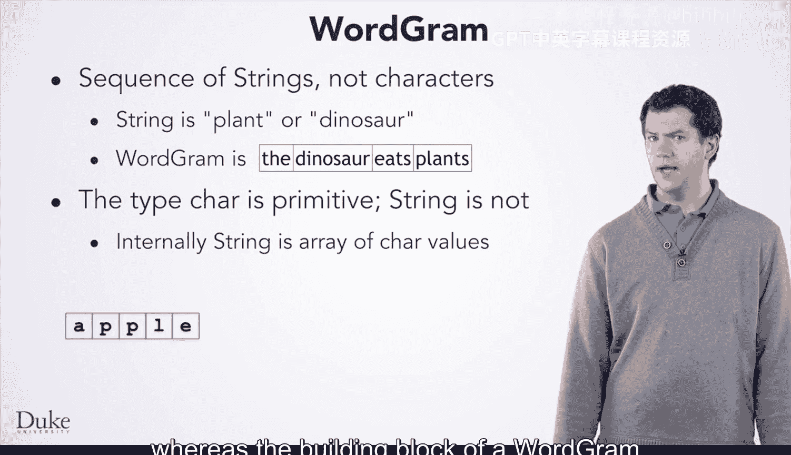

# 杜克大学《Java编程和软件工程基础2-5｜Java Programming and Software Engineering Fundamentals》中英 p155 35_04_05_WordGram类.zh_en -BV18U411U729_p155-

Okay， now we're going to look at the design and implementation of a class word gra。

 which will let us create markov random and predictive text based on words rather than characters。

 When we used characters and strings， it was not too difficult to go from Markov 1 to mark off2 and then to creating interfaces in an abstract class in the git random text method changing from Mark off 1 to Mark off2。

 required changing the constant one to the constant2 in three places。 changing to any number。

 not just two， required the same three changes。 My order is used here instead of using a one or a two。

 My order is used here to get a substr of the right length， not just length1 or two。

 and my order is used here to indicate we've already generated letters and stored them before we start looping。

The code in helper method get followsll does not change。

 not at all in moving from order 1 to order 2 to any order。

Changes to the Markov word1 class that uses words to generate predictive text at random are not as simple or straightforward。

As we'll see in a minute， when using characters and strings。

 we relied on the dot substring method to get any sub sequenceence of a string。

 We need an analog of this dot substring method for a string array so we can extend Mark off word 1 to a class with any number of strings or words predicting a new word。

Let's look at the method git follows for an in character Markov class。

 then we'll extend that to in words。This is the get follows method for the character and string versions of Markov In variable My text stores the string that represents the training data for the Markov class。

 The key for the random text is also a string。 We use this key to find all following characters to predict random text and extend the random sequence we're returning。

The method Git follows relies on dot index of and dot substring to do the work。

Dot index of returns the index of the first occurrence of key starting the search at pose dot substr returns a sequence of char values。

 the substr starting at a specific location。How can we extend these ideas from in characters to in words？

The code and version that used characters made it straightforward to change from Markov1 to2 to any number。

 As we said， strings can be thought of as a sequence of characters。 Strings can easily be one。

2 or three characters long。 We saw string variable key and the method dot index of using sequences of chas。

 We'll have to give some thought in going from the already tested Markov word1 class to a general class that can use two or inwords to generate text。

 We'll need to move from a one word key， which can be represented as a string to an inword key。

 which can't easily be represented as a single string。😊，We'll need to search for inwords。

 not just one in creating the follows helper method。

Will design and implement a word sequence class to handle order 2 or  three。

 or even order 20 random text based on words。 This will be a sequence of strings。

 just as a string is a sequence of chas。 It will represent a sequence of strings stored in an array。

 The analog of the Markov class that treats a string as a sequence of chas。

This new class will be called a word gra。Let's look more closely at that idea。

 Our word gram class will represent a sequence of strings， not characters。

 while strings can be a sequence of letters like a P A and T to represent planned。

Or the sequence that is the string dinosaur。 A word gra object will be a sequence of strings like the sequence the dinosaur eats plants。

Designing this class will take a little thought because the building block of a string is the primitive type cha。

 whereas the building block of a word gram is a string， not a primitive type， internally。

 a word gra class will be an array of string references， as you can see here。

Now that we've got the concepts thought out， the next thing we'd want to do is think about how to design the class。

 We'll see that in the next video。

