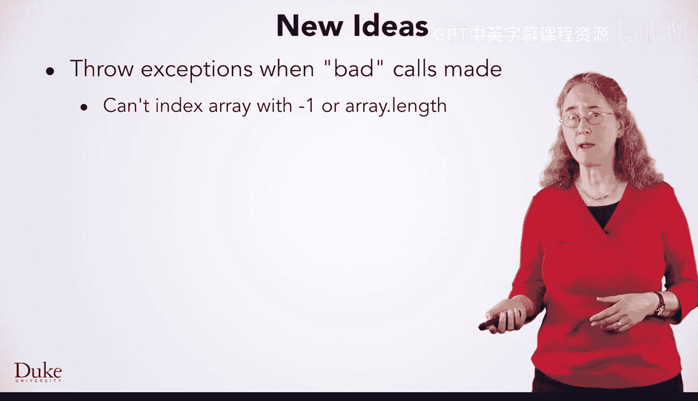
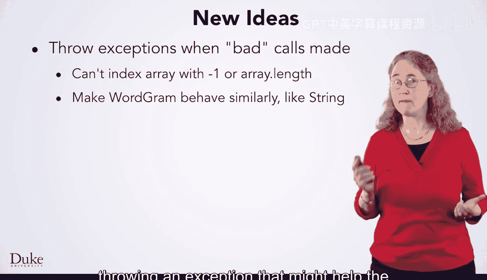
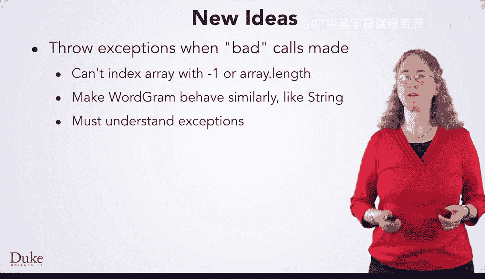
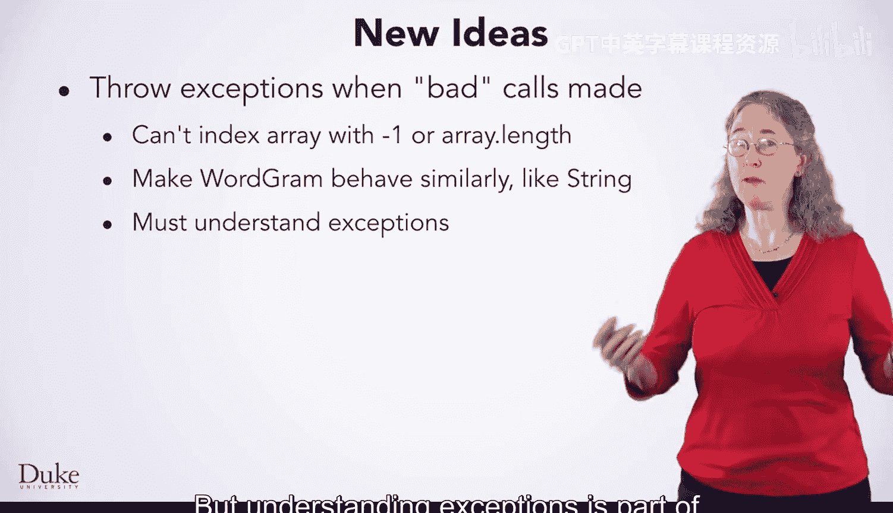
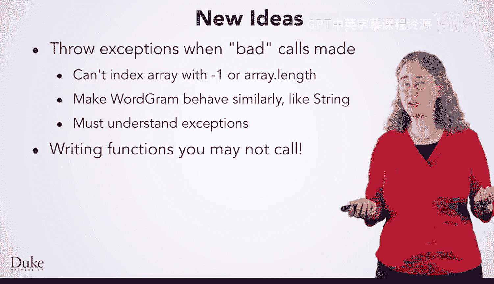

# 杜克大学《Java编程和软件工程基础2-5｜Java Programming and Software Engineering Fundamentals》中英 p159 39_04_09_总结_2.zh_en -BV18U411U729_p159-

Hi， we've just completed the design and implementation of the class word gra to enable random text generation by word rather than by letter。

This extends the predictive and occasionally amusing text generation that's the basis for spanm detection。

 predictive text and search engines， and more。

We use word at a time rather than letter at a time to illustrate new concepts。

 but a good initial design with the IMarov model interface allowed our new classes to work with existing and previously tested client programs。

We developed Markov Word1 first， it used one word to predict the next。

 this was an easy transition from the letter Markov programs to using Word Gram。

It's a good idea in general to take small steps in developing new programs with new ideas and changing design。

After the small step works and has been tested， take another step in extending designs。

 As you take steps， be sure to use the seven step process for algorithms， as that's warranted。

We looked at a new class word gra and its internal representation of behavior。

 our design and implementation of Markov Word1 used strings rather than characters and was successful。

 but we had to design and implement the word Gra class to extend our order one word Markov program to order two。

 three， and more。

However， we could develop the word Gra class with familiar designs， testing， programs and interfaces。

We tested WordG outside of the context of Markov T generation。

 but we developed use cases with Markoff to help guide the design of WordG。

We tested dot2 string and constructors first because it's tough to test and debug when you can't create and print an object。

When it was time to implement dot word at and dot length methods。

 the similarity to similar methods in the string class helped。

We also had to understand how to implement dot equals and dot hash code。

But only dot equals was needed in our code。 dot hash code would be needed in more advanced uses of Word gram。

We encountered a few new ideas in implementing word gram。

 The dot word at method through an exception when an index was at a bound。

You can't index an array or a string with values like minus1 or the length of the array。

We made wordG behave like stringing does， throwing an exception that might help the programmer when bad indexes are made。

Typically， bad indexes don't occur in release software。

 but they do in the development of new software as it's being tested。

 but understanding exceptions is part of being a software engineer or programmer。

We wrote functions that we didn't call other methods might call them as dot2 string is called when an object is printed。

As we saw sometimes dot2 string is called explicitly， as when appending to a string builder。

When inserting into a hash map， the dot hash code method gives an index for what we call a bucket where objects are stored。

 The dot equals method helps distinguish objects that might end up in the same bucket。

Happy programming。