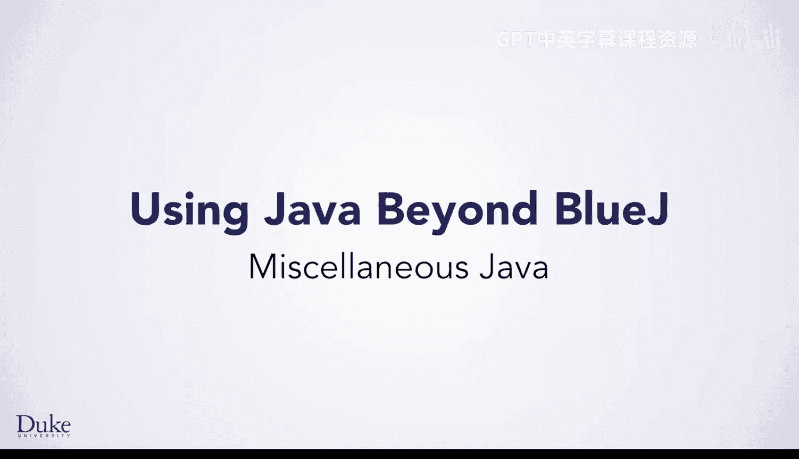
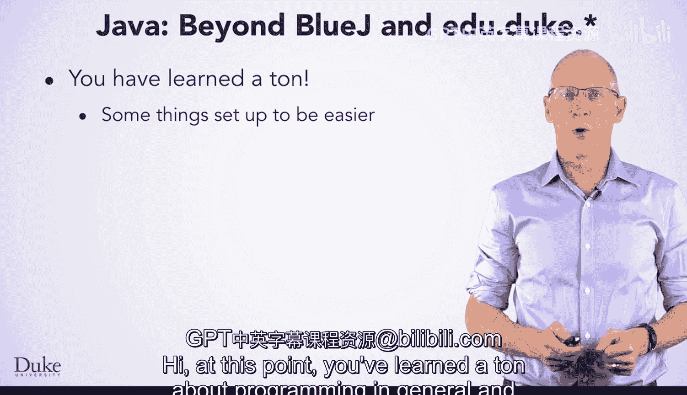
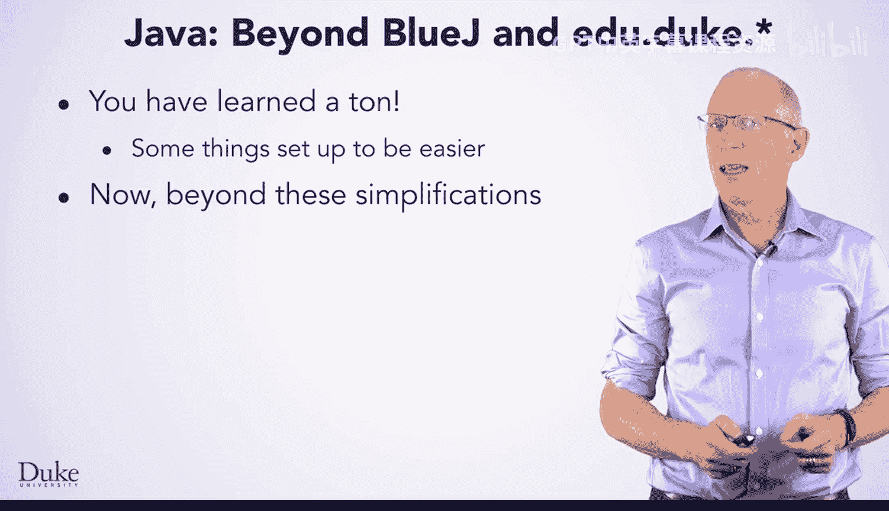

# 杜克大学《Java编程和软件工程基础2-5｜Java Programming and Software Engineering Fundamentals》中英 p160 40_05_02_Java杂项.zh_en -BV18U411U729_p160-

Hi， at this point， you've learned a ton about programming in general and about Java in particular for a lot of the problems。

 you're going to be able to solve them on your own now。 However。

 we have set things up with some simplifications to help you get it through this course such as using the Blue Jay programming environment and providing the Eduu。

 Duke Library of classes these have helped you focus on the key things you need to learn without getting bogged down in complexities of the Java language However。

 it's time to move beyond these simplifications to let you know what's next。 First。

 you're going to learn about main， the method which indicates the start of a Java program when you're not using the Blueja IDE。

 Blueja is great for novices， but as you become a more advanced program。

Programr， you may want to consider more advanced editors， and we'll talk briefly about some of them。

 You'll also learn a little bit more about exceptions and why they're needed and how to handle them。

 We'll also talk about how you would read files without the Edu dot Duke do star libraries with classes like file resource。

Finally， we'll wrap up this course with a brief discussion of what you might do next。

 we hope you're really excited about programming in Java， programming in general。

 and computer science， and that you're very eager to learn more。

