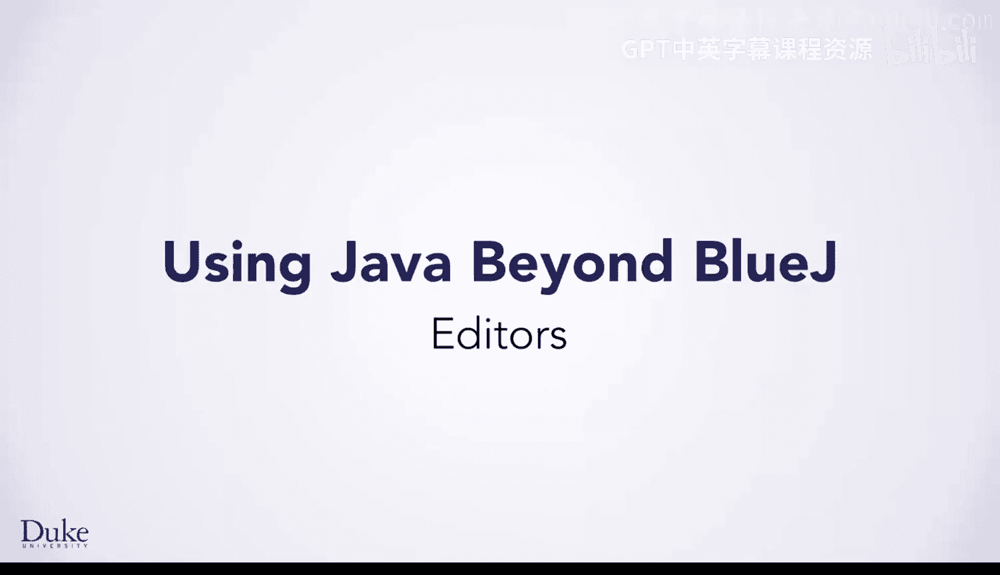
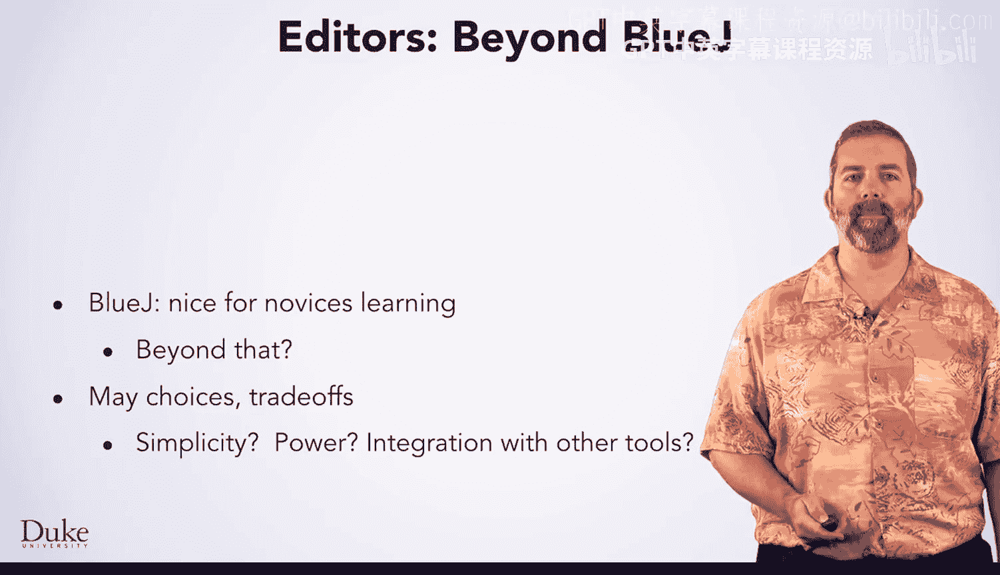
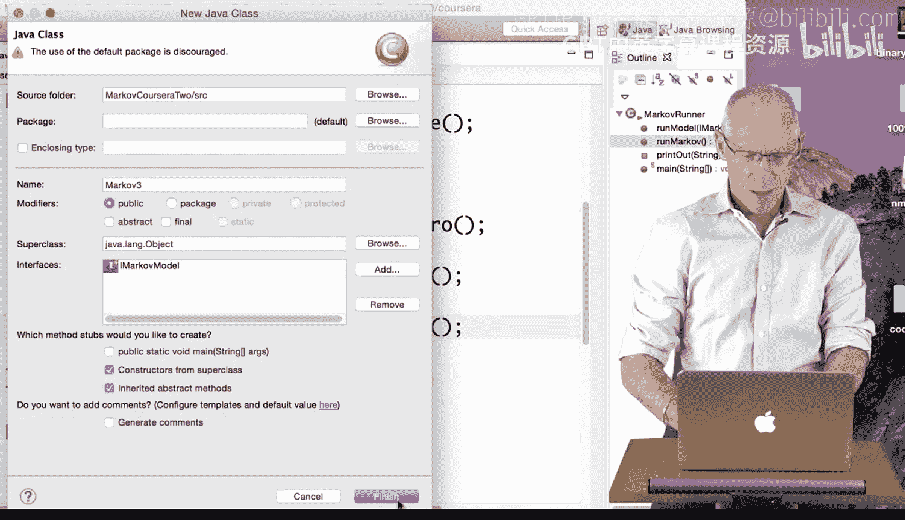
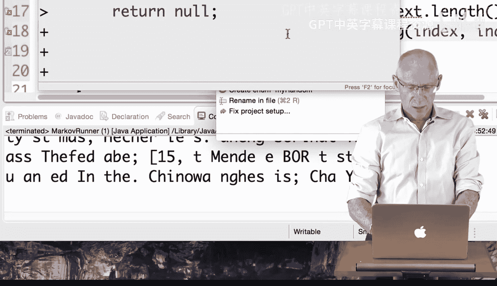
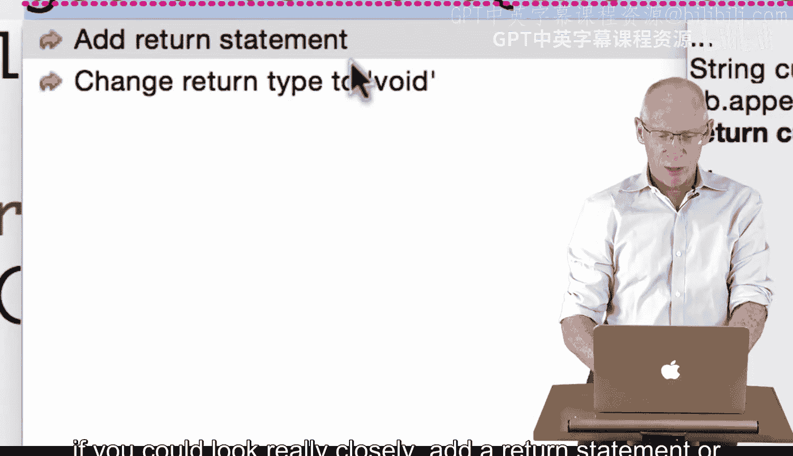

# 杜克大学《Java编程和软件工程基础2-5｜Java Programming and Software Engineering Fundamentals》中英 p163 43_05_05_编辑器使用.zh_en -BV18U411U729_p163-

You've used Blue Jay throughout this course because it is a great tool for novices learning to program。

It makes things easy for you， and there are not too many features to learn with it。 However。

 as you advance in programming skill， you may want to explore other editors。

There are many choices and trade offs， do you prefer simplicity or the power presented by advanced features？

As you learn other programming tools such as revision control systems like Git or debugging tools。

 how does your tool integrate with them？

Another important consideration is whether you want to use a graphical user interface or Gui。

 which may feel more familiar and comfortable to you， or something where you only use the keyboard。

 using only the keys may seem intimidating， but it allows you to work from muscle memory。

 When you can edit from muscle memory， your editing doesn't interrupt your thoughts about your algorithm design and implementation。

 which can make it much more efficient。As you think about these factors。

 there is a wide spectrum of editors ranging from those which are more friendly to novices to those which are more friendly to experts。

Novice friendly editors such as Blue Jay are GuUi based and favor simplicity over power。

As you work your way down the spectrum， you find editors providing more advanced features。

One popular editor is Eclipse。 There are also two very common editors， aimed solely at experts。

 Emax and Vim programmegramrs who use these editors primarily use the keyboard and enjoy the advanced features they provide。

 However， their power comes with the cost of a learning curve。😊。

EAC is what Dreww teaches his students to use in class。So if expert friendly tools。

 whether editors or other tools are harder to learn， why would you want to learn them？

Learning them is an investment if you plan to use them over the long term。

If you look at what you can do with a tool versus the effort you have spent learning it。

For a novice friendly tool， you can just pick it up and use it and do a decent amount with it。

 as you work with the tool， you can do more， but you quickly plateau in what you can do。

If you look at an expert friendly tool， you find that when you start out。

 it is more difficult to use， you may not be able to do much with it until you invest some effort into learning it。

However， as you invest effort into mastering your tool。

 you surpass what you could do with an novice tool and then benefit from the power of the advanced features。

As an analogy， think about recording video for most people， a novice friendly tool is great。

 If I'm going to record a video， I take out my cell phone and press the record button。

 It's super easy， and I didn't have to do anything to learn how。😊。

But professional videographers use much more sophisticated tools。

 A high end professional video camera has a bunch of complicated features。

 and I wouldn't know how to use one without investing some time in learning it。

If I wanted to use any of the advanced features， it would take even more effort。

I can stick to my cell phone since I don't need those features and I not a professional in that field。

However， for professionals， learning to use the advanced tools is a worthwhile investment。

The same principle is true of editors。 If you plan to be a casual programmer and just write small programs。

 a simple editor may be a good choice。However， if you plan to become a serious professional programmer。

 you will want to invest the effort in learning an editor whose advanced features will make your job easier in the long run。

Hi， I'm going to walk through using aclipse， an integrated development environment or IDE that's the IDE of choice for many。

 many Java developers。 I've used it to develop most of the material for this course when I'm not using Blue Jay and the UCSD specialization that comes after our specialization also asks learners to use eclipse as you know。

 there are some other IDs as well， but because I'm most familiar with eclips。

 I'm going to walk through just a few of the features that it has to show you what it's about。

I'm using the class Markov runner that we've used before， and I've created Markov 0。

 Markov 1 and Markov2。 We've gone through those in previous lessons。

 I'm going to use eclipse to make Markov 3， a class that we haven't done yet。

 We've gone in previous lessons right from Markov2 to the general Markov model。 So in eclipse。

 I'm coming in just as you do in。Blue Jay and saying I need a new Java class， I get a little menu。

 and I'm going to call this Markov3。The interesting thing about eclipse is I can say。

 here's an interface that I'd like to add， and I'd like to add the I Markov model interface。

I'm going to say okay。

When I'm finished。Now I have my Markov3 class， and you can see that eclipse has filled in the stubs for all the methods I need to implement that are part of the I markov model interface As a reminder。

 Here's the I markov model interface。 It has two methods that I must add。

 set training and get random text。 We've seen that before。

 And Stub implementations for those were provided in markov 3 by Eclipse。It even has a return value。

 That's not the right return value。 And it does the set training method here。

 So the nice part about eclipse for what we're seeing here is that for interfaces。

 Eclipse will fill in the stubs。 And then I can copy the code for Markov2 into here and make sure that it runs。

 I'm not going to do that Now， I just wanted you to see that with interfaces。

 That's a nice feature to have。 If I started to copy the code in。 And I'll just do it a little bit。

 so that you can see what happens。 Here's the get random text function。 this。😊。

I'll just copy the first few lines into my Markov three class。If I had forgotten， for example。

 in this case mark， this two is going to be replaced by a three。

 we've walked through that in a previous lesson。SB dot append when I type SB dot。

I see a menu pop up of the choices for this method， including a pen。 Now。

 blue J has the same functionality， if you do。A control space or a right click space In this case。

 I'm just going to make sure that I call aend properly and put in current。

Bluujai also has that functionality here， say if I forget the return statement。

I get some red X's Eclipse is going to complain。In this case。

 it's is told me that it doesn't know where my random is and it doesn't know what。

My text are with these little red X's。 I do a pop up。

 and it can say create a local variable or create a field。 So I'll create a field。 My text。

 and the eclipse came and set this variable。 My text， knowing how it was used here。

 I can do the same thing here for my random。I will add the field my random。It added that up here。

 It thinks it's an object。 It couldn't know that it was random。

 I'm going to change the type to random。 I've got another red X。

Import the class random from Java dot uil Eclipse nowheres， knows where this class lives。

 And so it filled in all this material for me。I'm almost done。

 but I finally have a redx here because as it says， if you could look really closely。

 add a return statement or change the return type to void。 I'm missing the return statement。

 So eclipse makes a guess and says maybe I should return current。 That's not correct。

 but it's enough to make my program compile。 And as you've discovered once the program is compiled。

 I can run it。 and that means I contest test it and go back and make corrections。

 So that takes care of a few of the features that eclipse allows me to have and make my programming a little more productive by helping me correct my own errors。

 One more interesting feature that eclipse can do。 I can say I don't like the variable name， my text。

 I'd like to right click refactor。 I'd like to rename this variable。

 I think my text is not quite right。 I'd like to call it my training text。😊。

So when I make that change there， Eclipse has gone through and found all the occurrences of my text。

 you can see them highlighted and they're changed there。

 Reffactoring in eclipse has lots of many powerful functions that we're not getting into here。

 But if you continue and do more advanced object oriented in Java programming， you'll see them。

Happy programming。