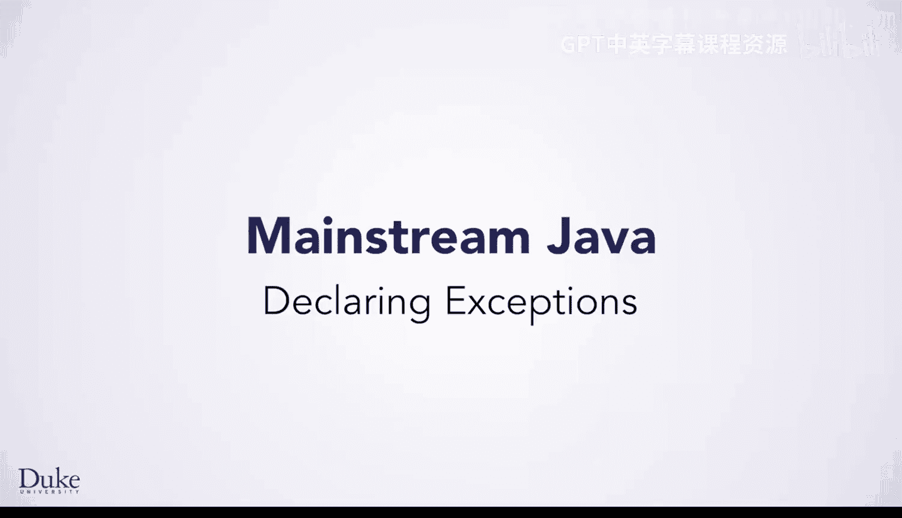

# 杜克大学《Java编程和软件工程基础2-5｜Java Programming and Software Engineering Fundamentals》中英 p168 48_05_04_声明异常.zh_en -BV18U411U729_p168-

So what if you were writing code where an exception might happen。

 but you don't know how to deal with the exception right there？

Maybe because you are writing a method which may be used in a lot of different ways。

 and what to do depends on how it is being used， Or maybe you just need information that isn't in this method。

 In either case， you really need them the method that called this method to handle the problem。

 Or maybe its caller or maybe its caller and so on。 In fact。

 if you think about the fact that the constructor for the URL through an exception。

 It is exactly because it detected a problem， but it did not know how to deal with it。

 This is the whole point of exceptions。Fortunately， when you do not handle an exception。

 it will propagate to the caller automatically。However。

 for certain kinds of exceptions called checked exceptions。

 you need to specify that the method might throw them。

 You do this by writing throws and the name of the exception types it might throw after the parameter list。

 but before the curly braces， as you see here。We aren't going to delve into the details of which exceptions are checked。

 but you can read more about them in the Java documentation if you want。

