# 杜克大学《Java编程和软件工程基础2-5｜Java Programming and Software Engineering Fundamentals》中英 p20 20_02_02_七步法实战：算法开发.zh_en -BV18U411U729_p20-

Hi， in this video， we're going to walk through an example of using our seven step process to solve a programming problem。

 In particular， the problem where we're going to work on is given a shape， find its perimeter。

 Step 1 is to work an instance of the problem yourself。

 That means you'll need to draw a shape and find its perimeter。

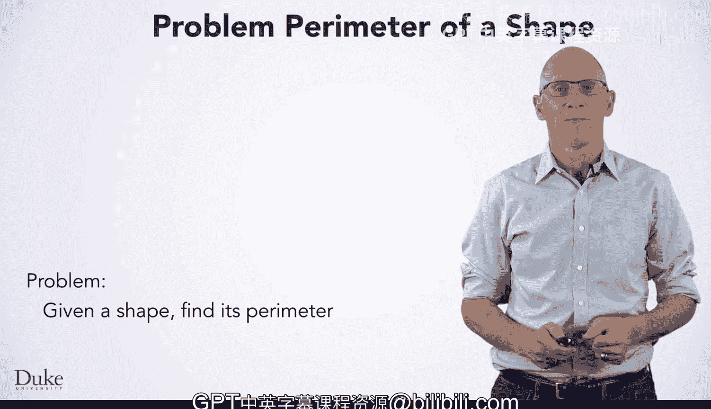

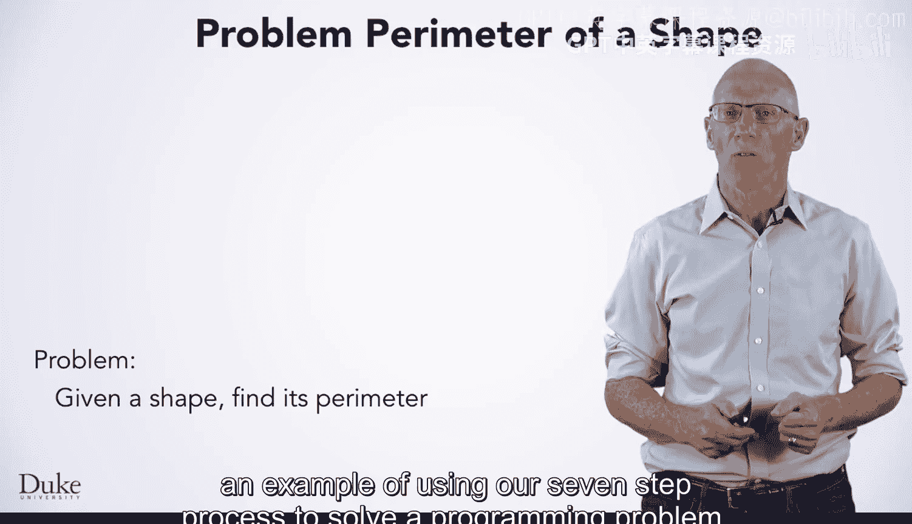

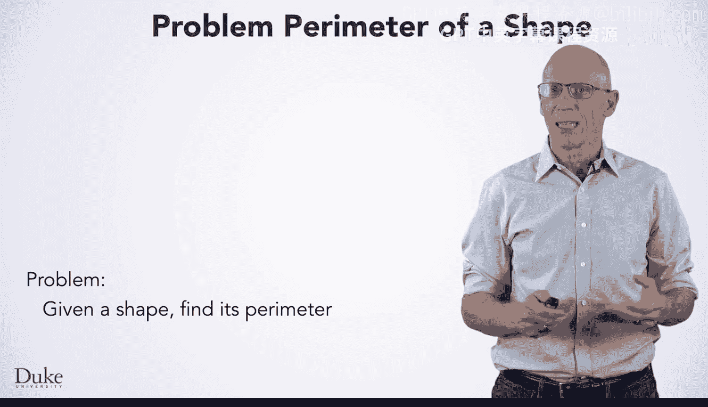

We'll need a little domain knowledge here for this problem。

 specifically what is the perimeter of a shape。If you don't recall。

 the perimeter is the sum of the lengths of all the sides of the shape。

We'll need to know that a shape is defined by its points。

 and the points are listed in order as they appear around the perimeter。 First。

 we'll draw a coordinate grid so we can draw our shape precisely and carefully。

 Then we'll draw a shape on that grid。 We're noting the coordinates of each point in the shape as we draw it。

 This will allow us to easily do math on them to compute the lengths of the edges of our shape。

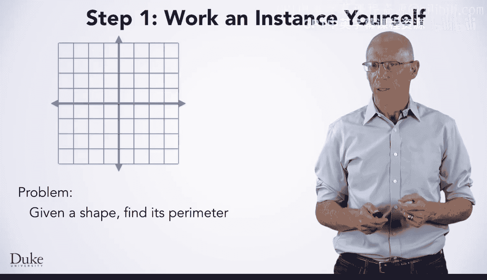

Once we have the shape， we can start finding its perimeter。This left edge has length four。

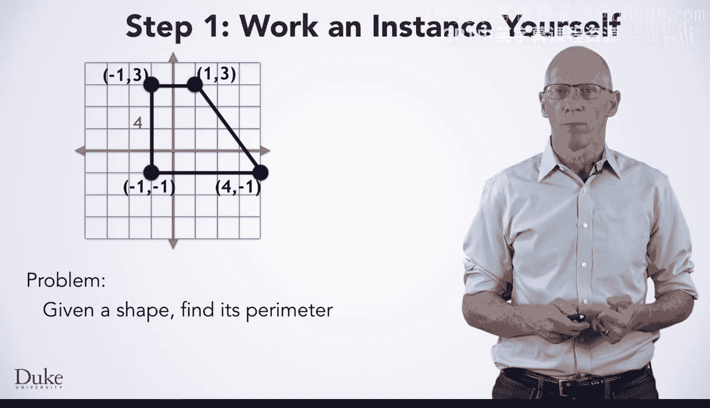

And this bottom line edge has length  five， so we can add them together and get9。

 the running total of our perimeter。

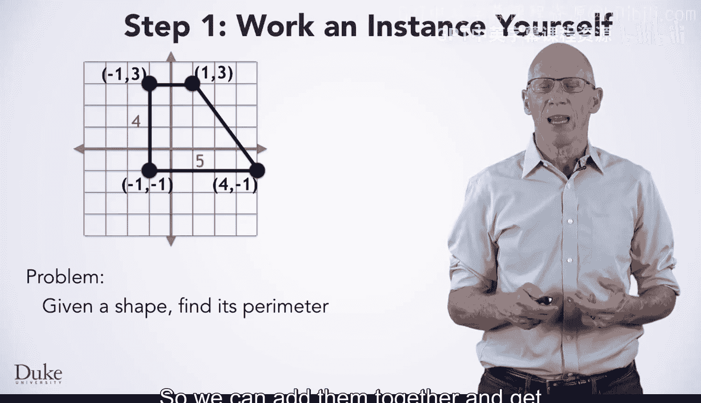

The next edge is the diagonal， so we'll need to do a little bit of math。

The difference in the x's is3。And the difference in the Ys is4。

The square root of3 squared plus4 squared，9 plus 16 or 25 is 5。 that's the length of this edge。

We can then add9 plus5 so that our running total is 14。Now we see that the last edge has length 2。

 We add 2 to 14 to get 16。 So 16 is our answer for this particular instance of the perimeter problem。

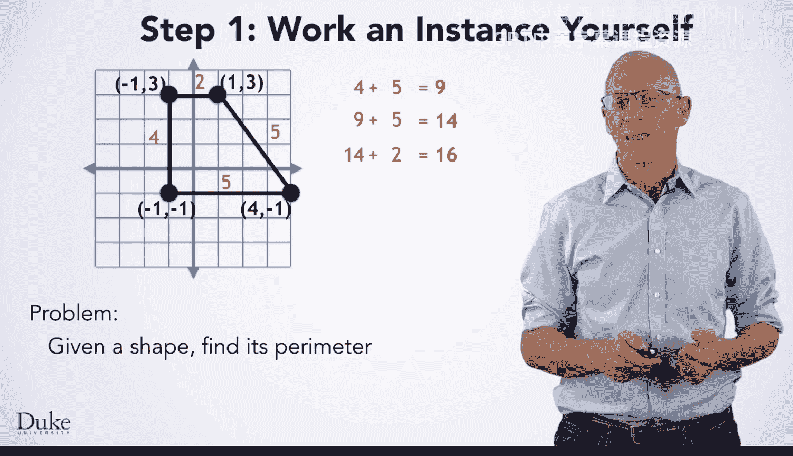

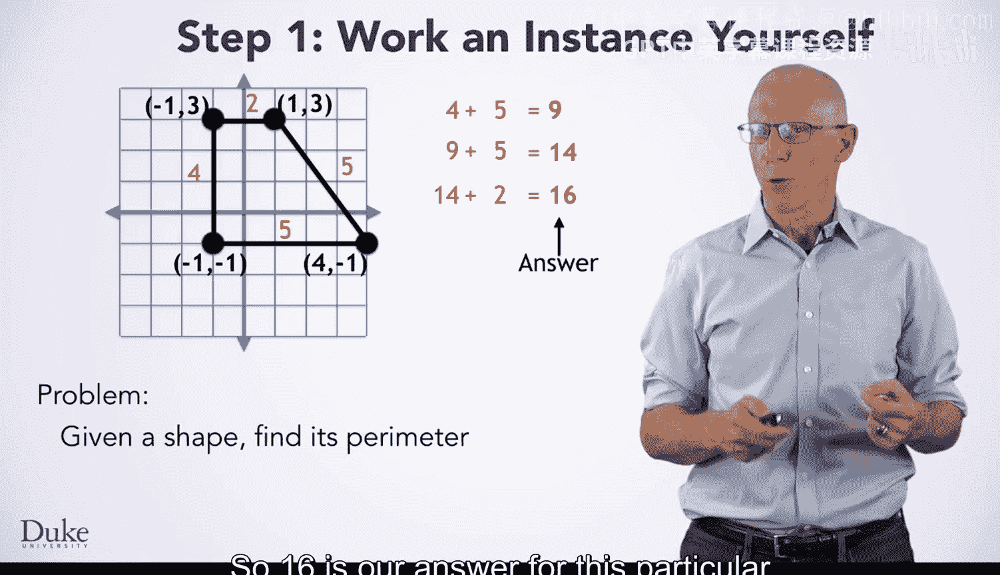

Now you're ready for step 2， writing down specifically what we just did。 First。

 we found the distance from the first point to the second point， which was4。

Then we took the second point to the third point， which was five。

Then we added four plus5 to get a running total of nine。

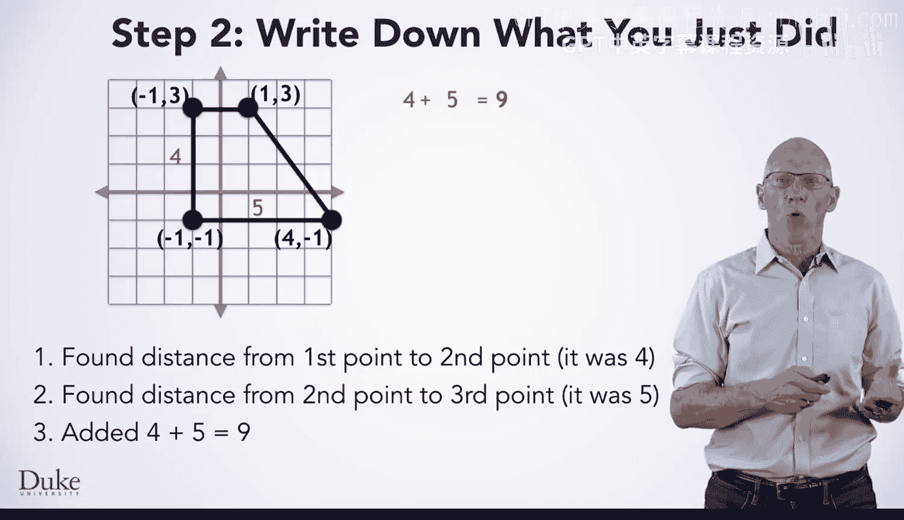

Next， we found the distance from the third point to the fourth point， which was5 and added 9 plus 5。

 so our running total is 14。Then we found the distance from the fourth point back to the first point。

 which is 2。 And we added 14 plus 2 to get 16。 Last， we said that 16 was our answer。

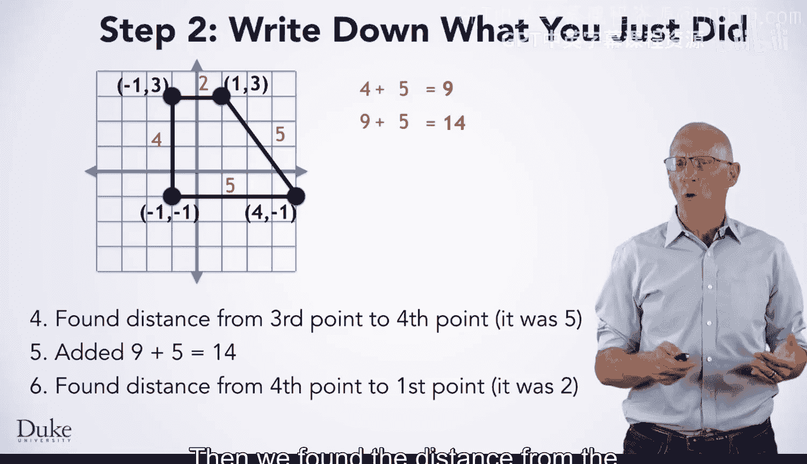

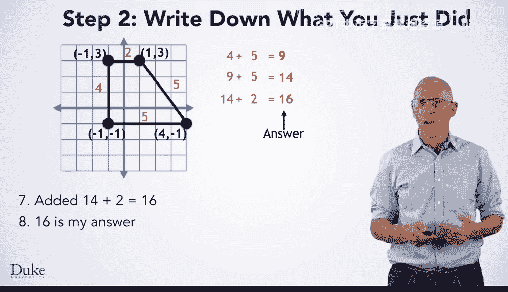

So we can write down the steps to solve this particular instance of the problem， as you can see here。

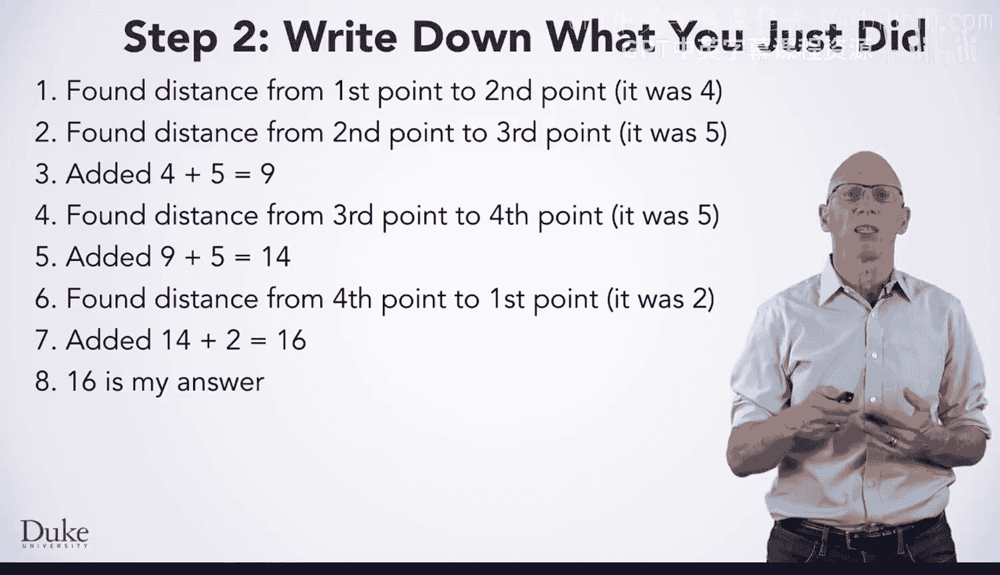

Now we're ready to move on to step three， where we're going to find the patterns and generalize to find the perimeter of any shape。

 not just the one we just saw。

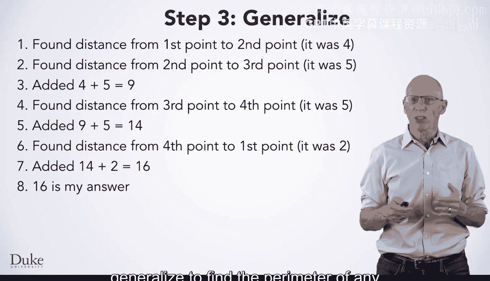

One thing you might notice is that we're doing almost the same thing repeatedly， when we generalize。

 we want to look for similar steps and express them as repetition。

To do this we'll need to make the match up exactly。

 which we might do here by starting out by adding 0 plus 4 to get 4。

Why does this seem like a good way to make these match up or keep adding the previous result to our running total of all the lengths。

 so it makes sense to start with zero for a running total and add our current result to it。

The next thing we might do in generalizing this algorithm is give this quantity a name。

 It won't always have these values， So we should name the quantity and refer to it by that name。

 We'll call it Curist。 since it's the current distance。 when we name this quantity， Curdist。

 well also want to change all the places we use that value When we computed it to reflect the name that we just。

Cose。This gives us an algorithm that looks like this。Next， we should give this quantity a name here。

 total perimeter makes sense or total peri。 as this quantity is the total perimeter of the shape that we're calculating as we go through the steps。

 again， when we name the quantity。 we'll need to replace the places we use that value using the name we just gave it。

 To peri。 This gives us an algorithm that looks like this。

Let's stop and look at this algorithm for a second。

 Does anything strike you as maybe just a little bit odd。What about this place that we used zero。

 It isn't a previous value that we computed， but why did we put this line in to begin with。

We wanted all the steps to repeat exactly， but now they look different。

Can we make them look the same？Sure， we can make total perm start at zero before we begin the repetitive steps。

 then we can just update total perm in our first step。Now these steps form a repetitive pattern。

 theyre the same except for which particular points they're working with。

The first point in each of the repetition counts through the points of the shape in the order in which they appear。

 That's great。 We like it when we can iterate over a sequence。

 because we can ultimately express this in code with a for each loop。😊。

But this second point in each repetition is a bit more problematic。

 We'd have to have a way to get to the point after the current one。 Now。

 there are ways that we could set up our shapes interface or API to iterate over the points and ask for the next one。

 too。 But let's do something very clever。Let's reorder the steps so that we do the distance from the fourth point to the first point first。

That is， let us write the steps in this order first， is it okay to do this？

When we want to reorder things， we have to think about it and be very careful。Here。

 the reordering is totally fine， is totally fine since addition is commutative。

 it doesn't matter what order we do the addition in。 second， why is it useful？

Well now we're going through the points in order， giving us unnatural for each repetition。

 But the other point， which does not lend itself to before each repetition is the one we just used。

 That means we can simply remember the previous point in a variable and use it with the next point。

 We express this idea by updating our algorithm to look like this。

 Notice how we update pre point to the be the point we just finished with。

 before moving on to the next point。 Then we make use of that point in the next set of steps。

But what about this point？We can use the same idea we saw earlier when we initialized a total per to0。

 start prepoint out with the value we want before we begin repeating the steps。

 but will it always be the fourth point。No。It just happens that we had four points here。

 but in general， we'll want to start pre point as the last point in our shape。Okay， great。

 Now we have nice， repetitive steps where the only difference is the point we're working on。

 And those go in order through the points in the shape so we can express all these steps in the colored boxes that you see here。

😊，As a repetition for each point of the steps， this gives us a nice general algorithm for finding the perimeter of any shape。

 Later， we'll translate this into code。

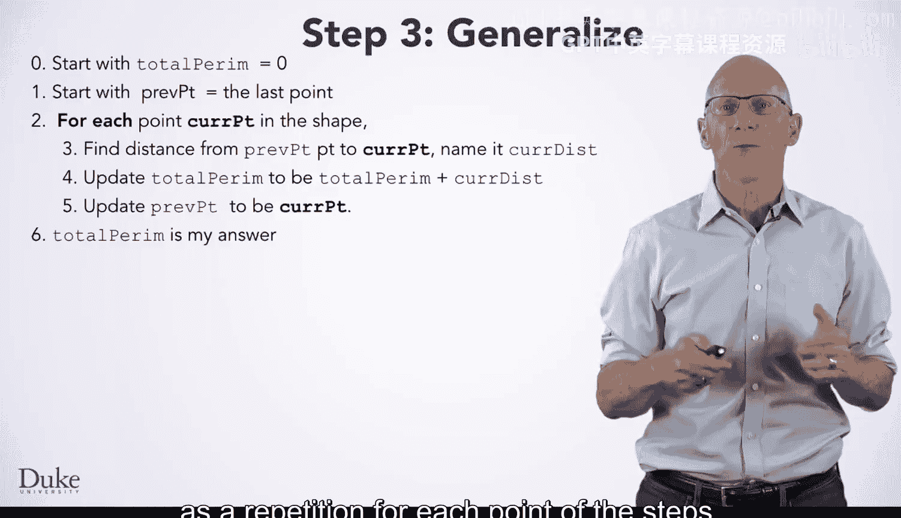

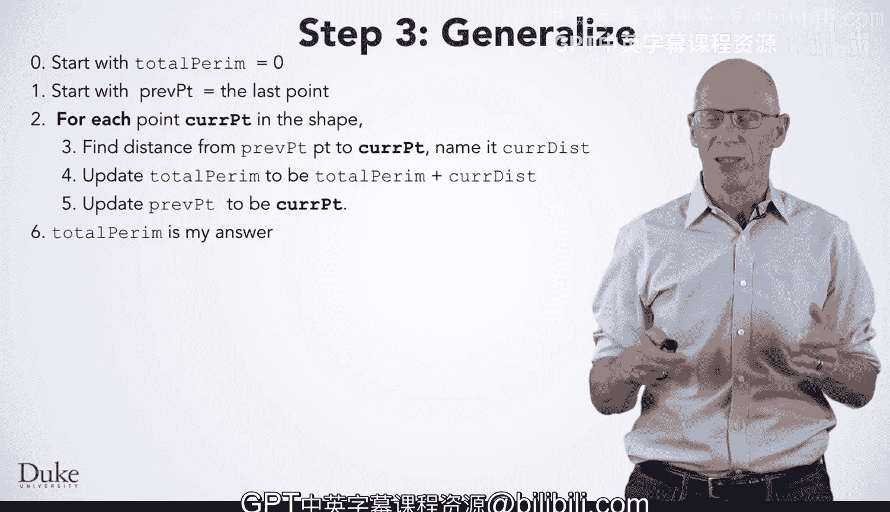